## **第一部分-基础知识**

#### **Java8的变化概述**

简要来说，Java8的改变在许多方面比Java历史上任何一次改变都深远，如

* 行为参数化，将代码传递给方法
* 多核并行有了更简单的新思路，不局限于线程池和并发集合
* 更简易的编程方式，如Stream API
* 接口的默认方法
* 函数式编程

#### **Java8新概念**

##### **流处理**

流是一系列数据项，程序可以从输入流中读取数据项，或者将数据项写入输出流，类似Unix操作流

```bash
cat file1 file2 | tr "[A-Z]"  "[a-z]"  |  sort  |  tail -3 
```

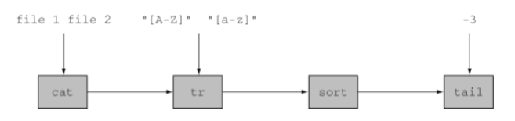

基于流思想，Java8在java.util.stream中添加了Stream API将许多操作联结起来形成一条复杂的流处理流水线

* 流处理可以一次执行多个操作
* 流处理可以并行、多线程执行

##### **行为参数化**

将代码作为参数传递给方法，Stream API就是构建在行为参数化思想上的

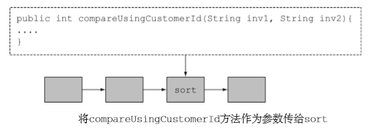

##### **并行与共享的可变数据**

一般情况下，流处理为了同时对不同的输入安全地执行，因此不能访问共享的可变数据，而Java8可以通过流实现简单的并行处理，打破“不能有共享的可变数据”这一规则

#### **Java8新功能**

##### **方法引用**

将**类的函数方法**作为参数值传递给方法，与对象引用传递对象类似，方法引用传递的是代码，是行为参数化的一种体现

* **语法**

  > ClassName::FunctionName

* **例子**

  ```java
  //Java8以前
  File[] hiddenFiles = new File(".").listFiles(new FileFilter() {
      public boolean accept(File file) {
          return file.isHidden();
      }
  }); 
  //方法引用
  File[] hiddenFiles = new File(".").listFiles(File::isHidden);
  ```

##### **Lambda-匿名函数**

将**匿名函数方法**作为参数值传递给方法，与方法引用类似，也是行为参数化的一种体现

* **语法**

  > (Params) -> CodeBlock

* **例子**

  ```java
  (Apple a) -> a.getWeight() >150 
  ```

##### **流**

相比于Collection API和Thread API，Stream API处理集合数据的方式更加简单、高效

* **迭代遍历方式(简单)**
  * Collection API采用外部迭代：使用for-each循环获取每个集合元素再处理
  * Stream API采用内部迭代：数据处理完全在库内进行
* **多线程并行处理方式(高效)**
  * Thread API采用synchronized关键字：避免线程同时访问并更新共享变量
  * Stream API采用并行流：将Collection转换为Stream进行并行处理再转换回Collection，由于流中的方法在执行时元素之间基本无互动(无可变的共享对象)因此可以保证线程安全

例子

```java
//Stream+Lambda顺序处理
List<Apple> heavyApples = appleList.stream()
    .filter(E -> E.getWeight()>150)  //内部迭代遍历处理集合数据
    .collection(Collectors.toList); 
//Stream+Lambda并行处理
List<Apple> heavyApples = appleList.parallelStream()  //并行流处理
    .filter(E -> E.getWeight()>150)  
    .collection(Collectors.toList); 
```

##### **默认方法**

接口可以包含实现类没有提供实现的方法签名，这让接口更容易改进和扩充，而不会破坏接口现有的实现类代码

* stream方法，在Java8以前，Collection<T\>接口和其实现类均无此方法，若需要添加这个方法
  * Java8以前方式：在Collection接口添加stream方法的声明，并在其所有实现类(List/Set/Map/ArrayList等)均实现此方法
  * Java8采用默认方法：在Collection接口使用default关键字增加默认方法stream()即可，所有实现类均可调用

##### **Optional<T\>**

Optional<T\>致力于避免NullPointerException，其中有明确的方法来处理值不存在的情况

#### **小结**

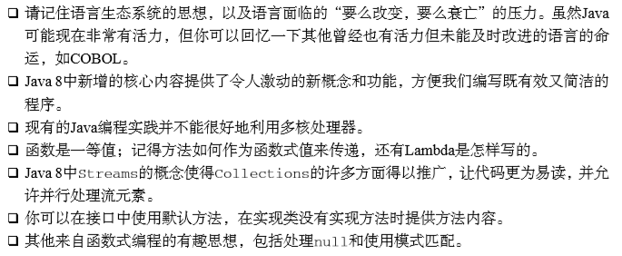


## **第二部分-函数式思想**

#### **行为参数化**

将代码块作为参数传递给一个方法，是一种处理频繁变更需求的软件开发模式

##### **演变历史**

方法的代码逻辑的实现方式

* **常量**实现(写死)
* **单参数**实现(需求变化需修改)
* **多参数**实现(复杂、不灵活)
* **接口作为参数**实现(行为参数化)

##### **详解**

方法以接口作为参数，通过接口的实现类的方法实现代码逻辑，这种方式使方法的行为取决于接口对象传递的代码，即将方法的行为参数化

##### **简化**

当方法将行为参数化后，每当有新的行为就需要增加新的接口实现类，还是十分繁琐

* **匿名类**
  * 简化声明和实例化类的过程，允许你同时声明并实例化一个类，并且不需要指定类名
  * 但匿名类往往很笨重，占用许多代码空间，存在许多模板代码可以优化
* **Lambda表达式**
  * 优化了匿名类的模板代码，仅保留方法参数、代码块

##### **样例代码-Comparator排序**

对集合进行排序，Java8中List自带的sort方法可以用Comparator接口对象进行行为参数化

```java
//java.util.Comparator
public interface Comparator<T>{
    public int compare(T o1, T o2);
}
//行为参数化List.sort方法 
inventory.sort(new Comparator<User>() {     
    public int compare(User u1, User u2){         
        return u1.getWeight().compareTo(u2.getWeight());     
    } 
});
//Lambda表达式优化
UserList.sort((User u1, User u2) -> u1.getWeight().compareTo(u2.getWeight()));
```

##### **样例代码-Runnable执行代码块**

线程的执行代码块可以使用Runnable接口对象进行行为参数化

```java
// java.lang.Runnable 
public interface Runnable{
    public void run(); 
} 
//行为参数化Thread的构建方法
Thread t = new Thread(new Runnable() {     
    public void run(){         
        System.out.println("Hello world");     
    } 
}); 
//Lambda表达式优化
Thread t = new Thread(() -> System.out.println("Hello world")); 
```

##### **样例代码-GUI事件处理**

GUI编程的响应代码块可以使用EventHandler接口对象进行行为参数化

```java
Button button = new Button("Send"); 
//行为参数化Button.setOnAction方法
button.setOnAction(new EventHandler<ActionEvent>() {     
    public void handle(ActionEvent event) {         
        label.setText("Sent!!");     
    } 
}); 
//Lambda表达式优化
button.setOnAction((ActionEvent event) -> label.setText("Sent!!")); 
```

#### **Lambda表达式**

##### **概述**

简洁地表示可传递的匿名函数，仅包含参数列表、函数主体、返回类型和可抛出的异常列表(可选)

* 简洁：优化省去匿名类的模板代码
* 传递：可作为参数传递给方法或存储在变量中
* 匿名：不需要方法名称和方法声明
* 函数：不像方法一样属于某个特定的类，但和方法一样有参数列表、函数主体、返回类型和可抛出的异常列表(可选)

##### **基本语法**

> (parameters) -> expression

或者

> (parameters) -> {statements; }

##### **示例**

```java
//布尔表达式
(Apple a) -> a.getWeight() > 150
//创建对象
() -> new Apple(150)
//消费对象
(Apple a) -> {
     System.out.println("Apple Weight:");
     System.out.println(a.getWeight());
}
//单对象选择/提取
(String s) -> s.length()
//组合多对象
(int a, int b) -> a * b
//比较两个对象
(Apple a1, Apple a2) -> a1.getWeight().compareTo(a2.getWeight()) 
```

##### **使用场景-函数式接口**

* **定义**

  只定义了一个抽象方法的接口

* **场景**

  Lambda表达式可以直接以内联的形式为函数式接口的抽象方法提供实现，并把整个表达式作为函数式接口的实例

* **标记**

  > @FunctionalInterface

* **示例**

```java
//函数式接口：java.lang.Runnable
public interface Runnable{      
    void run(); 
} 
//行为参数化的方法
public static void process(Runnable r){     
    r.run(); 
} 
//Lambda表达式为函数式接口的抽象方法提供实现
process(() -> System.out.println("Hello World"));
```

##### **检测格式-函数描述符**

* **定义**

  函数式接口的抽象方法的签名

* **表达**

  > (parameters) -> returnType

* **用途**

  可用于检测Lambda表达式的使用是否正确

* **示例**

```java
//Lambda正确示例
public Callable<String> fetch() {         
    return () -> "Tricky example  ;-)";
} 
//fetch()的返回类型Callable<String>的函数描述符是()->String
//Lambda表达式的函数描述符是()->String

//Lambda错误示例
Predicate<Apple> p = (Apple a) -> a.getWeight(); 
//Predicate<Apple>的函数描述符是(Apple)->boolean
//Lambda表达式的函数描述符是(Apple)->Integer
```

##### **Lambda表达式背后的原理**

* **类型检查**

  Lambda表达式的返回类型是从对应函数式接口的抽象方法的返回值中推理得出，因此不需要显式指定

* **Lambda对应的函数式接口可有多个**

  由于许多函数式接口存在抽象方法返回泛型T，因此同一个Lambda表达式可以应用于多个函数式接口

* **类型推断**

  Java编辑器会从上下文推断出Lambda表达式对应的函数式接口的抽象方法的参数类型，因此Lambda表达式可以省略参数类型，如E -> E.getLength()

* **局部变量**

  Lambda表达式允许访问显式声明为final的局部变量，这种模式易于Lambda表达式做到并行处理


#### **函数式接口**

除了Java API中已经存在的Comparable/Runnable/Callable的函数式接口，Java8的java.util.function包中还引入了常用的函数式接口

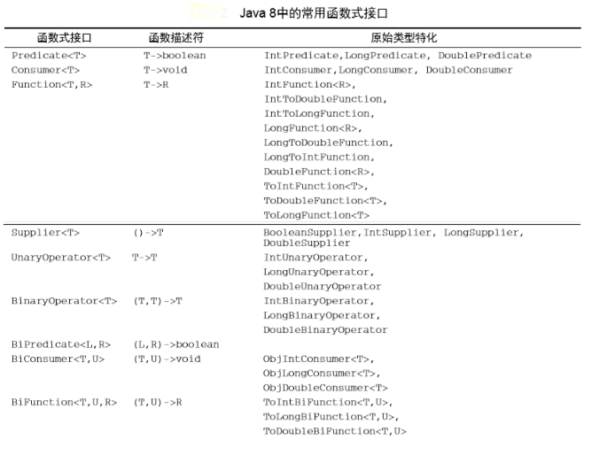

##### **原始类型特化**

泛型函数式接口由于其通用性使用了泛型，但泛型只能绑定到引用类型，Java中的装箱拆箱能将原始类型与引用类型相互转换，但在性能方面需付出代价，因为装箱(原始->引用)后的值需要更多的内存

因此针对专门的输入参数类型的函数式接口的都有原始类型特化的函数式接口，起到提高性能的作用

##### **异常**

默认的函数式接口均不允许抛出受检异常(Checked Exception)，若需要抛出异常，有两种方法

* 自定义函数式接口，并声明受检异常

  ```java
  //自定义函数式接口
  @FunctionalInterface 
  public interface BufferedReaderProcessor {     
      String process(BufferedReader b) throws IOException; //声明受检异常
  } 
  ```

* Lambda表达式中使用try-catch块，显式捕捉受检异常

  ```java
  Function<BufferedReader, String> f = (BufferedReader b) -> {     
      try {         
          return b.readLine();     
      } catch(IOException e) {         
          throw new RuntimeException(e);     
      } 
  }; 
  ```

#### **方法引用**

调用仅涉及单一方法的Lambda表达式的快捷写法

**语法**

> ClassName::MethodName

**示例**

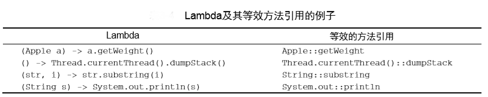

**类别**

* **静态方法的方法引用**

  * Lambda

    > (args) -> ClassName.staticMethod(args)

  * 方法引用

    > ClassName::staticMethod

  * 示例

    ```java
    //Lambda
    (String s) -> Integer.parseInt(s)
    //方法引用
    Integer::parseInt
    ```

* **任意类型实例方法的方法引用**

  - Lambda

    > (args, rest) -> args.instanceMethod(rest)

  - 方法引用

    > ClassName::instanceMethod

  - 示例

    ```java
    //Lambda
    (String s, int i) -> s.substring(i)
    //方法引用
    String::substring
    ```

* **外部局部对象的实例方法的方法引用**

  - Lambda

    > (args) -> expr.instanceMethod(args)

  - 方法引用

    > expr::instanceMethod

  - 示例

    ```java
    //外部局部对象
    Thread currentThread = Thread.currentThread();
    //Lambda
    () -> currentThread.dumpStack() 
    //方法引用
    currentThread::dumpStack
    ```

* **对象的构造函数的方法引用**

  对于无参、一个参数、两个参数的构造函数，均有默认的函数式接口有对应，因此均可以使用方法引用

  ```java
  //无参构造函数 Supplier接口
  Apple::new == () -> new Apple()
  //一个参数的构造函数 Function接口
  Apple::new == (args0) -> new Apple(args0)
  //两个参数的构造函数 BiFunction接口
  Apple::new == (args0, args1) -> new Apple(args0, args1)
  ```

  对于三个参数以上的构造函数，Java8并没有提供与构造函数引用的签名匹配的函数式接口，因此需要自定义编写

  ```java
  //自定义三个参数的函数式接口 
  @FunctionalInterface 
  public interface TriFunction<T, U, V, R>{     
      R apply(T t, U u, V v); 
  } 
  //方法引用
  TriFunction<Integer, Integer, Integer, Color> colorFactory = Color::new; 
  ```

#### **Lambda表达式实践**

在实践中使用行为参数化、函数式接口、Lambda表达式、方法引用使代码更简洁灵活

##### **示例代码**

```java
public static String processFile() throws IOException {     
    try (BufferedReader br =             
         new BufferedReader(new FileReader("data.txt"))) {         
        return br.readLine();     
    }     
} 
```

##### **简化流程**

* **行为参数化**

  示例代码仅能读取文件第一行，若是需求变更需要读取文件的前两行则需要修改源代码，因此我们考虑使用行为参数化来传递行为

* **函数式接口传递行为**

  根据示例代码，我们需要创建一个函数描述符为(BufferedReader) -> String的函数式接口，并可以抛出IOException异常

* **Lambda表达式实例化函数式接口**

  使用Lambda表达式为函数式接口的抽象方法提供实现，可以根据需求灵活地重用processFile方法
  
* **方法引用简化Lambda表达式**

  使用方法引用优化Lambda表达式

  ```java
  //函数式接口
  @FunctionalInterface 
  public interface BufferedReaderProcessor {     
      String process(BufferedReader b) throws IOException; 
  } 
  //行为参数化的示例代码
  public static String processFile(BufferedReaderProcessor p) throws IOException { 
      try (BufferedReader br =             
           new BufferedReader(new FileReader("data.txt"))) {         
          return p.process(br);  //行为参数化     
      } 
  }
  //Lambda实例化函数式接口，灵活使用方法
  String oneLine =  processFile((BufferedReader br) -> br.readLine()); 
  String twoLines = processFile((BufferedReader br) -> br.readLine() + br.readLine()); 
  //方法引用简化特定的Lambda表达式
  String oneLine =  processFile(BufferedReader::readLine); 
  ```

#### **复合Lambda表达式**

函数式接口可以提供默认方法将Lambda表达式复合成更高级的复杂的表达式

* **比较器复合**

  函数式接口Comparator<T\>提供了默认方法reversed、thenComparing

  * 逆序

    ```java
    appleList.sort(comparing(Apple::getWeight).reversed());
    ```

  * 比较器链

    ```java
    appleList.sort(comparing(Apple::getWeight).thenComparing(Apple::getCountry)); 
    ```

* **谓词复合**

  函数式接口Predicate<T\>提供默认方法negate、and、or

  * 组合谓词

    ```java
    Predicate<Apple> redAndHeavyAppleOrGreen = redApple
    				.and(a -> a.getWeight() > 150)             
    				.or(a -> "green".equals(a.getColor())); 
    ```

* **函数复合**

  函数式接口Function<T,T>提供默认方法andThen、compose

  * 转换流水线

    ```java
    Function<String, String> addHeader = Letter::addHeader; 
    Function<String, String> transformationPipeline = addHeader
    				.andThen(Letter::checkSpelling)                
        			.andThen(Letter::addFooter); 
    ```

#### **小结**

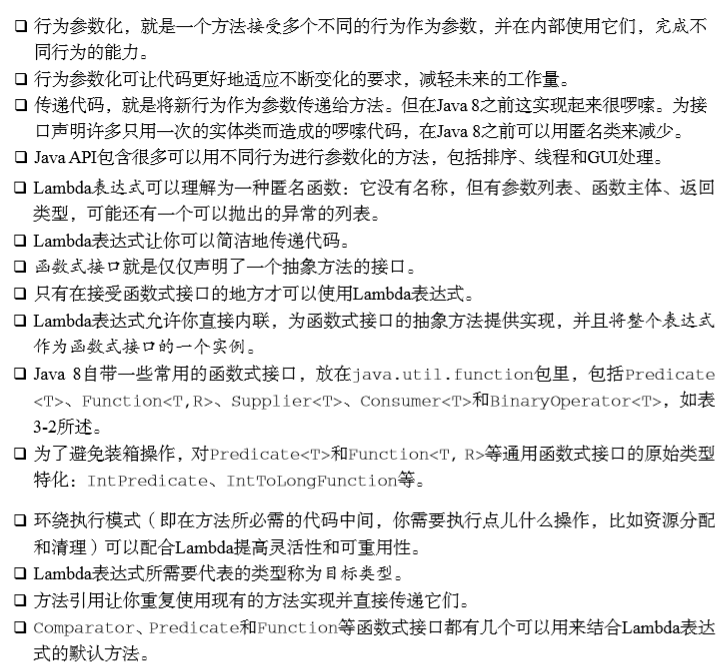


## **第三部分-函数式数据处理(流)**

#### **流的概述**

首先谈谈集合，Collection API是Java中最频繁使用的API，Java程序通常都在制造和处理集合，但在Java8以前集合操作并不完美，包括无法声明式地指定操作和无法简洁地并行处理大量集合元素

Java8提供了新的Stram API采用简洁、灵活且高效的方式处理数据集

- **声明性(简洁)**

  Stram API的方法以声明性方式编写目的性明确，加上行为参数化可以让方法应对任何变化的需求，同时保持代码清晰可读

- **链式(灵活)**

  Stram API可以将几个基础操作方法链式编写来表达复杂的数据处理流水线，代码编写更加灵活

- **并行(高效)**

  Stream API的方法是与线程模型无关的高层次构件，可以充分利用多核架构进行任务并行处理而不需要担心线程和锁

##### **流的定义**

从支持数据处理操作的源生成的元素序列

- **数据处理操作**

  类似函数式编程语言中的常用操作，如filter、map、reduce、find、match、sort等，可顺序也可并行执行

- **源**

  提供数据的源，如集合、数组或I/O资源

- **元素序列**

  流内部提供了接口用于访问特定元素类型的一组有序值

##### **流的重要特点**

- **流水线**

  流的内部操作本身会返回一个流，这样多个操作连接形成一个复杂的数据处理流水线，可以进行延迟、短路等优化操作

- **内部迭代**

  流的迭代不同于集合使用迭代器的显式迭代

##### **流与集合**

- **急切创建与按需创建**

  集合是急切创建的，需要确定集合的所有元素的值才能将其添加到集合中，而流是按需创建的，流会根据用户的要求才会计算元素的值

- **遍历次数**

  流类似集合的迭代器，只能遍历一次，遍历完成后流就被消费而释放了

- **迭代方式**

  集合需要用户显式取出元素再加以处理，即外部迭代，流则是声明性操作由Stram库决定迭代方式，即内部迭代，这样程序可以并行处理、优化处理顺序等

#### **流操作**

java.util.stream.Stream中的Stream接口定义了流操作，类似构建器模式，调用链设置一套配置(流的中间操作链)，最后调用build方法构建对象(流的终端操作)

- **中间操作**

  返回一个流对象可用于多个操作连接形成一个复杂的流水线操作，中间操作不会执行任何处理，而是在流水线的终端操作时一次性全部处理

  - **优化特性**

    中间操作利用了流的延迟性质可以做相关优化，如limit操作的**短路**优化、独立操作的**循环合并**优化

- **终端操作**

  从流的流水线生成结果，结果可以是集合类、基本类甚至是void

- **示例**

  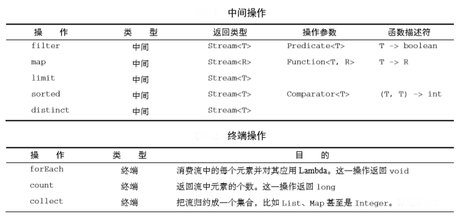

#### **流的使用**

流可以从多种源创建，如数值流、文件流、数组流、无限流(函数流)等

流通过内部迭代可以快速完成复杂的数据处理，如筛选、切片、映射、查找、匹配和归约等

##### **流操作**

- 筛选

  - **filter方法**

    接受一个谓词(T -> boolean)作为参数，返回一个包括所有符合谓词元素的流

  - **distinct方法**

    无参数，返回一个元素各异(根据流元素的hashCode和equals方法去重)的流

- 切片

  - **limit方法**

    接受一个int参数，返回一个不超过给定int值长度的流，若流是有序的则返回前int个元素

  - **skip方法**

    接受一个int参数，返回一个去除前int个元素的流，若流中元素小于int则返回空流

- 映射

  - **map方法**

    接受一个函数(T -> R)作为参数，该函数会被应用到流的每个元素上并映射成一个新的元素(创建)，返回由新的元素组成的流

  - **flatMap方法**

    流的扁平化(降维)，将每个元素映射成单个流的内容后合并成一个流，接受一个映射函数作为参数，如使用Arrays.stream()方法作为参数将一个数组映射成一个流

    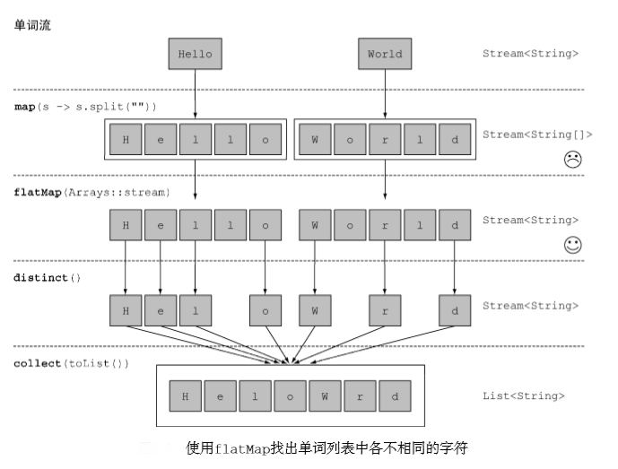

- 匹配

  - **anyMatch方法**

    接受一个谓词(T -> boolean)作为参数，返回流中是否存在符合谓词的一个元素的boolean结果，终端操作

  - **allMatch方法**

    接受一个谓词(T -> boolean)作为参数，返回流中是否所有元素均符合谓词的boolean结果，终端操作

  - **noneMatch方法**

    接受一个谓词(T -> boolean)作为参数，返回流中是否所有元素均不符合谓词的boolean结果，终端操作

- 查找

  - **findAny方法**

    无参数，返回当前流中的任意元素，返回类型为Option<T\>，终端操作

  - **findFirst方法**

    无参数，返回有序流中的第一个元素，返回类型为Option<T\>，终端操作

- 归约(折叠)

  将一个流中的所有元素组合起来

  - **reduce方法**
    - 接受两个参数，初始值和BinaryOperator<T\>函数式接口参数，分别用来存储返回结果和定义两个元素结合的方式
    - 接受一个参数，不接受初始值，但会返回一个Optional<T\>对象
    - 特例，最大值/最小值，可用reduce(Integer::max)/reduce(Integer::min)

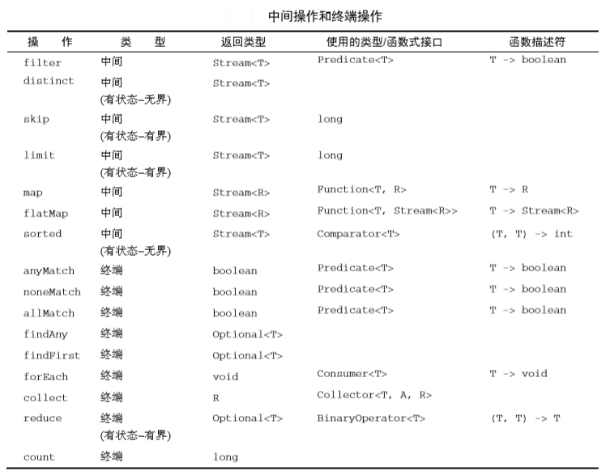

##### **流操作的内部优化**

流操作内部存在一些自动优化

- **短路**

  有些流操作不需要处理整个流就能得到结果，如匹配、查找操作

- **并行**

  有些流操作的内部迭代实现可以选择并行执行，将输入分块并行执行再合并起来，提升性能，如查找、归约操作

##### **数值流**

流操作中的计算如reduce对于基本数据类型暗含了拆箱装箱的成本，Java8引入了三个原始类型特化流接口，分别是**IntStream、DoubleStream**和**LongStream**，将流中的包装类元素转换成基本类型元素，并提供了常用数值归约的新方法，提升了流计算的效率

- **映射到数值流**

  mapToInt、mapToDouble和mapToLong方法，类似map方法，接受一个(T -> R)的函数式接口作为参数，返回对应的原始类型特化的数值流

- **转换回对象流**

  boxed方法，无参数，会将数值流转换成对应的包装类的一般流

- **数值流的数值计算方法**

  - sum：返回对应流的基本类型的数值，空流默认返回0
  - max/min/average：返回泛型为对应基本类型的Optional<T\>，避免空流引起误会

- **数值范围流**

  Java8提供IntStream和LongStream的静态方法range和rangeClosed用来构建数值范围流，接受(int,int)参数，表示起始值和结束值，但range方法不包含结束值

#### **创建流**

除了使用stream方法从集合生成流和根据数值范围创建流外，还有许多方法可以创建流

##### **值创建流**

Stream.of静态函数，其可以接受任意数量的值参数

##### **数组创建流**

Arrays.stream静态函数，其接受一个数组作为参数

##### **文件创建流**

Java中用于文件处理的I/O操作的NIO API如java.nio.file.Files中很多静态方法都会返回一个流，如Files.lines返回指定文件中的各行构成的字符串流

```java
long uniqueWords = 0;
//Java7中的try(){}语句用于自动关闭(释放)资源
try(  
    Stream<String> lines = Files.lines(Paths.get("data.txt"), Charset.defaultCharset())
){
    //生成单词流->去重->统计数量
    uniqueWords = lines.flatMap(line -> Arrays.stream(line.split(" "))).distinct().count();
}
catch(IOException e){
	//处理打开文件时出现的异常
}
```

##### **函数创建流-无限流**

Stream API提供两个静态方法用于从函数生成流，函数生成的流具备无限长度，即无限流，因此一般使用limit()方法来对无限流加以限制

- **Stream.iterate(T,UnaryOperator<T\>)**

  - T为初始值，UnaryOperator<T\>为函数式接口(T->T)用于计算依赖于旧值产生的新值

  - 例子

    ```java
    //生成斐波那契数组 (0,1)(1,1)(1,2)(2,3)..
    Stream<int[]> fibonacciArrays = 
        Stream.iterate(new int[]{0, 1}, E -> new int[]{E[1], E[0] + E[1]});
    ```

- **Stream.generate(Supplier<T\>)**

  - Supplier<T\>为函数式接口(()->T)用于生成新值

  - 例子

    ```java
    //生成随机双精度数
    Stream<Double> randomStream = Stream.generate(Math::random);
    ```

#### **流的收集**

流的操作类似于数据集迭代器用于处理数据，最后通常需要将流中的元素汇总成一个可用的数据结构

##### **收集器概述**

先看一个收集器的例子

```java
//将交易（Transaction）按照货币(Transaction.Currency)分组
Map<Currency, List<Transaction>> transactionsByCurrencies =         transactions.stream().collect(groupingBy(Transaction::getCurrency)); 
```

区别于外部迭代的**指令式编程**，这种收集器的编程方法称为**函数式编程**

函数式编程可以简洁灵活地对流调用collect方法对流中的元素触发归约操作(Collector参数化)

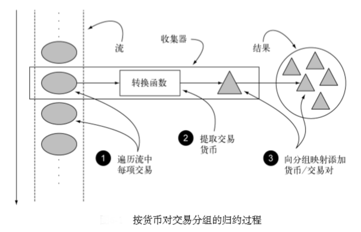

- **collect()方法**

  Stream的终端操作方法，用于对流中的元素进行汇总

- **Collector接口**

  收集器，其中方法的实现决定了如何对流执行归约操作，即定义了转换函数

- **Collectors工具类**

  提供了许多静态工厂方法用于创建常用的收集器实例，如Collectors.toList()

#### **预定义收集器-Collectors工具类**

即可以从Collectors工具类提供的静态工厂方法创建的收集器，主要提供了三大收集方式，归约汇总、分组和分区

##### **归约汇总**

将流中的所有元素合并成一个结果

- **元素数值数据**

  如元素数量、最大值、最小值、求和、平均值等

  - **counting()**

    元素数量，返回long

  - **maxBy(Comparator<T\>)/minBy(Comparator<T\>)**

    元素最小值，接受一个比较器参数，返回Optional<T\>

  - **summingInt(T->int)**

    元素的和，接受一个将流中的元素映射为一个值的函数式接口，返回求和值，还有对应的long/double方法

  - **averagingInt(T->int)**

    元素的平均值，接受一个将流中的元素映射为一个值的函数式接口，返回平均值，还有对应的long/double方法

  - **summarizingInt(T->int)**

    元素的汇总数据，接受一个将流中的元素映射为一个值的函数式接口，返回IntSummaryStatistics对象包含流元素的数量、和、最小值、平均值、最大值，还有对应的long/double方法

- **连接字符串**

  - **joining()**

    将流中的元素调用toString()方法得到字符串并逐个连接起来

  - **joining(String split)**

    将流中的元素调用toString()方法得到字符串并用分隔符split逐个连接起来

- **广义的归约汇总**

  **Collectors.reducing(R, T->R, BinaryOperator<R,R,R>)**

  所有的归约汇总函数均可一般化为reducing方法

  - 第一个参数，R，初始值，归约操作的起始值或者空流的返回值
  - 第二个参数，T->R函数式接口，转换函数，用于将对象转换成用于归约的数据类型
  - 第三个参数，BinaryOperator<R,R,R>，累积函数

  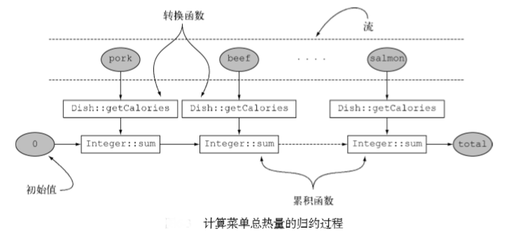

##### **分组**

将流中的元素通过属性进行分组

- **groupingBy(T->R)**

  单级分组，将流中的元素通过分类函数T->R映射得到分组的Key，返回Map<R, List<T\>>

  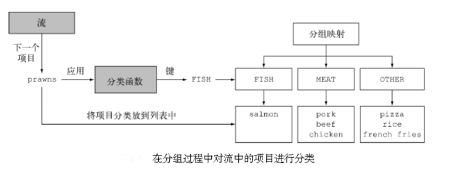

- **groupingBy(T->R, groupingBy(T->E))**

  多级分组，嵌套调用groupingBy()函数，返回Map<R, Map<E, List<T\>>>

  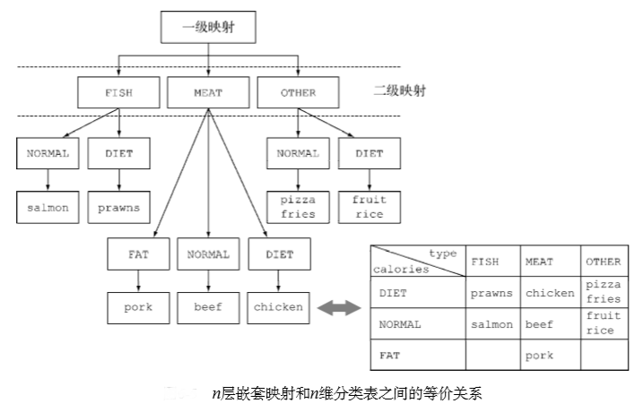

- **groupingBy(T->R, E)**

  将分组方法一般化，实质上参数E可以是任何类型的收集器，如Collectors.counting()、Collectors.toList()，即可以将收集器嵌套起来使用

  ```java
  //嵌套的映射收集器
  .collect(groupingBy(Dish::getType,
                      summingInt(Dish::getCalories)));  
  //mapping(T->R,E)方法可生成对输入元素映射的指定收集对象的收集器
  .collect(groupingBy(Dish::getType, mapping(  
          dish -> {  //对输入元素映射
              if (dish.getCalories() <= 400) return CaloricLevel.DIET;             
              else if (dish.getCalories() <= 700) return CaloricLevel.NORMAL;       
              else return CaloricLevel.FAT; 
          },     
          toCollection(HashSet::new)))  //指定收集对象
  ); 
  ```

##### **分区**

分组的特殊情况，按照指定谓词(T->Boolean)作为分区函数进行分组，即将元素分为两组

- **partitioningBy(T->Boolean, E)**

  类似分组方法，第一个参数是谓词，第二个参数E可以是任何类型的收集器，用于嵌套分区

##### **预定义收集器总结**

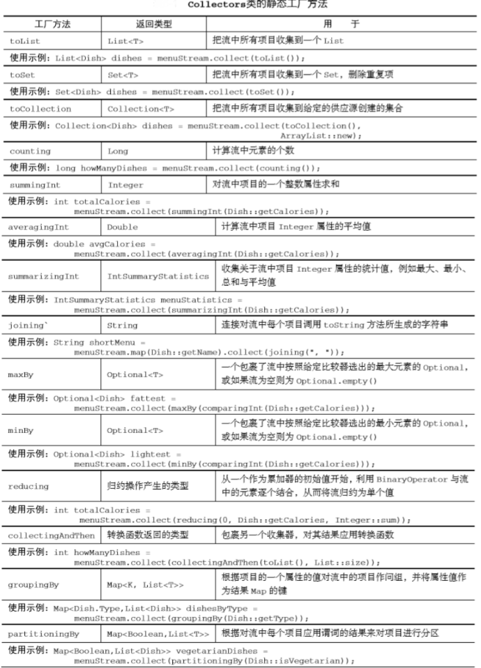

#### **自定义收集器-Collector接口**

实质上Collectors工具类的工厂方法生产的收集器均是实现了Collector接口进行归约收集，因此知晓Collector接口的定义、接口的方法如何被Stream.collect方法所调用对我们实现自定义收集器十分重要

##### **Collector接口的定义**

```java
public interface Collector<T, A, R> {     
    Supplier<A> supplier();     
    BiConsumer<A, T> accumulator();     
    Function<A, R> finisher();     
    BinaryOperator<A> combiner();     
    Set<Characteristics> characteristics(); 
} 
```

- 接口申明

  - T是流中要收集的元素的泛型
  - A是累加器的类型，用于收集过程中累积部分结果
  - R是收集操作得到的对象的类型，通常但不一定是集合

- 方法声明

  阅读Stream.collect方法可知supplier、accumulator、finisher和combiner方法均被collect方法调用，而characteristics则提供了一个列表用于提示collect方法执行归约操作时的优化方式，如并行化

  - supplier

    建立新的结果容器，即创建一个空的累加器实例，用于数据收集过程使用

  - accumulator

    将元素添加到结果容器，即将第n个元素添加到前1-n个元素的累加器中

  - finisher

    对结果容器应用最终转换，遍历完流之后返回累积过程最后一个调用的函数，用于将累加器对象转换为整个集合操作的最终对象

  - combiner

    合并两个结果容器，并行规约时对流各个子部分的累加器进行合并

  - characteristics

    定义收集器的优化行为

    - UNORDERED

      归约结果不受流中项目的遍历和累积顺序的影响

    - CONCURRENT

      accumulator累积器可以多线程同时调用，即该收集器可以并行归约流

    - IDENTITY_FINISH

      finisher完成器返回的是恒等函数，累加器对象不加检查直接用作归约过程的最终结果

##### **自定义收集器示例**

开发一个ToListCollector收集器将流中的数据归约成List<T\>

```java
public class ToListCollector<T> implements Collector<T, List<T>, List<T>> { 
 
    @Override     //建立新的结果容器ArrayList
    public Supplier<List<T>> supplier() {         
        return ArrayList::new;                 
    } 
 
    @Override     //通过add()方法将元素添加到结果容器
    public BiConsumer<List<T>, T> accumulator() {         
        return List::add;                       
    } 
 
    @Override     //恒等函数 累加器对象直接用作归约过程的最终结果
    public Function<List<T>, List<T>> finisher() {         
        return Function.indentity();           
    } 
 
    @Override     //合并累加器
    public BinaryOperator<List<T>> combiner() {         
        return (list1, list2) -> {             
            list1.addAll(list2);              
            return list1;          
        };         
    }     
 
    @Override     //为收集器添加IDENTITY_FINISH和CONCURRENT标志
    public Set<Characteristics> characteristics() {         
        return Collections.unmodifiableSet(EnumSet.of(             
            IDENTITY_FINISH, CONCURRENT));      
    } 
}
```

#### **并行流**

##### **概述**

并行流就是将一个内容分成多个数据块，并用不同的线程分别处理每个数据块的流

Stream API接口允许声明性地将顺序流变为并行流，本质上是通过应用Java7引入的分支/合并框架实现，这让并行(多线程)处理数据集合变得轻松灵活，但只有了解了如何划分并行流才能避免误用产生的意外

可以通过对收集源调用parallelStream方法将集合转换为并行流，或者通过对流对象调用parallel方法将流转换为并行流

##### **测试并行流性能示例**

通过实现累加器函数(给定n，返回[1,n]的和)测试并行流性能

```java
//for迭代版本累加器
public static long iterativeSum(long n) {
    long result = 0;
    for (long i = 1L; i <= n; i++) {
        result += i;
    }
    return result;
}
//顺序流累加器
public static long sequentialSum(long n) {
    return Stream.iterate(1L, i -> i + 1)
        .limit(n)
        .reduce(0L, Long::sum);
}
//并行流累加器
public static long parallelSum(long n) {
    return Stream.iterate(1L, i -> i + 1)
        .limit(n)
        .parallel()
        .reduce(0L, Long::sum);
}
//测试性能函数 调用10次函数取最短执行时间返回
public long measureSumPerf(Function<Long, Long> adder, long n) {
    long fastest = Long.MAX_VALUE;
    for (int i = 0; i < 10; i++) {
        long start = System.nanoTime();
        long sum = adder.apply(n);
        long duration = (System.nanoTime() - start) / 1_000_000;
        System.out.println("Result: " + sum);
        if (duration < fastest) fastest = duration;
    }
    return fastest;
}
//测试
measureSumPerf(GuavaController::iterativeSum, 100000000);   //40
measureSumPerf(GuavaController::sequentialSum, 100000000);  //2433
measureSumPerf(GuavaController::parallelSum, 100000000);    //18044
```

分析结果得知for迭代性能>顺序流性能>并行流性能，究其缘由有两个因素

- 因为顺序流性能弱于For迭代性能，可能是iterate生成的无限流的元素对象是Long包装类对象，需要拆箱成数字才能求和，影响性能
- 因为并行流性能小于顺序流，可能式iterate生成的无限流并没有拆分成多个独立块并行执行

针对这两个因素，我们可以应用LongStream.rangeClosed方法解决

- LongStream.rangeClosed直接产生原始类型的数值流，没有拆箱装箱开销
- LongStream.rangeClosed会产生数字范围，易拆分成独立的小块并行处理

```java
//优化后的顺序流原始类型累加器
public static long rangedSum(long n) {
    return LongStream.rangeClosed(1, n)
        .reduce(0L, Long::sum);
}
//优化后的并行流范围累加器
public static long parallelRangedSum(long n) {
    return LongStream.rangeClosed(1, n)
        .parallel()
        .reduce(0L, Long::sum);
}
//测试
measureSumPerf(GuavaController::iterativeSum, 100000000);   //40
measureSumPerf(GuavaController::rangedSum, 100000000);  //463
measureSumPerf(GuavaController::parallelRangedSum, 100000000);    //90

```

分析结果得知

- 数值流避免了拆箱装箱开销增强了性能，因此有时候选择恰当的数据结构往往比并行化算法更重要
- 由于并行化过程本身需要对流进行递归划分分配子流到不同线程执行并归约结果，因此选择方便划分的流与独立的流操作才能保证并行化提升性能

##### **并行流的典型错误**

并行流的流操作不可用于改变某些共享状态，这会得到错误的执行结果，因为并行流中没有同步机制

##### **并行流的使用方案**

关于使用并行流的定量建议毫无意义，因为这关乎到硬件、业务逻辑、执行代码等动态因素，但有一些并行流的定性建议可以帮助决定特定情况下是否有必要使用并行流优化代码

- 测试

  顺序流转换成并行流十分简单，但考虑使用顺序流还是并行流时，用适当的基准代码来检查其性能比无谓的性能分析要实用的多

- 留意装箱开箱

  自动装箱开箱操作会大大降低性能，Java8中有数值流来避免这种操作

- 流操作的可并行性

  一些流操作不具备可并行性，如limit和findFirst等依赖于元素顺序的操作，并行化执行的代价十分大，如需求中对元素顺序不敏感，可调用unordered方法将顺序流转化成无序流用作无序流操作的并行化执行

- 单元素的流水线处理成本

  一个元素的流水线处理成本越大，并行流时性能好的可能性比较大

- 处理元素的总数

  处理元素的总数越大，并行流时性能好的可能性比较大

- 流数据源的可分解性

  流数据源的数据结构是否易于分解，如ArrayList流的拆分效率高于LinkedList流，因为ArrayList流无需遍历即可平均拆分，而后者需要遍历，如range工厂方法创建的数值流也可以快速分解

  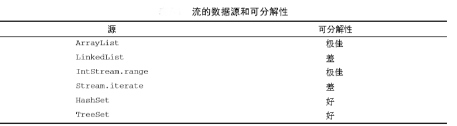

##### **并行流的拆分原理**

并行流的基础架构是Java7引入的分支/合并框架，其可以以递归的方式将可以并行的任务拆分成更小的任务，然后将每个子任务的结果合并成整体结果

并行流的工作原理基于Java8中新加入的Spliterator接口，即可分迭代器，用于并行遍历数据源中的元素，Java8已经为集合框架中的所有数据结构提供了一个默认的Spliterator实现

#### **小结**

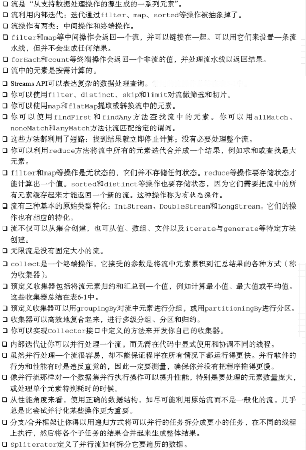

