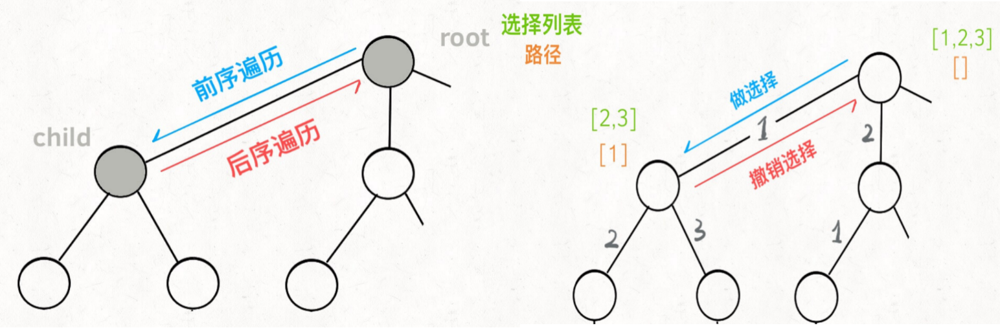

[TOC]


#### LeetCode-

* 题目

* 分析

* 解答


#### LeetCode-124 求二叉树内最大路径和

* 题目

  求一个二叉树的最大路径和

  * 路径

    从树中任意节点出发，沿父子节点连接，达到任意节点的序列，路径至少包含一个节点，且不一定经过根节点

  * 路径和

    路径中各节点值的总和

  节点数目， [1, 30000]

  节点值，[-1000, 1000]
  
* 分析

  考虑任一个节点，最大路径和包含该节点的方式

  * 该节点作为最大路径和的根节点

    则最大路径和的值为，左节点的最大路径和 + 右节点的最大路径和 + 自身节点值

    * 左右节点最大路径和为负，则不参与计算

  * 该节点非最大路径和的根节点

    则该节点计算不出最大路径和，只能算出自身的最大路径和，向父节点回溯

    * 自身最大路径和为，左节点或右节点最大路径和 + 自身节点值

* 解答

  ```java
  /**
   * Definition for a binary tree node.
   * public class TreeNode {
   *     int val;
   *     TreeNode left;
   *     TreeNode right;
   *     TreeNode() {}
   *     TreeNode(int val) { this.val = val; }
   *     TreeNode(int val, TreeNode left, TreeNode right) {
   *         this.val = val;
   *         this.left = left;
   *         this.right = right;
   *     }
   * }
   */
  class Solution {
  
      private int maxPathSum = -1001;
  
      public int maxPathSum(TreeNode root) {
          oneSideMax(root);
          return maxPathSum;
      }
  
      private int oneSideMax(TreeNode root){
          if(root == null) return 0;
  
          // 计算左右节点最大路径和，负数舍去
          int leftSideMax = Math.max(0, oneSideMax(root.left));
          int rightSideMax = Math.max(0, oneSideMax(root.right));
  
          // 该节点作为最大路径和的根节点
          maxPathSum = Math.max(maxPathSum, leftSideMax + rightSideMax + root.val);
  
          // 该节点非最大路径和的根节点,计算自身的最大路径和，向父节点回溯
          return Math.max(leftSideMax, rightSideMax) + root.val;
      }
  }
  ```

  


#### LeetCode-105 从前序与中序遍历序列构造二叉树

* 题目

  根据二叉树的前序遍历和中序遍历构造二叉树

  树中无重复元素

* 分析

  * 前序遍历，根节点-左子树节点-右子树节点
  * 中序遍历，左子树节点-根节点-右子树节点

  前序遍历确定根节点

  中序遍历确定左/右子树节点个数

  递归构造左/右子树节点

* 解答

  ```java
  /**
   * Definition for a binary tree node.
   * public class TreeNode {
   *     int val;
   *     TreeNode left;
   *     TreeNode right;
   *     TreeNode() {}
   *     TreeNode(int val) { this.val = val; }
   *     TreeNode(int val, TreeNode left, TreeNode right) {
   *         this.val = val;
   *         this.left = left;
   *         this.right = right;
   *     }
   * }
   */
  class Solution {
      public TreeNode buildTree(int[] preorder, int[] inorder) {
          return buildTree(preorder, 0, preorder.length-1, inorder, 0, inorder.length-1);
      }
  
      private TreeNode buildTree(
          int[] preorder, int preStart, int preEnd,
          int[] inorder, int inStart, int inEnd){
          
          if(preStart > preEnd || inStart > inEnd) return null;
  
          // 前序遍历确定根节点
          TreeNode root = new TreeNode(preorder[preStart]);
          
          // 中序遍历确定左/右子树节点个数
          int inorderRootIndex = getIndex(inorder, inStart, inEnd, root.val);
          int leftTreeNum = inorderRootIndex - inStart;
  
          // 递归构造左/右子树节点
          root.left = buildTree(preorder, preStart+1, preStart+leftTreeNum, inorder, inStart, inorderRootIndex-1);
          root.right = buildTree(preorder, preStart+leftTreeNum+1, preEnd, inorder, inorderRootIndex+1, inEnd);
  
          return root;
      }
  
      // 可用Map优化
      private int getIndex(int[] array, int start, int end, int value){
          while(start <= end){
              if(array[start] == value) return start;
              else start++;
          } 
          return start;
      }
  }
  ```


#### LeetCode-99 恢复二叉搜索树

* 题目

  二叉搜索树的两个节点被错误交换，在不改变结构的情况下恢复这棵树

* 分析

  中序遍历二叉搜索树的值是递增的，节点被错误交换则在中序递增序列中

  * 第一个错误值大于前值
  * 第二个错误值小于前值

  找到两个错误值，交换则恢复成功

* 解答

  ```java
  class Solution {
  
      TreeNode bigNode = null;
      TreeNode smallNode = null;
      TreeNode preNode = new TreeNode(Integer.MIN_VALUE);
  
      public void recoverTree(TreeNode root) {
          inOrder(root);
          int temp = bigNode.val;
          bigNode.val = smallNode.val;
          smallNode.val = temp;
      }
  
      private void inOrder(TreeNode node){
          if(node == null) return;
          inOrder(node.left);
          if( preNode.val > node.val ){
              // 第一个错误值大于前值
              if(bigNode == null) bigNode = preNode;
              // 第二个错误值小于前值
              if(bigNode != null) smallNode = node;
          }
          preNode = node;
          inOrder(node.right);
      }
  }
  ```

  

#### LeetCode-509 斐波那契数

* 题目

  计算斐波那契数

* 分析

  * 重叠子问题

    穷举递归中存在过多重叠子问题，时间复杂度为O(2^N)
    * 备忘录

      将每次计算得到的子问题答案记录到数组，防止重复计算

      是自顶向下的递归解法，时间复杂度为O(N)

    * DP Table

      自底向上，迭代循环，直到计算到所需值

  * 状态转移方程

    f(n) = f(n - 1) + f(n - 2)

  * 状态压缩

    当前状态仅与前两个状态有关，则可以降低空间复杂度仅存储前两个状态

* 解答

  * 备忘录

    ```java
    class Solution {
    
        public int fib(int n) {
            if(n == 0) return 0;
            int[] memo = new int[n+1]; // 初始化备忘录
            return memoFib(n,memo); 
        }
    
        private int memoFib(int n, int[] memo){
            if(n == 1 || n == 2 ) return 1;  // base case
    
            if(memo[n] != 0) return memo[n];  // 备忘录存在
    
            // 状态转移 计算后先存在备忘录再返回
            memo[n] = memoFib(n-1, memo) + memoFib(n-2, memo);
            return memo[n];
        }
    }
    ```

  * DP Table

    ```java
    class Solution {
    
        public int fib(int n) {
            if(n == 0) return 0;
            int[] dpTable = new int[n+2];  // 初始化DP Table
            dpTable[1] = 1;  // base case
            dpTable[2] = 1;  // base case
            for(int i = 3; i <= n ; i++){
                dpTable[i] = dpTable[i-1] + dpTable[i-2]; // 状态转移
            }
            return dpTable[n]; 
        }
    }
    ```

    


#### LeetCode-322 零钱兑换

* 题目

  存在不同面额的硬币coins和总金额amount，计算凑成总金额所需的最少硬币数

  如果没有任何一种硬币组合能组成总金额，返回 -1

  每种硬币的数量无限

* 分析

  * 是否是动态规划

    子问题之间相互独立(硬币数量无限制)，符合最优子结构，是动态规划
    
  * 列出正确的状态转移方程

    * 确定base case

      amount为0时返回0

    * 确定状态

      目标金额amount的变化

    * 确定选择

      选择硬币会减少目标金额，因此所有硬币的面值就是选择

    * 确定动态规划方案

      * 自顶向下的函数递归，备忘录优化
      * 自底向上的数组迭代，DP Table优化

* 解答

  * 自顶向下的函数递归，备忘录优化

    ```java
    class Solution {
    
        public int coinChange(int[] coins, int amount) {
            int[] memo = new int[amount+1];  // init memo
            return dp(amount,coins,memo);
        }
    
        private int dp(int amount, int[] coins, int[] memo){
            // base case
            if(amount == 0) return 0;
            if(amount < 0) return -1;  // no solution
    
            // read memo
            if(memo[amount] != 0) return memo[amount];
    
            // 当前状态所有选择的最优解
            int currentAmountMinNum = Integer.MAX_VALUE;
            
            // 状态 amount 选择 coins
            for(int coin : coins){
                int subDpNum = dp(amount-coin,coins,memo);
                if(subDpNum == -1) continue;  //  no solution
                currentAmountMinNum = Math.min(currentAmountMinNum, 1 + subDpNum);
            }
    
            // 当前amout 所有coins 的最小所需硬币数
            if(currentAmountMinNum != Integer.MAX_VALUE) memo[amount] = currentAmountMinNum;
            else memo[amount] = -1;
    
            return memo[amount];
        }
    
    }
    ```

  * 自底向上的数组迭代，DP Table优化

    ```java
    class Solution {
    
        public int coinChange(int[] coins, int amount) {
            int[] dpTable = new int[amount+1];  // init dpTable
    
            dpTable[0] = 0;  // base case
    
            for(int i = 1; i <= amount; i++){
                int currentAmountMinNum = Integer.MAX_VALUE;  // 当前状态所有选择的最优解
                for(int coin : coins){
                    if(i < coin) continue;  // no solution
                    if(dpTable[i-coin] == -1) continue;  // no solution
                    currentAmountMinNum = Math.min(currentAmountMinNum, 1 + dpTable[i-coin]);
                }
                // 当前amout 所有coins 的最小所需硬币数
                if(currentAmountMinNum != Integer.MAX_VALUE) dpTable[i] = currentAmountMinNum;
                else dpTable[i] = -1;
            }
    
            return dpTable[amount];
            
        }
    
    }
    ```

    

  


#### LeetCode-46 全排列

* 题目

  给定一个没有重复数字的序列，返回其所有可能的全排列
  如[1,2,3]->[[1,2,3],[1,3,2],[2,1,3],[2,3,1],[3,1,2],[3,2,1]]

* 分析

  回溯算法时，数据结构为决策树(N叉树)

  树的前序/后续遍历，对应，回溯算法的做选择/取消选择

  

  * 路径

    已做出的选择，即类似[1,2]

  * 选择

    当前路径下还可以做出的选择，如路径是[1,2]，则选择是[3]

  * 结束条件

    无法选择时，即[1,2,3]时

    

* 解答

  ```java
  class Solution {
  
      List<List<Integer>> res = new ArrayList();
  
      public List<List<Integer>> permute(int[] nums) {
          List<Integer> track = new ArrayList();  // 路径
          backtrack(track,nums);
          return res;
      }
  
      void backtrack(List<Integer> track, int[] choices){
          // 结束条件
          if(track.size() == choices.length){
              res.add(new ArrayList(track));
              return;
          }
  
          // 遍历选择列表
          for(int i=0; i<choices.length; i++){
              Integer choice = choices[i];
  
              if(track.contains(choice)) continue;  // 过滤路径已有的选择
  
              track.add(choice);   // 前序遍历 - 做选择(路径增加+选择列表减少) 
              backtrack(track,choices);
              track.remove(choice);  // 后续遍历 - 取消选择(路径减少+选择列表增加)
          }
      }
  
  }
  ```


#### LeetCode-51 N皇后

* 题目

  一个 N×N 的棋盘，放置 N 个皇后，使得它们不能互相攻击

  皇后可以攻击同一行、同一列、左上左下右上右下四个方向的任意单位

  输入棋盘大小N，输出每行的皇后站位，如4->[[".Q..","...Q","Q...","..Q."],["..Q.","Q...","...Q",".Q.."]]

* 分析

  套用框架

  * 初始化路径、选择列表、答案容器
  * 编写回溯函数(backtrack)
    * 结束条件，添加路径至答案容器
    * 遍历选择列表
      * 校验该选择是否合规
      * 做选择，(路径增加，选择列表减少)
      * 递归回溯下一次选择(backtrack)
      * 撤销选择，(路径减少，选择列表增加)
  * 返回答案容器

* 解答

  ```java
  class Solution {
  
      private List<List<String>> res = new ArrayList<>();
      
  	public List<List<String>> solveNQueens(int n) {
  		// 初始化一个空棋盘
  		StringBuilder emptyRow = new StringBuilder();  // 初始化"...."字符串
  		for (int i = 0; i < n; i++) {
  			emptyRow.append(".");
  		}
  		List<String> board = new ArrayList<>();
  		for (int i = 0; i < n; i++) {
  			board.add(new String(emptyRow));  // 初始化["....","....","....","...."]
  		}
  
          // 从0行开始回溯算法
  		backtrack(board,0);
          
  		return res;
  	}
  
  	private void backtrack(List<String> board, int row){
  		// 结束条件 最后一行也完成选择
  		if(row > board.size()-1){
  			res.add(new ArrayList(board));
  			return;
  		}
  
  		// 遍历选择列表
  		for (int col = 0; col < board.get(row).length(); col++) {
              // 过滤不合规的选择
  			if(!isValid(board,row,col)) continue;
  
              // 做选择
  			board.set(row,setCharAt(board.get(row), col, 'Q'));
  			// 递归下一次选择
              backtrack(board,row + 1);
  			// 撤销选择
  			board.set(row,setCharAt(board.get(row), col, '.'));
  
  		}
  	}
  
      // 设置字符串s索引为index的字符为c
  	private String setCharAt(String s, int index, char c){
  		StringBuilder newStringBuilder = new StringBuilder(s);
  		newStringBuilder.setCharAt(index,c);
  		return newStringBuilder.toString();
  	}
  
      // board的row行col列放置皇后Q是否符合规定
  	private boolean isValid(List<String> board, int row, int col){
  		// 列(上方) 是否有皇后冲突
  		for (int i = 0; i < row; i++) {
  			 if(board.get(i).charAt(col) == 'Q') return false;
  		}
  
  		// 右上 是否有皇后冲突
  		for (int i = 1; (row-i >= 0) && (col+i < board.get(row).length()); i++) {
  			if(board.get(row-i).charAt(col+i) == 'Q') return false;
  		}
  
  		// 左上 是否有皇后冲突
  		for (int i = 1; (row-i >= 0) && (col-i >= 0); i++) {
  			if(board.get(row-i).charAt(col-i) == 'Q') return false;
  		}
  		
  		return true;
  	}
      
  }
  ```


#### LeetCode-111 二叉树的最小深度

* 题目

  给定二叉树，找出从根节点到最近叶子节点的最短路径上的节点数量

* 分析

  BFS，广度优先遍历，在队列中存储每层的节点，直到存储到叶子节点

  * 队列，核心数据结构，先入先出，可保证上层节点扩展添加下层节点时，不影响原有节点

  二叉树的BFS相关概念

  * 起点，根节点

  * 终点，任一叶子节点
  * 已访问节点，二叉树无环，不需记录
  * 相邻节点，二叉树则是左右子节点

* 解答

  ```java
  /**
   * Definition for a binary tree node.
   * public class TreeNode {
   *     int val;
   *     TreeNode left;
   *     TreeNode right;
   *     TreeNode() {}
   *     TreeNode(int val) { this.val = val; }
   *     TreeNode(int val, TreeNode left, TreeNode right) {
   *         this.val = val;
   *         this.left = left;
   *         this.right = right;
   *     }
   * }
   */
  class Solution {
      public static int minDepth(TreeNode root) {
          if(root == null) return 0;
  
          Queue<TreeNode> q = new LinkedList<>();  // 核心数据结构
          q.offer(root);
          int depth = 1;
  
          while(!q.isEmpty()){
              int curQueueSize = q.size();  // 当前层的节点数量
              for (int i = 0; i < curQueueSize; i++) { // 遍历当前层节点向下扩散
                  TreeNode cur = q.poll();
                  // 叶子节点 遍历结束
                  if(cur.left == null && cur.right == null) return depth;
                  // 非叶子节点 向下扩散
                  if(cur.left != null) q.offer(cur.left);
                  if(cur.right != null) q.offer(cur.right);
              }
              // 当前层节点遍历扩散完毕 深度增加
              depth++;
          }
  
          return depth;
  
      }
  }
  ```

  


#### LeetCode-752 打开转盘锁

* 题目

  有一个带有四个圆拨轮的转盘锁，每个拨轮都有0-9十个数字，每个拨轮可以自由旋转，锁初始数字为 '0000' 

  deadends代表一组死锁数字，转盘锁不能为死锁数字，target代表解锁数字

  给出最少到达解锁数字的操作次数，如果无论如何不能解锁，返回 -1

  如输入，deadends = ["0201","0101","0102","1212","2002"],，target = "0202"，输出6
  移动序列为 "0000" -> "1000" -> "1100" -> "1200" -> "1201" -> "1202" -> "0202"

* 分析

  1. 穷举所有可能的密码组合(BFS基本框架)

  无视deadends和target，从0000开始，每扭动一次，有8种可能(每一位向上或向下扭动)

  将密码锁的数字抽象成节点，这就是一个图，每个节点有8个相邻节点，求到达某个节点的最短路径，即BFS

  2. 特定条件

     1. 记录已访问的节点，Set
     2. 跳过deadends节点，不扩散

  3. 双向BFS优化

     对于已知终点的BFS，可以起点终点双向扩散，提升效率

     * Set存储节点

       可快速判断元素是否在集合中，但由于遍历扩散时不能同时添加节点，需要额外空间存储扩散节点

     * 轮流/智能扩散少节点的集合

       扩散速度和效率增加

* 解答

  * 单向BFS

    ```java
    class Solution {
        public int openLock(String[] deadends, String target) {
    
            Queue<String> q = new LinkedList<>();
            Set<String> visited = new HashSet();  // 2.1
            Set<String> deadendsSet = new HashSet();  // 2.2
            for(String deadend : deadends){
                deadendsSet.add(deadend);
            }
    
            q.offer("0000");
            visited.add("0000");
            int num = 0;
    
            while(!q.isEmpty()){
                int curQueueSize = q.size();
                for (int i = 0; i < curQueueSize; i++) {
    
                    String cur = q.poll();
    
                    if(deadendsSet.contains(cur)) continue;  // 2.2
    
                    // String 对象类性 不能用==判断相等
                    if(cur.equals(target)) return num;
    
                    for (int j = 0; j < 4; j++) {
                        String plusOne = lockPlusOneByIndex(cur, j);
                        String minusOne = lockMinusOneByIndex(cur, j);
                        if(!visited.contains(plusOne)){  // 2.1
                            q.offer(plusOne);
                            visited.add(plusOne);  // 2.1
                        }
                        if(!visited.contains(minusOne)){ // 2.1
                            q.offer(minusOne);
                            visited.add(minusOne);  // 2.1
                        }
                    }
                }
                num++;
            }
    
            return -1;
        }
    
        private String lockPlusOneByIndex(String s, int i){
            char[] ch = s.toCharArray();
            if(ch[i] == '9') ch[i] = '0';
            else ch[i] += 1;
            return new String(ch);
        }
    
        private String lockMinusOneByIndex(String s, int i){
            char[] ch = s.toCharArray();
            if(ch[i] == '0') ch[i] = '9';
            else ch[i] -= 1;
            return new String(ch);
        }
    }
    ```

  * 双向BFS

    ```java
    int openLock(String[] deadends, String target) {
    
        // Set结构存储节点
        Set<String> q1 = new HashSet<>();
        Set<String> q2 = new HashSet<>();
    
        Set<String> visited = new HashSet<>(); 
        Set<String> deads = new HashSet<>();
        for (String s : deadends) deads.add(s);
    
        int step = 0;
    
        q1.add("0000");
        q2.add(target);
    
        while (!q1.isEmpty() && !q2.isEmpty()) {
    
            // temp存储扩散结果
            Set<String> temp = new HashSet<>();
    
            for (String cur : q1) {
    
                if (deads.contains(cur)) continue;
                if (q2.contains(cur)) return step;
                
                visited.add(cur);
    
                for (int j = 0; j < 4; j++) {
                    String plusOne = lockPlusOneByIndex(cur, j);
                    String minusOne = lockMinusOneByIndex(cur, j);
    
                    if (!visited.contains(plusOne)){
                        temp.add(plusOne);
                    }
                    if (!visited.contains(minusOne)){
                        temp.add(minusOne);
                    }
                }
            }
    
            step++;
    
            // 交换扩散
            q1 = q2;
            q2 = temp;
        }
    
        return -1;
    }
    ```

    


#### LeetCode-704 二分查找

* 题目

  n 个元素升序的整型数组nums，查找其中的目标值 target的下标，不存在则返回-1

  如nums=[-1,0,3,5,9,12]，target=9，返回4

* 分析

* 解答

  ```java
  class Solution {
      
      public int search(int[] nums, int target) {
          int left = 0;
          int right = nums.length -1;  // right取值合规
  
          while(left <= right){  // 1.right取值合规 2.left==right也要搜索
              int mid = left + (right-left)/2 ;  // 防止溢出
              if(nums[mid] == target) return mid;
              else if(nums[mid] < target) left = mid + 1;  // 去除mid
              else right = mid - 1;  // 去除mid
          }
  
          return -1;
      }
  }
  ```


#### LeetCode-34 寻找元素范围

* 题目

  n 个元素升序的整型数组nums，查找其中的目标值 target的开始位置和结束位置，不存在则返回[-1,-1]

  如nums = [5,7,7,8,8,10]，target = 8，返回[3,4]

* 分析

  * 二分搜索寻找左侧边界，注意循环停止条件
  * 二分搜索寻找右侧边界，注意循环停止条件

* 解答

  ```java
  class Solution {
  
      //  1 2 3 4
      //  0 1 2 3
  
      public int[] searchRange(int[] nums, int target) {
  
          int[] res = new int[]{-1,-1};
  
          int left = 0;
          int right = nums.length -1;
  
          // 搜索左边界
          while(left <= right){ 
              int mid = left + (right-left)/2 ;  
              if(nums[mid] == target) right = mid - 1;
              else if(nums[mid] < target) left = mid + 1; 
              else right = mid - 1;
          }
  
  		// 循环停止时left>right 若right为初始值 则left可能越界
          if(left >= nums.length || nums[left] != target) res[0] = -1;
          else res[0] = left;
  
          left = 0;
          right = nums.length -1;
  
          // 搜索右边界
          while(left <= right){ 
              int mid = left + (right-left)/2 ;  
              if(nums[mid] == target) left = mid + 1;
              else if(nums[mid] < target) left = mid + 1; 
              else right = mid - 1;
          }
  
          // 循环停止时right<left 若left为初始值 则right可能越界
          if(right < 0 || nums[right] != target) res[1] = -1;
          else res[1] = right;
  
          return res;
      }
  }
  ```

  


#### LeetCode-76 最小覆盖子串

* 题目

  返回字符s中涵盖字符t所有字符的最小子串，不存在则返回空字符串

  如s = "ADOBECODEBANC"， t = "ABC"，则返回"BANC"

* 分析

  流程

  * 增大窗口至窗口满足要求或字符尾部
    * 右索引增加
    * 更新窗口数据
  * 缩小窗口至窗口不满足要求
    * 左索引增加
    * 更新窗口数据

  核心关键

  * 缩小窗口条件
  * 判断最小窗口条件

* 解答

  ```java
  class Solution {
      public static String minWindow(String s, String t) {
          // 初始化变量
          Map<Character,Integer> window = new HashMap();  // 窗口字符统计
          Map<Character,Integer> need = new HashMap();  // 所需字符统计
          for(char ct: t.toCharArray()){
              need.put(ct, need.getOrDefault(ct, 0) + 1);
          }
  
          int left = 0, right = 0;  // 窗口索引
          int valid = 0;  // 窗口字符满足所需字符的个数
          int start = 0, end = Integer.MAX_VALUE;  // 最小子串索引
  
          // 窗口是否已移动到最右
          while(right < s.length()){
              // 增大窗口
              char rightChar = s.charAt(right);
              right++;
              
              // 若增大的字符是所需字符 更新窗口数据
              if(need.containsKey(rightChar)){  
                  Integer windowNum = window.getOrDefault(rightChar, 0);
                  Integer needNum = need.get(rightChar);
                  
                  window.put(rightChar,windowNum+1);  
                  if(needNum.equals(windowNum+1)) valid++;
              }
  
              // 窗口数据是否满足要求
              while(valid == need.keySet().size()){
                  // 判断满足要求的窗口是否是最小窗口
                  if(right - left < end - start) { 
                      start = left;
                      end = right;
                  }
  
                  // 缩小窗口
                  char leftChar = s.charAt(left);
                  left++;
                  
                  // 若缩小的字符是所需字符 更新窗口数据
                  if(need.containsKey(leftChar)){
                      Integer windowNum = window.getOrDefault(leftChar, 0);
                      Integer needNum = need.get(leftChar);
  
                      if(needNum.equals(windowNum)) valid--;
                      window.put(leftChar, windowNum-1);
                  }
              }
          }
  
          // 是否存在满足要求的窗口
          if(end - start > s.length()) return "";
          else return s.substring(start,end);
  
      }
  }
  ```

  


#### LeetCode-567 字符串的排列

* 题目

  判断字符串S中是否存在一个子串，包含字符串T中所有字符且不包含其他字符

  如s1 = "ab"，s2 = "eidbaooo"，则返回True

  如s1= "ab"，s2 = "eidboaoo"，则返回False

* 分析

  核心关键

  * 缩小窗口条件，排列长度和窗口长度相同
  * 合规值条件，排列长度和窗口长度相同，且窗口中排列字符的个数相同

* 解答

  ```java
  class Solution {
      public static boolean checkInclusion(String t, String s) {
          // 初始化变量
          Map<Character,Integer> window = new HashMap();
          Map<Character,Integer> need = new HashMap();
          for(char ct: t.toCharArray()){
              need.put(ct, need.getOrDefault(ct, 0) + 1);
          }
  
          int left = 0, right = 0; 
          int valid = 0; 
  
          while(right < s.length()){
              // 增大窗口
              char rightChar = s.charAt(right);
              right++;
              if(need.containsKey(rightChar)){
                  window.put(rightChar,window.getOrDefault(rightChar, 0) + 1);
                  if(need.get(rightChar).equals(window.get(rightChar))) valid++;
              }
  
              // 核心1，缩小窗口条件
              while(right - left >= t.length()){
  
                  // 核心2，判断是否找到合规值
                  if(valid == need.keySet().size()) return true;
  
                  // 缩小窗口
                  char leftChar = s.charAt(left);
                  left++;
                  if(need.containsKey(leftChar)){
                      if(need.get(leftChar).equals(window.get(leftChar))) valid--;
                      window.put(leftChar, window.get(leftChar) - 1);
                  }
              }
          }
  
          return false;
  
      }
  }
  ```


#### LeetCode-438 找到字符串中所有字母异位词

* 题目

  字母异位词指字母相同，但排列可以不同的字符串

  如s: "abab"，p: "ab"，则返回[0, 1, 2]

* 分析

  核心关键

  * 缩小窗口条件，排列长度和窗口长度相同
  * 合规值条件，排列长度和窗口长度相同，且窗口中排列字符的个数相同

* 解答

  ```java
  class Solution {
      public List<Integer> findAnagrams(String s, String p) {
          Map<Character,Integer> window = new HashMap();
          Map<Character,Integer> need = new HashMap();
          for(char ct: p.toCharArray()){
              need.put(ct, need.getOrDefault(ct, 0) + 1);
          }
  
          int left = 0, right = 0; 
          int valid = 0;
          List<Integer> res = new ArrayList();
  
          while(right < s.length()){
              char rightChar = s.charAt(right);
              right++;
              if(need.containsKey(rightChar)){
                  window.put(rightChar,window.getOrDefault(rightChar, 0) + 1);
                  if(need.get(rightChar).equals(window.get(rightChar))) valid++;
              }
  
              // 核心1，缩小窗口条件，排列长度和窗口长度相同
              while(right - left >= p.length()){
  
                  // 核心2，合规值条件，排列长度和窗口长度相同且窗口中排列字符的个数相同
                  if(valid == need.keySet().size()){
                      res.add(left);
                  }
  
                  char leftChar = s.charAt(left);
                  left++;
                  if(need.containsKey(leftChar)){
                      if(need.get(leftChar).equals(window.get(leftChar))) valid--;
                      window.put(leftChar, window.get(leftChar) - 1);
                  }
              }
          }
  
          return res;
      }
  }
  ```

  


#### LeetCode-3 无重复字符的最长子串

* 题目

  找出字符串中不含有重复字符的最长子串的长度

  如s = "pwwkew"，返回3，最长无重复字串是wke

* 分析

  核心关键

  * 缩小窗口条件，新加的值造成窗口存在重复值
  * 合规值条件，缩小至窗口不存在重复值时此时窗口大小即时合规字串大小

* 解答

  ```java
  class Solution {
      public int lengthOfLongestSubstring(String s) {
          Map<Character,Integer> window = new HashMap();
  
  
          int left = 0, right = 0;
          int res = 0;
  
          while(right < s.length()){
  
              char rightChar = s.charAt(right);
              right++;
  
              window.put(rightChar,window.getOrDefault(rightChar, 0) + 1);
  
              // 核心1，缩小窗口条件，新加的值造成窗口存在重复值
              while(window.get(rightChar) > 1){
  
                  char leftChar = s.charAt(left);
                  left++;
  
                  window.put(leftChar, window.get(leftChar) - 1);
              }
  
              // 核心2，合规值条件，缩小至窗口不存在重复值时此时窗口大小即时合规字串大小
              res = Math.max(res, right - left);
          }
  
          return res;
      }
  }
  ```

  