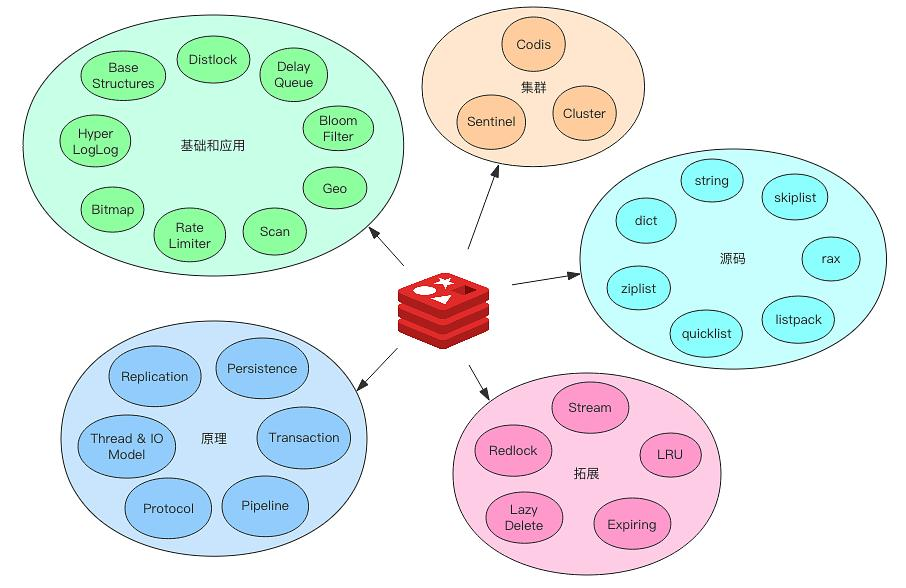
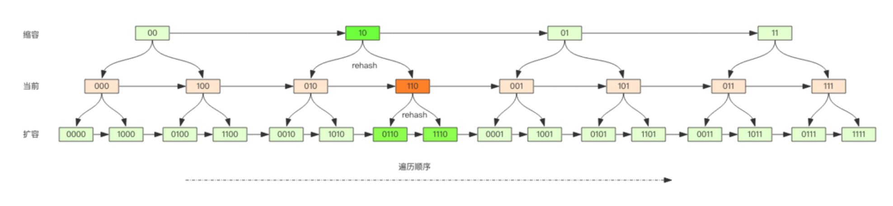

## Redis深度历险-核心原理和应用实践

#### **目录**



1. 基础和应用篇
   1. 概述
   2. 基础数据结构
   3. 分布式锁
   4. 延时队列
   5. 位图
   6. HyperLogLog
   7. 布隆过滤器
   8. 简单限流
   9. 漏斗限流
   10. GeoHash
   11. Scan
2. 原理篇
   1. 线程IO模型
   2. 通信协议
   3. 持久化
   4. 管道
   5. 事务
   6. Pub/Sub
   7. 小对象压缩
3. 集群篇
   1. 主从同步
   2. Sentinel
   3. Codis
   4. Cluster
4. 拓展篇
   1. Stream
   2. Info指令
   3. 分布式锁进阶
   4. 过期策略
   5. LRU
   6. 懒惰删除
   7. Jedis
   8. 安全策略
   9. 安全通信
5. 源码篇
   1. 字符串
   2. 字典
   3. 压缩列表
   4. 快速列表
   5. 跳跃列表
   6. 紧凑列表
   7. 基数树
   8. LFU/LRU
   9. 懒惰删除
   10. 字典遍历


#### **概述**

在贴吧社区系统中，Redis可能的基础应用

* 基础数据缓存(Hash)
  * 帖子的基础数据(标题、摘要、作者、点赞、评论等)
  * 热门帖子的内容
* 去重计数缓存(Zset)
  * 用户浏览的帖子列表
  * 帖子点赞、评论相关的用户列表
  * 帖子相关的推荐帖子列表
  * 总热榜、分类热榜的帖子列表
* 恶意行为过滤(Zset+Hash)
  * 用户行为历史


#### **基础数据结构**

##### CentOS7安装Redis

```bash
$ yum -y install redis

# 修改配置文件 后台启动、密码、允许远程连接
$ vi /etc/redis.conf
...
daemonize yes
requirepass Qq123456

protected-mode no
# bind 127.0.0.1
...

# 后台启动Redis
$ redis-server /etc/redis.conf &
[1] 3614

# 查看Redis进程
$ ps -ef | grep redis

# 查看Redis日志
$ cat /var/log/redis/redis.log

# 输入密码连接Redis 关闭Redis
$ redis-cli
127.0.0.1:6379> auth Qq123456
127.0.0.1:6379> shutdown
not connected> exit
```

##### **基础数据结构-String**

Key->Value

```bash
# 增删查
> set key value
OK
> get key
value
> exists key
1
> del key
1
> setnx key value # insert ignore 成功1/失败0
> 1/0

# 批量操作
> mset key1 value1 key2 value2
> mget key1 key2
1) value1
2) value2

# 过期策略
> expire key seconds
> setex key seconds value # set+expire

# 计数 对整数value进行自增操作 最大值signed long
> set index 30
OK
> incr index 1
31
> incr index 5
36
> set index 3628821464564 # overMax
OK
>incr index
ERR increment or decrement would overflow
```

##### **基础数据结构-List**

类似LinkedList，增删快O(1)，查询慢O(n)，常用作异步队列

```bash
# 队列 右进左出
> rpush key value1 value2 value3
3
> llen key
3
> lpop key
value1
> lpop key
value2
> lpop key
value3
> lpop key
(nil)

# 栈 右进右出
> rpush key value1 value2 value3
3
> rpop key
value3
> rpop key
value2
> rpop key
value1
> rpop key
(nil)

# 索引遍历-lindex 范围遍历-lrange 区域裁剪-ltrim
> rpush key value1 value2 value3
3
> lindex key 0
value1
> lrange key 0 -1
1) value1
2) value2
3) value3
> ltrim key 1 -1
OK
> lrange key 0 -1
1) value1
2) value2
```

##### **基础数据结构-Hash**

类似HashMap，无序字典，Key->Field->Value

```bash
# 增删改查
> hset key field1 value1
1
> hmset key field2 value2 field3 value3
OK
> hget key field1
value1
> hgetall key # key value间隔出现
1) field1
2) value1
3) field2
4) value2
5) field3
6) value3
> hlen key
3

# 自增
> hset key index 30
> hincrby key index 2
32
```

##### **基础数据结构-Set**

类似HashSet，无序且唯一，有去重功能

```bash
> sadd key value1
1
> sadd key value1 # 重复无效
0
> sadd key value2
1
> smembers key
1) value1
2) value2
> sismember key value1 # exist
1
> scard key # count
2
> spop key # delete
value1
```

##### **基础数据结构-Zset**

类似SortedSet+HashMap，有序且唯一，有权重功能

```bash
> zadd key 100 value1
1
> zadd key 85 value2
1
> zadd key 96 value3
1
> zrange key 0 -1 # score DESC
1) value1
2) value3
3) value2
> zrevrange key 0 -1 # score ASC
1) value2
2) value3
3) value1
> zcard key # count
3
> zrank key value3 # get index
1
> zrangebyscore key -inf 99 # get value range by score
1) value2
2) value3
> zrangebyscore key -inf 99 withscores # get value and score range by score
1) value2
2) 85
3) value3
4) 96
> zrem key value1 # delete
```

##### **基础数据结构总结**

* String，Key->Value
* List，Key->[Value1,Value2...]，可重复，有序
* Set，Key->[Value1,Value2...]，无重复，无序
* Hash，Key->Field->Value
* Zset，Key->[Value1+Score1,Value2+Score2...]，无重复，有序


#### **应用-分布式锁**

用于解决分布式应用多实例并发问题，如**并发修改、单次定时任务**等，核心指令如下

* 获取锁，setnx lockKey value
* 释放锁，del lockKey 

##### **程序异常**

程序异常导致**死锁**

给锁加上**过期时间**

* 获取时效锁，set lockKey value **ex seconds** nx
* 释放时效锁，del lockKey 

##### **程序超时**

程序超时，锁释放，另一进程获取到锁再次执行业务逻辑，导致**业务逻辑重复执行**

设置锁值为**随机数**，保证进程只能解自己获取的锁

- 获取时效锁，set lockKey **randomValue** ex seconds nx
- 释放时效锁
  - 获取锁值，get lockKey 
  - **判断随机数，若不等，则回滚业务逻辑**
  - 释放锁，del lockKey 


#### **应用-延时队列**

简化消息队列的搭建，但**不具备可靠性(ack)**，核心指令如下

* 生产消息，rpush/lpush key value
* 消费消息，lpop/rpop key

##### **空队列**

消费者**空轮询**浪费性能，提升Redis的QPS

消费者**间隔轮询**

* Thread.sleep(1000)

##### **队列延迟**

间隔轮询会**延迟消息消费**

运用**阻塞读**，队列无数据时会进入休眠

* 阻塞读，**blpop/brpop** key value

##### **延时队列**

指定队列中的消息在**特定时间点被消费**，如检测订单30分钟未支付自动取消，在顾客下单1分钟后推送短信

可通过Redis的**Zset**有序列表实现，序列化消息为value，到期处理时间为score

* 生产延迟消息到队列，zadd queueKey time msgValue
* 消费延迟消息
  * 获取消息，**zrangebyscore** queueKey 0 nowTime 
  * **删除消息(保证并发唯一)**，**zrem** queueKey msgValue
    * 删除成功则消费消息
    * 删除失败则不处理消息


#### **应用-位图**

**位(byte)数组**，可用于**存储大量boolean数据**，节省存储空间

位图本质上是字符串，可用get/set获取和设置整个位图内容，也可用getbit/setbit获取和设置位图某个byte内容

* **整存零取**，set key value，getbit key index
* **零存整取**，setbit key index byte(0/1)，get key

##### **统计和查找**

* **bitcount**，统计位图中1的个数
  * bitcount key，统计位图中1的个数
  * bitcount key startIndex endIndex，统计[startIndex,endIndex]**字符**间的1的个数
* **bitpos**，查找位图中1/0的索引
  * bitpos key 1/0，查找位图中第一个1/0位的索引
  * bitpos key 1/0 startIndex endIndex，查找[startIndex,endIndex]**字符**中的第一个1/0位的索引


#### **应用-HyperLogLog**

**不精确的去重统计**的数据结构，可用于统计网页的UV(Unique Vistor)等

HLL相较于Set，优点在于**内存占用极小(12K)**，原理是运用2^14个桶，每个桶6个bits存储，共占用2^14*6/8=12K字节

* 增加数据，**pfadd** key value
* 统计去重数据，**pfcount** key
* 合并去重数据，**pfmerge** key


#### **应用-布隆过滤器**

**不精确的去重过滤**的数据结构，可用于判断数据是否存在于数据集中，如历史数据过滤、垃圾邮件过滤

布隆过滤器相较于Set，优点在于存储消耗低

* 增加数据，**bf.add** key value
* 查询数据是否存在，**bf.exists** key value
* 查询多个元素是否存在，**bf.mexists** key value1 value2

##### **精准度与空间消耗**

通过命令显式创建布隆过滤器，可以间接设置精准度

* bf.reserve key errorRate initialSize
  * errorRate，错误率，越低所需空间越大
  * initialSize，预计存放元素数量，超过则误判率上升


#### **应用-限流**

##### **简单限流**

用于**减少高流量并发**或者**过滤非法请求**，如限定用户行为在单位时间内只能请求N次

可运用**Zset数据结构**实现简单限流，key-value记录用户行为历史，score记录请求时间，核心代码如下

* 增加用户行为，zadd key nowTime actionValue
* **统计单位时间内用户行为次数**
  * **zremrangeByScore** key 0 nowTime-unitTime*1000
  * **zcard** key
* **重置用户行为的过期时间**，避免冷用户持续占用内存，**expire** key period+1
* 逻辑比较单位时间用户行为次数是否超过规定次数
  * 超过，则非法请求，不执行响应

##### **漏斗限流**

运用**漏斗容量**和**漏斗流水速率**(单位时间内允许行为次数)，动态计算是否允许行为执行

可运用**Redis-Cell模块**实现漏斗限流，其提供**原子的限流指令**(加锁+取值+运算+设值+解锁)，核心代码如下

* 请求行为，**cl.throttle** key capacity operations unitTime quote
  * capacity，漏斗容量
  * **operations，单位时间内允许行为次数** 
  * **unitTime，单位时间(s)** 
  * quote，触发行为消耗漏斗容量单位，默认1
* 返回参数
  * 1) (integer) 0，**0 (允许)/1(拒绝)**
  * 2) (integer) 15，漏斗容量
  * 3) (integer) 14，漏斗剩余空间
  * 4) (integer) -1，**拒绝行为后，漏斗重获空间的时间(s)**
  * 5) (integer) 2，漏斗空容量的时间(s)


#### **应用-GeoHash**

**标识地理位置**的数据结构，可用于计算地理位置距离、附近的元素等

**数据库**使用**二维的经纬度**存储地理位置数据，由于经纬度的密度不一样(360/180)，计算距离需要加权求和，计算附近元素性能消耗大

##### **GeoHash算法**

**地理位置距离排序算法**，将二维经纬度数据映射至**一维整数**，对整数**Base32编码**成字符串存储

本质上是将**二维空间划分编码**，越近的坐标编码越相似，划分精度越高编码越长占用空间越大

##### **Redis-Geo**

提供Geo指令封装，本质是运用**Zset**存储地理位置数据

* value是元素的标识
* score是元素坐标值经过GeoHash算法并**52位整数的编码值**

Geo指令如下

* 新增地理位置数据，**geoadd** key longitude latitude value
* 计算元素距离，**geodist** key value1 value2 unit(m/km/ml/ft)
* 获取元素坐标，**geopos** key value
* 获取元素的标准经纬度编码字符串(base32)，**geohash** key value
  * 该哈希编码可在http://geohash.org/${hash}可视化
* 获取指定元素附近的其他元素，**georadiusbymenber** key value unit count N asc/desc [params]
  * value，指定元素
  * unit，指定距离，如20 km
  * count N，指定最大数量，如count 3
  * asc/desc，指定排序
  * params，附加参数
    * withcoord，增加返回元素的经纬度
    * withdist，增加返回元素距离中心的距离
    * withhash，增加返回元素的geohash值(52位)
* 获取指定经纬度附近的其他元素，**georadius** key longitude latitude unit count N asc/desc [params]


#### **应用-Scan**

Redis用于**扫描指定Key**的指令，具备以下优点

* 复杂度为O(n)，但采用**游标分布**进行，**不阻塞线程**
* 提供**Limit参数**控制每次返回**最大条数**
* 提供**正则模式匹配**功能

具备以下特点

* 服务器不保存游标状态(游标整数)
* **返回结果可能不准确**，如返回重复数据，如可能遍历不到正修改的数据
* **遍历结束**标志为**返回游标值为零**

指令如下

* **scan** cursor matchKey limitNum
  * **cursor**，游标遍历标识，非零则未遍历结束
  * **matchKey**，key的正则匹配规则
  * **limitNum**，每次最大返回条数
* 指定**容器集合**遍历
  * **zscan**->zset
  * **hscan**->hash
  * **sscan**->set

##### **Key字典结构**

Redis的**Key字典**均以**一维数组+二维链表**结构存储，一维数据大小为2^n

Scan指令参数对应的存储结构如下

* cursor，就是存储key的**一维数组的位置索引(槽slot)**
* limitNum，就是遍历的**槽位数**

##### **Key字典扩容**

Key字典扩容时重新分配一个2倍大小的数组，元素rehash到新数组，规则如下

* 元素**保留hash值的低位**，**高位为0/1**
* **渐进式rehash**，同时保留新旧数组，保证扩容不阻塞线程

Scan时Key字典扩容，则采取**高位加进法**的遍历顺序，保证rehash前后的遍历顺序不重复




#### **原理-线程IO模型**

单线程的Redis依据**非阻塞IO+事件轮询(多路复用)**，才得以处理大量并发客户端连接

* 非阻塞IO，为套接字的读/写提供**Non_Blocking**选项，打开时读写方法不阻塞

* 事件轮询API，**通知线程**非阻塞读/写何时继续，如**select、epoll(linux)、kqueue(freebsd&macosx)**

Redis通过**指令队列+响应队列**，实现非阻塞IO和事件轮询


#### **原理-通信协议**

Redis采用**RESP文本通信协议**，优点是直观、简单、易解析

RESP将传输的数据结构分为**5种最小单元**，每种单元结束统一加上**回车换行符(/r/n)**

* +，单行字符串开头
* $length，多行字符串开头
* :，整数开头
* -，错误消息开头
* *length，数组开头

**客户端向服务端**发送的指令格式为**多行字符串数组**，解析如下

* set author harvie -> ***3** \r\n **$3** \r\n **set** \r\n **$6** \r\n **author** \r\n **$6** \r\n **harvie** \r\n

**服务器向客户端响应**支持多种数据结构

* +OK -> OK
* -ERR value is not an integer or out of range -> (error) ERR value is not an integer or out of range
* :1 -> (integer) 1
* $8 \r\n harvie -> "harvie"
* *2 \r\n $3 \r\n age \r\n $3 \r\n sex \r\n -> 1) "age" 2) "sex" 


#### **原理-持久化**

Redis持久化机制分为**快照(全量)**和**AOF日志(增量)**

##### **快照**


