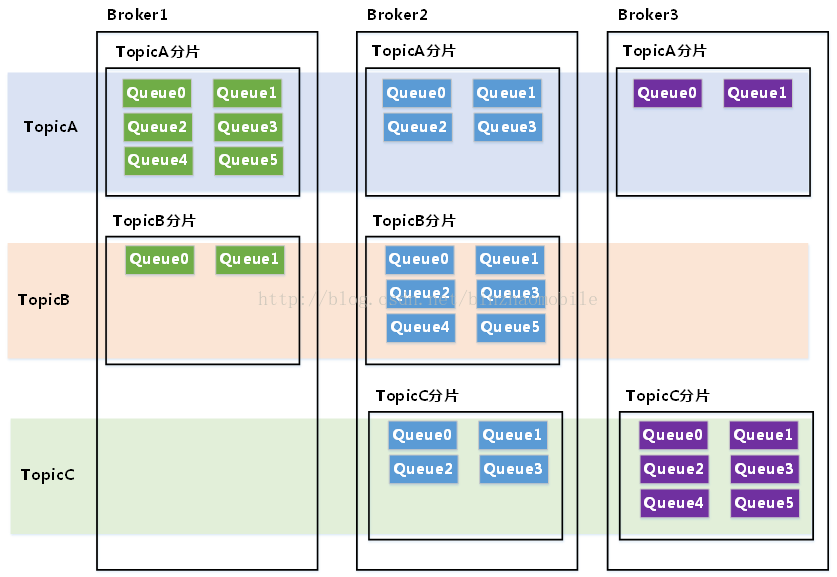
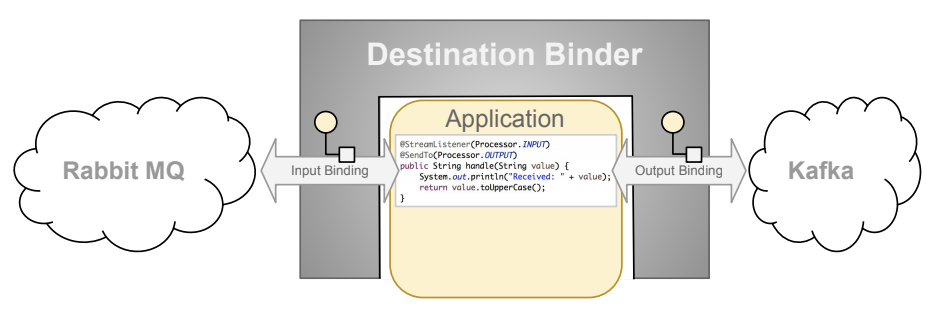

## **RocketMQ**

#### **添加Maven依赖**

```xml
<dependency>
	<groupId>org.apache.rocketmq</groupId>
	<artifactId>rocketmq-client</artifactId>
	<version>4.3.0</version>
</dependency>
```

------

## **消息示例(Topic)**

#### **消息生产者**

RocketMQ可通过三种方式发送消息

*  Reliable Synchronous-可靠同步，主要用于重要通知的业务场景，如SMS通知等

  相关要点注意

  * setVipChannelEnabled(false)：不设置可能造成[org.apache.rocketmq.remoting.exception.RemotingTooMuchRequestException: sendDefaultImpl call timeout]异常，发送消息失败
  * Topic：需要提前配置好，不设置可能造成[org.apache.rocketmq.client.exception.MQClientException: No route info of this topic, TopicTest]异常，发送消息失败
  * 发送多条消息不建议使用SendResult.getSendStatus()作为业务逻辑处理的判断依据，因为当消息发送成功并通过RPC回调到程序上下文中时，其状态还未返回，容易造成程序异常崩溃

```java
//通过ProducerGroupName初始化消息生产者
DefaultMQProducer producer = new DefaultMQProducer("RocketMqTest");
//设置MQ的NameSrv服务地址
producer.setNamesrvAddr("100.75.186.165:4308");
//关闭VIP通道，避免发送消息失败
producer.setVipChannelEnabled(false);
//启动生产者实例
producer.start();
//创建消息对象，包括Topic、Tag、Key和传递的数据
Message msg = new Message("TopicTest", "TagTest", "KeyTest",data.getBytes(RemotingHelper.DEFAULT_CHARSET));
//Reliable Synchronous方式发送消息到NameSrv下的某个broker实例并得到返回结果
SendResult sendResult = producer.send(msg);
//关闭生产者实例
producer.shutdown();
//返回消息的响应
return sendResult;
```

发送消息后可以在RocketMQ控制台查看发送到消息队列的消息


发送消息的响应格式为

```json
{
    "sendStatus": "SEND_OK",
    "msgId": "0AC85B0F4A0C18B4AAC2507EF13B0000",
    "messageQueue": {
        "topic": "TopicTest",
        "brokerName": "broker-b",
        "queueId": 5
    },
    "queueOffset": 0,
    "offsetMsgId": "644BBAA2000010D4000000000000FE71",
    "regionId": "DefaultRegion",
    "traceOn": true
}
```

* Reliable Asynchronous-可靠异步，主要用于时间敏感的业务场景

```java
DefaultMQProducer producer = new DefaultMQProducer("RocketMqProducerGroupTest");
producer.setNamesrvAddr("100.75.186.165:4308");
producer.setVipChannelEnabled(false);
producer.setRetryTimesWhenSendAsyncFailed(1);  //异步发送消息可设置失败重试次数
producer.start();
Message msg = new Message("TopicTest", "TagTest", "KeyTest", data.getBytes(RemotingHelper.DEFAULT_CHARSET));
producer.send(msg, new SendCallback() {  //异步发送消息可设置回调函数
    @Override
    public void onSuccess(SendResult sendResult) {  //发送成功
        System.out.printf(sendResult.getMsgId());
    }
    @Override
    public void onException(Throwable e) {  //发送异常
        e.printStackTrace();
    }
});
producer.shutdown();
```

不知道为什么一直报错org.apache.rocketmq.client.exception.MQClientException: No route info of this topic, TopicTest，以后有时间解决

* One-Way Transmission：单向传输，主要用于中等(Moderate)可靠性的传输场景，如日志收集等

```java
DefaultMQProducer producer = new DefaultMQProducer("RocketMqProducerGroupTest");
producer.setNamesrvAddr("100.75.186.165:4308");
producer.setVipChannelEnabled(false);
producer.start();
Message msg = new Message("TopicTest", "TagTest", "KeyTest",data.getBytes(RemotingHelper.DEFAULT_CHARSET));
producer.sendOneway(msg);  //单向传输发送消息，无响应信息
producer.shutdown();
```

#### **消息消费者**

* 如果使用SpringBoot可以在消费者方法上加上**@PostConstruct**注解使类被初始化时会自动调用该方法

```java
//通过ConsumerGroupName初始化消息消费者
DefaultMQPushConsumer consumer = new DefaultMQPushConsumer("RocketMqConsumerGroupTest");
//设置MQ的NameSrv服务地址
consumer.setNamesrvAddr("100.75.186.165:4308");
//关闭VIP通道
consumer.setVipChannelEnabled(false);
//消费消息方式 consumerGroup第一次启动 CONSUME_FROM_FIRST_OFFSET从消息队列头部消费
consumer.setConsumeFromWhere(ConsumeFromWhere.CONSUME_FROM_FIRST_OFFSET);
//广播模式消费消息
consumer.setMessageModel(MessageModel.BROADCASTING);
//设置订阅的Topic
consumer.subscribe("TopicTest", "*");
//注册监听
consumer.registerMessageListener(new MessageListenerConcurrently() {

    //重写获取消息后的回调函数
    @Override
    public ConsumeConcurrentlyStatus consumeMessage(List<MessageExt> msgs, ConsumeConcurrentlyContext context) {
        //相关业务逻辑
        System.out.printf("%s Receive New Messages: %s %n", Thread.currentThread().getName(), msgs);
        //返回消费成功标识
        return ConsumeConcurrentlyStatus.CONSUME_SUCCESS;
    }
});
//启动消息消费者
consumer.start();
System.out.printf("Consumer Started.%n");
```

* **MessageExt**数据结构JSON化输出

```json
{
    "queueId": 11,
    "flag": 0,
    "sysFlag": 0,
    "keys": "KeyTest",
    "delayTimeLevel": 0,
    "msgId": "0AC85B0F4A7C18B4AAC2509FEA880001",
    "body": [68,97,116,97,32,70,114,111,109,32,80,114,111,100,117,99,101,114],
    "waitStoreMsgOK": true,
    "bodyCRC": 610674504,
    "queueOffset": 0,
    "storeSize": 196,
    "bornHostString": "10.200.91.15",
    "bornTimestamp": 1571211857544,
    "reconsumeTimes": 0,
    "storeTimestamp": 1571211857534,
    "bornHostBytes": {
        "array": "CshbDwAA9j8=",
        "limit": 8,
        "position": 0
    },
    "bornHost": {
        "address": "10.200.91.15",
        "port": 63039
    },
    "tags": "TagTest",
    "preparedTransactionOffset": 0,
    "storeHostBytes": {
        "array": "ZEu6oQAAENQ=",
        "limit": 8,
        "position": 0
    },
    "bornHostNameString": "IQSZ-D0479.cmrh.com",
    "commitLogOffset": 71597,
    "topic": "TopicTest",
    "offsetMsgId": "644BBAA1000010D400000000000117AD",
    "storeHost": {
        "address": "100.75.186.161",
        "port": 4308
    },
    "properties": {
        "MIN_OFFSET": "0",
        "MAX_OFFSET": "1",
        "KEYS": "KeyTest",
        "CONSUME_START_TIME": "1571211857550",
        "UNIQ_KEY": "0AC85B0F4A7C18B4AAC2509FEA880001",
        "WAIT": "true",
        "TAGS": "TagTest"
    }
}
```

* **ConsumeConcurrentlyContext**数据结构JSON化输出

```json
{
    "ackIndex": 2147483647,
    "delayLevelWhenNextConsume": 0,
    "messageQueue": {
        "queueId": 11,
        "topic": "TopicTest",
        "brokerName": "broker-a"
    }
}
```

* 将消息中的**内容解码输出**

```java
//Data From Producer
new String(MessageExtObject.getBody(), Charset.forName(RemotingHelper.DEFAULT_CHARSET)); 
```

------

## **顺序消息(Queue)**

RocketMQ提供MessageQueue采用FIFO方式发送顺序消息，原理是通过**指定QueueId**

* 生产者：将部分需要顺序消费的消息发往同一个Topic下的同一个MessageQueue
* 消费者：按顺序消费同一个Topic下的同一个MessageQueue里的消息(同一个Topic的不同MessageQueue可以并发消费)

#### **顺序消息生产者**

```java
Message msg = new Message("TopicTest", "TagTest", "KeyTest",(data+i).getBytes(RemotingHelper.DEFAULT_CHARSET));
SendResult sendResult = producer.send(msg, new MessageQueueSelector() {
    @Override
    public MessageQueue select(List<MessageQueue> mqs, Message msg, Object arg) {
        Integer id = (Integer) arg;
        int index = id % mqs.size();  //mqs.size()是该Topic下的queue数量
        return mqs.get(index);  //根据index标识该消息发送到的queue
    }
}, 1);  //这里的参数是select方法的arg参数 即同一批需要顺序消费的消息的Integer标识,如订单ID
```

#### **顺序消息消费者**

```java
//设置线程数 保证同一个Topic下的同一个MessageQueue里的消息不被并发消费
consumer.setConsumeThreadMin(1);
consumer.setConsumeThreadMax(1);
//并发消费
//consumer.registerMessageListener(new MessageListenerConcurrently() {
//    @Override
//    public ConsumeConcurrentlyStatus consumeMessage(List<MessageExt> msgs, ConsumeConcurrentlyContext context) {
//        return ConsumeConcurrentlyStatus.CONSUME_SUCCESS;
//    }
//});
//顺序消费
consumer.registerMessageListener(new MessageListenerOrderly() {
    @Override
    public ConsumeOrderlyStatus consumeMessage(List<MessageExt> msgs, ConsumeOrderlyContext context) {
        return ConsumeOrderlyStatus.SUCCESS;
    }
});
```

可以看到消息均发送到queueId为1的MessageQueue队列中被顺序消费

```
Fetch Msg Topic : TopicTest
Fetch Msg brokerName : broker-a
Fetch Msg queueId : 1  //MessageQueueId
Fetch Msg Body : Data From Producer0
Fetch Msg Tags : TagTest

Fetch Msg Topic : TopicTest
Fetch Msg brokerName : broker-a
Fetch Msg queueId : 1  //MessageQueueId
Fetch Msg Body : Data From Producer1
Fetch Msg Tags : TagTest

Fetch Msg Topic : TopicTest
Fetch Msg brokerName : broker-a
Fetch Msg queueId : 1  //MessageQueueId
Fetch Msg Body : Data From Producer2
Fetch Msg Tags : TagTest
```

#### **MessageQuese概念**

创建Topic时可以指定该Topic的queue数量，如16


这里指定的Queue还会根据Broker数量对Topic进行分片，因此一个Topic下的queue数量为指定的QueueNum*BrokerNum



可以在RocketMQ控制台查看Topic下的MessageQueu情况


------

## **Spring Cloud Stream**

#### **概述**

* Spring Cloud Stream 是一个用于构建**基于消息的微服务应用框架**

* **基于 SpringBoot**来创建具有生产级别的单机 Spring 应用，并且使用 **Spring Integration**与 Broker 进行连接

#### **特点**

提供了消息中间件配置的同一抽象，推出了 `publish-subscribe`、`consumer groups`、`partition` 这些统一的概念

* **Binder**：跟外部消息中间件集成的组件，用来创建Binding
* **Binding**：在消息中间件与应用程序提供的Provider 和Consumer之间提供了一个桥梁，包括InputBinding和OutputBinding



------

## **代码**

* Maven依赖

```xml
<!--  RocketMQ  -->
<dependency>
	<groupId>org.apache.rocketmq</groupId>
	<artifactId>rocketmq-client</artifactId>
	<version>4.3.0</version>
</dependency>
```

* 配置文件

```properties
apache.rocketmq.nameservice.address=100.75.186.165:4308
apache.rocketmq.producer.group=cmuop_app
apache.rocketmq.consumer.group=cmuop_app
apache.rocketmq.consumer.subscribe.topics=test-topic
apache.rocketmq.consumer.subscribe.tags=*
```

* ProducerService

```java
@Service
public class ProducerService {

    @Value("${apache.rocketmq.nameservice.address}")
    private String rocketmqNamesrvAddr;

    @Value("${apache.rocketmq.producer.group}")
    private String rocketmqProducerGroup;

    public ResponseData sendReliableMsg(String topic, String tag, String key, String Msg){
        //通过ProducerGroupName初始化消息生产者
        DefaultMQProducer producer = new DefaultMQProducer(rocketmqProducerGroup);
        //设置MQ的NameSrv服务地址
        producer.setNamesrvAddr(rocketmqNamesrvAddr);
        //关闭VIP通道，防止消息发送错误
        producer.setVipChannelEnabled(false);

        //启动生产者实例
        try {
            producer.start();
        } catch (MQClientException e) {
            e.printStackTrace();
        }

        //创建消息对象，包括Topic、Tag、Key和传递的数据
        //初始化返回值
        SendResult sendResult=null;
        Message msg = null;
        try {
            msg = new Message(topic, tag, key,Msg.getBytes(RemotingHelper.DEFAULT_CHARSET));
        } catch (UnsupportedEncodingException e) {
            e.printStackTrace();
        }

        //Reliable Synchronous方式发送消息到NameSrv下的某个broker实例并得到返回结果
        try {
            sendResult= producer.send(msg);
        } catch (MQClientException e) {
            e.printStackTrace();
        } catch (RemotingException e) {
            e.printStackTrace();
        } catch (MQBrokerException e) {
            e.printStackTrace();
        } catch (InterruptedException e) {
            e.printStackTrace();
        } finally {
            //关闭生产者实例
            producer.shutdown();
        }

        //判断消息是否发送成功
        if(Objects.nonNull(sendResult) || sendResult.getSendStatus().equals(SendStatus.SEND_OK)){
            //消息发送成功
            ResponseData<Object> responseData=new ResponseData<>();
            responseData.setCode("1");
            responseData.setData(sendResult);
            return responseData;
        }else{
            //消息发送失败
            ResponseData<Object> responseData=new ResponseData<>();
            responseData.setCode("0");
            responseData.setData(sendResult);
            return responseData;
        }
    }
}
```

* ConsumerService

```java
/**
 * @author harvie
 * @version $Id: ConsumerService.java, v 0.1 2019-10-17 15:48 Exp $$
 */
@Service
public class ConsumerService {

    @Value("${apache.rocketmq.nameservice.address}")
    private String rocketmqNamesrvAddr;

    @Value("${apache.rocketmq.consumer.group}")
    private String rocketmqConsumerGroup;

    @Value("${apache.rocketmq.consumer.subscribe.topics}")
    private String topics;

    @Value("${apache.rocketmq.consumer.subscribe.tags}")
    private String tags;


    @PostConstruct
    public void asynConsumer(){
        //通过ProducerGroupName初始化消息消费者
        DefaultMQPushConsumer consumer = new DefaultMQPushConsumer(rocketmqConsumerGroup);
        //设置MQ的NameSrv服务地址
        consumer.setNamesrvAddr(rocketmqNamesrvAddr);
        //关闭VIP通道，防止消息发送错误
        consumer.setVipChannelEnabled(false);
        //消费消息方式 consumerGroup第一次启动 CONSUME_FROM_FIRST_OFFSET从消息队列头部消费
        consumer.setConsumeFromWhere(ConsumeFromWhere.CONSUME_FROM_FIRST_OFFSET);
        //广播模式消费消息
        consumer.setMessageModel(MessageModel.BROADCASTING);

        //设置订阅的Topic和Tag
        try {
            consumer.subscribe(topics, tags);
        } catch (MQClientException e) {
            e.printStackTrace();
        }

        //设置消费类型 目前采取并发消费
        //并发消费 设置监听处理器
        consumer.registerMessageListener(new MessageListenerConcurrently() {
            @Override
            public ConsumeConcurrentlyStatus consumeMessage(List<MessageExt> msgs, ConsumeConcurrentlyContext context) {
                return consumerMsg(msgs,context);
            }
        });

//        //顺序消费
//        //设置线程数 保证同一个Topic下的同一个MessageQueue里的消息不被并发消费
//        consumer.setConsumeThreadMin(1);
//        consumer.setConsumeThreadMax(1);
//        //设置监听处理器
//        consumer.registerMessageListener((MessageListenerOrderly) (msgs, context) -> {
//            return ConsumeOrderlyStatus.SUCCESS;
//        });


        //启动消费者实例
        try {
            consumer.start();
        } catch (MQClientException e) {
            e.printStackTrace();
        }
        //可以优化成Log
        System.out.printf("Consumer Started.%n");
    }

    private ConsumeConcurrentlyStatus consumerMsg(List<MessageExt> msgs, ConsumeConcurrentlyContext context){
        System.out.println("consumeMsg Thread : "+Thread.currentThread());
        msgs.stream().forEach(E->{
            System.out.println("Fetch Msg Topic : "+context.getMessageQueue().getTopic());
            System.out.println("Fetch Msg brokerName : "+context.getMessageQueue().getBrokerName());
            System.out.println("Fetch Msg queueId : "+context.getMessageQueue().getQueueId());
            System.out.println("Fetch Msg UniMsgId : "+E.getMsgId());
            System.out.println("Fetch Msg Body : "+new String(E.getBody(), Charset.forName(RemotingHelper.DEFAULT_CHARSET)));
            System.out.println("Fetch Msg Tags : "+E.getTags());
        });
        return ConsumeConcurrentlyStatus.CONSUME_SUCCESS;
    }

}
```

