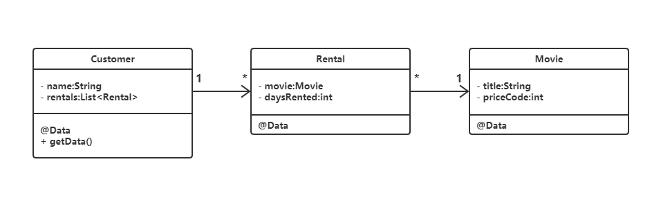
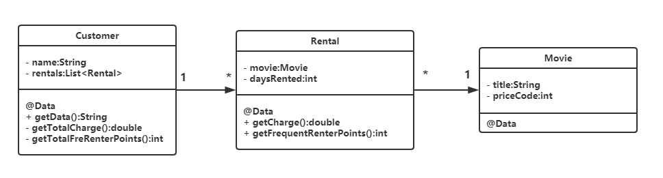

[TOC]


## **前言**

重构(refactoring)，一个不改变代码外在行为的前提下，对代码做出修改，以改进程序的内部结构的过程

软件开发遵循先设计后编码，然而随着迭代的进行，原先设计的系统结构逐渐衰弱，代码质量渐渐沉沦

重构则是编码完成后改进其设计，从根本上改善代码质量


## **第一章-重构案例**

#### **原始代码**

影片出租系统

* 实体类，分别是影片类、顾客类和租赁类

  

* 顾客类的计算租赁数据的方法，数据包含租赁的影片名称、总价格、总积分等

  ```java
  class Customer {
      //计算顾客租赁数据
      public String getData(){
          //数据初始化
          double totalAmount = 0;
          int frequentRenterPoints = 0;
          List<Rental> rentalsList = this.getRentals();
          String result = "Rental Record for " +this.getName() + "\n";
          
          //计算租赁价格和积分
          foreach(rental:rentalsList){
              double thisAmount = 0;
              //分类计算价格
              switch(rental.getMovie().getPriceCode()){
                  case Movie.REGULAR:
                      thisAmount += 2;
                      if(rental.getDaysRented() > 2){
                          thisAmout += (rental.getDaysRented()-2) * 1.5;
                      }
                      break;
                  case Movie.NEW_RELEASE:
                      thisAmout += rental.getDaysRented() * 3;
                      break;
                  case Movie.CHILDRENS:
                      thisAmount += 1.5;
                      if(rental.getDaysRented() > 2){
                          thisAmout += (rental.getDaysRented()-3) * 1.5;
                      }
                      break;
              }
              
              //计算积分 租赁新版影片大于1天可加倍积分
              frequentRenterPoints ++;
              if(rental.getMovie().getPriceCode()==Movie.NEW_RELEASE 
                 && rental.getDaysRented() > 1){
                  frequentRenterPoints ++;
              }
              
              //打印数据
              result += "\t" + rental.getMovie().getTitle() + "\t" + 
                  String.valueOf(thisAmout) + "\n";
              totalAmout += thisAmout;
          }
          
          //打印总价格和总积分
          result += "Amout owed is" + String.valueOf(totalAmout) + "\n";
          result += "You earned" + String.valueOf(frequentRenterPoints) + "\n";
          return result;
      }
  }
  ```

#### **代码评价**

代码冗长，职责不明

可扩展性差，输出格式、计费标准、影片分类固定

#### **重构策略**

1. **建立可靠的测试用例**

重构依赖测试，测试给予重构必要的安全保障，防止引入Bug

2. **分解并重组代码成可复用的独立函数**

* 分解代码，提炼独立函数
  * 未被修改的变量(仅读的变量)，可提炼成独立函数的参数
  * 被修改的变量(写入的变量)，可提炼成独立函数的返回值

* 放置独立函数

  * 函数一般放置在所使用的数据的所属对象内

* 去除临时变量

  临时变量作用域有限，导致多余参数的传递，容易助长冗长复杂的代码

3. **运用设计模式**

可以运用设计模式重构类之间的关系，如运用State模式的继承和多态重构switch逻辑

#### **重构代码**

提炼switch代码成独立函数，Rental为参数，thisAmout为返回值，并将其放置在Rental类中

提炼积分计算代码成独立函数，Rental为参数，累加的积分为返回值，并将其放置在Rental类中

```java
//提炼独立函数
class Rental {
    ...
    public double getCharge()
    {
        double result = 0;
        switch(getMovie().getPriceCode()){
            case Movie.REGULAR:
                result += 2;
                if(getDaysRented() > 2){
                    result += (getDaysRented()-2) * 1.5;
                }
                break;
            case Movie.NEW_RELEASE:
                result += getDaysRented() * 3;
                break;
            case Movie.CHILDRENS:
                result += 1.5;
                if(getDaysRented() > 2){
                    result += (getDaysRented()-3) * 1.5;
                }
                break;
        }
        return result;
    }
    
    public int getFrequentRenterPoints()
    {
        if(getMovie().getPriceCode()==Movie.NEW_RELEASE && getDaysRented() > 1){
            return 2;
        }else{
            return 1;
        }
    }
}
//调用独立函数
thisAmount = rental.getCharge();
frequentRenterPoints += rental.getFrequentRenterPoints();
```

去除Customer类的临时变量，将其提炼成独立函数放置在Customer类中

```java
class Customer{
    //提炼临时变量totalAmount
    private double getTotalCharge(){
        double result = 0;
        List<Rental> rentalsList = this.getRentals();
        foreach(rental:rentalsList){
            result += rental.getCharge();
        }
        return result;
    }
    
    //提炼临时变量frequentRenterPoints
    private int getTotalFreRenterPoints(){
        int result = 0;
        List<Rental> rentalsList = this.getRentals();
        foreach(rental:rentalsList){
            result += rental.getFrequentRenterPoints();
        }
        return result;
    }
}
```

重构后的计算租赁数据的方法

```java
class Customer {
    //计算顾客租赁数据
    public String getData(){
        //数据初始化
        List<Rental> rentalsList = this.getRentals();
        String result = "Rental Record for " +this.getName() + "\n";
        
        //打印影片信息
        foreach(rental:rentalsList){
            result += "\t" + rental.getMovie().getTitle() + "\t" + 
                String.valueOf(rental.getCharge()) + "\n";
        }
        
        //打印总价格和总积分
        result += "Amout owed is" + String.valueOf(getTotalCharge()) + "\n";
        result += "You earned" + String.valueOf(getTotalFreRenterPoints()) + "\n";
        return result;
    }
}
```

重构后的实体类UML图




## **第二章-重构原则**

#### **重构定义**

运用一系列重构手法，在不改变软件可观察行为的前提下，调整软件内部结构，提高其可理解性，降低其修改成本

重构可以提高整理代码的效率，但不一定会形成性能优化

在软件开发过程中，重构与添加新功能交替进行，重构优化程序结构促进添加新功能，添加新功能引发重构

#### **重构优点**

* 改进软件设计，提高编程速度，增加系统可理解程度
* 帮助定位BUG，写出强健代码

#### **重构时机**

* 添加新功能时重构，降低编写新代码难度
* 修补错误时重构，增加代码清晰度，易于定位错误
* 技术复审时重构，复审团队共同提高代码质量

#### **重构难题**

* **数据库**
  * 软件系统代码与数据库紧密耦合
  * 数据迁移工作量大
  * 可在系统代码与数据库中插入分隔层代码，降低重构代码中数据库的影响
* **接口**
  * 修改实现类较安全，修改接口则会影响到调用者
  * 必须同时维护新旧两个接口，直到所有调用者都准备好
  * 重构后维护过多接口代价大
  * 接口的异常抛出无法隐藏使调用者无感

* **设计模式**
  * 核心设计决策难以重构

#### **重构与设计**

重构与设计彼此互补

* 若无重构，预先设计需要正确无误，若有偏差则修改代价高昂

* 若有重构，则预先设计仅需得到合理的解决方案，重构可以应付变化带来的风险

#### **重构与性能**

重构可能使软件运行速度变慢，但简化了软件的性能优化难度

重构提升性能的途径是，首先重构出性能可优化的软件，然后进行性能优化调整

#### **重构起源**

* Ward和Kent发展的Smalltalk(极限编程环境)，支持快速修改代码，将修改的影响隐藏于定义良好的接口背后
* Bill研究的语义保持性重构及如何用工作实现重构
* John和Don开发的重构浏览器工作


## **第三章-代码的坏味道**

#### **Duplicated Code-重复代码**

* 同类的函数含有相同表达式

  提炼重复代码在类中

* 子类含有相同表达式

  提炼重复代码，将其上移至父类

* 代码类似但并非完全相同

  将相似部分提炼成单独函数，运用Template Method设计模式

* 函数以不同算法做相同事情

  选择其中较为清晰函数替换其余函数

* 无关的类出现相同表达式

  提炼重复代码到其中一个类或第三方类中，另外的类使用这个类的函数

#### **Long Method-过长函数**

将代码提炼成独立短函数的优点

* 解释能力

  短函数的职责明确，易于理解，调用者可通过函数签名了解函数作用

* 共享能力

* 选择能力

#### **Large Class-过大的类**

过大的类中包含过多的实例变量和代码，增加重复代码、混乱代码的风险性

可提炼代码到额外的类或下移至子类中

#### **Long Parameter List-过长参数列**

过长的参数列难易理解，造成上下文不一致，不易使用

面向对象编程中，可将函数所需的参数传递给对象，函数从对象中获取即可

#### **Divergent Change-发散式变化**

针对多种外界变化造成一个类的多次修改

可提炼代码到独立的类中，确保每个类只因一种变化而需要修改

#### **Shotgun Surgery-霰弹式修改**

针对一种外界变化造成多个类的小修改，这种修改散布四处，难以定位

可转移方法和对象到独立的类中，确保每个类只因一种变化而需要修改

#### **Feature Envy-依恋情节**

数据和对数据的操作行为分离，造成一个函数调用多个类的取值函数

可提炼多个函数并将独立函数转移到合适的类中，使数据和数据的行为函数包装在一起，共同变化

#### **Data Clumps-数据泥团**

多个类中含有相同字段、多个函数签名中含有相同参数

提炼数据到独立的对象中，减少字段和参数个数

#### **Primitive Obsession-基本类型偏执**

基本类型充斥在代码中

提炼基本类型数据构成有意义的结构类型数据

#### **Switch Statements-Switch语句**

Switch语句意味着重复，并且新增Case子句需要找到所有关联的Switch语句并修改

运用多态代替Switch，提炼Switch语句到独立函数中，再将其转移到多态性的类中

#### **Parallel Inheritance Hierarchies-平行继承体系**

Shotgun Surgery的继承形式，为一个增加子类则必须为另一个类也响应增加一个子类

让两个继承体系的实例形成关联引用

#### **Lazy Class-冗赘类**

无用的类耗费开发者的理解、维护精力

移除无用的类

#### **Temporary Field-暂时字段**

类中某个变量仅为特定情况而设，降低程序清晰度，不易理解

将所有和暂时字段相关的代码提炼成一个独立的类

#### **Inappropriate Intimacy-过度亲密**

两个类耦合过紧，而继承往往造成过度亲密

提炼两者的共同点到独立的类

#### **Data Class-数据类**

数据类仅拥有字段和访问字段的函数，即贫血模型

尝试提炼访问数据的调用行为搬移到数据类中，丰富数据类型的表达能力和责任

#### **Comments-过多的注释**

代码糟糕难以理解需要过多注释解释

重构代码去除注释


## **第四章-构建测试体系**

可靠优良的测试体系促进编写代码和重构

自动化测试代码能够大大缩减查找问题所需时间

开发者可用单元测试框架如JUnit用于自测，测试者更多地将整个系统当做黑盒进行功能测试


## **第五章-重构列表**

#### **列表形式**

* **名称-Name**

* **概要-Summary**

  解决问题的场景+简短陈述过程+重构前后示例图

* **动机-Motivation**

* **做法-Mechanics**

  安全重构的每个步骤，小步前行，频繁测试

* **范例-Examples**

  阐述实现重构的具体做法


## **第六章-重组函数**

#### **方法论**

重构出现的问题大多源于过长函数，其内含太多信息并且逻辑复杂

* **提炼函数(Extract Method)**
  * 处理临时变量
    * **分离临时变量(Split Temp Variable)**
    * **查询替换(Replace Temp with Query)**
    * **对象替换(Replace Method with Method Object)**
  * 处理参数
    * **移除参数赋值(Remove Assignments to Parameters)**
* **替换算法(Substitute Algorithm)**

#### **Extract Method-提炼函数**

* 概要

  组织一段代码放入一个独立函数中，并通过函数名称解释该函数用途

* 动机

  将过长的函数或需注释解释的代码提炼成独立且命名良好的函数，增加函数复用率，降低函数复写难度

* 做法

  * 以函数的作用为名新建函数，提炼代码到目标函数
  * 将源函数的局部变量以参数传递给目标函数
  * 将目标函数中值变化的局部变量以返回参数形式返回
  * 在源函数中，将被提炼的代码替换为目标函数的调用
  
* 范例

  ```java
  //重构前
  void printCount(int a){
  	int b = 0;
  	for(i = 0;i < a; i++){
  		b += i;
  	}
  }
  //重构后
  int calculate(int a){
      int c =0;
      for(i = 0;i < a; i++){
  		c += i;
  	}
      return c;
  }
  void printCount(int a){
      int b = calculate(a);
  }
  ```

#### **Inline Method-内联函数**

* 概要

  在函数调用点插入过于简单的函数本体，然后移除该函数的调用

* 动机

  函数的提炼不合理，导致函数之间的委托关系冗余复杂，增加函数的可用价值

* 做法

  * 确定内敛函数无多态性，即无子类继承该函数
  * 将函数的所有调用点替换为函数本体

#### **Replace Temp with Query-以查询取代临时变量**

* 概要

  将程序中保存表达式运算结果的临时变量，替换成查询函数

* 动机

  临时变量仅作用于所属函数，将其替换成查询函数增加其可用性，并且使源函数易重构

* 做法

  * 确保临时变量仅被赋值一次
  * 将临时变量保存的表达式运算提炼成独立的查询函数
  * 将源函数中的临时变量替换成查询函数

* 范例

  ```java
  //重构前
  public double getPrice(){
      int basePrice = quantity * itemPrice;
      double discount;
      if(basePrice > 1000) discount = 0.95;
      else discount = 0.98;
      return basePrice * discount;
  }
  //重构后
  private int getBasePrice(){
      return quantity * itemPrice;
  }
  private double getDiscount(){
      if(getBasePrice() > 1000) discount = 0.95;
      else discount = 0.98;
  }
  double getPrice(){
      return getBasePrice() * getDiscount();
  }
  ```

#### **Introduce Explaining Variable-引入解释型变量**

- 概要

  将复杂表达式的运算结果，替换成清晰可读的临时变量

- 动机

  以命名良好的临时变量解释表达式的运算结果，增加代码的可读性

- 做法

  * 将复杂表达式分解为一部分动作的运算结果
  * 将每个运算结果替换为命名良好的临时变量

- 范例

  ```java
  //重构前
  public double getPrice(){
      //price = basePrice - quantityDiscount + shipping
      return quantity * itemPrice - Math.max(0,quantity-500)* itemPrice * 0.05 + Math.min(quantity * itemPrice *0.1,100.0);
  }
  //重构后
  public double getPrice(){
      final double basePrice = quantity * itemPrice;
      final double quantityDiscount = Math.max(0,quantity-500)* itemPrice * 0.05;
      final double shipping = Math.min(basePrice *0.1,100.0);
      return basePrice - quantityDiscount + shipping;
  }
  ```

#### **Split Temporary Variable-分解临时变量**

- 概要

  将非控制循环和非收集计算结果的、超过一次赋值的临时变量，分解为多个临时变量

- 动机

  临时变量多次赋值导致职责不明，分解成多个独立的临时变量增加代码的清晰程度

- 做法

  * 在声明处对临时变量改名，并修改下次赋值之前的变量引用名
  * 重复上述过程

- 范例

  ```java
  //重构前
  public double getPrice(){
      double price = quantity * itemPrice;
      double shipping = Math.min(price *0.1,100.0);
      price = price + shipping;
      return price;
  }
  //重构后
  public double getPrice(){
      double basePrice = quantity * itemPrice;
      double shipping = Math.min(basePrice *0.1,100.0);
      double price = basePrice + shipping;
      return price;
  }
  ```

#### **Remove Assignments to Parameters-移除对参数的赋值**

- 概要

  将代码对参数的赋值，替换对该参数的临时变量的赋值

- 动机

  Java是按值传递，对参数的重新赋值不会对调用端造成任何影响，但是会降低代码的清晰度

- 做法

  * 建立临时变量，将待处理的参数值赋值给临时变量

#### **Replace Method with Method Object-以函数对象取代函数**

- 概要

  将大型函数提炼成一个类，其中的局部变量是类的字段，其中的逻辑代码可以分解为类的多个方法

- 动机

  用对象取代函数，减少函数的局部变量对重构函数的干扰

- 做法

  * 建立新类，在其中创建新字段保存源函数所在对象，即源对象
  * 在新类中创建对应字段保存原函数的每个临时变量和每个参数
  * 在新类中创建构造函数，接收源对象和原函数的所有参数作为参数，即初始化新类所有字段
  * 在新类中创建方法，提炼原函数的代码到新类的方法中
  * 将原函数的调用，修改为创建新类对象并调用其方法

- 范例

  ```java
  //重构前
  class Account{
      public double getPrice(int quantity, double itemPrice){
          final double basePrice = quantity * itemPrice;
          final double discount = getDiscount();
          final double shipping = Math.min(basePrice *0.1,100.0);
          return basePrice - discount + shipping;
      }
  }
  //重构后
  class Price{
      
      private final Account account;
      private int quantity;
      private double itemPrice;
      private double basePrice;
      private double discount;
      private double shipping;
      
      public Price(Account account, int quantity, double itemPrice){
          account = this.account;
          quantity = this.quantity;
          itemPrice = this.itemPrice;
      }
      
      public double getPrice(){
          basePrice = quantity * itemPrice;
          discount =  account.getDiscount();
          shipping = Math.min(basePrice *0.1,100.0);
          return basePrice - quantityDiscount + shipping;
      }
  }
  class Account{
      public double getPrice(int quantity, double itemPrice){
          return new Price(this,quantity,itemPrice).getPrice();
      }
  }
  ```

#### **Substitude Algorithm-替换算法**

- 概要

  将算法替换为更清晰的另一个算法

- 动机

  当重构将复杂代码分解成简单函数时，用更为清晰的算法替换一些函数，增加代码的可阅读性

- 做法

  * 创建替换算法
  * 将源函数调用替换成新替换算法，若运行结果与源函数相同，则重构结束

- 范例

  ```java
  //重构前
  String foundPerson(Srting[] people){
      for(int i=0; i< people.length; i++){
          if(people[i].equals("Don")){
              return "Don"
          }else if(people[i].equals("Tom")){
              return "Tom"
          }else{
              return "Not Found";
          }
      }
  }
  //重构后
  String foundPerson(Srting[] people){
      List candidates = Arrays.asList(new String[]{"Dom","Tim"});
      for(int i=0; i< people.length; i++){
          if(candidates.contains(people[i])){
              return people[i];
          }else{
              return "Not Found";
          }
      }
  }
  ```


## **第七章-搬移特性**

#### **方法论**

重构中类往往因为承担过多责任而变得臃肿不堪

* **移动类行为**
  * 搬移函数(Move Method)
  * 搬移字段(Move Field)
* **移动类责任**
  * 提炼类(Extract Class)
  * 内联类(Inline Class)
  * 隐藏委托(Hide Delegate)
  * 移除委托(Remove Middle Man)
* **移动限制类**
  * 引入外加函数(Introduce Foreign Method)
  * 引入本地拓展(Introduce Local Extension)

#### **Move Method-搬移函数**

- 概要

  将函数搬移至其常使用的字段的所属类内

- 动机

  分离类的过多行为，降低类之间的耦合度

- 做法

  * 检查源类的子类和超类是否有源函数的声明，若有则此函数具备多态性或许无法搬移
  * 在目标类创建目标函数，将源函数代码复制到目标函数
    * 注意函数的异常处理是否需要转移
  * 调整目标函数引用源类的特性(字段和函数)的方式
    * 将特性转移至目标类
    * 建立目标类到源类的引用关系
    * 将源对象当做参数传递给目标函数
    * 将特性当做参数传递给目标函数
  * 从源函数正确引用目标对象，调用目标类的目标函数

- 范例

  ```java
  //重构前
  class Acccount{
      private AccountType accountType;
      private int daysOverdrawn;
      
      public double overdraftCharge(){
          if(accountType.isPremium()){
              double result = 10;
              if(daysOverdrawn > 7) result += (daysOverdrawn- 7 )*0.85;
              return result;
          }else return daysOverdrawn * 1.75;
      }
  }
  //重构后
  class AccountType{
      public double overdraftCharge(int daysOverdrawn){
          if(isPremium()){
              double result = 10;
              if(daysOverdrawn > 7) result += (daysOverdrawn- 7 )*0.85;
              return result;
          }else return daysOverdrawn * 1.75;
      }
  }
  class Acccount{
      private AccountType accountType;
      private int daysOverdrawn;
      
      public double overdraftCharge(){
          return accountType.overdraftCharge(daysOverdrawn);
      }
  }
  ```

#### **Move Field-搬移字段**

- 概要

  将字段搬移至其常使用的函数的所属类内

- 动机

  分离类的过多字段，降低类之间的耦合度

- 做法

  * 若源字段被大量引用，可先封装取值函数替换引用点，减少后续修改量
  * 在目标类建立与源字段相同的字段和对应的setter/getter函数
  * 删除源字段，将所有对源字段的引用替换为对目标字段的setter/getter函数调用

- 范例

  ```java
  //重构前
  class Acccount{
      private AccountType accountType;
      private double interestRate;  //利率
      
      public double interestForAmountDays(double amount, int days){
          return getInterestRate() * amount * days /365;
      }
      
      private double getInterestRate(){
          return interestRate;
      }
  }
  //重构后
  @Data
  class AccountType{
      private double interestRate;
  }
  class Acccount{
      private AccountType accountType;
      
      public double interestForAmountDays(double amount, int days){
          return getInterestRate() * amount * days /365;
      }
      
      private double getInterestRate(){
          return accountType.getInterestRate();
      }
  }
  ```

#### **Extract Class-提炼类**

- 概要

  将过多特性(字段和函数)的类提炼成新类

- 动机

  明确类的职责，将彼此相依和同时变化的特性提炼成新类，降低类的复杂度

- 做法

  - 思考如何分解旧类的职责
  - 建立新类，建立旧类到新类之间的连接关系
  - 搬移字段(Move Field)
  - 搬移函数(Move Method)
  - 考虑是否公开新类
    - 公开新类，允许任何对象与新类交互
    - 不公开新类，仅允许任何对象通过旧类与新类交互

- 范例

  ```java
  //重构前
  @Data
  class Person{
      private String name;
      private String officeAreaCode;
      private String officeNumber;
      
      public String getTelephoneNumber(){
          return "("+ officeAreaCode + ")" + officeNumber;
      }
  }
  //重构后
  @Data
  class TelephoneNumber{
      //搬移字段
      private String number;
      private String areaCode;
      
      //搬移函数
      public String getTelephoneNumber(){
          return "("+ areaCode + ")" + number;
      }
  }
  @Data 
  class Person{
      private String name;
      //建立与新类的连接关系
      private TelephoneNumber officeTelephone = new TelephoneNumber();
      
      public String getTelephoneNumber(){
          return officeTelephone.getTelephoneNumber();
      }
  }
  ```

#### **Inline Class-内联类**

- 概要

  将过少特性的类合并到另一个类中

- 动机

  将过少责任的类合并且移除，降低类间的耦合调

- 做法

  - 将目标类中的公开特性合并到源类(外部可引用)，修改源类的引用点替换成引用目标类
  - 搬移源类的函数和字段到目标类

#### **Hide Delegate-隐藏委托**

- 概要

  将委托类调用对象的函数上升封装至委托类

- 动机

  将委托关系的变化限制在委托类中，消除其对调用类的影响，减少调用类与委托类的耦合度

- 做法

  * 在委托类建立函数，替换通过委托关系调用的函数
  * 调整调用类调用委托函数
  * 移除委托类中受托类的访问函数

- 范例

  ```java
  //重构前
  @Data
  class Person{
      private Department department;
  }
  @Data
  class Department{
      priavte String code;
  }
  //获取某人的部门编码 暴露了Department类
  harvie.getDepartment().getCode();
  //重构后
  @Data
  class Person{
      private Department department;
      
      //隐藏委托关系
      public String getDepartmentCode(){
          return department.getCode();
      }
      
      //隐藏受托类的访问函数
      private Department getDepartment(){
          return department;
      }
  }
  //获取某人的部门编码 隐藏委托关系
  harvie.getDepartmentCode();
  ```

#### **Remove Middle Man-移除委托**

- 概要

  将委托类的过多委托函数消除，让调用类直接调用受托类

- 动机

  随着受托类的特性增加，委托类需要不断增加委托函数，移除委托则可降低委托类与受托类之间的耦合度

- 做法

  - 在委托类建立受托类的访问函数
  - 删除委托类的委托函数
  - 调整调用类直接调用受托类

#### **Introduce Foreign Method-引入外加函数**

- 概要

  外加函数封装不可修改的类的函数，增强其服务

- 动机

  外加函数封装不可修改的类的函数，避免每次使用时重复编码

- 做法

  * 在调用类建立外加函数，第一参数为服务类实例
  * 在外加函数内，正确调用不可修改的服务类函数
  * 将该外加函数注释为，外加函数，应在服务类实现

- 范例

  ```java
  //重构前
  Date newNextDate = new Date(lastDate.getYear(),lastDate.getMonth(),lastDate.getDate() + 1);
  //重构后
  //外加函数 应在服务类实现
  private static Date nextDay(Date arg){
      return new Date(arg.getYear(),arg.getMonth(),arg.getDate() + 1);
  }
  Date newNextDate = nextDay(lastDate);
  ```

#### **Introduce Local Extension-引入本地拓展**

- 概要

  子类或包装类本地拓展不可修改的类，增强其服务

- 动机

  独立的子类或包装类统一拓展不可修改的类，增加函数的复用率，增强源类的服务

- 做法

  - 建立源类的拓展类(子类或包装类)
  - 拓展类加入转型构造函数，即以源对象为参数的构造函数
    - 子类的构造函数则调用超类构造函数
    - 包装类的构造函数则将传入源对象以字段形式保存，用作委托
  - 在拓展类中加入新特性，将源对象调用点替换成拓展对象

- 范例

  ```java
  //子类拓展Date类
  class DateEx extends Date{
      //构造函数
      public DateEx(String dateString){
          super(dateString);
      }
      //转型构造函数
      public DateEx(Date arg){
          super(arg.getTime());
      }
      //新特性代码
      public Date nextDay(){
          return new Date(getYear(),getMonth(),getDate() + 1);
      }
  }
  //调用点
  DateEx lastDayEx = new DateEx(lastDate);
  Date nextDay = lastDayEx.nextDay();
  
  //包装类拓展Date类
  class DateWrap{
      //委托对象
      private Date original;
      //构造函数
      public DateWrap(String dateString){
          original = new Date(dateString);
      }
      //转型构造函数
      public DateWrap(Date arg){
          original = arg;
      }
      //为源类函数提供委托函数
      public int getYear(){
          return original.getYear();
      }
      ...
      //新特性代码
      public Date nextDay(){
          return new Date(getYear(),getMonth(),getDate() + 1);
      } 
      
  }
  ```


## **第八章-组织数据**

#### **方法论**

重构将数据处理变的轻松

* 封装字段
  * 常量替换魔法值(Replace Magic Number with Symbolic Constant)
  * 封装集合(Encapsulate Collection)
* 封装类
  * 对象替换值(Replace Value with Object)
  * 引用对象替换值对象(Change Value to Reference)
  * 值对象替换引用对象(Change Reference to Value)
  * 对象替换数组(Replace Array with Object)
* 封装类的关联
  * 双向关联替换单向关联(Change Unidirectional Association to Bidirectional)
  * 单向关联替换双向关联(Change Bidirectional Association to Unidirectional)
* 封装类型码
  * 类替换类型码(Replace Type Code with Class)
  * 子类替换类型码(Replace Type Code with Subclasses)
  * 状态对象替换类型码(Replace Type Code with State/Strategy)


#### **Replace Magic Number with Symbolic Constant-常量替换魔法值**

- 概要

  用命名良好的常量替换特殊含义的数值

- 动机

  常量替换魔法数可便捷修改所有魔法数引用点，并且增加代码的可读性

- 做法

  - 创建命名良好的常量存储魔法数值
  - 替换所有魔法数的所有引用点

- 范例

  ```java
  //重构前
  double potentialEnergy(double mass, double height){
      return mass * height * 9.81;
  }
  //重构后
  static final double GRAVITATIONAL_CONSTANT = 9.81;
  double potentialEnergy(double mass, double height){
      return mass * height * GRAVITATIONAL_CONSTANT;
  }
  ```


#### **Encapsulate Collection-封装集合**

- 概要

  将集合封装到类的字段中

- 动机

  封装集合，集合的取值函数返回集合的只读副本，集合的设值函数提供集合添加/移除元素函数，降低集合拥有类与调用者之间的耦合度

- 做法

  - 集合所属类内添加集合字段
  - 初始化集合字段并添加集合的设置函数
  - 加入集合的添加/移除元素函数和获取集合只读副本函数
  - 封装集合行为转移到类中
  - 替换调用点

- 范例

  ```java
  //重构后
  @Data
  class Course{
      private String name;
      private boolean isAdvanced; 
  }
  @Data
  class Student{
      //初始化集合
      private Set courses = new HashSet();
      
      //集合的设置函数
      public void setCourses(Set arg){
          if(courses.isEmpty()){
              courses.addAll(arg);
          }
      }
      
      //集合的添加/移除元素函数
      public void addCourse(Course arg){
          course.add(arg);
      }
      public void removeCourse(Course arg){
          course.remove(arg);
      }
      
      //获取集合只读副本
      public Set getCourses(){
          return Collections.unmodifiableSet(course);
      }
      
      //集合行为 统计高级课程数量
      public int getNumOfAdvancedCourses(){
          int count = 0;
          for(Course course:courses){
              if(course.getIsAdvanced()) count++;
          }
          return count;
      }
  }
  ```

  


#### **Replace Data Value with Object-对象替换值**

- 概要

  将数据与其他数据和行为封装成对象

- 动机

  将数据和其有关特性封装成对象，增强其表达能力

- 做法

  * 新增数据类，加入源数据同类型字段、构造函数、赋值函数和取值函数
  * 将源数据的调用替换成数据类型和相应函数

- 范例

  ```java
  //重构前
  @Data
  class Order{
      private String customer;
  }
  private static int numberOfOrdersForCustomer(List<Order> orders, String customer){
      int result = 0;
      for(Order order:orders){
          if(orders.getCustomer().equals(customer)) result++;
      }
      return result;
  }
  //重构后
  @Data
  class Customer{
      private String name;
      public Customer(String name){
          this.name = name;
      }
  }
  @Data
  class Order{
      private Customer customer;
  }
  private static int numberOfOrdersForCustomer(List<Order> orders, Customer customer){
      int result = 0;
      for(Order order:orders){
          if(orders.getCustomer().getName().equals(customer.getName())) result++;
      }
      return result;
  }
  ```


#### **Change Value to Reference-引用对象替换值对象**

- 概要

  引用对象替换值对象

- 动机

  * 引用对象代表实体，如客户、账户等
  * 值对象代表数据值，如日期、钱等
  * 引用对象替换值对象，可以确保一个对象的修改能影响到所有引用此对象的调用者

- 做法

  * 构造函数私有化
  * 创建静态的工厂函数和对象存储字段
  * 初始化对象存储字段
  * 在对象调用点，用工厂函数替换构造函数

- 范例

  ```java
  //重构前
  @Data
  class Customer{  //值对象
      private String name;
      public Customer(String name){
          this.name = name;
      }
  }
  @Data
  class Order{
      private Customer customer;
      public Order(String customerName){
          customer = new Customer(customerName);
      }
  }
  //重构后
  @Data
  class Customer{
      //Customer注册表
      private static HashMap dictionary = new HashMap();
      private String name;
      
      //初始化注册表
      static void loadCustomers(){
          new Customer("Tom").store();
          new Customer("Harvie").store();
          new Customer("Ryan").store();
      }
      private void store(){
          dictionary.put(this.getName(),this);
      }
      
      //工厂函数
      public static Customer getName(String name){
          //注册表无则创建新对象
          if(Objects.isNull(dictionary.get(name))){
              new Customer(name).store();
          }
          return dictionary.get(name);
      }
      
      //私有构造函数
      private Customer(String name){
          this.name = name;
      }
      
  }
  @Data
  class Order{
      private Customer customer;
      public Order(String customerName){
          //从工厂函数获取
          customer = Customer.getName(customerName);
      }
  }
  ```


#### **Change Reference to Value-值对象替换引用对象**

- 概要

  值对象替换引用对象

- 动机

  在分布系统和并发系统中，引用对象可能造成同步问题，而不可变(immutable)的值对象则不会

- 做法

  * 检查重构类的实例是否为不可变的(immutable)，即无设值函数(setter)
  * 重写equals()和hashCode()
  * 删除工厂函数，构造函数公有化

- 范例

  ```java
  //Currency类是引用对象 其维护一个包含所有Curry实例的链表
  //重构Currency类的实例为值对象
  @Data
  class Currency{
      private String code;
      
      //重写equals()
      public boolean equals(Object arg){
          if(!(arg instanceof Currency)) return false;
          return (code.equals((Currency)arg.getCode()));
      }
      
      //重写hashCode()
      public int hashCode(){
          return code.hashCode();
      }
    
      //构造函数公有化
      public Currency(String code){
          this.code = code;
      }
  }
  ```


#### **Replace Array with Object-对象替换数组**

- 概要

  用对象替换数组存储不同类型的数据

- 动机

  数组仅适用于顺序存储相似对象，对象可以运用字段名存储不同类型的对象和相关行为

- 做法

  * 新建类，将数组拥有的数据以不同类型的字段存储在类中
  * 修改数组调用点，新建数组替换成新建类实例，数组的设值/取值替换成类字段的设值/取值函数

- 范例

  ```java
  //重构前
  ArrayList row = new ArrayList();
  row.add("Liverpool");
  row.add("15");
  String name = row.get(0);
  int age = Integer.parseInt(row.get(1));
  //重构后
  @Data
  class User{
      private String name;
      private int age;
  }
  User row = new User();
  row.setName("Liverpool");
  row.setAge(15);
  String name = row.getName();
  int age = row.getAge();
  ```


#### **Change Unidirectional Association to Bidirectional-双向关联替换单向关联**

- 概要

  两个类通过双向关联能够相互访问特性并同时更新双方关联关系

- 动机

  两个类一般只有单向连接，但被引用类不能反向访问引用类

- 做法

  - 在被引用类增加字段保存引用类的引用实例
  - 增加控制关联的函数，及时更新关联关系

- 范例

  ```java
  //重构前 Order类单向关联Customer
  @Data
  class Order{
      private Customer customer;
  }
  //重构后 Customer对Order是一对多且Order不重复
  @Data
  class Customer{
      //反向关联
      private Set orderSet = new HashSet();
  }
  @Data
  class Order{
      private Customer customer;
      
      //控制关联关系
      void setCustomer(Customer arg){
          if(customer!=null){
              //去除旧的反向关联
              customer.getOrderSet().remove(this);
          }
          if(arg!=null){
              //新增新的反向关联
              customer.getOrderSet().add(this);
          }
          //增加单向关联
          customer = arg;
      }
  }
  ```


#### **Change Bidirectional Association to Unidirectional-单向关联替换双向关联**

- 概要

  一个类接触与另一个类不必要的双向关联

- 动机

  双向关联的对象的创建、删除增加系统的复杂度，增加了类之间的耦合度

- 做法

  * 检查是否可以去除关联字段
  * 修改取值函数
  * 修改包含关联对象的方法，替换为新的取值函数获取关联对象

- 范例

  ```java
  //重构前 Order类与Customer类双向关联
  @Data
  class Order{
      private Customer customer;
      public String getCustomerName(){
          return customer.getName();
      }
  }
  @Data
  class Customer{
      private Set orderSet = new HashSet();
      private String name;
  }
  //重构后 去除Order类关联Customer类
  @Data
  class Order{
      //修改取值函数
      Customer getCustomer(){
          //从实例/数据库中查询拥有该订单的用户
          for(Customer customer:Customer.getInstances()){
              if(customer.getOrderSet().contains(this)) return customer;
          }
          return null;
      }
      //修改原先Customer实例的调用
      String getCustomerName(){
          return getCustomer().getName();
      }
  }
  ```


#### **Replace Type Code with Class-类替换类型码**

- 概要

  类替换不会影响类的行为的状态码

- 动机

  编译器可以对类进行类型检验，类的工厂函数可以保证合法实例的创建，减少类型码的出错概率

- 做法

  - 建立新类替换类型码，其包含
    - 一组静态变量保存允许被创建的实例
    - 静态工厂函数，根据类型码返回对应的静态实例
    - 字段，保存实例对应类型码
  - 替换调用点

- 范例

  ```java
  //重构前
  @Data
  class Person{
      public static final int O = 0;
      public static final int A = 1;
      public static final int B = 2;
      public static fianl int AB = 3;
      
      private int bloodGroup;
  }
  //重构后
  @Data
  class BloodGroup{
      //静态变量
      public static final BloodGroup O = new BloodGroup(0);
      public static final BloodGroup A = new BloodGroup(1);
      public static final BloodGroup B = new BloodGroup(2);
      public static final BloodGroup AB = new BloodGroup(4);
      private static final BloodGroup[] values = {O,A,B,AB}
      
      //静态工厂函数 返回类型码对应静态实例
      public static BloodGroup code(int arg){
          return values[arg];
      }
      
      private final int code;
      private BloodGroup(int code){
          this.code = code;
      }
      
  }
  @Data
  class Person{  
      private BloodGroup bloodGroup;
      
      public Person(int bloodGroupCode){
          return BloodGroup.code(bloodGroupCode);
      }
      
      public int getBloodGroup(){
          return bloodGroup.getCode();
      }
      
      public void setBloodGroup(int arg){
          bloodGroup = BloodGroup.code(arg);
      }
  }
  ```

  

#### **Replace Type Code with Subclasses-子类替换类型码**

- 概要

  子类替换会影响类的行为的状态码

- 动机

  将状态码替换为可拥有多态行为的子类，将影响类行为的条件表达式转移到状态码子类中，降低增加新状态码行为的难度

- 做法

  * 父类将类型码的访问函数声明为抽象函数
  * 为类型码每一个数值建立一个对应子类
    * 子类实现抽象的类型码访问函数，返回对应的类型码数值
  * 父类构造函数私有化，新建工厂函数，返回类型码对应的子类

- 范例

  ```java
  //重构前
  @Data
  class Employee{
      static final int ENGINEER = 0;
      static final int SALESMAN = 1;
      static final int MANAGER = 2;
      
      private int type;
      Employee(int type){
          this.type = type;
      }
  }
  //重构后
  @Data
  class Engineer extends Employee{
      //实现返回对应类型码数值的类型码访问函数
      int getType(){
          return Employee.ENGINEER;
      }
  }
  @Data
  class Salesman extends Employee{
      //实现返回对应类型码数值的类型码访问函数
      int getType(){
          return Employee.SALESMAN;
      }
  }
  @Data
  class Manager extends Employee{
      //实现返回对应类型码数值的类型码访问函数
      int getType(){
          return Employee.MANAGER;
      }
  }
  @Data
  class Employee{
      static final int ENGINEER = 0;
      static final int SALESMAN = 1;
      static final int MANAGER = 2;
      
      private int type;
      private Employee(int type){  //构造函数私有化
          this.type = type;
      }
      
      //抽象的类型码访问函数
      abstract int getTyoe();
      
      //工厂函数
      static Employee create(int type){
          switch(type){
              case ENGINEER:return new Engineer();
              case SALESMAN:return new Salesman();
              case MANAGER:return new Manager();
              default:throw new IlleagalArgumentException("Incorrect type code value");
          }
      }
  }
  ```

  

#### **Replace Type Code with State/Strategy-状态对象替换类型码**

- 概要

  状态对象替换会影响类行为的、无法继承的状态码

- 动机

  类型码的值在对象生命周期中发生改变，则无法通过继承方式消除类型码，但可以新增状态类替换类型码

- 做法

  - 建立新类替换类型码，其包含
    - 一组静态字段保存实例对应类型码
    - 静态工厂函数，根据类型码返回对应的静态实例
  - 建立新类的子类，表示不同类型码的类
  - 替换调用点

- 范例

  ```java
  //重构前
  @Data
  class Employee{
      static final int ENGINEER = 0;
      static final int SALESMAN = 1;
      static final int MANAGER = 2;
      
      private int type;
      Employee(int type){
          this.type = type;
      }
      
      //工程师的类型码会改变并影响其薪资
      int payAmount(){
          switch(getType()){
              case ENGINEER:return monthlySalary;
              case SALESMAN:return monthlySalary + commission;
              case MANAGER:return monthlySalary + bonus;
              default:throw new IlleagalArgumentException("Incorrect Employee");    
          }
      }
  }
  //重构后
  abstract class EmployeeType{
      //静态变量
      static final int ENGINEER = 0;
      static final int SALESMAN = 1;
      static final int MANAGER = 2;
      
      abstract int getTypeCode();
      
      //静态工厂函数 返回类型码对应静态实例
      static EmployeeType create(int code){
          switch(code){
              case ENGINEER: return new Engineer();
              case SALESMAN: return new Salesman();
              case MANAGER: return new Manager();
              default:throw new IlleagalArgumentException("Incorrect Employee Code");   
          }
      }
  }
  @Data
  class Engineer extends EmployeeType{
      int getTypeCode(){
          return EmployeeType.ENGINEER;
      }
  }
  @Data
  class Salesman extends EmployeeType{
      int getTypeCode(){
          return EmployeeType.SALESMAN;
      }
  }
  @Data
  class Manager extends EmployeeType{
      int getTypeCode(){
          return EmployeeType.MANAGER;
      }
  }
  @Data
  class Employee{  
      private EmployeeType type;
      Employee(int type){
          this.type = type;
      }
      
      //重写设值/取值函数
      int getType(){
          return type.getTypeCode();
      }
      void setType(int arg){
          type = EmployeeType.create(arg)
      }
      
      //工程师的类型码会改变并影响其薪资
      int payAmount(){
          switch(getType()){
              case EmployeeType.ENGINEER:return monthlySalary;
              case EmployeeType.SALESMAN:return monthlySalary + commission;
              case EmployeeType.MANAGER:return monthlySalary + bonus;
              default:throw new IlleagalArgumentException("Incorrect Employee");    
          }
      }
  }
  ```

  


## **第九章-简化条件逻辑**

#### **方法论**

* 简化条件逻辑，分离判断逻辑和操作行为

  **分解条件表达式(Decompose Conditional)**

* 合并重复的条件逻辑

  **合并条件表达式(Consolidate Conditional Expression)**

* 控制特殊的条件逻辑

  **卫语句取代嵌套条件表达式(Replace Nested Conditional with Guard Clauses)**

* 消除条件逻辑，降低条件拓展难度

  **多态取代条件表达式(Replace Conditinal with Polymorphism)**


#### **Decompose Conditional-分解条件表达式**

- 概要

  从条件表达式中提炼独立函数

- 动机

  提炼条件逻辑和行为成独立函数，提升代码可读性

- 做法

  * 将复杂的条件逻辑提炼成独立函数
  * 将复杂的行为提炼成独立函数

- 范例

  ```java
  //重构前
  double getCharge(int quantity, Date date){
      if(date.before(SUMMER_START_DATE) || date.after(SUMMER_END_DATE)){
          return quantity * winterRate
      }else return quantity * summerRate;
  }
  //重构后
  private boolean notSummerDate(Date date){
      return date.before(SUMMER_START_DATE) || date.after(SUMMER_END_DATE)
  }
  private double summerCharge(int quantity){
      return quantity * summerRate;
  }
  private double winterCharge(int quantity){
      return quantity * winterRate;
  }
  double getCharge(int quantity, Date date){
      if(notSummer(date)){
          return winterCharge(quantity);
      }else return summerCharge(quantity);
  }
  ```

  

#### **Consolidate Conditional Expression-合并条件表达式**

- 概要

  将同样判断结果的条件测试合并为一个独立函数

- 动机

  通过逻辑或/逻辑与，将检查条件不同但行为一致的条件测试合并，提升代码可读性

- 做法

  - 通过适当的逻辑操作符将条件表达式合并为一个独立函数

- 范例

  ```java
  //重构前
  double disabilityAmount(){
      //逻辑或
      if(seniority < 2) return 0;
      if(monthDisabled > 12) return 0;
      if(isPartTime return 0;
      //逻辑与
      if(onVacation()){
          if(lengthOfService() > 10) return 1;
      }else return 0.5;
      ...
  }
  //重构后
  boolean isNotEligibleForDisability(){
      return (seniority < 2 || monthDisabled > 12 || isPartTime);
  }
  boolean isHoliday(){
      return (onVacation() && lengthOfService() > 10);
  }
  double disabilityAmount(){
      if(isNotEligibleForDisability()) return 0;
      if(isHoliday()) return 1;
      else return 0.5;
      ...
  }
  ```

  

#### **Replace Nested Conditional with Guard Clauses-卫语句取代嵌套条件表达式**

- 概要

  卫语句表现条件表达式的所有特殊情况

- 动机

  某个条件表达式为真时立即从函数返回，则可以使用卫语句单独检查，提升代码可读性

- 做法

  * 卫语句单独检查，要不从函数中返回，要不抛出异常
  * 条件反转实现卫语句单独检查

- 范例

  ```java
  //重构前
  double getPayAmount(){
      double result;
      if(isDead()){
          result = deadAmount();
      }
      else if(isSeparated()){
          result = separatedAmount();
      }else if(isRetired()){
          result = retiredAmount();
      }else{
          result = normalAmount();
      }
      return result;
  }
  double getAdjustedCapital(){
      double result = 0.0;
      if(capital > 0.0){
          if(intRate > 0.0 && duration > 0.0){
              result = income / duration * ADJ_FACTOR;
          }
      }
      return result;
  }
  //重构后
  double getPayAmount(){
      //提炼成单独检查的卫语句
      if(isDead()) return deadAmount();
      if(isSeparated()) return separatedAmount();
      if(isRetired()) return retiredAmount();
      return normalAmount();
  }
  double getAdjustedCapital(){
      //条件反转 + 合并表达式
      if(capital <= 0.0 || intRate < = 0.0 || duration <= 0.0) return 0.0;
      return income / duration * ADJ_FACTOR;
  }
  ```


#### **Replace Conditinal with Polymorphism-多态取代条件表达式**

- 概要

  多态封装对象使其能够根据对象类型的不同而选择不同的行为

- 动机

  多态可以消除条件表达式，降低新增对象类型的难度

- 做法

  * 将条件表达式提炼到独立函数，放置到继承结构的顶端
  * 子类覆写容纳条件表达式的独立函数，实现对象类型对应的行为
  * 修订调用点

- 范例

  ```java
  //重构前
  class Employee{
      private EmployeeType type;
      
      int getType(){
          return type.getTypeCode();
      }
      
      int payAmount(){
          return type.payAmount(this);
      }
  
  }
  abstract class EmployeeType{
      
      abstract int getTypeCode();
      
      int payAmount(Employee emp){
          switch(getTypeCode()){
              case ENGINEER:return emp.monthlySalary;
              case SALESMAN:return emp.monthlySalary + emp.commission;
              case MANAGER:return emp.monthlySalary + emp.bonus;
              default:throw new IlleagalArgumentException("Incorrect Employee");    
          }
      }
  }
  //重构后
  abstract class EmployeeType{
      abstract int getTypeCode();
      //继承结构顶端的条件表达式函数
      abstract int payAmount(Employee emp);
  }
  @Data
  class Engineer extends EmployeeType{
      int payAmount(Employee emp){  //子类覆写
          return emp.monthlySalary;
      }
  }
  @Data
  class Salesman extends EmployeeType{
      int payAmount(Employee emp){  //子类覆写
          return emp.monthlySalary + emp.commission;
      }
  }
  @Data
  class Manager extends EmployeeType{
      int payAmount(Employee emp){  //子类覆写
          return emp.monthlySalary + emp.bonus;
      }
  }
  class Employee{
      int payAmount(){
          return type.payAmount(this);  //修订调用点
      }
  }
  ```

  


## **第十章-简化函数调用**

#### **方法论**

* 简化函数调用方式，提升代码可读性

  * **分离查询和修改函数(Separate Query from Modifier)**

  * **方法参数化(Parameterize Method)**

* 简化函数调用参数

  * **保持对象完整(Preserve Whole Object)**

  * **方法替代参数(Replace Parameter with Methods)**

* 简化复杂的构建函数

  * **工厂函数替换构造函数(Replace Constructor with Factory Method)**

* 修订函数调用错误，明确错误的责任方

  * **异常替换错误码(Replace Error Code with Exception)**

#### **Separate Query from Modifier-分离查询和修改函数**

- 概要

  将既返回数据又修改数据的函数分离成两个函数，一个负责查询，一个负责修改

- 动机

  任何查询函数都不应该同时修改数据，降低多线程系统中数据不同步的风险

- 做法

  - 建立查询函数，返回值与原函数相同
  - 建立修改函数，参数值与原函数的调用值相同
  - 修改原函数，调用查询函数和修改函数

- 范例

  ```java
  //重构前
  String findCustomerAndSendEmail(String customerName){
      List<Customer> totalCustomerName = customerMapper.getTotalCustomer();
      for(Customer customer:totalCustomerName){
          if(customer.getName().equals(customerName)){  //查询
              customerMapper.sendEmail(customerName);  //修改
              return customer.getName();
          }
      }
      return null;
  }
  //重构后
  //查询函数
  private String findCustomer(String customerName){
      List<Customer> totalCustomerName = customerMapper.getTotalCustomer();
      for(Customer customer:totalCustomerName){
          if(customer.getName().equals(customerName)){
              return customer.getName();
          }
      }
      return null;
  }
  //修改函数
  private boolean sendEmail(String customerName){
      customerMapper.sendEmail(customerName);
  }
  //调用函数
  void findCustomerAndSendEmail(String customerName){
      String customerName = findCustomer(customerName);  //查询函数
  	sendEmail(customerName);  //修改函数
  }
  ```
  
  

#### **Parameterize Method-方法参数化**

- 概要

  将类似的函数提炼成参数表达不同的单一函数

- 动机

  将类似的函数统一，通过参数值处理变化的不同情况，简化问题，去除重复代码

- 做法

  * 找出，可将少量数值视为参数，的重复性代码
  * 新建带参数的函数，替换重复性代码

- 范例

  ```java
  //重构前
  private Dollars baseCharge(){
      double result = Math.min(lastUsage(),100) * 0.03;
      if(lastUsage() > 100) result += (Math.min(lastUsage(),200) - 100) * 0.05;
      if(lastUsage() > 200) result += (lastUsage() - 200) * 0.07;
      return new Dollars(result);
  }
  //重构后
  //判断大于初值 大于则返回与末值比较后减去初值的值
  private int usageInRange(int start,int end){
      if(lastUsage() > start) return Math.min(lastUsage(),end) - start;
      else return 0;
  }
  private Dollars baseCharge(){
      double result = usageInRange(0,100) * 0.03;
      result += usageInRange(100,200) * 0.05;
      result += usageInRange(200,Integer.MAX_VALUE) * 0.07;
      return new Dollars(result);
  }
  ```


#### **Preserve Whole Object-保持对象完整**

- 概要

  将传递对象字段改为传递完整对象

- 动机

  过长的参数列较难使用，降低增加新的数据项难度(否则需要修改所有调用点)，但会增加函数与对象之间的耦合度

- 做法

  * 将目标函数的参数替换成原数据的完整对象
  * 修改目标函数，将参数替换成调用对象的取值函数
  * 修改调用函数，传递完整对象

- 范例

  ```java
  //重构前
  boolean withinPlan(HeatingPlan plan){
    int low = plan.getLow();
      int high = plan.getHigh();
      return withinRange(low,high);
  }
  boolean withinRange(int low,int high){
      if(low >= range.getLow() && high <= range.getHigh()) return true;
      else return false;
  }
  //重构后
  boolean withinRange(HeatingPlan arg){
      return arg.getLow() >= range.getLow() && arg.getHigh() <= range.getHigh();
  }
  boolean withinPlan(HeatingPlan plan){
      return withinRange(plan);
  }
  ```
  
  

#### **Replace Parameter with Methods-方法替代参数**

- 概要

  被调用方直接调用方法替换调用者传递方法结果

- 动机

  缩减被调用方的参数列，减少方法间的依赖，增加代码可读性

- 做法

  * 将参数的计算过程提炼到独立函数
  * 将参数调用点替换成独立函数，去除参数

- 范例

  ```java
  //重构前
  public double getPrice(){
      int basePrice = quantity * itemPrice;
      int discountLevel;
      if(quantity > 100) discountLevel = 2;
      else discountLevel = 1;
      double finalPrice = discountedPrice(basePrice,discountLevel);
      return finalPrice;
  }
  private double discountedPrice(int basePrice,int discountLevel){
      if(discountLevel == 2) return basePrice * 0.1;
      else return basePrice * 0.05;
  }
  //重构后
  private double getBasePrice(){
      return quantity * itemPrice;
  }
  private double getDiscountLevel(){
      if(quantity > 100) return 2;
      else return 1;
  }
  private double discountedPrice(){
      if(getDiscountLevel() == 2) return getBasePrice() * 0.1;
      else return getBasePrice() * 0.05;
  }
  public double getPrice(){
      return discountedPrice();
  }
  ```

  


#### **Replace Constructor with Factory Method-工厂函数替换构造函数**

- 概要

  创建对象同时附带其他行为

- 动机

  * 工厂函数可以根据参数的个数和类型选择不同的创建行为，如子类创建
  * 工厂函数是引用对象创建的基础

- 做法

  - 新建静态的工厂函数，调用构造函数
    - 可调用子类构造函数
    - 可新建注册表，遍历注册表，返回引用对象
  - 将构造函数的调用替换成调用工厂函数

- 范例

  ```java
  //重构前
  class Employee{
      private int type;
      Employee(int type){
          this.type = type;
      }
      
  }
  //重构后
  class Employee{
      private int type;
      //私有构造函数
      private Employee(int type){
          this.type = type;
      }
      //工厂函数
      static Employee create(int type){
          return new Employee(type);
      }
  }
  ```


#### **Replace Error Code with Exception-异常替换错误码**

- 概要

  异常代替函数返回的特定错误编码

- 动机

  程序发现错误但不一定可以处理错误，抛出异常沿调用链传递给可处理错误的调用者

  * 非受控异常(unchecked)/运行时异常(runtime)

    如空指针、数组越界等，能编译通过，需要调用者预先检查

  * 受控异常(checked)

    如文件IO等，不能编译通过，需要调用者在try-catch中调用

- 做法

  * 非受控异常，调用者预先检查
  * 受控异常，调用者捕捉异常

- 范例

  ```java
  //重构前
  class Account{
      private int balance;
      int withdraw(int amount){
          if(amount > balance) return -1;
          balance -= amount;
          return 0;
      }
  }
  
  //重构后 非受控异常
  //移除错误码
  void withdraw(int amount){  
      if(amount > balance)
          throw new RuntimeException("Amount too large");  //异常行为
      balance -= amount;
  }
  //调用者有责任预先检查
  if(amount > account.getBalance()){ 
      account.withdraw(amount);
  }else{
      handleOverdrawn();
  }
  
  //重构后 受控异常
  class BalanceException extends Exception(){}  //建立合适的异常类
  //移除错误码 抛出异常
  void withdraw(int amount) throws BalanceException{   //抛出自定义异常
      if(amount > balance)
          throw new BalanceException(); 
      balance -= amount;
  }
  //调用者捕捉异常
  try{
      account.withdraw(amount);
  }catch(BalanceException e){
      handleOverdrawn();
  }
  ```

  


## **第十一章-处理继承关系**

#### **方法论**

* 继承体系内部重构
* 继承体系共性函数提取
* 继承体系重构
* 委托与继承互换


#### **Pull Up Field-字段上移**

- 概要

  将子类共同字段上移至超类

- 动机

  子类中的重复特性使用方式相似可以归纳到超类中

- 做法

  - 保证子类中重复特性被相同方式调用
  - 将子类字段统一命名，修改子类中字段的调用
  - 移除子类字段，在超类中新建统一命名的字段
    - 若子类字段是private，则超类字段需声明成protected


#### **Pull Up Method-函数上移**

- 概要

  将子类共同字段上移至超类

- 动机

  子类中的重复特性使用方式相似可以归纳到超类中

- 做法

  - 保证子类中重复特性被相同方式调用
  - 将子类字段统一命名，修改子类中字段的调用
  - 移除子类字段，在超类中新建统一命名的字段
    - 若子类字段是private，则超类字段需声明成protected

