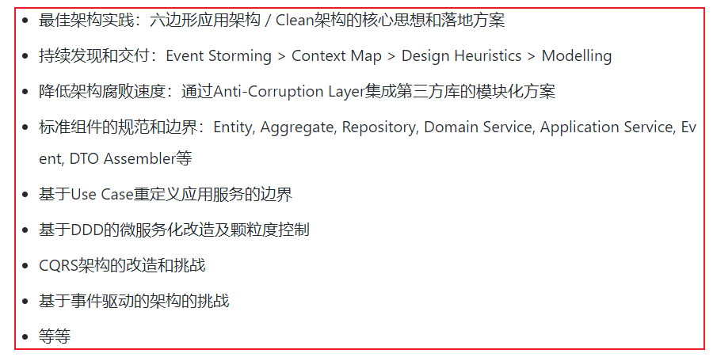

## **第一讲-Domain Primitive**

#### **DDD**

在软件开发中，如何降低系统复杂度是关键，设计模式或范式的理念是通过技术手段解决问题，而领域驱动设计(DDD)是从根本上，以业务角度出发，提供一整套的架构思路来解决问题

DDD是一种架构思想，因此应用到代码层面缺乏指导，作者希望通过代码的方式降低DDD的实践门槛，包括以下内容



#### **Domain Primitive**

* 定义

  DP是一个在特定领域里，拥有精准定义的、可自我验证的、拥有行为的Value Object

* 核心

  * 隐性概念的显性化，Make Implicit Concepts Expecit
  * 隐性上下文的显性化，Make Implicit Context Expecit
  * 多对象行为的封装，Encapsulate Multi-Object Behavior

* 应用场景

  * 收集所有DP行为

    将系统中散落在各个服务类或工具类的DP行为收集，成为DP自己的行为或属性

  * 替换数据校验和无状态逻辑

    将跟DP有关的数据校验逻辑，替换成DP自己的Validity行为

#### **隐性概念的显性化**

在一个用户注册的场景中，有一个业务逻辑是，根据用户手机号的区号查找对应的区域业务员，代码如下

```java
public class RegistrationServiceImpl implements RegistrationService {
	//用户注册方法
    public User register(String name, String phone, String address) throws Exception 
    {
            // 校验参数逻辑(忽略其他参数的校验)
            if (phone == null || !isValidPhoneNumber(phone)) {
                throw new ValidationException("phone");
            }

            // 取手机号里的区号
            String areaCode = null;
            String[] areas = new String[]{"0571", "021", "010"};
            for (int i = 0; i < phone.length(); i++) {
                String prefix = phone.substring(0, i);
                if (Arrays.asList(areas).contains(prefix)) {
                    areaCode = prefix;
                    break;
                }
            }

            //通过区号查找对应区域的业务员
            SalesRep rep = salesRepRepo.findRep(areaCode);

            //...后续注册逻辑
            ...
    }
    //正则校验手机号格式
    private boolean isValidPhoneNumber(String phone) {
        String pattern = "^0[1-9]{2,3}-?\\d{8}$";
        return phone.matches(pattern);
    }
}
```

分析如下

* 业务员、用户本身属于实体(Entity)，注册系统属于应用服务(Application Service)

* 校验手机号格式 、获取手机号的区号，这两个业务逻辑，既不属于现有的实体，也不应该属于应用服务
* 手机号是用户实体的一个参数，属于**隐性概念**，手机号格式和区号是手机号的业务逻辑，我们需要将手机号概念显性化，代码如下

```java
public class PhoneNumber {
  
    //Immutable Value Object 不可变对象
    private final String number;
    
    //构造函数 包含校验逻辑 保证PhoneNumber类实例化一定是校验通过的
    public PhoneNumber(String number) {
        if (number == null) {
            throw new ValidationException("number不能为空");
        } else if (isValid(number)) {
            throw new ValidationException("number格式错误");
        }
        this.number = number;
    }
    
    public String getNumber() {
        return number;
    }

   //AreaCode是PhoneNumber的计算属性
    public String getAreaCode() {
        for (int i = 0; i < number.length(); i++) {
            String prefix = number.substring(0, i);
            if (isAreaCode(prefix)) {
                return prefix;
            }
        }
        return null;
    }

    //内部校验逻辑
    private static boolean isAreaCode(String prefix) {
        String[] areas = new String[]{"0571", "021", "010"};
        return Arrays.asList(areas).contains(prefix);
    }

    //内部校验逻辑
    public static boolean isValid(String number) {
        String pattern = "^0?[1-9]{2,3}-?\\d{8}$";
        return number.matches(pattern);
    }

}
```

修订后的用户注册的场景代码，分析如下

* **接口清晰度**

  用对象参数代替先前的无意义字符串参数，接口清晰可读

* **数据校验**

  校验逻辑内聚(包含在构造函数中)，在接口边界外完成

* **业务代码清晰度**

  刨除了原先获取区号的胶水代码(不可复用的代码)，用可复用的PhoneNumber类的计算属性getAreaCode()替换，突出业务逻辑的核心

* **可测试性**

  边界测试和业务逻辑测试用例减少，测试成本降低

```java
public class RegistrationServiceImpl implements RegistrationService {
	//用户注册方法
    public User register(
      @NotNull Name name, 
      @NotNull PhoneNumber phone, 
      @NotNull Address address) 
    {
            //通过区号查找对应区域的业务员
            SalesRep rep = salesRepRepo.findRep(phone.getAreaCode());

            //...后续注册逻辑
            ...
    }
}
```

#### **隐性上下文的显性化**

在一个用户支付的场景中，有一个业务逻辑是，用户转账给另外一个用户

```java
public void pay(BigDecimal money, Long recipientId) {
    BankService.transfer(money, "CNY", recipientId);
}
```

分析这个用例，在货币概念里，除了数字，还有一个**隐性的上下文**，就是单位，这里默认货币单位是CNY，则这个方法在跨国转账中会存在问题，我们需要**将货币隐性的单位显性化组成完整的上下文**

```java
public class Money {
    private BigDecimal amount;
    private Currency currency;
    public Money(BigDecimal amount, Currency currency) {
        this.amount = amount;
        this.currency = currency;
    }
}
```

修订后的用户支付的场景代码，分析如下

* 将货币隐性的上下文单位显性化，与数字共同组成整体的上下文Money

```java
public void pay(Money money, Long recipientId) {
    BankService.transfer(money, recipientId);
}
```

#### **多对象行为的封装**

在一个支持汇率转换的支付场景中，有一个业务逻辑是，用户进行跨境转账且货币汇率是动态的

```java
public void pay(Money money, Currency targetCurrency, Long recipientId) {
    if (money.getCurrency().equals(targetCurrency)) {
        BankService.transfer(money, recipientId);
    } else {
        BigDecimal rate = ExchangeService.getRate(money.getCurrency(), targetCurrency);
        BigDecimal targetAmount = money.getAmount().multiply(new BigDecimal(rate));
        Money targetMoney = new Money(targetAmount, targetCurrency);
        BankService.transfer(targetMoney, recipientId);
    }
}
```

分析这个用例，业务逻辑有些繁琐，首先判断是否是跨境转账，若是则调用服务获取汇率计算新的货币数字进行转账

这里有个问题在于，货币汇率转换的逻辑被包含在了支付服务的逻辑中，设计到的对象也有5个(amount/currency/targetAmount/targetCurrency/rate)，这种情况可以**将多个对象的行为封装起来**

```java
public class ExchangeBehavior {
    private Money fromMoney

    public ExchangeBehavior( @NotNull Money fromMoney) {
        this.fromMoney = fromMoney;
    }

    public Money exchange( @NotNull Currency targetCurrency) {
        BigDecimal rate = ExchangeService.getRate(fromMoney.getCurrency(), to);
        BigDecimal targetAmount = fromMoney.getAmount().multiply(rate);
        return new Money(targetAmount, targetCurrency);
    }
}
```

修订后的用户跨境支付的场景代码，分析如下

* 多对象的交互行为和校验逻辑被封装到汇率华转换对象ExchangeBehavior中，核心业务逻辑清晰

```java
public void pay(Money money, Currency targetCurrency, Long recipientId) {
    Money targetMoney = new ExchangeBehavior(money).exchange(targetCurrency);
    BankService.transfer(targetMoney, recipientId);
}
```

