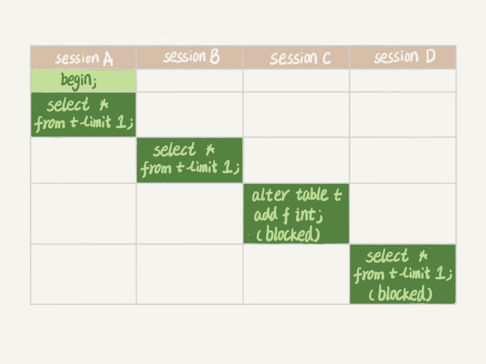

#### **01-基础架构(SQL查询语句执行流程)**

* Server层，涵盖MySQL的核心功能、内置函数和跨存储引擎功能，如存储过程、触发器、视图等

  * 连接器

    负责跟客户端建立连接、获取权限、维持和管理连接

  * 查询缓存(8.0+版本移除)

    查询的执行结果以KV形式存储在查询缓存中，新的查询命中则直接返回结果

  * 分析器

    * 词法分析，将SQL语句中的关键字、字符串识别
    * 语法分析，根据语法规则判断SQL语句是否满足MySQL语法

  * 优化器

    决定SQL语句的执行方案，如选择每个表的执行索引等

  * 执行器

    判断权限、调用表引擎接口获取数据、将满足条件的数据组成结果集返回给客户端

* 存储引擎层，负责数据的存储和提取，插件式架构，支持InnoDB、MyISAM、Memory等多个存储引擎


#### **02-日志系统(SQL更新语句执行流程)**

##### **日志模块**

* redo log(重做日志)

  InnoDB引擎特有，物理日志，固定空间循环写入

  将更新记录写到redo log并更新内存，在空闲的时候再更新磁盘记录，称为WAL(Write-Ahead Logging)

* bin log(归档日志)

  Server层日志，逻辑日志，可追加写入

##### **SQL更新语句在执行器和InnoDB引擎执行的具体流程**

1. 执行器调用引擎接口，获取更新语句对应的数据页
2. 执行器更新数据页，调用引擎接口提交新数据页
3. InnoDB引擎将新数据页更新到内存，记录更新操作到redo log(prepare)
4. 执行器生成更新操作的bin log，并将其写入磁盘保存
5. 执行器调用引擎接口提交事务
6. InnoDB引擎更新redo log(commit)状态


##### **数据库恢复**

* 数据库异常重启(crash-safe)

  可通过redo log找回提交记录，恢复数据库在崩溃前的状态

* 数据库数据恢复(回滚)

  可通过数据库整库备份+bin log，恢复数据库在历史时期的任意状态

##### **两阶段提交(跨系统维持数据逻辑一致性)**

MySQL更新语句中的3和6过程，对redo log进行了两阶段提交(写入)

目的是当写入日志间系统崩溃，可以保持重启的数据库状态(redo log)和回滚的数据库状态(bin log)保持一致，实现细节如下

1.redoLog(prepare) -> 2.binLog -> 3.redoLog(commit)

1->2崩溃，数据库异常重启后redoLog(prepare)回滚，数据库恢复无binLog，数据一致

2->3崩溃，数据库异常重启后redoLog(prepare)和binLog完整，redoLog自动提交(commit)，数据库恢复有binLog，数据一致


#### **03-事务隔离**

事务是保证一组数据库操作，要么全部成功，要么全部失败，由引擎层提供支持

##### **事务隔离性与隔离等级**

事务的特性有ACID(原子性、一致性、隔离性、持久性)

隔离性(Isolation)可以解决事务并行出现的问题，如下

* 脏读(DirtyRead)
* 不可重复读(Non-RepeatableRead)
* 幻读(PhantomRead)

隔离级别是解决问题的具体方案，SQL标准的事务隔离级别如下

* 读未提交(ReadUncommitted)，事务未提交的变更能被其他事务读取
* 读提交(ReadCommitted)，事务提交的变更才能被其他事务读取
* 可重复读(RepeatableRead)，事务未提交的变更其他事务不可见，事务执行过程数据不变
* 串行化(Serializable)，事务对于同一行数据读写加琐，冲突则后访问的事务必须等待前一个事务执行完成

##### **事务隔离的实现方式**

数据库的多版本并发控制(MVCC)，不同事务对于同一条记录在系统中可以存在多个版本，从而保证事务的隔离性

* 读提交，每一条SQL开始执行时，创建当前时刻的数据的快照读视图(ReadView)

* 可重复读，启动事务时，创建当前时刻的数据的快照读视图(ReadView)

##### **事务回滚**

事务中每条记录的更新都会同时记录一条回滚操作到回滚日志中

当不存在比这个回滚日志更早的快照读视图时，回滚日志会被删除


##### **事务启动方式**

* 显示启动

  begin/start transaction -> commit/rollback，单次事务

  begin/start transaction -> commit work and chain，提交并启动下次事务

* 自动启动

  set autocommit=0，执行语句自动启动事务且事务不会自动提交，事务持续到主动执行commit/rollback/断开连接

##### **如何避免长事务对业务的影响**

* 应用端

  * 取消自动启动事务

    通过MySQL的general_log日志确认是否使用了set autocommit = 0，若框架自动设置了可通过参数调节成1

  * 减少不必要的只读事务

    确认框架是否将没有事务需要的读语句放在事务中(begin/commit)

  * 控制连接数据库执行语句的最长时间

    通过设置SET MAX_EXECUTION_TIME命令控制每个语句的最长执行时间

* 数据库端

  * 开启general_log

  * 设置长事务阈值

    监控 information_schema.Innodb_trx 表，设置长事务阈值，超过就报警/kill

  * 运用外部工具

    如Percona的pt-kill


#### **04-索引**

索引类似于数据表的目录，用于提高数据查询效率

##### **索引模型**

* 哈希表

  键值(KV)存储数据的结构，哈希冲突可用链表解决

  * 优点，等值查询快，新增更新快

  * 缺点，范围查询慢

  适用于等值查询场景，如Memcached/Redis等NoSQL引擎

* 有序数组

  按照某个字段递增顺序存储数据的结构

  * 优点，等值查询快(二分查找)，范围查询快(二分查找+遍历)
  * 缺点，新增更新数据慢

  适用于静态存储引擎(数据变更少)

* 搜索树

  有序(左<中<右)存储数据的N叉树结构

  * 优点，查询快(O(log(N)))，更新快(O(log(N)))

##### **InnoDB的索引模型(B+树)**

* 中间节点，有K个子节点则包含K个元素，不存储数据只保存索引
* 叶子节点，存储所有索引和索引指向数据的指针，叶子节点之间顺序指针连接
* 中间节点的索引元素是子节点中的最大/最小索引元素


##### **InnoDB的索引类型**

* 聚簇索引(主键索引)，叶子节点存储的是整行数据
* 非聚簇索引(非主键索引)，叶子结点存储的是主键值，查询需要回表(扫描主键索引树)

##### **索引维护**

B+树为了维护索引有序性可能形成大的成本，如页分裂影响性能(数据迁移)和空间利用率

因此索引的合理性很重要，从两个方面分析

* 性能

  自增主键的插入数据模式(有序追加)不会形成数据迁移和叶子节点分裂

  业务逻辑字段主键的插入往往不容易保证有序插入(如UUID)

* 空间利用率

  主键长度越小，非主键索引的叶子节点存储的主键值越小，非主键索引占用空间越小

因此自增主键作为主键索引是合理的选择

但在KV场景中，由于没有非主键索引，因此不需要考虑其叶子节点大小问题，可选择业务字段直接做主键索引

##### **索引优化**

* 减少回表(联合索引+覆盖索引)

  * 覆盖索引，通过非主键索引即可查询所需数据，而不必通过回表查询
  * 联合索引，将多个字段组合形成索引

  将频繁查询的字段设为联合索引，查询时形成覆盖索引，减少回表提升性能

* 索引顺序(最左前缀原则)

  联合索引的索引顺序满足最左前缀匹配，如(a,b)索引可支持(a,b)和(a)字段索引查询，不支持(b)字段索引查询

  合理调整联合索引顺序可减少索引维护，提升空间效率

* 索引下推

  MySQL 5.6引入的优化，索引遍历过程中对索引包含的字段先做判断，直接过滤掉不满足条件的记录，减少回表次数

  如查询条件是a>c AND b>d，联合索引(a,b)的查询会遍历满足a>c和b>d的记录，再回表查询，而不是遍历a>c的记录回表查询再判断b>d条件

**重建索引**

索引可能因为删除、也分列原因导致数据有空洞，重建索引可以提高页面利用率

* 非主键索引

  ```mysql
  ALTER TABLE T DROP INDEX k;
  ALTER TABLE T ADD INDEX (k);
  ```

* 主键索引

  删除/创建主键会重建整表，因此重建主键索引无需删除再添加，直接重建整表

  ```mysql
  ALTER TABLE T engine = InnoDB;
  ```


#### **05-锁**

根据加锁范围，MySQL中的锁可分为全局锁、表级锁和行锁

##### **全局锁**

对数据库实例加锁，MySQL提供命令Flush tables with read lock(FTWRL)对数据库加全局读锁，加锁后数据库处于只读状态，DML(写)/DDL/事务(写)的提交都会被阻塞

适用场景为，不支持MVCC隔离级别的数据库引擎(如MyISAM)，做全库逻辑备份

InnoDB引擎可用官方逻辑备份工具(mysqldump -single-transaction)，确保备份业务开启事务拿到一致性视图(MVCC)

##### **表级锁**

* 表锁

  限制表的读写，语法lock tables T read/write，unlock tables

  在还未出现更细粒度的锁时可用于处理并发，但对于支持行锁的引擎一般不适用

* 元数据锁(metadata lock，MDL)

  限制表结构的读写，表的增删改查(DML)会加MDL读锁，表结构的变更(DDL)会加MDL写锁

  MDL读锁不互斥，MDL读/写锁和MDL写锁互斥

  * 热点数据的DDL

    MDL阻塞的写锁会阻塞后续的MDL写锁，造成数据库连接线程爆满从而挂库

    

    可通过减少长事务或设定DDL的等待时间(NOWAIT)避免

    ```mysql
    ALTER TABLE T NOWAIT ADD COLUMN ...
    ALTER TABLE T WAIT N ADD COLUMN ...
    ```

  * Online DDL

    DDL期间表可以正常进行读写数据，过程如下

    MDL写锁 -> 降级成MDL读锁 -> DDL -> 升级成MDL写锁 -> 释放MDL写锁

##### **行锁**

对数据表中的行记录进行加锁

由引擎层实现，如MyISAM不支持行锁，InnoDB支持行锁提升业务并发度

InnoDB行锁特点

* 两阶段锁协议

  在InnoDB事务中，行锁是在对行执行修改时加上，但在事务结束时统一释放

  因此若事务中需要锁多个行，最后再执行可能影响并发度的语句，减少事务行锁的持有时间

* 死锁和死锁检测

  并发的多事务线程出现资源循环依赖则会出现死锁，导致线程进入无限等待状态，一般有三种策略解决

  * 设置死锁超时时间

    innodb_lock_wait_timeout(默认50s)

    事务发生死锁会直接进入等待，直到超时

    一般业务线程难以等待，不推荐

  * 发起死锁检测

    innodb_deadlock_detect(on)

    当一个事务被锁时，会发起死锁检测查看依赖的资源是否被别的线程锁住，若有则主动回滚死锁链条中的某一个事务，解开死锁

    在多线程并发时，死锁检测复杂度为O(n)，会消耗大量CPU资源

  * 控制访问相同资源的并发事务量

    * 数据库层面，对于相同行的更新在进入数据库引擎前并发变串行
    * 中间件层面，如消息队列
    * 设计层面，如将一行改成逻辑上的多行减少冲突，如账户余额为10个记录值的总和

    

    

    

  