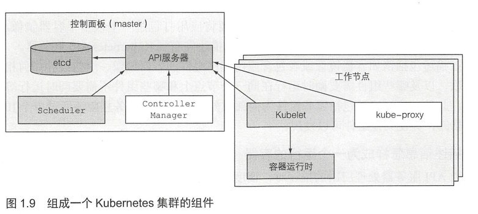
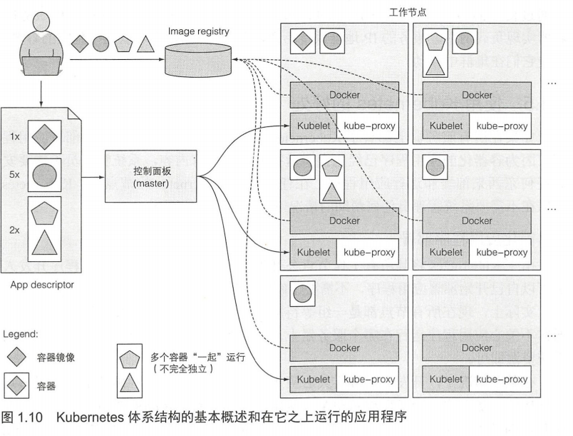
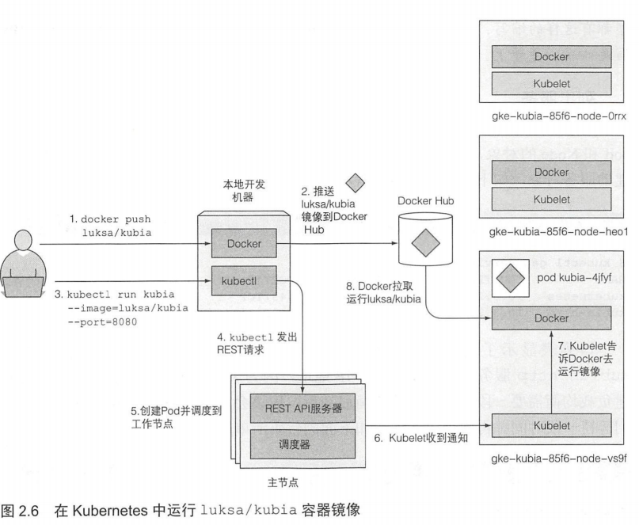
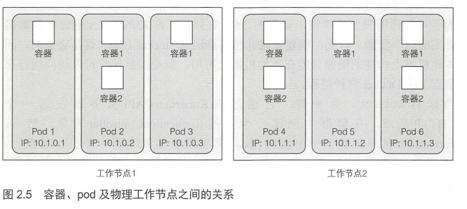
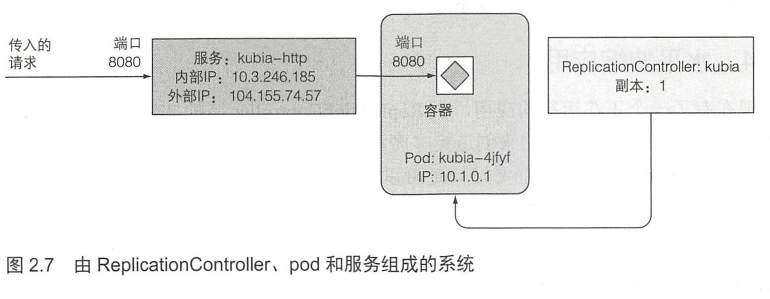
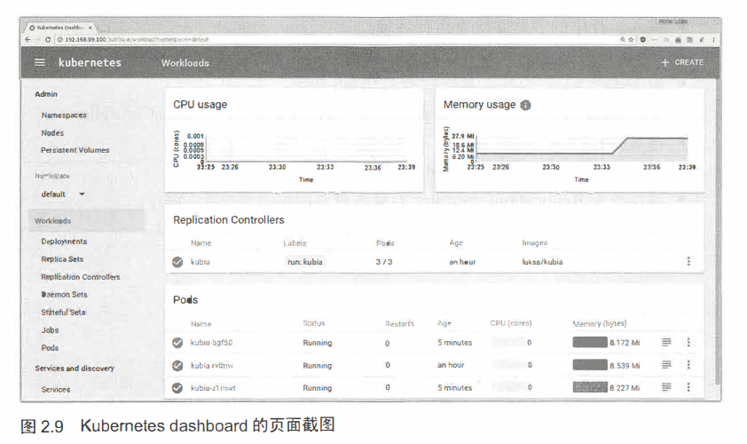

[TOC]


## **第一章-Kubernetes介绍**

如今单体应用被分解成独立的开发、部署、运行、升级的微服务，但难以管理

Kubernetes将数据中心的硬件基础设施抽象成资源池，帮助开发团队自动化部署和运行应用，帮助运维团队自动化调度、配置、监管应用和系统资源，降低系统管理难度

#### **Kubernates需求**

* 大型单体应用被拆解成小型微服务，系统复杂度提升
  * 微服务需要通过类似HTTP(同步协议)或AMQP(异步协议)的通信
  * 微服务需要独立水平扩展(代码)或垂直扩展(系统资源)
  * 微服务需要独立配置(环境/依赖)、独立部署
* 应用开发运维流程紧密，持续交付与DevOps
  * 开发者需要部署应用程序，而不关心系统基础设施
  * 运维者需要考虑系统资源，而不关心程序内部依赖

#### **容器技术**

Kubernetes运用Linux容器技术隔离微服务

* 容器提供每个微服务独立的环境
* 容器较虚拟机更加轻量，资源耗损小
* 容器隔离机制完备
  * Linux命名空间，隔离容器的系统资源(文件、进程、网络接口、主机名等)
  * Linux控制组(cgroups)，隔离容器的资源量(CPU、内存、网络带宽等)

Docker是一个构建、分发和运行应用程序的Linux容器引擎，有镜像、仓库、容器三大概念

rkt是另一个Linux容器引擎，强调安全性、可构建性并尊从开放标准

#### **Kubernetes概述**

Kubernetes是一个部署和管理容器化应用的软件系统

Kubernetes核心功能是，通过主节点，将容器化应用部署到集群的工作节点

Kubernetes为开发者提供服务发现、扩容、负载均衡、自恢复等功能

Kubernetes为运维者提供容器化应用的运行数据和自动调度资源功能

#### **Kubernetes架构**

Kubernetes集群由主节点和工作节点组成

* 主节点，即控制面板(master)
  * API服务器，通信功能
  * Scheduler，应用调度功能，如为应用分配工作节点
  * Controller Manager，集群级功能，如复制组件、持续跟踪工作节点、处理失败节点等
  * etcd，分布式数据存储功能，持久化存储集群配置
* 工作节点
  * Docker、rtk等容器
  * Kubelet，与主节点的API服务器通信，管理所在工作节点的容器
  * kube-proxy，负载均衡组件之间的网络流量



#### **Kubernetes运行流程**

1. 打包应用成容器镜像，推送至镜像仓库
2. 发布应用描述到Kubernetes API服务器
3. Scheduler调度指定组的容器到可用的工作节点
4. 工作节点的Kubelet拉取所分配的镜像并运行容器



#### **Kubernetes优势**

* 简化应用部署
* 优化硬件资源利用
* 应用运行监控和自动修复故障节点
* 集群规模易调整


## **第二章-Kubernetes运行**

#### **创建容器镜像**

1. 安装Docker引擎
2. 创建简单的Node.js应用，用于接受HTTP请求并返回应用运行的主机名
3. 运用Dockerfile将应用构建成容器镜像
4. 向Docker Hub推送镜像

#### **配置Kubernetes集群**

文档中配置集群方法很多，目前主流如下

* 本地机器运行单工作节点K8s集群
  * Minikube运行本地单节点K8s集群
* 访问运行在Google Kubernetes Engine(GKE)上的多工作节点集群
  * Google Cloud Platform控制台开启Kubernetes Engine API
* 运用kubeadm工具安装K8s集群，如在Amazon Web Service(AWS)上部署K8s集群

#### **在Kubernetes上运行应用**



1. kubectl向K8s API服务器请求部署应用

   ```bash
   # 指定 运行容器镜像(image) 应用监听端口(port) 标志(generator)
   $ kubectl run kubia --image=luksa/kubia --port=8080 --generator=run/v1
   replicationcontroller "kubia ” created
   ```

2. K8s API服务器创建Pod并调度到工作节点上

   Pod是K8s工作节点中一组密切相关的容器组，拥有独立的Linux命名空间(文件、进程、IP、主机名等)

   

3. 工作节点的Kubelet根据Pod内容拉取镜像运行容器

#### **访问Kubernetes**

K8s的每个Pod的IP地址是集群内部的，外部访问Pod则需要借助LoadBalancer类型的服务运用负载均衡的公共IP访问

```bash
# 创建LoadBalancer类型的服务对象
$ kubectl expose rc kubia --type=LoadBalancer --name kubia-http
# 查看服务外部IP
$ kubectl get svc
NAME        CLUSTER-IP     EXTERNAL-IP    PORT(S)          AGE
kubia-http  10.3.246.185   104.155.74.57  8080:31348/TCP   1m
# 通过外部IP访问服务
$ curl 104.155.74.57:8080
```

#### **Kubernetes的逻辑视图**

* Pod

  核心组件，包含运行容器，拥有独立私有的IP地址和主机名

* ReplicationController

  kubectl run命令实际创建的组件，用于创建、复制、恢复、监控pod实例，类似pod的镜像

* 服务

  RC替换的Pod的IP是动态的，服务可为客户端提供固定IP访问并转发请求到动态IP的pod



#### **Kubernetes水平伸缩应用**

运用ReplicationController简单扩容pod

```bash
# 查看rc
$ kubectl get rc
NAME 	DESIRED 	CURRENT 	AGE
kubia 	1 			1 			17m
# 增加期望pod的副本数
$ kubectl scale re kubia --replicas=3
replicationcontroller "kubia" scaled 
# 查看pod
$ kubectl get pods
NAME 			READY 	STATUS 		RESTARTS 	AGE
kubia-hczji 	1/1 	Running 	0 			7s
kubia-iq9y6 	0/1 	Pending 	0 			7s
kubia-4jfyf 	1/1 	Running 	0 			18m
# 请求不同实例的pod
$ curl 104.155.74.57:8080
You've hit kubia-hczji
$ curl 104.155.74.57:8080
You've hit kubia-iq9y6
$ curl 104.155.74.57:8080
You've hit kubia-4jfyf 
```

#### **Kubernetes查看Pod**

```bash
# 查看Pod列表
$ kubectl get pods -o wide
NAME 			READY 	STATUS 		RESTARTS 	AGE 	IP 			NODE
kubia-hczji 	1/1 	Running 	O 			7s 		10.1.0.2 	gke-kubia-85 ...
# 查看Pod细节
$ kubectl describe pod kubia-hczji
Name: kubia-hczJi
Namespace: default
Node: gke-kubia-85f6-node-vs9f/10.132.0.3
Start Time: Fri, 29 Apr 2016 14:12:33 +0200 
Labels: run=kubia
Status: Running
IP: 10.1.0.2
Controllers: Replicationcontroller/kubia
Containers: ...
Conditions:
	Type Status
	Ready True
Volumes: ...
Events: ...
```

#### **Kubernetes可视化**

Kubernetes提供可视化用户界面dashboard，可以查看、创建、修改和删除，部署在集群中的pod、rc、服务和其他对象




## **第三章-Kubernetes Pod**

Pod是工作节点上一组并置的容器，是K8s的核心组件

#### **Pod需求**

* 容器单进程

  容器运行多个进程系统，则保持所有进程运行、管理日志、处理故障等难度较大

* 多进程关联

  K8s期望单容器仅运行一个进程，但又期望关联的进程可以运行在同一个环境下

* Pod两全其美

  将多个单进程容器绑定为一个单元管理，既保证了容器单进程的隔离，又为关联进程提供几乎相同的环境
  * K8s通过配置Dokcer让一个Pod内的所有容器共享相同的Linux命名空间
  * 同一个Pod的容器拥有独立的文件系统，但可以通过Volume的K8s资源来共享文件目录
  * 同一个Pod的容器拥有相同的IP，因此会发生端口冲突
  * Pod间没有NAT(网络地址转换)网关，易通信

#### **Pod管理**

* 多层应用分散到多个Pod

  * 提高多节点资源的利用率

    如前端、后端、数据库，分散在多个Pod中放置在多个K8s集群的节点中

  * 动态扩容

    Pod是K8s扩容的基本单位，可以基于不同的扩容需求单独扩容容器

* Pod包含紧密耦合的容器组

  如爬虫服务容器和存储爬虫信息的文件服务容器

#### **创建与查看Pod**

通过向K8s REST API提供JSON或YAML描述文件创建

* 查看运行Pod的描述文件

  ```yaml
  $ kubectl get po kubia-zxzij -o yaml
  
  apiVersion: v1		# Kubernetes API版本
  kind: Pod 			# 资源类型
  # Pod元数据(名称/标签/注解等)
  metadata: 						
    annotations:
      kubernetes.io/created-by: ...
    ereatonTmestamp: 2016-03-l8Tl2:3750Z
    generateName: kubia-
    labels:
      run: kub
    name: kubia-zxzij
    namespace: default
    resourceVersion: "294"
    selfLink: /api/v1/anamespaces/default/pods/kubia-zxzij
    uid: 3a564dc0-ed06-ll5-ba3b-42010af00004
  # Pod内容(容器列表/volume等)
  spec: 							
    cotaiers:
      - image: luksa/kub
        imagePullPolicy: IfNotPresent
        name: kubia
        ports:
        - containerPort: 8080
          protocol: TCP
        resources:
          requests:
            cpu: 100m
            terminationMessagePath: /dev/termination-log
            volumeMounts:
            - mountPath: /var/run/secrets/k8s.io/service
              name: default-token-kvcqa
              readOnly: true
        dnsPolicy: ClusterFirst
        nodeName: gke-kubia-e8fe08b9-node-txje
        restartPolicy: Always
        serviceAccount: default
        terminationGracePeriodSeconds: 30
        volumes:
        - name: default-token-kvcqa
          secret:
            secretName: default-token-kvcqa
  # Pod运行状态
  status: 						
    conditions:
      - lastProbeTime: null
        lastTransitionTime: null
        status: "True"
        type: Ready
    containerStatuses:
     - containerID: docker://f0232
      image: luksa/kubia
      imageID: docker://4cafdaf
      lastState: {}
      name: kubia
      ready: true
      restartCount: 0
      state:
        running:
          starteAt: 2016-03-18T12:46:05Z
    hostIP: 10.132.0.4
    phase: Running
    podIP: 10.0.2.3
    startTime: 2016-03-18T12:44:05Z
  ```

* 创建Pod的简单描述文件

  ```yaml
  apiVersion: v1
  kind: Pod
  metadata:
  	name: kubia-manual  # Pod名称
  spec:
  	containers:
  	- image: luksa/kubia  # 镜像名称
  	  name: kubia  # 容器名称
  	  ports:
  	  - containerPort: 8080  # 应用监听端口
  	  protocol: TCP
  ```

* 创建Pod并查看

  ```bash
  # 创建Pod
  $ kubectl create -f kubia-manual.yaml
  
  # YAML格式查看Pod的描述文件
  $ kubectl get po kubia-manual -o yaml
  # JSON格式查看Pod的描述文件
  $ kubectl get po kubia-manual -o json
  
  # 查看Pod列表
  $ kubectl get pods
  ```

#### **查看与配置Pod**

* 查看日志

  ```bash
  # 查看Pod中的容器日志 [podName] -c [containerName]
  $ kubectl logs kubia-manual -c kubia
  ```

* 配置端口转发

  ```bash
  # 本地端口转发到Pod端口
  $ kubectl port-forward kubia-manual 8888:8080
  ```

#### **标签组织Pod**

标签可以定义在K8s任何资源上，用于管理和组织资源

* 创建Pod指定标签

  ```yaml
  metadata: 
  	labels: 
  		creation_method: manual
  		env: prod
  ```

* 查看和筛选Pod标签

  ```bash
  # 查看标签
  $ kubectl get po --show-labels
  $ kubectl get po -L creation_method,env
  # 筛选标签
  $ kubectl get po -l env
  $ kubectl get po -l creation_method=manual
  $ kubectl get po -l '!env'
  $ kubectl get po -l env in (prod,devel)
  $ kubectl get po -l env notin (prod,devel)
  ```

* 新增和修改Pod标签

  ```bash
  # 添加标签
  $ kubectl label po kubia-manual creation_method=manual
  # 修改标签
  $ kubectl label po kubia-manual-v2 env=debug --overwrite
  ```

* 标签调度Pod和节点

  ```bash
  # 新增标签到节点
  $ kubectl label node gke-kubia-85f6-node-Orrx gpu=true
  
  # 创建Pod的描述文件指定节点的标签
  spec:
  	nodeSelector:
  		gpu: 'true'
  ```

#### **注解标识Pod**

可以通过在Pod的描述文件中或者Bash命令为Pod添加注解，注解以JSON形式存储Pod的一些信息

```bash
# 描述文件中的注解
metadata:
	annotations:
		kubernetes.io/created-by:
			{"kind":"...","apiVersion":"v1"...}
# 添加和修改注解
$ kubectl annotate pod kubia-manual mycompany.com/someannotation="foo bar"
```

#### **命名空间管理Pod**

K8s提供命名空间将对象分割成完全独立而不重叠的组

* 资源隔离，命名空间可以将资源分配到不重叠的组中，组内管理独特的资源集合
* 资源权限，命名空间可以仅允许用户访问特定资源，甚至限定用户的资源数量

```bash
# 查看集群中命名空间列表
$ kubectl get ns
# 查看命名空间下的Pod
$ kubectl get po --namespace kube-system

# 描述文件
kind: Namespace
metadata: 
	name: custom-namespace
# 根据描述文件创建命名空间
$ kubectl create -f custom-namespace.yaml

# Bash命令创建命名空间
$ kubectl create namespace custom-namespace

# 创建资源指定命名空间
$ kubectl create -f kubia-manual.yaml -n custom-namespace
```

#### **停止和移除Pod**

```bash
# 按名称删除Pod
$ kubectl delete po kubia-gpu
# 按标签删除Pod
$ kubectl delete po -l creation_method=manual
# 删除命名空间的所有资源
$ kubectl delete all -all
# 删除命名空间
$ kubectl delete ns custom-namespace
```


## **第四章-部署托管的Pod**

创建未托管的Pod则节点失败Pod会丢失

创建ReplicationController或Deployment这样的资源，通过资源创建并管理Pod，则K8s会监控并保持Pod健康

#### **Pod健康**

容器进程崩溃K8s会重启容器，但对于异常容器，如内存泄漏、无限循环、死锁等，这种情况下K8s也需要重启容器，这依赖于K8s对于应用程序的外部监控

#### **存活指针(Liveness Probe)**

K8s通过存活指针监控Pod中每个容器的健康，有三种类型

* HTTP GET 探针监控容器的IP地址(端口+路径)，若响应状态码正常，则探测成功
* TCP套接字 探针监控容器指定端口，若建立TCP连接成功，则探测成功
* Exec 探针监控容器内执行命令，若命令的退出状态码是0，则探测成功

HTTP GET探针

```bash
# 描述文件创建包含HTTP GET探针的Pod
spec:
	containers:
		livenessProbe:
			httpGet:
				path: /
				port: 8080
				initialDelaySeconds: 15

# 查看重启容器的日志
$ kubectl logs mypod --previous
# 查看重启容器的描述(奔溃原因)
$ kubectl describe po kubia-liveness
```

有效的存储探针

* 探测的内容
  * 全面，对系统重要组织执行状态检查，确保健康
  * 独立，对系统内部检查，如服务器无法连接后端数据库则服务器探针不该失败
* 探针轻量，减少探针占用应用的CPU时间

#### **ReplicationController**

K8s持续监控和恢复Pod的资源，由三部分组成

* Label Selector，标签选择器，确定该RC所管控的Pod范围
* Replica Count，副本个数，指定期望运行的Pod数量
* Pod Template，Pod模板，用于创建新的Pod副本

RC的创建、查看和编辑

```bash
# RC描述文件 Pod模板标签和Pod选择器的标签需相同
apiVersion: v1
kind: ReplicationController    # RC类型
metadata:	
	name: kubia    # RC名称
spec: 
	replicas: 3    # pod实例的目标数目
	selector:
		app: kubia    # Pod选择器
	template:    # 创建Pod的模板
		metadata:
			labels:
				app: kubia
        spec: 
        	containers: 
        	- name: kubia
        	  image: luksa/kubia
        	  ports: 
        	  - containerPort: 8080
# 创建RC
$ kubectl create -f kubia-rc.yaml

# 查看RC列表
$ kubectl get rc
# 查看RC详情
$ kubectl describe rc kubia

# 编辑RC
$ kubectl edit rc kubia

# RC扩容/缩容Pod副本
$ kubectl scale rc kubia --replicas=10

# 删除RC和其管理的Pod
$ kubectl delete rc kubia
# 删除RC 不删除其管理的Pod
$ kubectl delete rc kubia --cascade=false
```

#### **ReplicaSet**

ReplicaSet是新一代的RC并替代RC，在创建更高层的Deployment资源时会自动创建

RS的Pod选择器表达能力强于RC

RS的创建

```bash
# RS描述文件 Pod模板标签和RC Pod选择器的标签需相同
apiVersion: apps/v1beta2    # RS属于apps API组的v1beta2版本
kind: ReplicaSet    # RS类型
metadata:	
	name: kubia    # RS名称
spec: 
	replicas: 3    # pod实例的目标数目
	selector:
		matchLabels:
			app: kubia    # matchLabels选择器-Pod选择器
	template:    # 创建Pod的模板
		metadata:
			labels:
				app: kubia
        spec: 
        	containers: 
        	- name: kubia
        	  image: luksa/kubia
        	  ports: 
        	  - containerPort: 8080
# 创建RC
$ kubectl create -f kubia-rs.yaml

# 查看RS列表
$ kubectl get rs
# 查看RS详情
$ kubectl describe rs kubia

# 删除RS和其管理的Pod
$ kubectl delete rs kubia
```

RS的增强Pod选择器

```bash
# 增强Pod选择器的描述文件
selector:
	matchExpressions:
		- key: app    # Pod名称包含字符
		operator: IN    # 标签运算符 In/NotIn/Exists/DoesNotExist
		values:    # 指定标签值
			-kubia
```

#### **DaemonSet**

RC和RS仅关心K8s集群上部署特定数量的Pod，部署的Pod是随机分布在集群的节点上的

DS则可以配置K8s集群上每个工作节点都部署一个Pod，用于管理系统服务进程Pod，如日志、监控服务

DS的创建和查看

```bash
# DS描述文件
apiVersion: apps/v1beta2    # RS属于apps API组的v1beta2版本
kind: DaemonSet    # DS类型
metadata:	
	name: monitor    # DS名称
spec: 
	selector:
		matchLabels:
			app: monitor    # Pod选择器
	template:    # 创建Pod的模板
		metadata:
			labels:
				app: monitor
        spec: 
        	nodeSelector:    # 节点选择器 仅部署带有disk=ssd标签的节点
        		disk: ssd
        	containers: 
        		- name: main
        	  	image: luksa/ssd-monitor
# 创建DS
$ kubectl create -f monitor.yaml

# 查看DS列表
$ kubectl get ds

# 查看Node列表
$ kubectl get node
# Node添加标签
$ kubectl label node minikube disk=ssd
# Node修改标签 会终止DS在此节点上的Pod
$ kubectl label node  minikube disk=hdd --overwrite
```

#### **Job**

RC/RS/DS会保持Pod持续运行，K8s提供Job资源调度Pod到节点，执行完毕后退出完成，适用于临时任务和数据转换导出任务

Job的创建

```bash
# Job描述文件
apiVersion: batch/v1    # Job属于batch API组的v1版本
kind: Job    # Job类型
metadata:	
	name: batch-job    # Job名称
spec:   # 没有指定Pod选择器则会根据Pod模板的标签创建
	completions: 1    # 运行Pod次数
	parallelism: 2    # 可并行运行的Pod个数
	activeDeadlineSeconds: 600   # 限制Job Pod完成任务的时间
	backoffLimit: 6    # Job被标记失败前重试次数
	template:    # 创建Pod的模板 
		metadata:
			labels:
				app: batch-job 
        spec: 
        	restartPolicy: OnFailure  # 重启策略不能用默认的Always 防止容器重新启动
        	containers: 
        		- name: main
        	  	image: luksa/batch-job

# 创建Job
$ kubectl create -f batch-job.yaml

# 查看已完成的Pod
$ kubectl get po -a
# 查看已完成Pod的日志
$ kubetcl logs batch-job-28qf4
```

#### **CronJob**

Job资源在创建时会立即调度Pod运行

CornJob资源可以定期执行或指定时间间隔重复执行的Job

CornJob的创建

```bash
# CornJob描述文件
apiVersion: batch/v1beta1    # CornJob属于batch API组的v1版本
kind: CornJob    # CornJob类型
metadata:	
	name: batch-job-every-fifteen-minutes    # CornJob名称
spec:  
	schedule: "0,15,30,45 * * * *"    # Corn表达式 每天每小时0/15/30/45分钟执行
	startingDeadlineSeconds: 15    # Job最晚推迟执行时间
	jobTemplate:    # 创建Job资源的模板 
		spec:
			template:
				metadata:
					labels:
						app: periodic-batch-job 
                spec: 
                    restartPolicy: OnFailure 
                    containers: 
                        - name: main
                        image: luksa/batch-job
```


## **第五章-Kubernetes 服务**

Pod具动态IP的特点，需要服务向外暴露

#### **服务概述**

K8s服务是为一组功能相同的Pod提供单一不变的接入点的资源，其IP地址和端口固定，可提供两种通信

* 外部通信，外部客户端与Pod之间的通信，如客户端与前端
* 内部通信，K8s集群中的Pod之间的通信，如前端与后端

服务的创建

```bash
# 创建服务的描述文件
apiVersion: v1
kind: Service
metadata:
	name: kubia
spec:
	ports:
		- name: http
		  port: 80    # 服务的可用端口
		  targetPort: 8080    # 服务将连接转发的容器端口
		- name: https
		  port: 443
		  targetPort: 8443
	selector:
		app: kubia    # Pod标签选择器
    sessionAffinity： ClientIp    # 会话亲和性 特定客户端IP的请求转发至同一个Pod
# 创建服务
$ kubectl create -f kubia.yaml

# 查看服务列表
$ kubectl get svc

# 在运行的Pod中执行curl命令测试服务连接与转发
$ kubectl exec kubia-7nog1 -- curl -s http://10.111.249.153
```

Pod配置服务

```bash
# Pod通过环境变量发现服务
# 查看Pod环境变量
$ kubectl exec kubia-3inly env
....
KUBERNETES_SERVICE_HOST= 10.111.240.1  # 服务的集群IP
KUBERNETES_SERVICE_PORT=443  # 服务的端口号
KUBIA_SERVICE_HOST=10.111.249.153
KUBIA_SERVICE_PORT=80

# Pod通过DNS发现服务 运用FQDN代替IP访问服务 服务名称.[命名空间].[集群域后缀]
# 在Pod容器运行shell 
$ kubectl exec -it kubia-3inly bash
root@kubia-3inly:/# curl http://kubia.default.svc.cluster.local
root@kubia-3inly:/# curl http://kubia.default
root@kubia-3inly:/# curl http://kubia
```

#### **Endpoint**

服务和Pod之间实质是通过Endpoint资源连接，Endpoin资源用于帮助服务重定向至内部资源(Pod)或外部资源(外部端口)

为没有Pod选择器的服务手动配置Endpoint访问外部资源

```bash
# 创建服务的描述文件
apiVersion: v1
kind: Endpoints
metadata:
	name: external-service  # Endpoint名称必须和服务名称匹配
subsets:
	- addresses:
	  - ip: 11.11.11.11  # 服务重定向的目标IP地址
	  - ip: 22.22.22.22  # 服务重定向的目标IP地址
	  ports:
	  - port: 80  # 服务重定向的目标端口
```

#### **ExternalName Service**

创建具备别名的外部服务，用于访问外部公共API

```bash
# ExternalName Service描述文件
apiVersion: v1
kind: Service
metadata:
	name: external-service
spec:
	type: ExternalName    # ExternalName服务
	externalName: someapi.somecompany.com  # 服务重定向的外部API
	ports:
	- port: 80
```

#### **NodePort Service**

K8s在每个集群节点保留一个端口，外部客户端可通过端口访问服务将请求重定向到对应Pod的目标端口

```bash
# NodePort Service描述文件
apiVersion: v1
kind: Service
metadata: 
	name: kubia-nodeport
spec:
	type: NodePort  # NodePort服务
	ports:
		- port: 80        # 集群IP的端口号
		targetPort: 8080  # 转发到Pod的目标端口号
		nodePort: 30123   # 集群节点的端口号
	selector:
		app: kubia
	
# 创建服务
$ kubectl create -f kubia-nodeport.yaml
# 查看服务
$ kubectl get svc kubia-nodeport
NAME 			CLUSTER-IP 		EXTERNAL-IP 	PORT(S) 		AGE
kubia-nodeport 10.111.254.223 	<nodes>			80:30123/TCP 	2m

# 通过JSONPath获取所有节点IP
# 访问服务 集群IP:内部端口/集群节点:固定端口号
$ curl http://10.111.254.223:80
$ curl http://130.211.97.55:30123
$ curl http://130.211.99.206:30123
```

#### **LoadBalancer Service**

外部客户端通过专用的负载均衡器访问所有节点端口的Pod的目标端口

```bash
# LoadBalancer Service描述文件
apiVersion: v1
kind: Service
metadata: 
	name: kubia-loadBalancer
spec:
	type: LoadBalancer  # LoadBalancer服务
	ports:
		- port: 80        # 集群IP的端口号
		targetPort: 8080  # 转发到Pod的目标端口号
	selector:
		app: kubia
	
# 创建服务
$ kubectl create -f kubia-loadBalancer.yaml
# 查看服务
$ kubectl get svc kubia-loadBalancer
NAME 				CLUSTER-IP 		EXTERNAL-IP 	PORT(S) 		AGE
kubia-loadBalancer 10.111.241.153 	130.211.53.173	80:30143/TCP 	2m

# 访问服务
$ curl http://130.211.53.173:80
```

#### **Ingress**

Ingress可以根据请求的主机名和路径重定向请求到对应的服务，并提供基于cookie的会话亲和性等增强服务型功能

开启Ingress控制器是创建Ingress资源的基础，Minikube和GKE可通过不同方式开启

```bash
# 创建Ingress资源 描述文件
apiVersion: extensions/v1beta1
kind: Ingress
metadata:
  name: kubia
spec:
  rules:
    - host: kubia.example.com    # 请求的主机域名
    http:
      paths:
        - path: /kubia    # kubia.example.com/kubia的请求
        backend:
          serviceName: kubia  # 转发到kubia服务的80端口
          servicePort: 80
        - path: /foo    # kubia.example.com/foo的请求
        backend:
          serviceName: bar  # 转发到bar服务的80端口
          servicePort: 80
    - host: foo.example.com    # 请求的主机域名
    http:
      paths:
        - path: /bar    # foo.example.com/bar的请求
        backend:
          serviceName: bar  # 转发到bar服务的80端口
          servicePort: 80
          
          
# 获取Ingress的IP地址
$ kubectl get ingresses
NAME 	HOSTS 				ADDRESS 		PORTS 	AGE
kubia 	kubia.example.com 	192.168.99.100 	80 		29m
# 修改/etc/hosts文件或配置DNS服务器 将Ingress的Host解析成IngressIP 
192.168.99.100 kubia.example.com

# 客户端通过域名访问Pod
$ curl http://kubia.example.com

```

可通过配置Secret资源为Ingress创建TLS认证，从而Ingress可以将HTTPS请求解密后以HTTP请求形式转发至Pod

#### **就绪探针**

K8s通过就绪探针确保Pod容器可以正确快速处理请求，有三种类型

* Exec探针，执行进程，由进程的退出状态代码确定容器状态
* HTTP GET探针，向容器发送HTTP GET请求，由请求响应状态码确定容器状态
* TCP socket探针，TCP连接到容器的端口，由连接是否建立确定容器状态

对于探测失败，存活探针会杀死异常容器，就绪探针则只是将Pod从服务的Endpoint中移除，该Pod则无法处理服务转发的请求

就绪探针的添加

```bash
# 向RC中Pod模板添加就绪探针
$ kubectl edit rc kubia
...
spec:
	template:	
		spec:
			containers:
				-name: kubia
				image: luksa/kubia
				readinessProbe:  # 就绪指针执行ls/var/ready命令 文件存在则就绪
					exec:
						command:
							- ls
							- /var/ready
							
# 创建文件模拟Pod准备就绪
$ kubectl exec kubia-2rlqb -- touch /var/ready
```

#### **Headless Service**

K8s允许DNS查找发现服务所有Pod的IP列表，这可以让客户端或Pod的请求链接到服务的所有Pod上，而不是服务随机的一个Pod上

Headeless服务不会被K8s分配集群IP，请求可直接链接到Headless服务对应的Pod上

```bash
# 创建Headless服务 描述文件
apiVersion: v1
kind: Service
metadata:
	name: kubia-headless
spec:
	clusterIP: None  # Headless服务标识
	ports:
		- port: 80   
		  targetPort: 8080   
	selector:
		app: kubia 
		
# DNS查找Headless服务 返回的是服务对应的Pod的地址
$ kubectl exec dnsutils nslookup kubia-headless
...
Name: kubia-headless.default.svc.cluster.local
Address: 10.108.1.4
Name: kubia-headless.default.svc.cluster.local
Address: 10.108.2.5
```

#### **服务连接Pod失败**

无法通过服务访问Pod可能有以下原因

* 确保从集群内部连接到服务的集群IP，而不是外部
* 就绪探针返回成功，否则Pod不会成为服务的一部分
* 检查服务的Endpoint是否连接到Pod
* FQDN访问服务失败，可以使用集群IP替代
* 尝试连接Pod的IP确保Pod端口连接正常


## **第六章-容器磁盘(卷)**

Pod中每个容器有独立的文件系统，但重启的新容器可能需要旧容器部分持久化的数据

K8s通过定义存储卷存储Pod数据，Pod中重启容器可以通过卷识别旧容器写入卷的内容，Pod中所有容器可以共享Pod的存储卷内容

#### **卷**

卷与容器一样，是依附于Pod的，Pod中容器需挂载卷才能使用卷，有以下类型的卷

* emptyDir

  存储临时文件的空目录

* hostPath

  将目录从工作节点的文件系统挂载到Pod中

* gitRepo

  检出Git仓库内容来初始化的卷

* nfs

  挂载到Pod中的NFS共享卷

* configMap/secret/downwardAPI

  将K8s部分资源和信息公开给Pod

* persistentVolumeClaim

  预置或动态配置的持久存储

#### **EmptyDir**

EmptyDir卷可用于Pod的容器共享文件或容器写入临时数据

```bash
# 创建Pod 包含容器和空目录卷
apiVersion: v1
kind: Pod
metadata:
  name: fortune
spec:
  containers:
    - image: luksa/fortune  # 第一个容器 用于生成html
      name: html-generator
      volumeMounts:         # html的卷挂载在容器的/var/htdocs中
        - name: html
        mountPath: /var/htdocs
    - image: nginx:alpine    # 第二个容器 web服务器
      name: web-server
      volumeMounts:         # html的卷挂载在/usr/share/nginx/html且只读
        - name: html
        mountPath: /usr/share/nginx/html
        readOnly: true
      ports:
        - containerPort: 80
        protocol: TCP
    volumes:              # html的卷 emptyDir类型
      - name: html
      emptyDir:
        medium: Memory  # 存储在内存中
      

# Pod端口转发
$ kubectl port-forward fortune 8080:80
# 访问Pod
$ curl http://localhost:8080
```

#### **GitRepo**

GitRepo卷会克隆Git仓库数据，可用于在Git仓库存放网站的静态HTML文件，但GitRepo与Git仓库不会保持同步

git sync sidecar容器可以保持本地目录与Git仓库同步，可通过将GitRepo挂载到同步容器的本地目录实现GitRepo与Git仓库同步

```bash
# 创建Pod 包含容器和Git仓库卷
apiVersion: v1
kind: Pod
metadata:
  name: gitrepo-volume-pod
spec:
  containers:
    - image: nginx:alpine    # web服务器
      name: web-server
      volumeMounts:         # html的卷挂载在/usr/share/nginx/html且只读
        - name: html
        mountPath: /usr/share/nginx/html
        readOnly: true
      ports:
        - containerPort: 80
        protocol: TCP
    volumes:              # html的卷 gitRepo类型
      - name: html
      gitRepo:    # 仓库地址 分支
        repository: https://github.com/luksa/kubia-website-example.git
        revision: master
        directory: .  # 将repo克隆到卷的根目录
      

```

#### **HostPath**

HostPath卷指向节点的文件系统上的文件或目录，Pod的容器可通过挂载HostPath访问节点上的数据

HostPath卷是持久化存储的，不会随着Pod删除而删除

