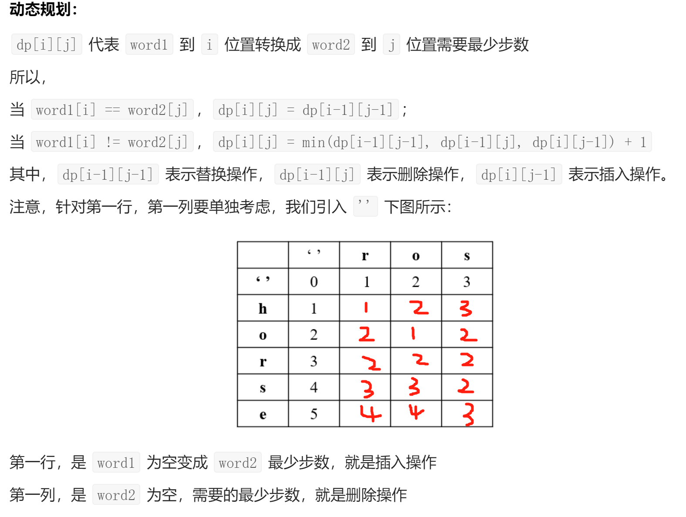

[TOC]


#### **LC-206 反转链表**

```java
public ListNode reverseList(ListNode head) {
    ListNode pre = null;
    ListNode cur = head;
    while(cur != null){
        ListNode temp = cur.next;
        cur.next = pre;
        pre = cur;
        cur = temp;
    }
    return pre;
}
```

#### **LC-146 LRU**

相关分析

* O(1)的插入与获取

  链表(插入)+哈希(获取)

* 最近最少使用

  双向链表，头部为最近使用，尾部为最近最少使用

* 虚拟头尾指针

  添加/删除节点不需考虑相邻节点

相关流程

* get()

  从哈希获取key对应的node

  * node不存在，返回-1
  * node存在，将node移到头部，返回value

* put()

  从哈希获取key对应的node

  * node不存在，新建节点，插入头部，添加哈希
    * 节点过多，删除尾节点，删除哈希
  * node存在，将node移到头部，更新value

```JAVA
class LRUCache {

    class Node {  // 双向链表节点
        int key;
        int value;
        Node pre;
        Node next;
        public Node() {}
        public Node(int key, int value) {this.key = key; this.value = value;}
    }

    private Map<Integer, Node> cache = new HashMap<Integer, Node>();
    private int size;
    private int capacity;
    private Node head, tail;  // 虚拟头尾指针

    public LRUCache(int capacity) {
        this.size = 0;
        this.capacity = capacity;
        head = new Node();
        tail = new Node();
        head.next = tail;
        tail.pre = head;
    }
    
    public int get(int key) {
        // 判断key
        Node node = cache.get(key);

        if (node == null) return -1;  // key不存在 返回-1
        else{
            // key存在 将对应节点移到头部 返回value
            node.pre.next = node.next;  
            node.next.pre = node.pre;

            node.pre = head;
            node.next = head.next;
            head.next.pre = node;
            head.next = node;
            
            return node.value;
        }
    }
    
    public void put(int key, int value) {
        // 判断key
        Node node = cache.get(key);

        if(node == null){
            // key不存在 
            // 创建新节点 在头部添加节点 在哈希表添加节点
            // 判断节点数是否超出容量 超出则删除尾部节点和哈希表对应项

            Node newNode = new Node(key, value);

            newNode.pre = head;
            newNode.next = head.next;
            head.next.pre = newNode;
            head.next = newNode;
            
            cache.put(key, newNode);

            size++;
            if(size > capacity){
                Node deleteNode = tail.pre;

                deleteNode.pre.next = deleteNode.next;
                deleteNode.next.pre = deleteNode.pre;

                cache.remove(deleteNode.key);

                size--;
            }
        }else{
            // key存在 将对应节点移到头部 更新value值
            node.pre.next = node.next;  
            node.next.pre = node.pre;

            node.pre = head;
            node.next = head.next;
            head.next.pre = node;
            head.next = node;
            
            node.value = value;
        }
    }
}
```

#### **LC-215 数组中第K个最大元素**

基于快速排序分区思想的快速搜索

```java
public int findKthLargest(int[] nums, int k) {
    int index = nums.length - k;  // 第K个最大元素在数组的索引值
    return quickSearch(nums,0,nums.length-1,index);
}

private int quickSearch(int[] nums, int left, int right, int k){
    int partition = partition(nums,left,right);
    
    if(partition == k) return nums[partition];
    if(partition < k) return quickSearch(nums,partition+1,right,k);
    return quickSearch(nums,left,partition-1,k);
}

private int partition(int[] nums, int left, int right){
    int base = nums[left];
    int i = left;
    int j = right;

    while(true){
        while(nums[i] <= base && i < right) i++;
        while(nums[j] >= base && j > left) j--;
        if(i >= j) break;
        int temp = nums[i];
        nums[i] = nums[j];
        nums[j] = temp;
    }

    nums[left] = nums[j];
    nums[j] = base;

    return j;
}
```

#### **LC-25 K个一组的反转链表**

增加虚拟头节点，记录翻转后的头节点和化归第一个翻转链表

```java
public ListNode reverseKGroup(ListNode head, int k) {
    ListNode vhead = new ListNode();  // 虚拟头节点
    vhead.next = head;

    ListNode left = vhead;
    ListNode right = vhead;

    // left -> (i)(j)ListNode(i) -> (j)right
    while(true){
		// move right
        for(int i = 0; i < k; i++){
            right = right.next;
            if(right == null) return vhead.next;
        }
        right = right.next;

        ListNode i = left.next;
        ListNode j = i.next;

        while(j != right){
            ListNode temp = j.next;
            j.next = i;
            i = j;
            j = temp;
        }

        // 翻转后 头节点-i 尾节点-left.next
        left.next.next = right;  // 处理尾节点
        right = left.next;  // 记录尾节点 同时也是下次翻转的起点
        left.next = i;  // 处理头节点
        left = right;  // 初始化下次翻转
    }
}
```

#### **LC-3 无重复字符的最长子串**

滑动窗口

```java
public int lengthOfLongestSubstring(String s) {
    int left = 0;
    int right = 0;
    int res = 0;
    
    Map<Character,Integer> m = new HashMap();

    while(right < s.length()){
        Character newChar = s.charAt(right);
        right++;
        m.put(newChar, m.getOrDefault(newChar, 0) + 1);

        while(m.get(newChar) > 1){
            Character oldChar = s.charAt(left);
            left++;
            m.put(oldChar, m.get(oldChar) - 1);
        }

        res = Math.max(res, right - left);
    }

    return res;
}
```

#### **LC-121 买卖股票的最佳时机**

动态规划，发现当前天的最大利润只跟前一天的最大利润和当前天卖出的利润有关，状态压缩至两个变量

```java
public int maxProfit(int[] prices) {
    int maxProfit = 0;
    int minPrices = prices[0];

    for(int price : prices){
        maxProfit = Math.max(maxProfit, price - minPrices);
        minPrices = Math.min(minPrices, price);
    }

    return maxProfit;
}
```

#### **LC-15 三数之和**

不使用Set去重的情况下，需要跳过重复的元素，提升时间复杂度

```java
public List<List<Integer>> threeSum(int[] nums) {

    if(nums.length < 3) return new ArrayList();

    // 排序 + 双指针逼近 + Set去重
    Arrays.sort(nums);
    Set<List<Integer>> res = new HashSet();

    for(int i = 0; i < nums.length - 2; i++){
        if(nums[i] > 0) break;
        // if (i > 0 && nums[i] == nums[i - 1]) continue; // 去重
        
        // 双指针逼近
        int left = i + 1;
        int right = nums.length - 1;
        
        while(left < right){
            if(nums[left] + nums[right] + nums[i] == 0){
                res.add(new ArrayList(Arrays.asList(nums[i],nums[left],nums[right])));
                left++;
                right--;
                // while (left < right && nums[left] == nums[left - 1]) left++;  // 去重
                // while (left < right && nums[right] == nums[right + 1]) right--; // 去重
            }
            else if (nums[left] + nums[right] + nums[i] > 0) right--;
            else left++;
        }
    }

    return new ArrayList<List<Integer>>(res);
}
```

#### **LC-103 二叉树的锯齿形层序遍历**

```java
public List<List<Integer>> zigzagLevelOrder(TreeNode root) {
    if(root == null) return new ArrayList();

    Queue<TreeNode> q = new LinkedList<>();
    List<List<Integer>> res = new ArrayList();

    q.offer(root);
    int depth = 1;

    while(q.size() > 0){
        int size = q.size();
        List<Integer> curRes = new ArrayList();

        for(int i = 0; i < size; i++){
            TreeNode curNode = q.poll();
            if(curNode.left != null) q.offer(curNode.left);
            if(curNode.right != null) q.offer(curNode.right);

            if((depth & 1) == 1) curRes.add(curNode.val);  // 奇数层 正向
            else curRes.add(0, curNode.val);  // 偶数层 反向
        }

        res.add(curRes);
        depth++;
    }

    return res;
}
```

#### **LC-160 相交链表**

两轮遍历

```java
public ListNode getIntersectionNode(ListNode headA, ListNode headB) {
    ListNode a = headA;
    ListNode b = headB;

    while(a != b){
        if(a != null) a = a.next;
        else a = headB;
        if(b != null) b = b.next;
        else b = headA;
    }

    // 停止条件 a==b 
    // 1. ab等长 则一轮结束 要么相交 要么a==b==null
    // 2. ab不等长 则两轮结束 要么相交 要么a==b==null
    return a;
}
```

#### **LC-21 合并两个有序链表**

虚拟头节点

```java
public ListNode mergeTwoLists(ListNode l1, ListNode l2) {
    ListNode vHead = new ListNode();  // 虚拟头节点
    ListNode cur = vHead;

    while(l1 != null && l2 != null){
        if(l1.val <= l2.val){
            cur.next = l1;
            cur = l1;
            l1 = l1.next;
        }else{
            cur.next = l2;
            cur = l2;
            l2 = l2.next;
        }
    }

    if(l1 != null) cur.next = l1;
    if(l2 != null) cur.next = l2;

    return vHead.next;
}
```

#### **LC-199 二叉树的右视图**

DFS不行，[1,2,3,4] -> [1,3,4] 会漏掉4

BFS，Deque当作队列(addLast/pollFirst)

```java
public List<Integer> rightSideView(TreeNode root) {
    List<Integer> res = new ArrayList();
    
    if(root == null) return res;

    // bfs 队列-addLast/pollFirst 每层最后一个记录下
    Deque<TreeNode> deque = new LinkedList();

    deque.addLast(root);

    while(deque.size() > 0){
        int size = deque.size();
        for(int i = 0; i < size; i++){
            TreeNode tn = deque.pollFirst();
            if(i == size - 1) res.add(tn.val);
            if(tn.left != null) deque.addLast(tn.left);
            if(tn.right != null) deque.addLast(tn.right);
        }
    }

    return res;
}
```

#### **LC-102 二叉树的层序遍历**

BFS，Deque当作队列(addLast/pollFirst)

```java
public List<List<Integer>> levelOrder(TreeNode root) {
    List<List<Integer>> res = new ArrayList();
    if(root == null) return res;

    Deque<TreeNode> deque = new LinkedList();
    deque.addLast(root);

    while(deque.size() > 0){
        int size = deque.size();
        List<Integer> curRes = new ArrayList();
        for(int i = 0; i < size; i++){
            TreeNode tn = deque.pollFirst();
            curRes.add(tn.val);
            if(tn.left != null) deque.addLast(tn.left);
            if(tn.right != null) deque.addLast(tn.right);
        }
        res.add(curRes);
    }

    return res;
}
```

#### **LC-141 环形链表**

* 哈希表(HashSet)
  * 每次将节点放入Set中，若失败则表明访问了相同节点
* 快慢指针
  * 有环，快指针会追上慢指针
  * 无环，快指针会到达终点(null)

```java
// 哈希表
public boolean hasCycle(ListNode head) {
    Set<ListNode> set = new HashSet();
    while(head != null){
        if(set.add(head)) head = head.next;  // add()返回false表示Set有相同元素
        else return true;
    }
    return false;
}
// 快慢指针
public boolean hasCycle(ListNode head) {
    if(head == null) return false;

    // 初始时快指针走两步 即到达head.next 慢指针走一步 即到达head
    ListNode fast = head.next;
    ListNode slow = head;

    while(true){
        if(fast == null || fast.next == null || fast.next.next == null) return false;
        if(fast == slow) return true;
        fast = fast.next.next;
        slow = slow.next;
    }
}
```

#### **LC-142 环形链表2**

* 快慢指针

  设链表有环，环外节点a个节点，坏内节点b个节点

  第一轮相遇时，设快指针走了f个节点，慢指针走了s个节点

  * f = 2s
  * f-s = nb(n为正整数)

  可得s为nb，此时若慢指针再走a个节点，会正好停在环内节点起点

  第二轮慢指针初始化到头节点，快慢指针同时走，相遇时即快指针走了a，慢指针走了a+nb

```java
public ListNode detectCycle(ListNode head) {
    if(head == null || head.next == null) return null;

    // 初始时快指针走两步 即到达head.next 慢指针走一步 即到达head
    ListNode fast = head.next;
    ListNode slow = head;

    // 第一轮相遇时 slow走了nb
    while(true){
        if(fast == null || fast.next == null || fast.next.next == null ) return null;
        if(fast == slow) break;
        fast = fast.next.next;
        slow = slow.next;
    }

    // 第二轮相遇时 slow走了a+nb 停在环内节点起点
    fast = head;
    slow = slow.next;
    while(fast != slow){
        fast = fast.next;
        slow = slow.next;
    }

    return slow;
}
```

#### **LC-92 反转特定位置链表2**

```java
public ListNode reverseBetween(ListNode head, int left, int right) {
    // left => (i)(j)反转子链表(i) => (j)right
    ListNode vHead = new ListNode();
    vHead.next = head;

    ListNode leftLN = vHead;
    ListNode rightLN = vHead;

    // left 走 left-1 次
    for(int i = 0; i < left - 1; i++){
        leftLN = leftLN.next;
    }

    // right 走 right+1 次
    for(int i = 0; i < right + 1; i++){
        rightLN = rightLN.next;
    }

    // 子链表反转
    ListNode i = leftLN.next;
    ListNode j = i.next;
    while(j != rightLN){
        ListNode temp = j.next;
        j.next = i;
        i = j;
        j = temp;
    }

    // 处理头尾
    leftLN.next.next = rightLN;
    // right = left.next;  // k个反转下次反转起点
    leftLN.next = i;
    // left = right;  // k个反转下次反转起点

    return vHead.next;
}
```

#### **LC-33 搜索旋转排序数组**

```java
public int search(int[] nums, int target) {
    int left = 0;
    int right = nums.length - 1;

    // 找到旋转位置
    int mid = 0;
    while(mid < right && nums[mid] < nums[mid + 1]) mid++;

    // 找到二分查找范围
    if(nums[left] > target) left = mid + 1;
    else right = mid;

    // 二分查找
    while(left <= right){
        mid = (left + right) / 2;
        if(nums[mid] > target) right = mid - 1;
        else if (nums[mid] < target) left = mid + 1;
        else return mid;
    }

    return -1;
}
```

#### **LC-42 接雨水**

* 暴力解法

  求每一列的雨水，等于每列左边和右边最高的墙的较矮的那个墙与自身的差值

* 优化。。。

```java
public int trap(int[] height) {
    int res = 0;
    
    // 最两端的列不考虑 不存水
    for(int i = 1; i < height.length - 1; i++){
        // 左边最高的墙
        int maxLeft = 0;
        for(int j = i - 1; j >= 0; j--) maxLeft = Math.max(maxLeft,height[j]);
        
        // 右边最高的墙
        int maxRight = 0;
        for(int j = i + 1; j < height.length; j++) maxRight = Math.max(maxRight,height[j]);

        // 左右最高墙的较矮的墙
        int minHeight = Math.min(maxLeft,maxRight);
        
        // 比自身高 则可存水
        if(minHeight > height[i]) res = res + minHeight - height[i];
    }
    return res;
}
```

#### **LC-1 两数之和**

哈希表存储值和索引

```java
public int[] twoSum(int[] nums, int target) {
    Map<Integer,Integer> map = new HashMap<>();
    for(int i = 0 ; i < nums.length; i++){
        Integer index = map.get(target - nums[i]);
        if(index != null) return new int[]{i,index};
        else map.put(nums[i],i);
    }
    return new int[0];
}
```

#### **LC-2 两数相加**

```java
public ListNode addTwoNumbers(ListNode l1, ListNode l2) {
    ListNode vHead = new ListNode();
    ListNode cur = vHead;

    int carry = 0;

    while(l1 != null && l2 != null){
        int sum = l1.val + l2.val + carry;
        carry = sum / 10;

        cur.next = new ListNode(sum % 10);

        cur = cur.next;
        l1 = l1.next;
        l2 = l2.next;
    }

    while(l1 != null){
        int sum = l1.val + carry;
        carry = sum / 10;

        cur.next = new ListNode(sum % 10);

        cur = cur.next;
        l1 = l1.next;
    } 

    while(l2 != null){
        int sum = l2.val + carry;
        carry = sum / 10;

        cur.next = new ListNode(sum % 10);

        cur = cur.next;
        l2 = l2.next;
    } 

    if(carry > 0) cur.next = new ListNode(carry);  // 最后还有进位要处理

    return vHead.next;
}
```

#### **LC-415 字符串相加**

类似上题的思路

* StringBuilder从头插入，insert(0,char)
* char转int，(int)char - (int)'0'
* int转char，(char)(int+'0')

```java
public String addStrings(String num1, String num2) {

    int i = num1.length() - 1;
    int j = num2.length() - 1;

    StringBuilder res = new StringBuilder();

    int carry = 0;
    while(i >= 0 || j >= 0){
        int sum = carry;
        if(i >= 0){
            sum = sum + (int) num1.charAt(i) - (int) '0';
            i--;
        }
        if(j >= 0){
            sum = sum + (int) num2.charAt(j) - (int) '0';
            j--;
        }
        carry = sum / 10;
        res.insert(0,sum % 10);
    }

    if(carry > 0) res.insert(0,carry);

    return res.toString();
}
```

#### **LC-54 螺旋矩阵**

收缩边界法

```java
public List<Integer> spiralOrder(int[][] matrix) {
    int l = 0;
    int r = matrix[0].length - 1;
    int t = 0;
    int b = matrix.length - 1;

    List<Integer> res = new ArrayList();

    while(true){
        for(int i = l; i <= r; i++) res.add(matrix[t][i]);
        t++;
        if(t > b) break;

        for(int i = t; i <= b; i++) res.add(matrix[i][r]);
        r--;
        if(r < l) break;

        for(int i = r; i >= l; i--) res.add(matrix[b][i]);
        b--;
        if(b < t) break;

        for(int i = b; i >= t; i--) res.add(matrix[i][l]);
        l++;
        if(l > r) break;
    }

    return res;
}
```

#### **LC-23 合并K个升序链表**

* 列表排序

  遍历所有节点放入队列，排序队列，构建有序链表

* 分治法

  类似归并排序，先拆分成最小单位两个链表，最后再不断合并

* 优先队列/小顶堆

  类似BFS，将所有节点放入优先队列中，每次获取其中最小值的节点，构建有序链表

```java
// 列表排序
public ListNode mergeKLists(ListNode[] lists) {
    // 遍历所有节点放入队列
    List<ListNode> l = new ArrayList();
    for(ListNode ln : lists){
        while(ln != null){
            l.add(ln);
            ln = ln.next;
        }
    }
    // 排序队列
    Collections.sort(l, (x,y)->x.val-y.val);
    // 构建有序链表
    ListNode vHead = new ListNode();
    ListNode cur = vHead;
    for(ListNode ln : l){
        cur.next = ln;
        cur = cur.next;
    }
    return vHead.next;
}
// 优先队列/小顶堆
public ListNode mergeKLists(ListNode[] lists) {
    // (x,y)->x.val-y.val 递增队列
    PriorityQueue<ListNode> pq = new PriorityQueue<>((x,y)->x.val-y.val);

    // 将所有节点放入优先队列中
    for(ListNode ln : lists){
        if(ln != null) pq.add(ln);
    }

    ListNode vHead = new ListNode();
    ListNode cur = vHead;

    while(pq.size() > 0){
        ListNode ln = pq.poll();  // 获取最小值的节点
        cur.next = ln;
        cur = cur.next;
        if(ln.next != null) pq.add(ln.next);  // 放入下一个节点
    }

    return vHead.next;
}
```

#### **LC-236 二叉树的最近公共祖先**

若root为p、q的最近公共祖先，则有两种情况

1. root为p/q，q/p在其子树上

2. root不为p/q，p/q分别在左右子树上

dfs后续遍历，对于节点root，检测左右子树是否存在p、q节点

* 左右子树均含p、q节点，则满足情况2，root即为最近公共祖先
* 左右子树均不含p、q节点，则root不为所求，返回null
* 左/右子树其中一个子树含p、q节点，则可能满足情况1，向上回溯是否满足情况2的情况
  * 若向上回溯一直未满足情况2，则满足情况1，先遍历到的p、q节点即为所求

```java
public TreeNode lowestCommonAncestor(TreeNode root, TreeNode p, TreeNode q) {
    return dfs(root, p, q);
}

private TreeNode dfs(TreeNode root, TreeNode p, TreeNode q){
    if(root == null) return null;
    if(root == p || root == q) return root;

    // 检测左/右子树是否存在pq
    TreeNode left = dfs(root.left, p, q);
    TreeNode right = dfs(root.right, p, q);

    // 左右子树均含p、q节点
    if(left != null && right != null) return root;
    
    // 左右子树其中一个子树含p、q节点
    if(left != null && right == null) return left;
    if(left == null && right != null) return right;
    
    // 左右子树均不含p、q节点
    return null;  // if(left == null && right == null)
}
```

#### **LC-155 最小栈**

* 辅助栈存储最小值
* 栈存储值与最小值的差值(节省空间)

```java
// 辅助栈
Stack<Integer> data;
Stack<Integer> minData;

public MinStack() {
    data = new Stack();
    minData = new Stack();
}

public void push(int val) {
    data.push(val);
    if(minData.isEmpty()){
        minData.push(val);
    }else{
        minData.push(Math.min(val,minData.peek()));
    }
}

public void pop() {
    data.pop();
    minData.pop();
}

public int top() {
    return data.peek();
}

public int getMin() {
    return minData.peek();
}

// 栈存储值与最小值的差值
Integer min;
Stack<Long> data;

public MinStack() {
    data = new Stack<>();
}

// 栈值 =  x - 当前栈最小值
public void push(int x) {
    if(data.isEmpty()){
        // 第一个值
        min = x;
        data.push(0L);
    }else{
        // 非第一个值 
        if(x < min){
            data.push(Long.valueOf(x) - min);
            min = x;
        }else{
            data.push(Long.valueOf(x) - min);
        }
    }
}

public void pop() {
    Long diff = data.pop();
    if(diff >= 0){
        // return (int)(diff + min);
    }else{
        int tempMin = min;
        min = (int)(min - diff);
        // return tempMin;
    }

}

public int top() {
    Long diff = data.peek();
    if(diff >= 0) return (int)(diff + min);
    else{
        return min;
    }
}
```

#### **LC-69 x的平方根**

* 二分法

* 牛顿迭代法

  求x的平方根s，可通过定义初始值res=x，不断通过res=res+x/res逼近s

```java
// 二分法
public int mySqrt(int x) {
    int l = 0;
    int r = x;
    int res = -1;
    while(l <= r){
        int mid = l + (r - l) / 2;
        if((long) mid * mid <= x){
            res = mid;
            l = mid + 1;
        }else r = mid - 1;
    }
    return res;
}
// 牛顿迭代法
public double sqrts(double x){
    double res = (x + s / x) / 2;
    if ((int)res == (int)x) return x;
    else return sqrts(res);
} 
```

#### **LC-20 有效的括号**

栈存储，保证括号位置正确

```java
public boolean isValid(String s) {
    // 1. HashMap 存储对应关系 
    Map<Character, Character> m = new HashMap();
    m.put('(', ')');
    m.put('{', '}');
    m.put('[', ']');

    // 2. 栈实现位置对应匹配
    Stack<Character> stack = new Stack<>();

    for(char c : s.toCharArray()){
        if(m.get(c) != null) stack.push(c);
        else if(stack.size() == 0 || m.get(stack.pop()) != c) return false;
    }

    return stack.size() == 0;
}
```

#### **LC-234 回文链表**

* 数组模拟，空间复杂度较高
* 快慢指针，链表反转，空间复杂度高

```java
// 数组模拟
public boolean isPalindrome(ListNode head) {
    List<ListNode> l = new ArrayList();

    while(head != null){
        l.add(head);
        head = head.next;
    }

    int left = 0;
    int right = l.size() - 1;
    while(left < right){
        if(l.get(left).val != l.get(right).val) return false;
        left++;
        right--;
    }

    return true;
}

// 快慢指针 反转链表
public boolean isPalindrome(ListNode head) {
    if(head == null || head.next == null) return true;

    ListNode slow = head;
    ListNode fast = head.next;
    ListNode slowNext = slow.next;

    while(fast != null && fast.next != null){
        ListNode temp = slow;
        slow = slowNext;
        slowNext = slowNext.next;
        fast = fast.next.next;
        slow.next = temp;
    }

    ListNode left;
    ListNode right;
    
    // 1 2 3 4 slow=2 fast=4 偶数
    // 1 2 3 4 5 slow=3 fast=6(null) 奇数
    if(fast != null){ // 偶数
        left = slow;
        right = slowNext;
    }else{  // 奇数
        left = slow.next;
        right = slowNext;
    }

    while(right != null){
        if(left.val != right.val) return false;
        left = left.next;
        right = right.next;
    }

    return true;
}
```

#### **LC-94 二叉树中序遍历**

* 递归
* 迭代，利用栈的特性

```java
// 迭代
public List<Integer> inorderTraversal(TreeNode root) {
    Stack<TreeNode> s = new Stack();
    List<Integer> res = new ArrayList();

    while(root != null || s.size() != 0){
        // 左
        while(root != null){
            s.push(root);
            root = root.left;
        }
        root = s.pop();
        // 根
        res.add(root.val);
        // 右
        root = root.right;
    }
    return res;
}
```

#### **LC-5 最长回文子串**

遍历每个字符，双指针中心扩散，考虑中心是字符/间隙

```java
public String longestPalindrome(String s) {
    if(s.length() <= 1) return s;

    String res = "";
    int left, right;
    String curRes;

    for(int i = 0; i < s.length(); i++){
        // 中心是字符
        left = i;
        right = i;
        while(left >= 0 && right <= s.length() - 1 && s.charAt(left) == s.charAt(right)){
            left--;
            right++;
        }
        curRes = s.substring(left + 1, right);
        if(curRes.length() > res.length()) res = curRes;

        // 中心是间隙
        left = i;
        right = i + 1;
        while(left >= 0 && right <= s.length() - 1 && s.charAt(left) == s.charAt(right)){
            left--;
            right++;
        }
        curRes = s.substring(left + 1, right);
        if(curRes.length() > res.length()) res = curRes;
    }

    return res;
}
```

#### **LC-31 下一个排列**

* 从后往前，找到后排列的变小节点
* 变小节点与后排列的降序中的大于变小节点的最小值交换
* 后排列重新排为升序


```java
class Solution {
    public void nextPermutation(int[] nums) {
        if(nums.length <= 2){
            change(nums, 0, nums.length - 1);
            return;
        }

        // 从后向前 找到 nums[i] < nums[i+1]
        int i = nums.length - 2;
        while(i >= 0 && nums[i] >= nums[i + 1]) i--;

        // 若是最大序列 反转数组
        if(i == -1){
            Arrays.sort(nums);
            return;
        }

        // [i + 1, end]降序中刚好大于nums[i]的nums[index]
        int index = i + 1;
        while(index <= nums.length - 1 && nums[index] > nums[i]) index++;
        index--;

        // 交换
        change(nums, i, index);

        // 反转[i + 1, end]
        Arrays.sort(nums, i + 1, nums.length);
        return;
    }

    private void change(int[] nums, int i, int j){
        int temp = nums[i];
        nums[i] = nums[j];
        nums[j] = temp;
    }
}
```

#### **LC-72 编辑距离**



```java
public int minDistance(String word1, String word2) {
    int n1 = word1.length();  // horse 5
    int n2 = word2.length();  // ros 3

    int[][] dp = new int[n1 + 1][n2 + 1];  // 6 * 4

    for(int i = 0; i < n1 + 1; i++) dp[i][0] = i;  // 第一列
    for(int i = 0; i < n2 + 1; i++) dp[0][i] = i;  // 第一行

    for(int i = 1; i < n1 + 1; i++){
        for(int j = 1; j < n2 + 1; j++){
            if(word1.charAt(i-1) == word2.charAt(j-1)) dp[i][j] = dp[i-1][j-1];
            else dp[i][j] = Math.min(Math.min(dp[i-1][j], dp[i][j-1]), dp[i-1][j-1]) + 1;
        }
    }

    return dp[n1][n2];
}
```

#### **LC-165 比较版本号**

双指针比较

```java
public int compareVersion(String version1, String version2) {
    int size1 = version1.length();
    int size2 = version2.length();
    int v1 = 0;
    int v2 = 0;

    while(v1 < size1 || v2 < size2){
        // 计算每个版本号大小
        int sum1 = 0;
        while(v1 < size1 && version1.charAt(v1) != '.'){
            sum1 = sum1 * 10 + (int)version1.charAt(v1) - (int)'0';
            v1++;
        }

        int sum2 = 0;
        while(v2 < size2 && version2.charAt(v2) != '.'){
            sum2 = sum2 * 10 + (int)version2.charAt(v2) - (int)'0';
            v2++;
        }

        if(sum1 != sum2) return sum1 > sum2 ? 1 : -1;
        else {  // 相等跳过.继续比较
            v1++;
            v2++;
        }
    }
    return 0;
}
```

