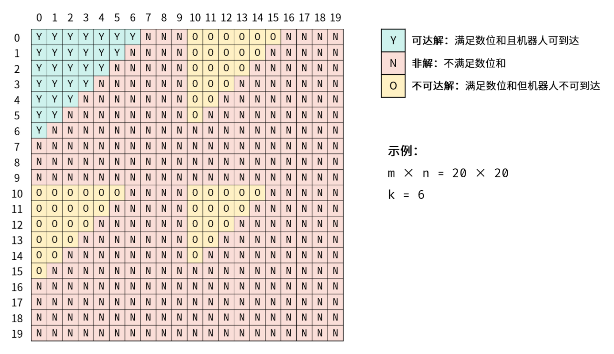
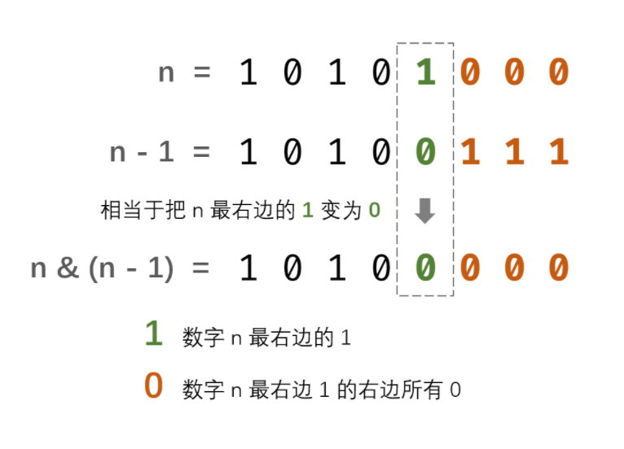
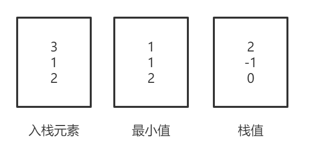
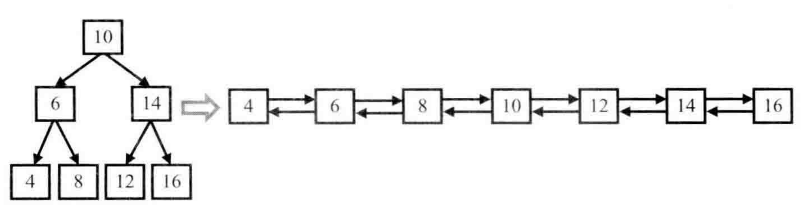
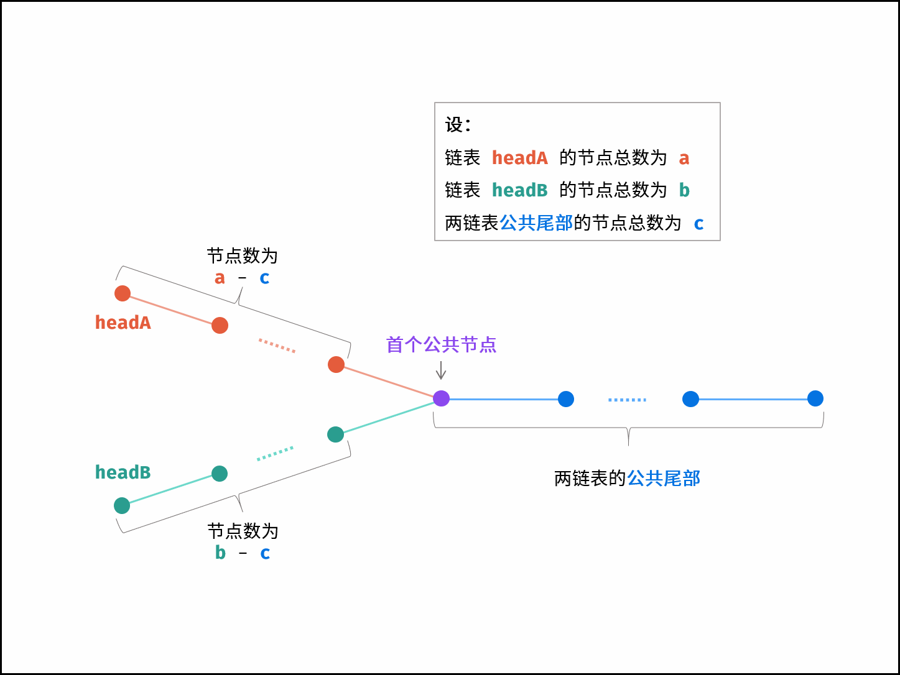
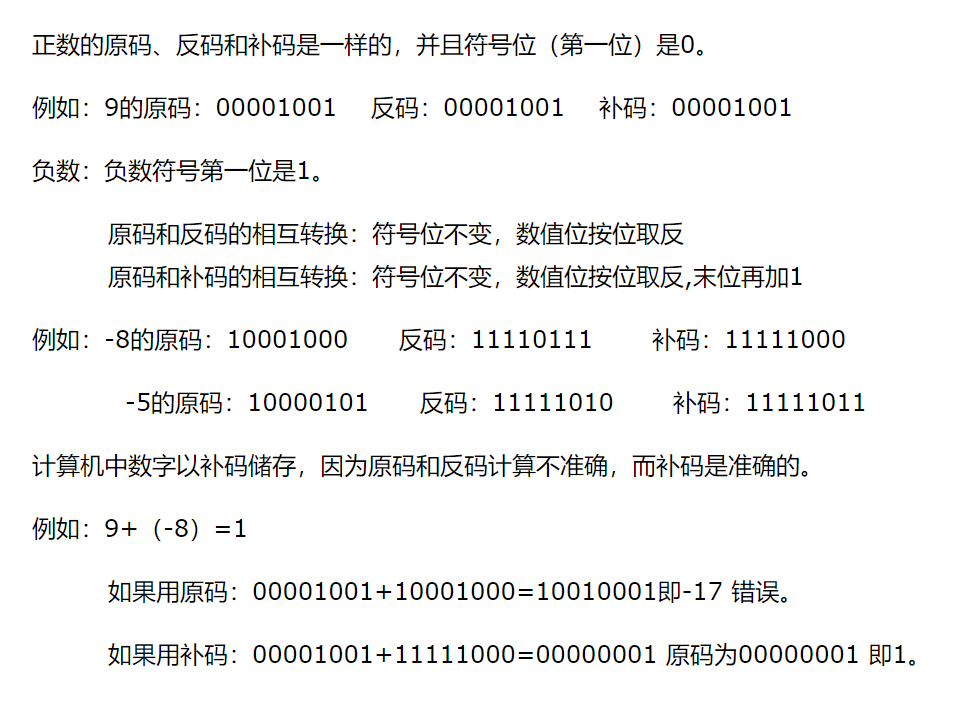

[TOC]


#### LC-剑指Offer-

* 题目

* 分析

* 解答


#### LC-剑指Offer-03 数组中重复的数字

* 题目

  找出一个长度n的数组中任意一个重复的数字，数字范围在[0,n-1]

  如输入[2, 3, 1, 0, 2, 5, 3]，输出2或3

* 分析

  四种解法

  * Set集合(官方)

    利用Set集合不能重复的特点，若加入失败则代表重复

  * 临时数组索引映射(自用)

    申明临时数组，利用数字范围在[0,n-1]，遍历到数字，则查询临时数组索引为数字的值，若为0则设为1，若为1则为重复数字

  * 数组置换(推荐)

    利用数字范围在[0,n-1]，遍历到数字，则将数字置换到数字对应的索引处，若数字对应的索引处存在相同数字，则重复

* 解答

  ```java
  class Solution {
      public int findRepeatNumber(int[] nums) {
          // i 遍历的索引 nums[i] 遍历的值
          // nums[i] 遍历的值对应的索引 nums[nums[i]] 遍历的值对应的索引的值
          int temp;
          for(int i = 0; i < nums.length; i++){
              while(nums[i] != i){
                  if(nums[i] != nums[nums[i]]){
                      temp = nums[i];
                      nums[i] = nums[nums[i]];
                      nums[temp] = temp;  // 此时nums[i]值已变
                  }
                  else return nums[i];
              }
          }
          return -1;
      }
  }
  ```

  


#### LC-剑指Offer-04 二维数组的查找

* 题目

  一个n*m的二维数组，每行每列都递增，判断数组中是否含有某数

  如下数组5*5

  [[1,   4,  7, 11, 15],
    [2,   5,  8, 12, 19],
    [3,   6,  9, 16, 22],
    [10, 13, 14, 17, 24],
    [18, 21, 23, 26, 30]]

  输入5，返回true，输入20，返回false

* 分析

  由于数组存在递增关系，首要想到二分搜索，但如果从数组中央二分搜索太难维持索引边界，放弃

  数组右上角/左下角的元素有这样的特征，比它们大/小的元素，一定在某个方向上

  如数组右上角元素，比它大则在它下方，比它小则在它上方，基于此遍历数组

  数组旋转则类似二分搜索树，右上角元素则为根节点

* 解答

  ```java
  class Solution {
      public boolean findNumberIn2DArray(int[][] matrix, int target) {
          // 前置判断
          if(matrix==null || matrix.length==0 || matrix[0].length==0 ) return false;
          // 右上角开始查找
          int n = matrix.length;
          int m = matrix[0].length;
          int i = 0;
          int j = m-1;
          while(i < n && j >= 0){
              if(matrix[i][j] == target) return true;
              else if(matrix[i][j] < target) i++;
              else if(matrix[i][j] > target) j--;
          }
          return false;
      }
  }
  ```


#### LC-剑指Offer-05 替换空格

* 题目

  将字符串中所有的空格替换成%20

* 分析

  * 统计空格

  * 扩充数组

    Java只能重新重新申请新数组

  * 双指针填充

    若在原数组填充，则**从后向前填充**，新数组的话则双指针前后填充都可

* 解答

  ```java
  class Solution {
      public String replaceSpace(String s) {
          // 统计空格
          int count = 0;
          char[] oldChars = s.toCharArray();
          for(char c : oldChars){
              if(c == ' ') count++;
          }
  
          // 扩充数组
          char[] newChars = new char[s.length() + count * 2];
  
          // 双指针填充
          int i = 0;
          for(char c : oldChars){
              if(c == ' '){
                  newChars[i++] = '%';
                  newChars[i++] = '2';
                  newChars[i++] = '0';
              }else newChars[i++] = c;
          }
          return new String(newChars);
      }
  }
  ```

  


#### LC-剑指Offer-06 从尾到头打印链表

* 题目

  输入一个链表的头节点，从尾到头反过来返回每个节点的值

* 分析

  * 辅助栈(官方)

    将元素放入栈中，利用先入后出的特性

  * 递归回溯(DFS深度优先遍历)

    递归至尾节点，在回溯时再添加元素

    * 可**递归时统计链表长度**，在尾节点时初始化数组后填充数据

* 解答

  ```java
  // 辅助栈
  public int[] reversePrint(ListNode head) {
      Stack<ListNode> temp = new Stack<>();
      while(head!=null){
          temp.add(head);
          head = head.next;
      }
      int[] res = new int[temp.size()];
      for (int i = 0; i < res.length; i++) {
          res[i] = temp.pop().val;  // pop弹出并删除 peek弹出不删除
      }
      return res;
  }
  // 递归回溯
  int[] res;
  int size = 0;
  int index = 0;
  
  public int[] reversePrint(ListNode head) {
      dfs(head);
      return res;
  }
  
  private void dfs(ListNode head){
      if(head==null){
          res = new int[size];
      }else{
          size++;
          dfs(head.next);
          res[index] = head.val;
          index++;
      }
  }
  ```

  


#### LC-剑指Offer-07 重建二叉树

* 题目

  根据树的前序和中序遍历重建二叉树，树的遍历结果不含重复数字

* 分析

  前序遍历确定根节点，中序遍历确定左右子树边界

  * **dfs可优化至三个节点**，即preStart，inStart，inEnd即可，终止条件为inStart > inEnd

* 解答

  ```java
  public TreeNode buildTree(int[] preorder, int[] inorder) {
      int preStart = 0;
      int preEnd = preorder.length - 1;
      int inStart = 0;
      int inEnd = inorder.length - 1;
      return dfs(preStart, preorder, preEnd, inStart, inorder, inEnd);
  }
  
  private TreeNode dfs(int preStart, int[] preorder, int preEnd, int inStart, int[] inorder, int inEnd){
      if(preStart > preEnd || inStart > inEnd){
          return null;
      }else{
          // 前序遍历确定根节点
          int rootVal = preorder[preStart];
          TreeNode root = new TreeNode(rootVal);
          // 中序遍历确定左右子树边界
          int rootInOrderIndex = findIndex(inorder, rootVal);
          int leftLength = rootInOrderIndex - inStart;
          int rightLength = inEnd - rootInOrderIndex;
  
          root.left = dfs(preStart + 1, preorder, preStart + leftLength, inStart, inorder, rootInOrderIndex - 1);
          root.right = dfs(preStart + leftLength + 1, preorder, preEnd, rootInOrderIndex + 1, inorder, inEnd);
          return root;
      }
  }
  
  private int findIndex(int[] array, int val){
      for(int i = 0; i < array.length; i++){
          if(array[i]==val) return i;
      }
      return -1;
  }
  ```

  


#### LC-剑指Offer-09 用两个栈实现队列

* 题目

  用两个栈实现队列

* 分析

  入队元素放在第一个栈

  获取出队元素时，将第一个栈所有元素出栈并入第二个栈，之后第二个栈顶层元素即是最先入队的元素

* 解答

  ```java
  class CQueue {
  
      // Deque<>双向队列 addFirst/removeFirst 也可作栈使用
      // LinkedList<> addLast/removeLast 也可作栈使用
      Stack<Integer> s1;
      Stack<Integer> s2;
  
      public CQueue() {
          s1 = new Stack<>();
          s2 = new Stack<>();
      }
      
      public void appendTail(int value) {
          s1.add(value);
      }
      
      public int deleteHead() {
          if(s2.size() == 0){
              while(s1.size()>0){
                  s2.add(s1.pop());
              }
          }
          if(s2.size() == 0) return -1;
          else return s2.pop();
      }
  }
  ```


#### LC-剑指Offer-10.1-斐波那契数列

* 题目

  求斐波那契数列第n项，计算答案要取模1000000007(防止溢出)

* 分析

  * 自顶向下，递归回溯，备忘录优化
  * 自底向上，迭代循环，仅保留前两个状态优化

* 解答

  ```java
  // 自顶向下，递归回溯，备忘录优化
  int[] nums = new int[101];
  
  public int fib(int n) {
      if(n == 0 || n == 1) return n;
      return dfs(n);
  }
  
  private int dfs(int n){
      if(n == 0 || n == 1) return n;
  
      if(nums[n] != 0) return nums[n];  // 备忘录
  
      nums[n] = (dfs(n-1) + dfs(n-2)) % 1000000007;
  
      return nums[n];
  }
  // 自底向上，迭代循环，保留两个状态优化
  public int fib(int n) {
      if(n == 0 || n == 1) return n;
  
      int i = 0;
      int j = 1;
      int temp = 1;
      int index = 2;
  
      while(index <= n){
          temp = (i + j) % 1000000007;
          i = j;
          j = temp;
          index++;
      }
  
      return temp;
  }
  ```


#### LC-剑指Offer-10.2 青蛙跳台阶

* 题目

  青蛙一次可以跳1级或2级台阶，求青蛙跳n级台阶有多少种跳法

  答案要取模1000000007

* 分析

  类似上题思路，但f(0)=1，f(1)=1

* 解答

  略


#### LC-剑指Offer-11/LC-145 旋转数组的最小数字

* 题目

  将数组最开始的若干个元素移到数组尾部即为数组的旋转

  一个升序数组进行了旋转，求数组中的最小值

* 分析

  数组的查找一般采用二分法，但二分法的前提是递增序列

  旋转数组是两段递增序列，但第二段序列的最大值肯定小于等于第一段序列的最小值，遵循这个原则一直缩小查找范围即可

  * 中间值 < 右边值，中间值在最小值右边(第二段序列)，缩小右边界
  * 中间值 > 右边值，中间值在最小值左边(第一段序列)，缩小左边界
  * 中间值=右边值，无法判断中间值在最小值哪边，缩小右边界可防止溢出重新计算且不会错过最小值

* 解答

  ```java
  class Solution {
      public int findMin(int[] nums) {
          int left = 0;
          int right = nums.length - 1;
          
          while(left < right){
              int mid = left + (right - left)/2;
              // nums[mid]肯定不是最小值
              if(nums[mid] > nums[right]) left = mid + 1;
              // nums[mid]可能是最小值
              else if(nums[mid] < nums[right]) right = mid;
              else right--;
          }
          
          // 此时left==right
          return nums[left];
      }
  }
  ```

  


#### LC-剑指Offer-12 矩阵中的路径

* 题目

  判断矩阵中是否包含某字符串所有字符的路径，不可走重复字符

  如下矩阵，

  [["a","**b**","c","e"],
  ["s","**f**","**c**","s"],
  ["a","d","**e**","e"]]

  包含bfce路径，不包含abfb路径

* 分析

  典型dfs，递归回溯实现

  * base case
    * 数组越界，false
    * 矩阵字符与目标字符不符，false
    * 矩阵字符已访问过，false
    * 矩阵字符与目标字符相符且目标字符串已遍历完，true
  * do choose(做选择)
    * 将当前选择从选择列表移除，即将当前矩阵字符置为空
    * 匹配字符串下个字符，valid+1
    * 上下左右四个选择
  * cacel choose(撤销选择)
    * 将当前选择放回选择列表，即将当前矩阵字符还原
    * 匹配当前字符，valid-1

* 解答

  ```java
  public boolean exist(char[][] board, String word) {
  
      char[] words = word.toCharArray();
  
      for (int i = 0; i < board.length; i++) {
          for (int j = 0; j < board[i].length; j++) {
              if(dfs(board,words,i,j,0)) return true;
          }
      }
      return false;
  }
  
  private boolean dfs(char[][] board, char[] words, int i, int j, int valid) {
      // base case
      if(i < 0 || i > board.length - 1 || j < 0 || j > board[i].length - 1 || board[i][j] != words[valid]) return false;
      if(valid == words.length - 1) return true;
  
      // do choose
      board[i][j] = ' ';
      boolean flag = dfs(board,words,i+1,j,valid+1) || dfs(board,words,i,j+1,valid+1) || dfs(board,words,i-1,j,valid+1) || dfs(board,words,i,j-1,valid+1);
  
      // cacel choose
      board[i][j] = words[valid];
  
      return flag;
  }
  ```


#### LC-剑指Offer-13 机器人的运动范围

* 题目

  一个m*n的矩阵，机器人可以到达不大于k的格子，每个格子的值为行列坐标的数位之和，求机器人能够到达多少个格子

  如[35,37]的值为3+5+3+7=18

* 分析

  * 遍历计算每个格子(自用)，未考虑存在不可达解，因此解答错误

    

  * 深度优先遍历(DFS)，从[0,0]开始，上下左右遍历
    * base case
      * 越界或走过此格子
      * 格子无效，记录visited
    * do choose
      * 格子有效，res++，记录visited
      * 上下左右走下个格子
    * cacel choose(无)
      * 格子只能走一次，因此不需要将选择放回选择列表
    
  * 广度优先遍历(BFS)，从[0,0]开始，上下左右遍历

    * 初始化队列，Queue(LinkedList)
    * 将初始条件加入队列中
    * 遍历队列，取出选择，校验选择，做选择

* 解答

  ```java
  // DFS
  class Solution {
      public int movingCount(int m, int n, int k) {
          int res = 0;  // 记录有效格子
          boolean[][] visited = new boolean[m][n];  // 记录走过的格子
          return dfs(0,0,m,n,visited,0,k);
      }
  
      private int dfs(int i, int j, int m, int n, boolean[][] visited, int res, int k) {
          // base case 1 越界或走过此格子
          if(i < 0 || i > m-1 || j < 0 || j > n-1 || visited[i][j] == true) return res;
          
          // base case 2 格子无效
          if(getBitSum(i) + getBitSum(j) > k ){
              visited[i][j] = true;
              return res;
          }
          
          // do choose 格子有效 上下左右走(可优化只走下右)
          res++;
          visited[i][j] = true;
          res = Math.max(res, dfs(i+1,j,m,n,visited,res,k));  
          res = Math.max(res, dfs(i,j+1,m,n,visited,res,k));
          res = Math.max(res, dfs(i-1,j,m,n,visited,res,k));  // 可优化去除
          res = Math.max(res, dfs(i,j-1,m,n,visited,res,k));  // 可优化去除
          return res;
      }
  
      private int getBitSum(int n){
          int sum = 0;
          while(n > 0){
              sum += n % 10;
              n /= 10;
          }
          return sum;
      }
  }
  
  // BFS
  class Solution {
      public int movingCount(int m, int n, int k) {
          // 初始化相关变量
          int res = 0;
          boolean[][] visited = new boolean[m][n];
          Queue<int[]> q = new LinkedList<>();
  
          // 将初始条件加入队列中
          q.add(new int[]{0,0});
  
          // 遍历队列
          while(q.size() > 0){
              // 取出选择
              int[] node = q.poll();
              int i = node[0];
              int j = node[1];
  
              // 校验选择
              if(i < 0 || i > m-1 || j < 0 || j > n-1 || visited[i][j] == true)continue;
              if(getBitSum(i) + getBitSum(j) > k ){
                  visited[i][j] = true;
                  continue;
              }
  
              // 做出选择
              res++;
              visited[i][j] = true;
              q.add(new int[]{i+1,j});
              q.add(new int[]{i,j+1});
              q.add(new int[]{i-1,j});  // 可优化去除
              q.add(new int[]{i,j-1});  // 可优化去除
          }
  
          return res;
      }
  
      private int getBitSum(int n){
          int sum = 0;
          while(n > 0){
              sum += n % 10;
              n /= 10;
          }
          return sum;
      }
  }
  ```


#### LC-剑指Offer-14-1 剪绳子

* 题目

  将一个正整数n拆分成任意m个正整数的和，求m个正整数的最大乘积

* 分析

  * 动态规划

    n的最大值等于MAX(max(1) \* max(n-1), max(2) \* max(n-2), ....max(n-1) \* max(1))

    注意特殊情况

    * n为1，2，3时，剪了的乘积比自身小(不剪)
    * n为4时，剪了的乘积等于自身(不剪)，4=2\*2
    * 大于4时， 剪了的乘积比自身大(不剪)，即5=2+3<2*3

  * 贪心算法

    可证明n>=4时，尽可能多地剪长度为3的绳子

* 解答

  ```java
  // 自低向上的动态规划
  public int cuttingRope(int n) {
      // 特殊情况
      if(n < 2) return 0;
      if(n == 2) return 1;
      if(n == 3) return 2;
  
      // 大于等于4时，拆分成1，2，3时不剪
      int[] dp = new int[n+1];
      dp[1] = 1;
      dp[2] = 2;
      dp[3] = 3;
  
      int max = 0;
      for(int i = 4; i <= n; i++){
          max = 0;
          for(int j = 1; j <= i/2; j++){
              max = Math.max(max, dp[j]*dp[i-j]);
          }
          dp[i] = max;
      }
      return dp[n];
  }
  ```


#### LC-剑指Offer-14-2 剪绳子 大数取余

* 题目

  与14-1剪绳子相同，但增加了n的范围，涉及到大数取余问题

* 分析

* 解答


#### LC-剑指Offer-15 二进制中1的个数

* 题目

  输入二进制整数中1的个数

  如输入11111111111111111111111111111101，返回31

* 分析

  * 判断个位后右移

    * 判断个位

      n&1=0，则最后一位为0，n&1=1，则最后一位为1

    * 右移(一位)

      n>>>1

  * n&(n-1)消除最右边的1

    

* 解答

  ```java
  // 判断个位后右移
  public int hammingWeight(int n) {
      int res = 0;
      while(n != 0){  // 注意条件
          res += n & 1;
          n = n >>> 1;
      }
      return res;
  }
  
  // n&(n-1)消除最右边的1
  public int hammingWeight(int n) {
      int res = 0;
      while(n != 0){
          n = n & (n-1);
          res++;
      }
      return res;
  }
  ```


#### LC-剑指Offer-16 数值的整数次方

* 题目

  求x的n次方，n可能为负数

* 分析

  * n=0，返回1

  * n<0，此时x的n次方，等于1/x的(-n)次方，转换成n大于0的情况

  * n>0，返回x的n次方

    * 快速幂算法优化

      求幂(底数的指数次方)复杂度依赖指数的大小，快速幂算法核心在于不断增大底数、减小指数，达到降低求幂的复杂度，具体步骤为
      
      * 指数为偶数，则底数^2，指数/2
  * 指数为奇数(包含1)，则记录底数，底数^2，(指数-1)/2
      * 指数为0，则幂为所有记录底数的乘积

    * 位运算优化
      * n&1替代n%2，判断指数的奇偶性
      * n>>>1代替n/2，减小指数

* 解答

  ```java
  public double myPow(double x, int n) {
      if(n == 0) return 1;
      long m = n;
      if(n < 0){
          m = -m;
          x = 1.0 / x;
      }
  
      // 记录底数
      double res = 1.0;
      while(m > 0){
          if((m & 1) == 1) res = res * x;
          x = x * x;  // 底数^2
          m = m >>> 1;  // 指数/2
      }
      return res;
  }
  ```

  


#### LC-剑指Offer-17 打印从1到最大的n位数

* 题目

  按顺序输出从1到最大n位数

  如n=3，输出从1到999

* 分析

  * 非大数问题

    直接循环输出从1到10^n-1即可

  * 大数问题

    需要用字符串模拟整数加法，但模拟进位效率不高，如999+1至1000则需循环四次

    * 全排列优化

      由于[1,10^n-1]的所有数字，即是0到9的n次全排列，可用递归回溯dfs生成

      对于0和高位为0的字符数字，需要特殊去除

* 解答

  ```java
  private char[] chooseChars = {'0','1','2','3','4','5','6','7','8','9'};
  private int numsIndex = 0;
  private int[] nums;
  
  public int[] printNumbers(int n) {
      // 总数 10^n-1
      int length = 1;
      for(int i = 0; i < n; i++){
          length = length * 10;
      }
      length = length - 1;
  
      nums = new int[length];
      dfs(0, new char[n], n);
      return nums;
  }
  
  private void dfs(int charsIndex, char[] chars, int n){
      // base case
      if(charsIndex > n - 1){
          int i = Integer.parseInt(new String(chars));
          System.out.println(i);
          if(i != 0) nums[numsIndex++] = i;
          return;
      }
  
      for(int i = 0; i < 10; i++) {
          // do choose
          chars[charsIndex] = chooseChars[i];
          // charsIndex++;
  
          // dfs
          dfs(charsIndex + 1, chars, n);  // 由于int传值 可优化charsIndex的加减
  
          // cacel choose
          // charsIndex--;
      }
  
  }
  ```


#### LC-剑指Offer-18 删除链表的节点

* 题目

  删除单向链表的某个值的节点

* 分析

  * 双指针

    i.next=j，j遍历链表判断，若符合要求，i.next=j.next

  * 单指针，复制并删除后一个节点值

    i遍历链表判断，若符合要求，i.val = i.next.val，i.next = i.next.next

    注意删除尾节点的判断

* 解答

  ```java
  // 双指针
  public ListNode deleteNode(ListNode head, int val) {
      if(head == null) return null;
      
      ListNode i = head;
      ListNode j = head.next;
      
      
      if(j == null) return null;  // 单节点情况
      if(i.val == val && j != null) return j;  // 删除头节点情况
      while(j != null){
          if(j.val == val){
              i.next = j.next;
              break;
          }else{
              i = j;
              j = j.next;
          }
      }
      return head;
  }
  ```


#### LC-剑指Offer-19 正则表达式的匹配

* 题目

  字符串s，正则表达式p，判断p是否匹配s，其中p的匹配规则包含【.】匹配任意单个字符、【*】匹配零个或多个前一个字符

  s、p可能为空且仅包含a-z

* 分析

  

* 解答


#### LC-剑指Offer-20 表示数值的字符串

* 题目

* 分析

* 解答


#### LC-剑指Offer-21 调整数组顺序使奇数位于偶数前面

* 题目

  将整数数组的所有奇数调整至数组前半部分，偶数调整至数组后半部分

* 分析

  * 头尾指针(自用)

    头指针从头遍历到偶数，尾指针从尾遍历到奇数，交换数字，直到指针相遇

  * 快慢指针

    快指针找奇数，慢指针从头指向存放奇数的位置，直到快指针遍历完成

* 解答

  ```java
  // 头尾指针
  public int[] exchange(int[] nums) {
      if(nums.length < 2) return nums;
      int head = 0, tail = nums.length - 1, temp;
      while(head < tail){
          while(head < tail && (nums[head] & 1) == 1) head++;
          while(head < tail && (nums[tail] & 1) == 0) tail--;
          if(head < tail){
              temp = nums[tail];
              nums[tail] = nums[head];
              nums[head] = temp;
          }
      }
      return nums;
  }
  // 快慢指针
  public int[] exchange(int[] nums) {
      if(nums.length < 2) return nums;
      int slow = 0, fast = 0, temp;
      while(fast < nums.length){
          if((nums[fast] & 1) == 0) fast++;
          else{
              temp = nums[fast];
              nums[fast] = nums[slow];
              nums[slow] = temp;
              slow++;
              fast++;
          }
      }
      return nums;
  }
  ```

  


#### LC-剑指Offer-22 链表中倒数第k个节点

* 题目

  输出链表中倒数第k个节点，从1开始

* 分析

  * 快慢指针

    快指针先走k-1个节点，快指针与慢指针同步走，直到快指针走到尾节点，慢指针就是倒数第k个节点

* 解答

  ```java
  public ListNode getKthFromEnd(ListNode head, int k) {
      ListNode slow = head;
      ListNode fast = head;
      for(int i = 1; i < k; i++){
          fast = fast.next;
      }
      while(fast.next != null){
          slow = slow.next;
          fast = fast.next;
      }
      return slow;
  }
  ```


#### LC-剑指Offer-24 反转链表

* 题目

  输出链表反转链表的头节点

* 分析

  * 三指针(自用)

    较为麻烦，丢弃

  * 双指针(官方)

    first与second，second->first，first = second，second = second.next，直到second为null时first为反转链表的头指针

* 解答

  ```java
  // 三指针 复杂且低效
  public ListNode reverseList(ListNode head) {
      if(head == null) return null;
  
      ListNode first = head;
      if(first.next == null) return first;
  
      ListNode second = first.next;
      if(second.next == null){
          second.next = first;
          first.next = null;
          return second;
      }
  
      ListNode third = second.next;
      // first为首节点时
      first.next = null;
      // 中间节点
      while(third.next != null){
          second.next = first;
          first = second;
          second = third;
          third = third.next;
      }
      // third为尾节点时
      second.next = first;
      third.next = second;
      return third;
  }
  
  // 双指针(官方) 囊括单节点/双节点/三节点链表情况
  public ListNode reverseList(ListNode head) {
      ListNode prev = null;
      ListNode curr = head;
      while (curr != null) {
          ListNode next = curr.next;
          curr.next = prev;
          prev = curr;
          curr = next;
      }
      return prev;
  }
  ```


#### LC-剑指Offer-25 合并两个排序的链表

* 题目

  合并两个递增排序的链表成一个递增排序的链表

* 分析

  * 双指针+虚拟头指针优化

    两个指针分别从两个链表遍历，新建头指针指向较小的节点

    由于双指针时一开始要确认哪个是头指针，增加了代码复杂度，可构建伪头指针，后续返回伪头指针的下个节点即可

* 解答

  ```java
  public ListNode mergeTwoLists(ListNode l1, ListNode l2) {
      if(l1 == null) return l2;
      if(l2 == null) return l1;
  
      // 虚拟头指针
      ListNode head = new ListNode(0);
      ListNode cur = head;
  
      while(l1 != null && l2 != null){
          System.out.println(cur.val);
          if(l1.val < l2.val){
              cur.next = l1;
              cur = l1;
              l1 = l1.next;
          }else{
              cur.next = l2;
              cur = l2;
              l2 = l2.next;
          }
      }
  	
      cur.next = l1 != null ? l1 : l2; 
      return head.next;  // 去除虚拟头指针
  }
  ```

  


#### LC-剑指Offer-26 树的子结构

* 题目

  判断B树是不是A树的子结构，即在A局部有和B相同的结构和节点

  B为空树则不是任何树的子结构

* 分析

  * 递归回溯(自用)

    先遍历A树找到B树的根节点，找到后同时遍历AB树，若AB树结构相同则存在，否则不存在

* 解答

  ```java
  // 递归回溯
  public boolean isSubStructure(TreeNode A, TreeNode B) {
      if(A == null || B == null) return false;
      return dfs(A,B);
  }
  private boolean dfs(TreeNode A, TreeNode B){  // 遍历A树找B树根节点
      if(A == null) return false;
      
      if(A.val == B.val){
          if(check(A,B)) return true;  // 校验成功则返回 失败则继续遍历找下一个根节点
      }
  
      return dfs(A.left,B) || dfs(A.right,B);
  }
  private boolean check(TreeNode A, TreeNode B){  // 校验AB结构
      if(B == null) return true;
      if(A != null && B != null){
          if(A.val != B.val) return false;
          else return check(A.left,B.left) && check(A.right,B.right);
      }
      return false;
  }
  ```


#### LC-剑指Offer-27 二叉树的镜像

* 题目

  输出一个二叉树左右翻转的镜像二叉树

* 分析

  * 递归回溯(自用)

    前序遍历二叉树，交换左右节点

  * 辅助栈(BFS)

    利用辅助栈存储树节点，BFS遍历二叉树，每次交换左右节点

* 解答

  ```java
  // 递归回溯
  public TreeNode mirrorTree(TreeNode root) {
      dfs(root);
      return root;
  }
  private void dfs(TreeNode root){
      if(root == null) return;
  
      ListNode temp = root.left;
      root.left = root.right;
      root.right = temp;
  
      dfs(root.left);
      dfs(root.right);
  
      return;
  }
  ```


#### LC-剑指Offer-28 对称二叉树

* 题目

  判断一颗二叉树是否左右对称

* 分析

  * 双指针+递归回溯(自用)

    定义左右节点指针，分别从根节点左右子树遍历

* 解答

  ```java
  // 双指针+递归回溯
  public boolean isSymmetric(TreeNode root) {
      if(root == null) return true;
      return check(root.left,root.right);
  }
  private boolean check(TreeNode left, TreeNode right){
      if(left == null && right == null) return true;
      
      if(left != null && right != null){
          if(left.val == right.val) {
              // 判断对称 左节点的左子树与右节点的右子树 左节点的右子树与右节点的左子树 
              return check(left.left,right.right) && check(left.right,right.left);
          }
          else return false;
      }
      
      return false;
  }
  ```


#### LC-剑指Offer-29 顺时针打印矩阵

* 题目

  从外向里顺时针打印矩阵(二元数组)的元素

* 分析

  * 收缩边界法

    固定边界指针遍历时，容易越界和访问重复元素

    收缩边界可以防止越界和隔离掉访问过的行列元素

* 解答

  ```java
  public int[] spiralOrder(int[][] matrix) {
      if(matrix.length == 0) return new int[0];
  
      // l-左边界 r-右边界 t-上边界 -b下边界
      int l = 0;
      int r = matrix[0].length - 1;
      int t = 0;
      int b = matrix.length - 1;
  
      int[] res = new int[(matrix.length * matrix[0].length)];
      int resIndex = 0;
  
      while(true){
          // left to right on top 不会越界地访问元素
          for(int i = l; i <= r; i++) res[resIndex++] = matrix[t][i];
  
          // top-- 收缩边界 隔离访问过的顶行元素
          t++;
          if(t > b) break;
  
          // top to bottom on right 不会越界地访问元素
          for(int i = t; i <= b; i++) res[resIndex++] = matrix[i][r];
  
          // right-- 收缩边界 隔离访问过的右列元素
          r--;
          if(r < l) break;
  
          // right to left on bottom 不会越界地访问元素
          for(int i = r; i >= l; i--) res[resIndex++] = matrix[b][i];
  
          // buttom-- 收缩边界 隔离访问过的底行元素
          b--;
          if(b < t) break;
  
          // bottom to top on left 不会越界地访问元素
          for(int i = b; i >= t; i--) res[resIndex++] = matrix[i][l];
  
          // left++ 收缩边界 隔离访问过的左列元素
          l++;
          if(l > r) break;
      }
      return res;
  }
  ```


#### LC-剑指Offer-30 包含min函数的栈

* 题目

  定义栈的数据结构，拥有时间复杂度为O(1)的min、push、pop、top方法

  * push(x)，元素x入栈
  * pop()，删除栈顶的元素
  * top()，获取栈顶元素
  * getMin()，检索栈中的最小元素

* 分析

  * 辅助栈(额外空间)

    每次元素进栈时，都保留当前栈的元素最小值

  * 栈存储差值(不需额外空间)

    数据结构为栈和最小值数值

    栈存储入栈元素与当前栈最小值的差值，负数则此时入栈元素为最小值，需更新当前栈最小值

    

* 解答

  ```java
  class MinStack {
  
      Integer min;  // 存储当前最小值
      Stack<Long> data;  // 存储差值的栈
  
      /** initialize your data structure here. */
      public MinStack() {
          data = new Stack<>();
      }
      
      // 栈值 =  x - 当前栈最小值
      public void push(int x) {
          if(data.isEmpty()){
              // 第一个元素 差值为0
              min = x;
              data.push(0L);
          }else{
              // 非第一个元素  栈值 =  x - 当前栈最小值
              data.push(Long.valueOf(x) - min);  // 这里可能越界 需用Long存储
              if(x < min) min = x;  // 负数则更新当前栈最小值
          }
      }
      
      public void pop() {
          Long diff = data.pop();
          if(diff >= 0){
              // return (int)(diff + min);
          }else{  // 差值小于0 则当前栈最小值为当前栈元素 新的最小值 = 当前栈最小值 - 栈值
              int tempMin = min;
              min = (int)(min - diff);
              // return tempMin;
          }
          
      }
      
      public int top() {
          Long diff = data.peek();
          if(diff >= 0) return (int)(diff + min);
          else{
              return min;
          }
      }
      
      public int getMin() {
          return min;
      }
  }
  ```

  


#### LC-剑指Offer-31 栈的压入、弹出序列

* 题目

  输入栈的压入序列，判断一个序列是否可能是该栈的弹出序列

* 分析

  * 模拟入栈出栈操作

    一组入栈序列和弹出序列是可以唯一确定入栈和出栈操作顺序的，因此可以模拟入栈和出栈的操作过程，若最后元素全部入栈且全部出栈则正确

* 解答

  ```java
  public boolean validateStackSequences(int[] pushed, int[] popped) {
      Stack<Integer> s = new Stack<>();
      int i = 0;
      for(int n : pushed) {  // 元素全部循环入栈
          s.push(n);
          while(!s.isEmpty() && s.peek() == popped[i]) { // 元素全部循环出栈
              s.pop();
              i++;
          }
      }
      return s.isEmpty();
  }
  ```


#### LC-剑指Offer-32-1  从上到下打印二叉树

* 题目

  从上到下从左到右打印二叉树节点

* 分析

  * 广度优先遍历(BFS)

    从根节点开始将节点按从左右到右的顺序放入队列中

* 解答

  ```java
  public int[] levelOrder(TreeNode root) {
      // init queue
      Queue<TreeNode> q = new LinkedList<>();
      q.add(root);
      
      List<Integer> l = new ArrayList();
  
      while(q.size() > 0){
          // get choose
          TreeNode tn = q.poll();
  
          // check choose and do action
          if(tn == null) continue; 
          l.add(tn.val);
  
          // do choose
          q.offer(tn.left);
          q.offer(tn.right);
      }
  
      // List to array
      int[] res = new int[l.size()];
      int i = 0;
      for(int ln : l){
          res[i++] = ln;
      }
  
      return res;
  }
  ```

  

  

#### LC-剑指Offer-32-2 从上到下打印二叉树

* 题目

  从上到下从左到右打印二叉树，每层打印到一行

  ```
  输入
      3
     / \
    9  20
      /  \
     15   7
  输出
  [
    [3],
    [9,20],
    [15,7]
  ]
  ```

* 分析

  * 广度优先遍历(BFS)

    每次将队列所有元素取出，一起处理之后再做下一次选择

* 解答

  ```java
  public List<List<Integer>> levelOrder(TreeNode root) {
      // init queue
      Queue<TreeNode> q = new LinkedList<>();
      q.add(root);
  
      List<List<Integer>> ll = new ArrayList();
  
      while(q.size() > 0){
          int curNum = q.size();  // 记录当前队列元素 之后加了元素不会影响
          List<Integer> l = new ArrayList();
          for(int i = 0; i < curNum ;i++){
              // get choose
              TreeNode tn = q.poll();
              // check choose and do action
              if(tn == null) continue; 
              l.add(tn.val);
              // do choose
              q.offer(tn.left);
              q.offer(tn.right);
          }
          if(!l.isEmpty()) ll.add(l);  // 空队列则全是null元素 不计入
  
      }
      return ll;
  }
  ```

  


#### LC-剑指Offer-32-3 从上到下打印二叉树

* 题目

  按照第一行从左往右，第二行从右往左打印二叉树

* 分析

  * 双端列表(LinkedList)

    奇数层，将元素值从队列尾部放入，偶数层，将元素值从队列头部放入

  * 反转列表

    偶数层，反转列表

* 解答

  ```java
  // 双端列表(LinkedList)
  LinkedList<Integer> l = new LinkedList(); 
  if((depth & 1) == 1){
      // 奇数层 从尾部放入
      l.addLast(tn.val);
  }else{
      // 偶数层 从头部放入
      l.addFirst(tn.val);
  }
  
  // 反转列表
  List<Integer> l = new ArrayList();
  if((depth & 1) == 0){
      // 偶数层 反转列表
      Collections.reverse(l);
  }
  ```

  


#### LC-剑指Offer-33 二叉搜索树的后序遍历序列

* 题目

  判断一个整数序列是不是二叉搜索树的后续遍历

* 分析

  * 深度优先遍历(DFS)

    后续遍历序列的结构为[左子树，右子树，根节点]，由于是二叉搜索树，因此有

    左子树节点值<根节点值，根节点值<右子树节点值

    递归回溯遍历序列，判断是否满足二叉搜索树特征即可

* 解答

  ```java
  public boolean verifyPostorder(int[] postorder) {
      return dfs(postorder, 0, postorder.length - 1);
  }
  
  private boolean dfs(int[] n, int l, int r){
      // base case 1
      if(l >= r) return true;
  
      // base case 2
      int i = l;
      while(n[i] < n[r]) i++;  // 找到 右子树开始的索引
      int j = i;
      while(n[j] > n[r]) j++;  // 找到 右子树结束的索引
      if(j != r) return false; // 若右子树与根节点之间存在值 则不是二叉搜索树
  
      // do choose
      return dfs(n,l,i-1) && dfs(n,i,r-1);  // 递归判断左右子树是不是二叉搜索树
  
      // (cancel choose)
  }
  ```


#### LC-剑指Offer-34 二叉树中和为某一值的路径

* 题目

  打印二叉树中路径节点值的和为某一值的所有路径

  二叉树路径为从根节点到叶子节点

* 分析

  * 递归回溯DFS(自用)

    递归遍历所有节点，统计节点值的和，在叶子节点计算路径和

* 解答

  ```java
  List<List<Integer>> res = new ArrayList();
  
  public List<List<Integer>> pathSum(TreeNode root, int sum) {
      dfs(root,sum,new ArrayList<Integer>(),0);
      return res;
  }
  
  private void dfs(TreeNode tn, int sum, List<Integer> curPath, int curPathSum){
      // base case 1
      if(tn == null) return;
  
      // base case 2 叶子节点计算路径和
      if(tn.left == null && tn.right == null){
          if(curPathSum + tn.val == sum){
              curPath.add(tn.val);
              res.add(new ArrayList(curPath));  // 注意构建新队列
              curPath.remove(curPath.size()-1);
              return;
          }else return;
      }
  
      // do choose 中间节点则继续遍历
      curPath.add(tn.val);
      dfs(tn.left,sum,curPath,curPathSum + tn.val);
      dfs(tn.right,sum,curPath,curPathSum + tn.val);
  
      // cacel choose 回溯时取消此节点的选择
      curPath.remove(curPath.size()-1);
      return;
  }
  ```

  


#### LC-剑指Offer-35 复杂链表的复制

* 题目

  复杂链表的节点中有next和random，分别指向下一个节点和随机一个节点，深拷贝复杂链表

* 分析

  * 正常思路

    根据next复制原链表

    遍历原链表，更新新链表random指向，但复杂度为O(n^2)

  * 哈希表

    * 复制链表，放入哈希表，<原链表节点，新链表节点>
    * 更新新链表的next和random指针

  * 拼接拆分链表

    * 复制节点，拼接放入原链表中，如A-A'-B-B'-C-C'
    * 更新新链表节点的random指针
    * 拆分链表，更新新链表的next指针

* 解答

  ```java
  // 哈希表
  public Node copyRandomList(Node head) {
      if(head == null) return null;
  
      Map<Node, Node> map = new HashMap<>();
  
      // 复制节点 存入哈希表
      Node cur = head;
      while(cur != null){
          map.put(cur,new Node(cur.val));
          cur = cur.next;
      }
  
      // 遍历原链表 更新next和random
      cur = head;
      while(cur != null){
          map.get(cur).next = map.get(cur.next);
          map.get(cur).random = map.get(cur.random);
          cur = cur.next;
      }
  
      return map.get(head);
  }
  
  // 拼接拆分链表
  public Node copyRandomList(Node head) {
      if(head == null) return null;
  
      // 复制节点 拼接放入原链表
      Node cur = head;
      while(cur != null){
          Node temp = new Node(cur.val);
          temp.next = cur.next;
          cur.next = temp;
          cur = temp.next;
      }
  
      // 更新新链表节点的random指针
      cur = head;
      while(cur != null){
          if(cur.random != null){
              cur.next.random = cur.random.next;
          }
          cur = cur.next.next;
      }
  
  
      // 拆分链表 更链表的next指针
      Node i = head, j = head.next, res = head.next;
      while(j.next != null){
          i.next = i.next.next;
          j.next = j.next.next;
          i = i.next;
          j = j.next;
      }
      i.next = null;  // 原链表尾指针单独处理
  
      return res;
  
  }
  ```

  


#### LC-剑指Offer-36 二叉搜索树与双向链表

* 题目

  将二叉搜索树转换成一个排序的循环双向链表，只能调整树节点中指针的指向

  树节点的左节点指向前驱节点，右节点指向后继节点，返回链表中最小元素的节点

  

* 分析

  * 排序链表，二叉搜索树的中序遍历
  * 双向链表，运用前驱节点pre和当前节点cur作双向绑定
  * 循环链表，链表头节点head和尾节点tail作双向绑定

* 解答

  ```java
  private Node pre, head;
  
  public Node treeToDoublyList(Node root) {
      if(root == null) return null;
  
      dfs(root);
  
      // 循环链表 头节点和尾节点作双向绑定
      head.left = pre;
      pre.right = head;
  
      return head;
  }
  
  
  private void dfs(Node cur){
      if(cur == null) return;
  
      // 中序遍历-左子树
      dfs(cur.left);
  
      // 中序遍历-当前节点
      if(pre == null){
          // 第一个节点 设置头节点
          pre = cur;
          head = cur;
      }else{
          // 非第一个节点 pre与cur做双向绑定
          // 此时改变pre.right和cur.left不影响后续遍历
          pre.right = cur;
          cur.left = pre;
          pre = cur;
      }
  
      // 中序遍历-右子树
      dfs(cur.right);
  
  }
  ```

  


#### LC-剑指Offer-37 序列化二叉树

* 题目

  实现序列化和反序列二叉树的函数

  ```
      1
     / \
    2   3
       / \
      4   5
  序列化 "[1,2,3,null,null,4,5,null,null,null,null]"
  ```

* 分析

  * 广度优先遍历(BFS)

* 解答

  ```java
  // Encodes a tree to a single string.
  public String serialize(TreeNode root) {
      if(root == null) return "[]";
  
      Queue<TreeNode> q = new LinkedList<>();
      q.offer(root);
  
      StringBuilder s = new StringBuilder();
      s.append('[');
  
      while(!q.isEmpty()){
          TreeNode tn = q.poll();
  
          if(tn == null) s.append("null,");
          else {
              s.append(tn.val + ",");
              q.offer(tn.left);
              q.offer(tn.right);
          }
  
      }
  
      s.setCharAt(s.length() - 1, ']');
      return s.toString();
  }
  
  // Decodes your encoded data to tree.
  public TreeNode deserialize(String data) {
  
      if(data.equals("[]")) return null;
  
      // substring [beginIndex,endIndex) 前开后闭
      String[] vals = data.substring(1, data.length() - 1).split(",");
  
      Queue<TreeNode> q = new LinkedList<>();
      TreeNode root = new TreeNode(Integer.parseInt(vals[0]));
      q.offer(root);
  
      int index = 1;
  
      while(!q.isEmpty()){
          TreeNode tn = q.poll();
  
          if(tn == null) continue;
  
          tn.left = vals[index].equals("null") ? null : new TreeNode(Integer.parseInt(vals[index]));
          index++;
          tn.right = vals[index].equals("null") ? null : new TreeNode(Integer.parseInt(vals[index]));
          index++;
  
          q.offer(tn.left);
          q.offer(tn.right);
      }
  
      return root;
  }
  ```


#### LC-剑指Offer-38 字符串的排列

* 题目

  输出字符串包含的字符的全排列

* 分析

  * 递归回溯(DFS)(自用)

    * Set去重优化，否则用List.contain会超时

    * 剪枝优化

      对于当前层排列过的元素就不重复选择排列

  * 固定交换位置递归(官方)

    从0开始依次固定字符数组位置，让其与后续每个字符交换后递归，可实现全排列

    同样可以Set去重优化和剪枝优化

  * Array和List相关转化

    * Array to List

      ```java
      List<String> list = new ArrayList<String>(Arrays.asList(array));
      ```

    * List to Array

      ```java
      String[] array=list.toArray(new String[list.size()]);
      ```

* 解答

  ```java
  // 递归回溯(DFS)(自用)
  Set<String> res = new HashSet<>();  // 去重用Set 要不超时
  
  public String[] permutation(String s) {
      char[] choices = s.toCharArray();
      boolean[] visited = new boolean[choices.length];
  
      dfs(choices,visited,new StringBuilder());
  
      return res.toArray(new String[res.size()]);
  }
  
  private void dfs(char[] choices, boolean[] visited, StringBuilder s) {
      // base case
      if(choices.length == s.length()){
          res.add(s.toString());
          return;
      }
  
      List<Character> curVisited = new ArrayList<>(); // 剪枝优化
      for(int i = 0; i < choices.length; i++){
          // 访问过的元素 或 当前层排列过的元素 不重复选择排列
          if(visited[i] == true || curVisited.contains(choices[i])) continue;
  		
          // do choose
          curVisited.add(choices[i]);  // 剪枝优化
          s.append(choices[i]);
          visited[i] = true;
          dfs(choices,visited,s);
          
          // cacel choose
          s.deleteCharAt(s.length() -1);
          visited[i] = false;
      }
  }
  
  // 固定交换位置递归
  Set<String> res = new HashSet<>();
  
  public String[] permutation(String s) {
      char[] chars = s.toCharArray();
  
      dfs(0,chars);
  
      return res.toArray(new String[res.size()]);
  }
  
  private void dfs(int x, char[] chars) {
      // base case
      if(x == chars.length - 1){
          res.add(String.valueOf(chars));
          return;
      }
  
      // do choose and cacel choose
      List<Character> curVisited = new ArrayList<>();
      for(int i = x; i < chars.length; i++){
          if(curVisited.contains(chars[i])) continue;  // 剪枝
  
          // do choose
          curVisited.add(chars[i]);
          swap(i ,x, chars);  // 交换位置
          dfs(x + 1, chars);
  
          // cacel choose
          swap(i ,x, chars);  // 交换回位置
      }
  }
  
  void swap(int i, int j, char[] chars) {
      char tmp = chars[i];
      chars[i] = chars[j];
      chars[j] = tmp;
  }
  ```

  


#### LC-剑指Offer-39 数组中出现次数超过一半的数字

* 题目

  输出数组中出现次数超过数组长度一半的数字

  可假设数组非空且一定存在此数字

* 分析

  * 哈希表统计法

    遍历数组，统计各数字个数，若数字个数大于数组长度一半，则返回

  * 数组排序法

    将数组排序，数组的中点元素一定为超过数组长度一半的元素

  * 摩尔投票法(官方)

    模拟遍历到的数是所求元素，根据是否相同投票，当票数为0则模拟新元素

    基于原理

    * 所求元素票数+1，其余元素票数-1，则数组票数和>0
    * 当票数和为0时，剩余数组与原数组所求元素相同

    

* 解答

  ```java
  public int majorityElement(int[] nums) {
      int cur = 0, votes = 0;
      for(int num : nums){
          if(votes == 0) cur = num;  // 票数和为0 当前元素假设为所求元素
          if(cur == num) votes++;
          else votes--;
      }
      return cur;
  }
  ```


#### LC-剑指Offer-40 最小的k个数

* 题目

* 分析

* 解答


#### LC-剑指Offer-41  数据流中的中位数

* 题目

  不断添加数据，输出数据流中的中位数

* 分析

  * 无序数组+快排

    数据插入无序数组O(1)，无序数组利用快排函数找出中位数O(n)

  * 有序数组

    数组插入时保持排序O(n)，有序数组找出中位数O(1)

  * 排序链表

    插入元素O(n)，维护指针指向链表中间节点O(n)，找出中位数O(1)

  * 最大堆+最小堆(官方)

    最大堆保存较小的一半元素，最小堆保存较大的一半元素

    加入元素

    * 索引为奇数的元素，加入最大堆，最大堆的最大元素加入最小堆
    * 索引为偶数的元素，加入最小堆，最小堆的最小元素加入最大堆

    获取中位数

    * 元素个数最大堆等于最小堆时，中位数为(最大堆最大元素+最小堆最小元素)/2
    * 元素个数最大堆不等于最小堆时，由于奇数时元素加入最小堆，因此中位数为最小堆的最小元素

* 解答

  ```java
  // 最大堆+最小堆
  Queue<Integer> maxHeap, minHeadp;
  
  public MedianFinder() {
      maxHeap = new PriorityQueue<>((x, y) -> (y -x));
      minHeadp = new PriorityQueue<>();
  }
  
  public void addNum(int num) {
      if(maxHeap.size() == minHeadp.size()) {
          // 索引为奇数的元素 加入最大堆 最大堆的最大元素加入最小堆
          maxHeap.add(num);
          minHeadp.add(maxHeap.poll());
      } else {
          // 索引为偶数的元素 加入最小堆 最小堆的最小元素加入最大堆
          minHeadp.add(num);
          maxHeap.add(minHeadp.poll());
      }
  }
  
  public double findMedian() {
      if(maxHeap.size() == minHeadp.size()) return (maxHeap.peek() + minHeadp.peek()) / 2.0;
      else return minHeadp.peek();
  }
  ```

  


#### LC-剑指Offer-42 连续子数组的最大和

* 题目

  输出一个数组中任意多个整数组成的子数组的和的最大值

* 分析

  * 分治法

    针对一个新的元素要不要加入到已有的连续子数组中

    * 若已有的连续子数组的和<=0，则新元素加入后连续子数组的和<新元素自身，则新元素不加入，自身就是最大和的连续子数组
    * 若已有的连续子数组的和>0，则新元素加入后连续子数组的和>新元素自身，则新元素加入
      * 由于新元素可能为负数，因此新元素加入前需记录此时连续子数组的和

  * 动态规划

    定义dp[i]为索引i结尾的元素的连续子数组的最大和

    状态转移方程为

    * 若dp[i-1] <= 0，则dp[i] = nums[i] 
    * 若dp[i-1] > 0，则dp[i] = dp[i-1] + nums[i]

    由于dp[i]仅与dp[i-1]和nums[i]有关，因此可以仅保留前一个状态即可

* 解答

  ```java
  // 分治法
  public int maxSubArray(int[] nums) {
      int curSum = 0;
      int resCurSum = Integer.MIN_VALUE;
  
      for(int num : nums){
          if(curSum <= 0) curSum = num;
          else curSum += num;
          if(curSum > resCurSum) resCurSum = curSum;
      }
  
      return resCurSum;
  }
  
  // 动态规划
  class Solution {
      public int maxSubArray(int[] nums) {
          int pre = 0; // dp[i-1] 对于dp[0] dp[-1]可认为为0
          int cur = nums[0];  // dp[i]
          int resCurSum = Integer.MIN_VALUE;
  
          for(int num : nums){
              if(pre <= 0) cur = num;
              else cur = pre + num;
              if(cur > resCurSum) resCurSum = cur;
              pre = cur;
          }
  
          return resCurSum;
      }
  }
  ```

  


#### LC-剑指Offer-43  1-n整数中1出现的次数

* 题目

  统计1-n中所有整数的十进制中1出现的次数

  如n=12，则1-12中包含1的数字有1，10，11，12，统计1的出现次数为5次

* 分析

  

* 解答


#### LC-剑指Offer-44 数字序列中某一位的数字

* 题目

  数字以0123456789101112131415…的格式序列化到一个字符序列中。在这个序列中，第5位（从下标0开始计数）是5，第13位是1，第19位是4，等等。

  请写一个函数，求任意第n位对应的数字。

* 分析

  * 找规律，三步法

    1-9，有10-1=9个数字，占用9\*1=9个位置

    10-99，有100-10=90个数字，占用90\*2=180个位置

    100-999，有1000-100=900个数字，占用900\*3=2700个位置
    * 确认n是几位数
    * 假设是i位数，n / i，确定n是在哪个数值中
    * 假设是i位数，n % i，确定n在数值中第几位

* 解答

  ```java
  public int findNthDigit(int n) {
      int digit = 1;  
      long start = 1;
      long count = 9;
      while (n > count) { // 1.确定n是几位数
          n -= count;
          digit += 1;
          start *= 10;
          count = digit * start * 9;
      }
      long num = start + (n - 1) / digit; // 2.确定n在哪个数值中
      return Long.toString(num).charAt((n - 1) % digit) - '0'; // 3.确定n在数值中第几位
  }
  ```

  


#### LC-剑指Offer-45 把数组排成最小的数

* 题目

  将一个非负数组的所有数字拼接成最小数字的字符串

  ```
  输入: [3,30,34,5,9]
  输出: "3033459"
  ```

* 分析

  * 比较规则+排序

    对于两个数x,y，若'x'+'y' > 'y' + 'x'，则称x大于y

    将数组所有数按照上述规则，由小到大排序，得到的数组拼成的字符串就是最小

    由于直接拼接'x' + 'y'后比较可能会有溢出风险，因此可转换成字符后，逐位比较

* 解答

  ```java
  public String minNumber(int[] nums) {
      // 转换成String数组
      String[] strs = new String[nums.length];
      for(int i = 0; i < nums.length; i++) 
          strs[i] = String.valueOf(nums[i]);
  
      // 排序 (有溢出风险)
      Arrays.sort(strs, (x, y) -> (x + y).compareTo(y + x));
  
      // 拼接
      StringBuilder res = new StringBuilder();
      for(String s : strs)
          res.append(s);
      return res.toString();
  }
  ```

  


#### LC-剑指Offer-46 把数字翻译成字符串

* 题目

  将给定数字串，按照0-a、1-b...25-z，翻译成单词字符串，输出所有翻译方法的个数

  ```
  输入: 12258
  输出: 5
  解释: 12258有5种不同的翻译，分别是"bccfi", "bwfi", "bczi", "mcfi"和"mzi"
  ```

* 分析

  * 动态规划

    dp[n]表示第n位有多少种翻译方法

    对于第n位，若n与n-1组成的数字能翻译成一个单词，则dp[n] = dp[n-1] + dp[n-2]

    若不能翻译成一个单词，则dp[n] = dp[n-1]

    * 状态压缩优化

      由于dp[n]仅与dp[n-1]和dp[n-2]有关，可仅保留两个状态

    * 取余与取整，优化空间

      num % 10，取余数，num / 10，取整数

      不断获取数字的各个位，省去字符串的空间

* 解答

  ```java
  public int translateNum(int num) {
      
      String numStr = String.valueOf(num);
      char[] chars = numStr.toCharArray();
      int[] res = new int[chars.length];
  
      if(chars.length == 1) return 1;
      if(chars.length == 2) return num > 25 ? 1 : 2;
  
      // 前两位特殊处理
      res[0] = 1;
      res[1] = charToInt(chars[0]) * 10 + charToInt(chars[1]) > 25 ? 1 : 2;
  
      for(int i = 2; i < chars.length; i++){
          int j =charToInt(chars[i-1]) * 10 + charToInt(chars[i]);
          if(j >= 10 && j <= 25) res[i] = res[i-1] + res[i-2];
          else res[i] = res[i-1];
      }
  
      return res[chars.length - 1];
  }
  
  private int charToInt(char c){
      return Integer.parseInt(String.valueOf(c));
  }
  ```

  

#### LC-剑指Offer-47 礼物的最大价值

* 题目

  从m*n的棋盘左上角到右下角的所有路径中，求得最大路径和

  只能向右或向下走

  ```
  输入: 
  [
    [1,3,1],
    [1,5,1],
    [4,2,1]
  ]
  输出: 12
  解释: 路径 1→3→5→2→1 可以拿到最多价值的礼物
  ```

* 分析

  * 递归回溯(DFS)(自用)

    暴力破解，超时

  * 动态规划(官方)

    dp[m\][n\]表示从grid[0\][0]到grid[m\][n\]路径的最大和

    则dp[m\][n\] = grid[m\][n\] + max(dp[m-1\][n\], dp[m\][n-1\])

    针对边界情况可特殊处理，如在第一行只可能从左边到达，在第一列只可能从上面达到

    * 空间复杂度优化

      由于dp[m\][n\]仅与grid[m\][n\]、dp[m-1\][n\]、dp[m\][n-1\]有关，可将原矩阵用作dp矩阵

    * 时间复杂度优化

      * 优先初始化

        由于第一行、第一列仅占少部分情况，可以优先初始化，减少每次迭代的判断

        ```java
        for(int j = 1; j < n; j++) // 初始化第一行
            grid[0][j] += grid[0][j - 1];
        for(int i = 1; i < m; i++) // 初始化第一列
            grid[i][0] += grid[i - 1][0];
        ```

      * 消除边界条件

        可多增加全为0的一行一列，消除边界条件的判断，和优先初始化第一行第一列原理类似

        ```java
        public int maxValue(int[][] grid) {
            int row = grid.length;
            int column = grid[0].length;
            // 多增加一行一列 消除边界条件
            int[][] dp = new int[row + 1][column + 1];
            for (int i = 1; i <= row; i++) {
                for (int j = 1; j <= column; j++) {
                    dp[i][j] = Math.max(dp[i - 1][j], dp[i][j - 1]) + grid[i - 1][j - 1];
                }
            }
            return dp[row][column];
        }
        ```

* 解答

  ```java
  public int maxValue(int[][] grid) {
      int m = grid.length;
      int n = grid[0].length;
  
      for(int i = 0; i < m; i++) {
          for(int j = 0; j < n; j++) {
              // 左上角 初始化为0 不处理
              if(i == 0 && j == 0) continue;
              // 第一行 仅考虑从左边进入
              if(i == 0) grid[i][j] += grid[i][j - 1] ;
              // 第一列 仅考虑从上面进入
              else if(j == 0) grid[i][j] += grid[i - 1][j];
              // 考虑从上面和左边进入
              else grid[i][j] += Math.max(grid[i][j - 1], grid[i - 1][j]);
          }
      }
  
      return grid[m - 1][n - 1];
  }
  
  ```

  


#### LC-剑指Offer-48 最长不含重复字符的子字符串

* 题目

  输出字符串中最长不含重复字符的字符串的长度

  ```
  输入: "pwwkew"
  输出: 3
  解释: 因为无重复字符的最长子串是 "wke" 所以其长度为3
  ```

* 分析

  * 动态规划

    dp[n]为字符串第n位结尾的最长不含重复字符的子串长度

    若chars[n]出现在前一个字符的最长子串的索引m中，则dp[n]为两个字符之间的距离d(m-n)

    若chars[n]未出现在前一个字符的最长子串中，则可以将chars[n]加入前一个字符的最长子串组成新的子串，则dp[n] = do[n-1]  + 1

    * 哈希表优化

      可以将字符出现在字符串的最后位置存储在哈希表中，优化线性遍历的时间

  * 滑动窗口

* 解答

  ```java
  // 动态规划
  public int lengthOfLongestSubstring(String s) {
      if(s.length() == 0) return 0;
  
      char[] chars = s.toCharArray();  // 转换成数组比直接用s.charAt()速度快
      int[] dp = new int[chars.length];
      int res = 1;
  
      dp[0] = 1;
      for(int i = 1; i < chars.length; i++){
          int j = i - 1;
          int size = dp[i - 1];
          while(size > 0){  // 遍历i-1字符的最长字串是否包含chars[i]
              if(chars[j] == chars[i]) break;
              j--;
              size--;
          }
          if(size == 0) dp[i] = dp[i - 1] + 1; // 不包含
          else dp[i] = i - j;  // 包含
          res = Math.max(res, dp[i]);
      }
      return res;
  }
  
  // 滑动窗口
  public int lengthOfLongestSubstring(String s) {
      int left = 0, right = 0;
      Map<Character,Integer> window = new HashMap();
      int res = 0;
      while(right < s.length()){
  
          char rightChar = s.charAt(right);
          right++;  // 右指针拓宽窗口
  
          // 更新窗口内新字符的统计次数
          window.put(rightChar,window.getOrDefault(rightChar, 0) + 1);
  
          // 新加的值造成窗口存在重复值
          while(window.get(rightChar) > 1){
  
              char leftChar = s.charAt(left);
              left++;  // 左指针收缩窗口
  
              window.put(leftChar, window.get(leftChar) - 1);
          }
  
          // 缩小至窗口不存在重复值时此时窗口大小即时合规字串大小
          res = Math.max(res, right - left);
      }
  
      return res;
  }
  ```


#### LC-剑指Offer-49 丑数

* 题目

  定义只包含质因子2、3、5的数称为丑数，1也是丑数，求第n个丑数
  
  ```
  输入: n = 10
  输出: 12
  解释: 1, 2, 3, 4, 5, 6, 8, 9, 10, 12 是前10个丑数
  ```
  
* 分析

  * 动态规划

    找寻规律可知，丑数一定是另一个丑数*2/3/5得到的

    已有的丑数得到下个丑数的方法是，所有已有的丑数全部*2/3/5，得到的最小的数就是下一个丑数

    可推理的优化是，若经过乘法得到下一个丑数后，再求的下下一个丑数应该是刚才的丑数\*2/3/5的下一个数\*2/3/5是最接近的，因此可优化成保存每次得到丑数的上个丑数因子

* 解答

  ```java
  public int nthUglyNumber(int n) {
      int[] dp = new int[n];
      int i2 = 0;
      int i3 = 0;
      int i5 = 0;
      dp[0] = 1;
  
      for(int i = 1; i < n; i++){
          int j2 = dp[i2] * 2;
          int j3 = dp[i3] * 3;
          int j5 = dp[i5] * 5;
          dp[i] = Math.min(Math.min(j2, j3), j5);
          if(j2 == dp[i]) i2++;
          if(j3 == dp[i]) i3++;
          if(j5 == dp[i]) i5++;
      }
  
      return dp[n-1];
  }
  ```

  

  


#### LC-剑指Offer-50 第一个只出现一次的字符

* 题目

  输出字符串第一个只出现一次的字符，若无则返回空格

  ```
  s = "abaccdeff"
  返回 "b"
  s = "" 
  返回 " "
  ```

* 分析

  * 滑动窗口+哈希表(自用)

    双指针遍历，遇到新字符在哈希表记录次数，若左指针指向元素的次数大于1，则右移收缩窗口

  * 线性遍历+哈希表(官方)

    遍历一次，记录各字符数量在哈希表

    遍历第二次，在哈希表找到字符数量为1的字符停止

* 解答

  ```java
  // 滑动窗口
  public char firstUniqChar(String s) {
      int left = 0;
      int right = 0;
      Map<Character,Integer> window = new HashMap();
  
      // 窗口是[left,right)
      while(right < s.length()){
          char rightChar = s.charAt(right);
          right++;
  
          // 记录出现次数
          window.put(rightChar,window.getOrDefault(rightChar, 0) + 1);
  
          // 左指针收缩窗口至字符数量为1的字符
          while(left < right && window.get(s.charAt(left)) > 1){
              left++;
              
              // 由于所求是整个字符串数量为1的字符 可不减少统计数量
              // window.put(leftChar, window.get(leftChar) - 1);
          }
      }
  
      // 若窗口为空 则无首个字符数量为1的字符
      if(left != right) return s.charAt(left);
      else return ' ';
  }
  
  // 线性遍历
  public char firstUniqChar(String s) {
      Map<Character,Integer> m = new HashMap();
      char[] chars = s.toCharArray();
      for(char c : chars){
          m.put(c,m.getOrDefault(c, 0) + 1);
      }
      for(char c : chars){
          if(m.get(c) == 1) return c;
      }
      return ' ';
  }
  ```

  


#### LC-剑指Offer-51 数组中的逆序对

* 题目

  数组中前面的一个数字大于后面的一个数字，则这两个数字为一个逆序对，输出一个数组的逆序对总数

  ```
  输入: [7,5,6,4]
  输出: 5
  ```

* 分析

  * 双循环/动态规划(超时)

    dp[n-1] = dp[n] + nums[n-1]的逆序对，从后往前统计，超时

  * 归并排序(分治法)

    归并排序体现分治法的思想，将数组不断二分至单个元素后，开始有序合并成子数组，直至合并成有序的原数组

    合并的本质是合并两个有序的数组，流程是双指针遍历两个子数组，将较小的元素放在合并数组中

    * 每当**「左子数组的元素 > 右子数组的元素」**时，意味着**「左子数组当前元素 至 末尾元素」 与 「右子数组当前元素」 构成了若干 「逆序对」** 

    

* 解答

  ```java
  int res = 0;  // 统计逆序对
  int[] temp;  // 归并排序的临时数组
  
  public int reversePairs(int[] nums) {
      temp = new int[nums.length];
      mergeSort(nums, 0, nums.length - 1);
      return res;
  }
  
  // 划分数组 合并数组
  private void mergeSort(int[] nums, int l, int r){
      if(l >= r) return;
  
      int mid = (l + r) / 2;
      mergeSort(nums, l, mid);
      mergeSort(nums, mid + 1, r);
  
      merge(nums, l, mid, r);
  }
  
  // 合并数组
  private void merge(int[] nums, int l, int mid, int r){
  	// 将两个有序数组复制至临时数组中
      for(int k = l; k <= r; k++){
          temp[k] = nums[k];
      }
  
      int i = l;
      int j = mid + 1;
  
      int index = l;
      // 将小的元素放回原数组
      while(i <= mid && j <= r){
          if(temp[i] > temp[j]){
              nums[index++] = temp[j++];
              res += mid - i + 1;  // 统计此时[左子数组当前元素 至 末尾元素]数量 即此时逆序对
          }else nums[index++] = temp[i++];
      }
  
      // 将剩下的元素放回原数组
      if(i > mid){
          while(j <= r) nums[index++] = temp[j++];
      }
      if(j > r){
          while(i <= mid) nums[index++] = temp[i++];
      }
  }
  ```

  


#### LC-剑指Offer-52 两个链表的第一个公共节点

* 题目

  求两个链表的第一个公共节点，无相交则返回null

* 分析

  * 辅助栈

    若两个链表有公共节点，则有公共的尾节点

    考虑从尾部开始遍历两个链表，最后一个相同节点即为第一个公共节点

    可将两个链表的节点从头开始放入两个栈中，之后比较栈顶元素，记录最后一个相同的节点

  * 快慢指针

    遍历两个链表，求得链表的长度差d，长链表的快指针先走d个节点，之后慢指针从短表头出发，相遇的第一个节点即是公共节点

  * 双指针双遍历

    指针AB分别遍历两个链表，遍历到尾节点的指针重新遍历另一个链表，此时相遇的第一个节点即是公共节点

    链表长度分别为a、b，公共链表长度为c

    两个链表遍历到第一个公共节点的路径分别为，a+(b-c)和b+(a-c)，是相等的，因此会在第一个公共节点相遇

    若无公共节点，即c等于0，则两个链表均会遍历到尾节点的下一个null节点而相等(null==null)

    

* 解答

  ```java
  // 双指针双遍历
  public ListNode getIntersectionNode(ListNode headA, ListNode headB) {
      ListNode lnA = headA;
      ListNode lnB = headB;
      // 仅第二次遍历的时候才会相遇(在公共节点或null)
      // 若第一次遍历就相遇了则AB链表长度相同直接返回
      while(lnA != lnB){  
          if(lnA == null) lnA = headB;
          else lnA = lnA.next;
          if(lnB == null) lnB = headA;
          else lnB = lnB.next;
      }
      return lnA;
  }
  ```

  


#### LC-剑指Offer-53-1 在排序数组中查找数字

* 题目

  统计一个数字在排序数组中出现次数

* 分析

  * 二分查找左右边界

    由于是排序数组，可采用二分查找

    二分查找到元素后左右遍历可统计次数，但数字可能出现n遍，因此时间复杂度是O(n)，与直接遍历一样

    可通过两个二分查找找到数字的左右边界，则数字出现次数为右边界-左边界

* 解答

  ```java
  public int search(int[] nums, int target) {
      int i = 0;
      int j = nums.length -1;
  
      // 找右边界
      while(i <= j){
          int m = (i + j) / 2;
          if(nums[m] < target) i = m + 1;
          if(nums[m] > target) j = m - 1;
          if(nums[m] == target) i = m + 1;  // 相等时 收缩左边界
      }
  
      // 循环停止条件是 i > j 
      // 由于相等时增大i 因此 target == nums[j] < nums[i]
      // 考虑越界问题
      // 1.target < nums[] 循环时会不断减小j 直到 j < 0 == i
      // 2.nums[] < target 循环时会不断增大i 直到 j == nums.length - 1 < i
      // 3.nums[...target] 循环时会不断增大i 直到 j == nums.length - 1 < i
      
      if(j < 0 || nums[j] != target) return 0;  // 数不存在
      int right = j;  // 最后一个target
  
      // 找左边界
      i = 0;
      while(i <= j){
          int m = (i + j) / 2;
          if(nums[m] < target) i = m + 1;
          if(nums[m] > target) j = m - 1;
          if(nums[m] == target) j = m - 1;  // 相等时 收缩右边界
      }
  
      // 循环停止条件是 i > j
      // 由于相等时减小j 因此 nums[j] < nums[i] == target
      // 考虑越界情况
      // 1.target < nums[] 循环时会不断减小j 直到 j < 0 == i
      // 2.nums[] < target 循环时会不断增大i 直到 j == nums.length - 1 < i
      // 3.nums[target...] 循环时会不断减小j 直到 j < 0 == i
      
      if(i > nums.length - 1 || nums[j] != target) return 0;  // 数不存在
      int left = i;  // 最前一个target
      
      return right - left + 1;
  }
  ```

  


#### LC-剑指Offer-53-2 0到n-1中缺失的数字

* 题目

  从0到n的递增数组中有n+1个数字，其中有一个数字不在数组中，找到这个数字

  ```
  输入: [0,1,2,3,4,5,6,7,9]
  输出: 8
  ```

* 分析

  * 二分查找

    数字与索引值相同，则在正确位置上，缺失的数字在右侧

    数字大于索引值，则在错误位置上，缺失的数字在左侧

* 解答

  ```java
  public int missingNumber(int[] nums) {
      int i = 0;
      int j = nums.length - 1;
      while(i <= j){
          int m = (i + j) / 2;
          if(nums[m] == m) i = m + 1;
          else j = m - 1;
      }
  
      // 结束情况 正确数字索引 = j < i == 缺失数字索引
      // 考虑越界情况 
      // 无正确数字索引 即缺失的是0 此时j不断减小 则有 j < i == 0
      // 全是正确数字索引 即缺失的是nums.length 此时i不断增大 则有 nums.length - 1 == j < i
      return i;
  }
  ```

  


#### LC-剑指Offer-54  二叉搜索树的第k大节点

* 题目

  求二叉搜索树的第k大节点

* 分析

  * 反中序遍历，记录遍历到的第k个节点
    * 剪枝优化，找到后可以设标志位，后续节点不需要遍历直接返回

* 解答

  ```java
  int res, k;
  public int kthLargest(TreeNode root, int k) {
      this.k = k;
      dfs(root);
      return res;
  }
  void dfs(TreeNode root) {
      if(root == null) return;
      dfs(root.right);
      if(k == 0) return;  // 后续节点剪枝
      if(--k == 0) res = root.val;
      dfs(root.left);
  }
  ```

  


#### LC-剑指Offer-55-1 二叉树深度

* 题目

  求一颗二叉树的深度

* 分析

  * 深度优先遍历(DFS)

    遍历下层时深度加一，叶子节点时记录最深深度

  * 广度优先遍历(BFS)

    每层遍历时加一

* 解答

  ```java
  // DFS
  private int depth = 0;
  
  public int maxDepth(TreeNode root) {
      dfs(root, 1);
      return depth;
  }
  
  private void dfs(TreeNode root, int curDepth){
      if(root == null) return;
  
      if(root.left == null && root.right == null){
          depth = Math.max(depth, curDepth);  // 叶子节点记录最深深度
      }else{
          // 遍历下层深度加一
          dfs(root.left, curDepth + 1);  
          dfs(root.right, curDepth + 1);
      }
  }
  
  // BFS
  public int maxDepth(TreeNode root) {
      Queue<TreeNode> q = new LinkedList();
      int depth = 0;
  
      if(root != null) q.offer(root);
  
      while(q.size() > 0){
          int size = q.size();
          while(size > 0){
              size--;
              TreeNode tn = q.poll();
              if(tn.left != null) q.offer(tn.left);  // 空节点不放入 干扰判断
              if(tn.right != null) q.offer(tn.right); // 空节点不放入 干扰判断
          }
          depth++;  // 每多遍历一层 深度加一
      }
      return depth;
  }
  ```

  


#### LC-剑指Offer-55-2 平衡二叉树

* 题目

  判断二叉树是否平衡，即任一节点左右子树深度相差不超过1

* 分析

  * 后续遍历

    设计到判断子树，可先求得左右子树的深度，判断节点是否满足，满足则继续向上判断

* 解答

  ```java
  private boolean res = true;;
  
  public boolean isBalanced(TreeNode root) {
      dfs(root);
      return res;
  
  }
  
  private int dfs(TreeNode root){
      if(root == null) return 0;  // 空节点深度为0
  
      int left = dfs(root.left);
      int right = dfs(root.right);
  
      // 左右子树深度校验
      if(left - right > 1 || right - left > 1) res = false;
  
      return Math.max(left, right) + 1;  // 向上深度加一
  }
  ```

  


#### LC-剑指Offer-56-1 数组中数字出现的次数

* 题目

  找出数组里只出现一次的两个数字，其余数字都出现了两次

  要求时间复杂度是O(n)，空间复杂度是O(1)

  ```
  输入：nums = [1,2,10,4,1,4,3,3]
  输出：[2,10] 或 [10,2]
  ```

* 分析

  * 异或特性

    异或运算是两者相等为0，不等为1，即

    * 0 ⊕ 0 = 0，1 ⊕ 1 = 0
    * 1 ⊕ 0 = 1，0 ⊕ 1 = 1

    则具备特性对于一个数p

    * 恒等率，p ⊕ 0 = p (0/1异或0都是自身)
    * 归零率，p ⊕ p = 0 (0/1异或相同的数为0)

    对于这题可以先异或数组所有的数，得到不同的两个数字的异或结果

    根据异或结果为1的那个位，将数组分为那个位为1和为0的两个数组，这样不同的两个数字肯定在不同数组

    分别对两个数组作异或，就得到两个不同的数字
    
    * 得到最低位为1的运算优化
    
      常规求法是先& 1运算得到最右边的位是否为1，不为1则>>运算获取下一位
    
      可通过x & (-x)运算获取x的最低位为1的值，原理如下
    
      

* 解答

  ```java
  public int[] singleNumbers(int[] nums) {
      // 异或所有的数
      int res = 0;
      for(int num : nums){
          res = res ^ num;
      }
  
      // 得到最低位的1
      int flag = res & (-res);
  
      // 根据最低位的1分组 
      int a = 0;
      int b = 0;
      for (int num : nums) {
          // 除1之外的位 做&运算为0
          // 1位的运算 为num自身值  
          if ((flag & num) != 0) a = a ^ num;
          else b = b ^ num;
      }
  
      return new int[] {a, b};
  }
  ```

  


#### LC-剑指Offer-56-2 数组中数字出现的次数

* 题目

  找出数组中只出现一次的数字，其余数字都出现了三次

* 分析

  * 位运算+取余

    由于其余数字出现了三次，若将所有数字的二进制位数加在一起后对3取余，则重复数字的1位数会被消除掉，剩余的数字即为所求

* 解答

  ```java
  public int singleNumber(int[] nums) {
      // 0-最低位 31-最高位
    int[] res = new int[32];
  
      for(int num : nums){
          int curBit = 1;  // 计算的位数
          for(int i = 0; i < 32; i++){
              if((num & curBit) != 0) res[i]++;
              curBit = curBit << 1;
          }
      }
  
      int curBit = 1;
      int result = 0;
      for(int resBit : res){
          // 位数不为0 则开始累加
          if(resBit != 0) result = result + curBit * (resBit % 3);
          curBit = curBit << 1;
      }
  
      return result;
  }
  ```
  
  


#### LC-剑指Offer-57 和为s的两个数字

* 题目

  输出递增数组中和为s的两个数字，若有多对输出任意一对即可

* 分析

  * 对撞双指针

    由于是递增数组，可用双指针指向首尾

    若指针和小于目标，则缩小和，即尾指针减小

    若指针和大于目标，则增大和，即首指针增大

    * 防止溢出

* 解答

  ```java
  public int[] twoSum(int[] nums, int target) {
      int i = 0;
      int j = nums.length - 1;
  
      while(i <= j){
          // 防止溢出 不采取 nums[i] + nums[j]
          if(target - nums[i] == nums[j]) return new int[]{nums[i], nums[j]};
          else if (target - nums[i] > nums[j]) i++;
          else j--;
      }
      return null;
  }
  ```

  


#### LC-剑指Offer-57-2 和为s的连续正数序列

* 题目

  输出和为正整数的所有正整数序列，序列按照从小到大排列

  ```
  输入：target = 15
  输出：[[1,2,3,4,5],[4,5,6],[7,8]]
  ```

* 分析

  * 滑动窗口(双指针)

    维护一个窗口内数字的和，若和小，则增大和，即扩大窗口，若和大，则缩小和，即缩小窗口

    * 写法一，判断条件，每次滑动(扩大/缩小)一格，默认扩大窗口
    * 写法二，默认扩大窗口一格，连续缩小窗口，判断条件

* 解答

  ```java
  // 滑动窗口写法一
  public int[][] findContinuousSequence(int target) {
      int left = 1;
      int right = 2;
      int sum = 3;
  
      List<int[]> res = new ArrayList<>();
  
      while(left < right && right < target){
          // 判断条件
          if(sum == target){
              int[] temp = new int[right - left + 1];
              int start = left;
              for(int i = 0; i < temp.length; i++){
                  temp[i] = start;
                  start++;
              }
              res.add(temp);
          }
          // 等于的时候默认扩大窗口 防止遇到可行解后停滞
          if(sum <= target){
              right++;
              sum += right;
          }else if(sum > target){
              sum -= left;
              left++;
          }
      }
  
      return res.toArray(new int[0][]);
  }
  
  // 滑动窗口写法二
  public int[][] findContinuousSequence(int target) {
      int left = 1;
      int right = 1;  // 不包含right
      int sum = 1;  // 不包含right
  
      List<int[]> res = new ArrayList<>();
  
      while(right < target - 1){
          // 默认扩大窗口一格
          right++;
          sum += right;
  
          // 连续缩小窗口
          while(left < right && sum > target){
              sum -= left;
              left++;
          }
  
          // 判断窗口是否符合条件
          if(sum == target){
              int[] temp = new int[right - left + 1];
              int start = left;
              for(int i = 0; i < temp.length; i++){
                  temp[i] = start;
                  start++;
              }
              res.add(temp);
          }
      }
  
      return res.toArray(new int[0][]);
  }
  ```

  


#### LC-剑指Offer-58-1 翻转单词顺序

* 题目

  反转英文句子中单词的顺序，标点符号和字母一样处理

  ```
  输入: "the sky is blue"
  输出: "blue is sky the"
  
  输入: "  hello world!  "
  输出: "world! hello"
  解释: 输入字符串可以在前面或者后面包含多余的空格，但是反转后的字符不能包括。
  
  输入: "a good   example"
  输出: "example good a"
  解释: 如果两个单词间有多余的空格，将反转后单词间的空格减少到只含一个。
  ```

* 分析

  

* 解答


#### LC-剑指Offer-

* 题目

* 分析

* 解答


