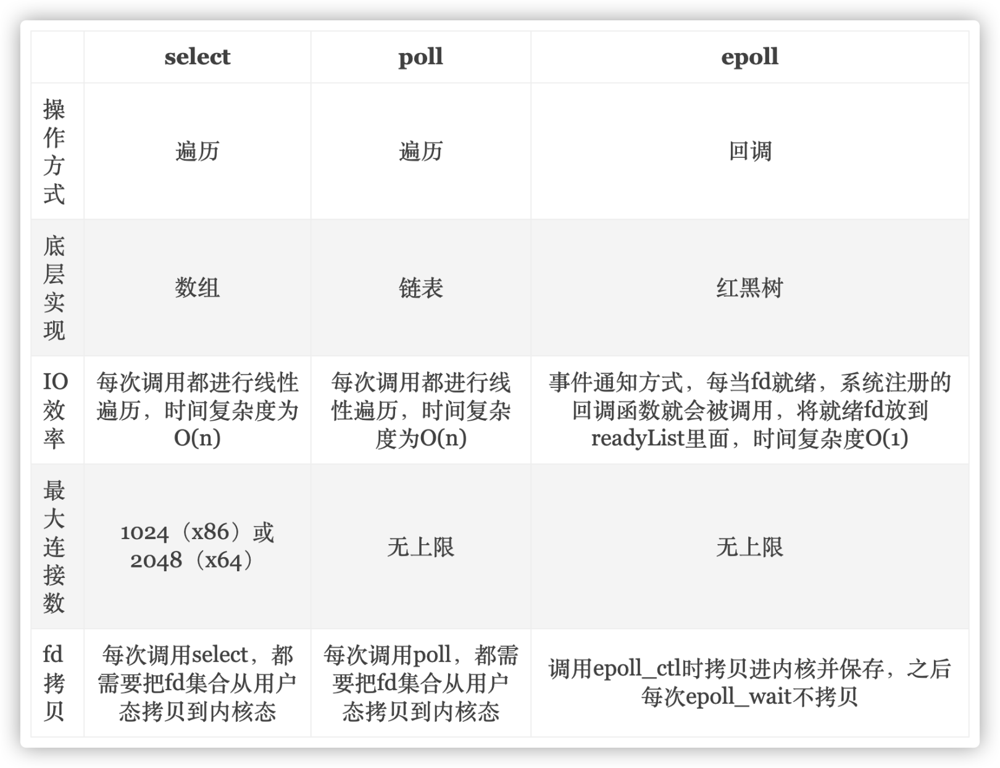

[TOC]


# 算法与数据结构

## 排序

* 选择排序

* 冒泡排序

* 插入排序，

  交换相邻元素，减少逆序对

* 希尔排序

  批量交换不相邻元素，减少逆序对

* 归并排序

* 快速排序

  * 提前shuffle()打乱数组，提升效率
  * 小数组可优化成插入排序
  * 三数取中作为切分元素，提升效率
  * 大量重复元素数组，可三向切分数组为小于、等于、大于切分元素
  * 基于partition()的快速选择算法，找出数组第K个元素

* 堆排序

  * 堆特性
    * 堆中节点值总是大于/小于其节点值，且是完全二叉树
    * 用数组表示则对于K节点(索引从1开始)，父节点索引为K/2，子节点索引为2K、2K+1
    * 节点通过下沉与上浮调整到合适的位置
    * 堆插入元素，将新元素放到堆末尾，之后上浮到合适位置
    * 堆删除元素，弹出堆顶元素，将堆最后一个元素放到堆顶，之后下沉到合适位置
  * 堆排序过程
    * 构建堆
      * 从左到右遍历数组元素，不断进行上浮操作
      * (推荐)从右到左遍历数组元素，不断进行下沉操作，忽略叶子节点则仅需遍历一半元素

* 排序算法比较

  |       算法       | 稳定性 |          时间复杂度          | 空间复杂度 |           备注           |
  | :--------------: | :----: | :--------------------------: | :--------: | :----------------------: |
  |     选择排序     |   ×    |              N2              |     1      |                          |
  |     冒泡排序     |   √    |              N2              |     1      |                          |
  |     插入排序     |   √    |            N ~ N2            |     1      | 时间复杂度和初始顺序有关 |
  |     希尔排序     |   ×    | N 的若干倍乘于递增序列的长度 |     1      |      改进版插入排序      |
  |     快速排序     |   ×    |            NlogN             |    logN    |                          |
  | 三向切分快速排序 |   ×    |          N ~ NlogN           |    logN    |   适用于有大量重复主键   |
  |     归并排序     |   √    |            NlogN             |     N      |                          |
  |      堆排序      |   ×    |            NlogN             |     1      |    无法利用局部性原理    |

* Java排序算法实现

   java.util.Arrays.sort()，基本类型数组采用三向切分的快速排序，引用类型采用归并排序

## 栈

* 基本方法

  push(T)，pop()，isEmpty()，size()

* 数组实现

  维护存储元素的数组和元素数量值

* 链表实现

  头插法，维护头指针指向入栈和出栈元素，保证先入后出

## 队列

* 基本方法

  add(T)，remove()，isEmpty()，size()

* 链表实现

  维护头指针和尾指针

  尾插法，头指针指向出队元素，尾指针指向入队元素


# 计算机网络

## 物理层

* 单工(单向)、半双工(双向交替)、全双工(双向同时)通信

## 链路层

* 将网络层的IP数据包，添加首部和尾部，封装成帧传输

* MAC地址是链路层地址，用于标识网络适配器(无线/有线)

## 网络层

#### IP协议

* IP数据包

  * 首部

    版本(IPv4/IPv6)、首部长度、总长度、生存时间(路由器跳数TTL)、上层数据协议(ICMP/TCP/UDP)、首部校验和

    源地址，目标地址

  * 数据部分

* IP地址

  网络号，(子网号)主机号

* IP协议配套相关协议

  * ARP，地址解析协议

    解析IP地址得到MAC地址，通过主机的ARP高速缓存一个IP到MAC的映射表

  * ICMP，网际控制报文协议

    有效转发IP数据包和提高交付成功机会

    PING、Traceroute 

  * IGMP，网际组管理协议

#### 路由选择协议

* 自治系统内部的路由选择协议
  * RIP，基于距离向量，转发一次距离加1，到15为不可达
  * OSPF，基于最短路径优先
* 自治系统外部的路由选择协议
  * BGP，边界网关协议，基于系统配置的BGP发言人确定路由路径

## 传输层

#### UDP

* 无连接、尽最大可能交付、支持多对多，面向报文
* 对于应用程序报文不拆分，直接添加伪首部和UDP首部，包含源端口、目的端口、长度、检验和

#### TCP

* 面向连接、可靠交付、流量控制、拥塞控制、全双工通信、一对一、面向字节流
* TCP首部，包含源端口、目的端口、序号、确认号、数据便宜、标识(ACK/SYNC/FIN)、窗口(流量控制)
* 三次握手
  * 客户端，SYN=1，seq=x
  * 服务端，SYN=1，ACK=1，seq=y，ack=x+1
  * 客户端，ACK=1，seq=x+1，ack=y+1
* 四次挥手
  * 客户端，FIN=1，seq=u
  * 服务端，ACK=1，seq=v，ack=u+1
  * 服务端数据传输
  * 服务端，FIN=1，ACK=1，seq=w，ack=u+1
  * 客户端，ACK=1，seq=u+1，ack=w+1
* 可靠传输，超时重传保证
* 滑动窗口，发送方和接收方缓存字节流，保证按序接收
* 流量控制，接收方确认报文中的窗口字段可以控制发送方窗口大小，从而控制发送方发送速率
* 拥塞控制，发送方维护拥塞窗口(cwnd)变量控制发送多少数据
  * 慢开始，每次发送加倍的报文数量，1,2,4,8
  * 拥塞避免，到达阈值(ssthresh)，每次发送加一的报文数量，8,9,10,11
  * 超时，ssthresh=cwnd/2，重新执行慢开始
  * 快重传，发送方收到三个重复确认得知下一个报文丢失，立即重传下一个报文
  * 快恢复，快重传后，ssthresh=cwnd/2，cwnd =ssthresh，进入拥塞避免

## 应用层

#### DNS

域名解析协议，提供域名和IP地址的转换

#### FTP

文件传送协议

* 控制连接，客户端主动与服务端21号端口建立连接
* 数据连接
  * 服务端主动，客户端与服务端20号端口建立连接
  * 客户端主动，客户端与服务端随机端口建立连接

#### DHCP

动态主机配置协议，客户端请求DHCP服务器，自动配置IP地址、子网掩码、网关IP等信息

#### TELNET

远程登录协议

#### SMTP/POP3/IMAP

电子邮件协议

* 发送协议，SMTP
* 接收协议
  * POP3，客户端读取服务器邮件并删除
  * IMAP，客户端与服务端邮件保持同步，不会自动删除

#### 常用协议总结

| 域名解析         | DNS    | 53      | UDP/TCP | 长度超过 512 字节时使用 TCP |
| ---------------- | ------ | ------- | ------- | --------------------------- |
| 动态主机配置协议 | DHCP   | 67/68   | UDP     |                             |
| 简单网络管理协议 | SNMP   | 161/162 | UDP     |                             |
| 文件传送协议     | FTP    | 20/21   | TCP     | 控制连接 21，数据连接 20    |
| 远程终端协议     | TELNET | 23      | TCP     |                             |
| 超文本传送协议   | HTTP   | 80      | TCP     |                             |
| 简单邮件传送协议 | SMTP   | 25      | TCP     |                             |
| 邮件读取协议     | POP3   | 110     | TCP     |                             |
| 网际报文存取协议 | IMAP   | 143     | TCP     |                             |

#### Web页面请求过程

* DHCP配置主机信息
* ARP解析MAC地址
* DNS解析域名
* HTTP请求页面

## HTTP

#### 报文结构

* 请求报文
  * 请求方法，URL，协议版本
  * 首部Header
  * 内容Body
* 响应报文
  * 协议版本，状态码，描述
  * 首部Header
  * 内容主体Body

#### 请求方法

GET，HEAD，POST，PUT，PATCH，DELETE，OPTIONS，CONNECT，TRACE

#### 常见状态码

* 100 Continue ，请求正在处理
* 200 OK，请求处理完毕
* 204 No Content，响应头部不返回数据
* 206 Partial Content，范围请求响应Content-Range指定的实体范围
* 301 Moved Permanently，永久重定向
* 302 Foound，临时重定向
* 400 Bad Request，请求报文存在语法错误
* 401 Unauthorized ，用户认证失败
* 403 Forbidden，拒绝请求
* 404 Not Found，请求资源不存在
* 500 Internal Server Error，服务器内部错误
* 503 Service Unavailable，服务器暂时不可用

#### 具体应用

* ##### 长连接

  建立一次TCP连接可进行多次HTTP通信

  * HTTP/1.1以前默认短连接，可指定Connection：Keep-Alive使用长连接
  * HTTP/1.1默认长连接，可指定Connection：close断开连接

* ##### 流水线

  默认HTTP请求是串行的，响应后才能发起下一个请求

  流水线可在同一条长连接上连续发送请求

* ##### Cookie

  HTTP协议是无状态的，HTTP/1.1引入Cookie保存状态信息，如用户会话、数据、个性化设置、行为跟踪

  如今浏览器可用Web storage API或IndexedDB存储状态数据

  客户端通过服务端响应报文的Set-Cookie字段设置Cookie，相关属性如下

  * Key=Value
  * Expires/max-age，指定持久性Cookie，否则Cookie在浏览器关闭后自动删除
  * Domain，作用域，默认当前域名(不包含子域名)
  * Path，携带Cookie的请求URL
  * HttpOnly，不能被JS调用，防止XSS攻击
  * Secure，Cookie会被HTTPS协议加密后传送

* ##### 请求缓存

  HTTP/1.1通过Cache-Control控制缓存

  * no-store，禁止缓存
  * no-cache，确认资源有效后响应缓存
  * private/public，资源作为私有/公共缓存
  * Expires/max-age，缓存资源有效期

* ##### 内容编码

  常见压缩算法，gzip、compress、deflate、identity

  客户端发送Accept-Encoding指定支持的压缩算法

  服务端发送Content-Encoding告知客户端采用的压缩算法

* ##### 范围请求

  客户端只请求服务端的部分数据，如断网导致数据中断

  * 客户端

    Range首部指定请求范围，如bytes=0-1023

  * 服务端

    Accept-Ranges首部表示能否支持范围请求，bytes-支持，none-不支持

    状态码，200-不支持，206-支持，416-范围请求越界

* ##### 分块传输

  Transfer-Encoding：chunked

* ##### 多部分对象集合

  报文主体可含多种类型的数据，每个部分用boundary字段定义的分隔符分隔，每部分都有首部

  ```
  Content-Type: multipart/form-data; boundary=AaB03x
  
  --AaB03x
  Content-Disposition: form-data; name="submit-name"
  
  Larry
  --AaB03x
  Content-Disposition: form-data; name="files"; filename="file1.txt"
  Content-Type: text/plain
  
  ... contents of file1.txt ...
  --AaB03x--
  ```

#### HTTPS

HTTP->SSL->TCP，具备三大特性

* ##### 加密，秘文通信，防窃听

  混合加密机制，非对称加密传输对称加密的秘钥，后续用对称加密进行通信，保证效率

* ##### 认证，验证通信方身份，防伪装

  服务端向数字证书认证机构(CA)申请公钥和数字签名，即为证书

  通信时，服务端用私钥加密数据哈希值生成签名，数据、签名、证书传输给客户端

  客户端先通过证书验证服务端的合法性，之后用证书的公钥解密签名，获取的哈希值与数据的哈希值一致则认证通过

  

* ##### 完整性保护，防篡改报文

  结合加密与认证，在签名内放入报文的MD5摘要

#### HTTP/1.1新特性

长连接，流水线，并发打开多个TCP连接，状态码100，支持分块传输，新增缓存处理指令max-age

#### GET和POST的区别

* 参数，GET参数在URL中仅支持ASCII编码，POST参数在Body中支持标准字符集
* 安全(只读)，GET不引起服务器状态改变
* 幂等，GET连续调用服务端结果一致，POST连续调用服务端增加多条记录
* 缓存，GET可缓存，POST一般不可缓存

## Socket

#### I/O模型

对于I/O操作一般有两个阶段

* Application调用IO，等待数据准备，如套接字上复制网络数据到内核的缓冲区中
* Kernel从内核向进程复制数据，即将数据从内核缓冲区复制到应用进程的缓冲区

Unix有五种I/O模型

* 阻塞式I/O

* 非阻塞式I/O，轮询(polling)

* I/O多路复用/事件驱动I/O

* 信号驱动I/O，内核发送SIGIO信号通知应用复制数据

* 异步I/O，内核通知进程I/O完成

#### I/O多路复用

一种系统内核缓冲I/O数据机制，单个进程可以监视多个文件描述符(file/socket/pipe)，一单某个描述符就绪，可以通知程序进行相应读写操作

Linux提供的实现方式




# 操作系统

后续


# 数据库

后续


# Java基础

#### 基本数据类型

* 大小(bit)

  - byte/8
  - char/16
  - short/16
  - int/32
  - float/32
  - long/64
  - double/64
  - boolean/~，JVM编译时将其转换成int(1-true,0-false)，boolean数组则通过byte数组实现

* 包装类，自动拆箱装箱

* 缓存池

  自动装箱时(valueOf)若值在缓存池范围内，则引用相同对象，基本类型的缓存池范围如下

  * boolean，true/false
  * byte，all
  * short，[-128，127]
  * int，[-128，127]，Java1.8可通过AutoBoxCacheMax指定上界
  * char，[\u0000，\u007F]

#### String

* 源码分析

  * char[]，字符数组存储，Java9改用byte[]
  * final，不可变
    * 对象的hash值不变，可缓存
    * 线程安全
    * StringPool优化
    * 县城安全

* StringBuffer，可变，线程安全，内部采用synchronized同步

* StringBuiler，可变，非线程安全

* SrtingPool，字符串常量池，保存着所有字符串的字面量，存放在堆中

  * 编译时确定，如String s = "aaa";
  * String.intern()添加，如new String("aaa").intern();

* new String("abc")

  * 编译时在StringPool创建字符串对象original，指向"abc"字面量
  * original作为参数传递到构造函数，创建新的字符串对象，指向同一个value数组

  ```java
  public String(String original) {
      this.value = original.value;
      this.hash = original.hash;
  }
  ```

#### Static初始化顺序

- 父类（静态变量、静态语句块）
- 子类（静态变量、静态语句块）
- 父类（实例变量、普通语句块）
- 父类（构造函数）
- 子类（实例变量、普通语句块）
- 子类（构造函数）

#### Object通用方法

* equals()，比较对象是否等价，流程如下

  * 检查是否为同一个对象的引用
  * 检查是否为同一类型
  * 判断每个成员变量是否相等

* hashCode()，返回对象的散列值，不重写默认返回内存地址

  在集合或HshMap中，可依据hashCode快速查找对象位置

* clone()，拷贝对象，实现Cloneable接口，重写clone()方法

  * 浅拷贝，拷贝对象和原始对象的引用类型引用同一个对象
  * 深拷贝，拷贝对象和原始对象的引用类型引用不同对象
  * Effective Java建议用，构造函数或拷贝工厂，拷贝对象

#### 重写(Override)调用顺序

本类对应方法，父类对应方法，参数转成父类型后重复以上过程

- this.func(this)
- super.func(this)
- this.func(super)
- super.func(super)

#### 反射

运行时动态获取类的信息，用于开发各种通用框架，有性能损耗和安全问题

* 获取Class对象，如Class.forName(path)，int.class，str.getClass()
* 获取Method对象并调用，getMethod()，method.invoke()
* 获取Fieldu对象，getField()
* 创建新对象，Constructor.newInstance()

#### 异常

* Error，JVM异常
* Exception，应用程序异常
  * RuntimeException，非受检异常，程序逻辑错误引起，如空指针、数组越界
  * 受检异常，编译时try-catch处理，可以恢复


#### 泛型

编译时不指定类型，创建对象或调用方法时才明确类型

* 类型擦除实现，编译时会将泛型类型转换成原始类型
* 限定通配符和非限定通配符，规定类型的上界和下界，如<? extends T>和<? super T>

#### 注解

附加在代码中的一些元信息，用于辅助工具或框架的使用，如生成文档、配置参数、编译格式检查(override)

* @Retention，注解生命周期，如SOURCE编译阶段注解，CLASS类加载注解，RUNTIME运行时注解
* @Target，注解标识对象，如FIELD成员变量，METHOD方法，PARAMETER参数等
* @Inherited，注解是否允许子类继承
* @Documented，是否将注解包含在JavaDoc中

#### Java7/8新特性

**Java SE 8**

1. Lambda Expressions
2. Pipelines and Streams
3. Date and Time API
4. Default Methods
5. Type Annotations
6. Nashhorn JavaScript Engine
7. Concurrent Accumulators
8. Parallel operations
9. PermGen Error Removed

**Java SE 7**

1. Strings in Switch Statement
2. Type Inference for Generic Instance Creation
3. Multiple Exception Handling
4. Support for Dynamic Languages
5. Try with Resources
6. Java nio Package
7. Binary Literals, Underscore in literals
8. Diamond Syntax


# Java容器

Collection和Map组成，Collection存储对象的集合，Map存储对象的映射表

#### Collection

* Set
  * TreeSet，红黑树实现，支持有序性操作，查找效率O(logN)
  * HashSet，哈希表实现，支持快速查找，不支持有序性操作
  * LinkedHashSet，双向链表实现，支持快速查找和有序性操作
* List
  * ArrayList，动态数组实现，支持随机访问，线程不安全
  * Vector，类似ArrayList，但是线程安全的
  * LinkedList，双向链表实现，支持顺序访问和快速插入删除，可用作栈、队列和双向队列
* Queue
  * LinkedList
  * PriorityQueue，堆结构实现，可用作优先队列(大顶/小顶堆)

#### Map

* TreeMap，红黑树实现
* HashMap，哈希表实现，线程不安全
* HashTable，类似HashMap，但是线程安全的
* ConcurrentHashMap，类似HashMap，分段锁保证线程安全
* LinkedHashMap，双向链表实现，支持顺序访问或LRU访问

#### 相关设计模式

* 迭代器模式，Collection继承Iterable接口，可迭代遍历元素
* 适配器模式，java.util.Arrays#asList()可以将数组转换为List

#### List相关源码分析

##### ArrayList

* 快速随机访问

  实现RandomAccess接口，标识支持快速随机访问(for)，而不用迭代器访问

* 数组扩容

  默认容量为10，扩容大小为oldCapacity + (oldCapacity >> 1)

  调用Arrays.copyOf()将原数组复制到新数组中

* 删除元素

  调用System.arraycopy()将后续元素复制到删除元素的位置上

* 序列化

  实现了Serializable接口，transient 标识不会序列化整个数组

  重写了writeObject()和readObject()控制只序列化数组中有元素的部分

* 快速失败(Fail-Fast)

  modCount记录数组结构变化次数，序列化或遍历时modCount改变会抛出异常快速失败

##### Vector

* 线程安全

  add()/get()等函数采用synchronized进行同步

* 数组扩容

  构造时可指定capacityIncrement参数，表示每次扩容时容量增长倍数，默认为0，即为2倍扩容

##### CopyOnWriteArrayList

* 读写分离

  读操作在原数组进行，写操作在复制数组上进行

  * 内存占用大，写操作时需要复制新数组
  * 数据不一致，读操作不能读取到实时写入的数组

* 线程安全

  写操作时加锁(ReentrantLock )，防止并发写入，保证线程安全

##### LinkedList

* 基于双向链表实现，不支持随机访问，支持快速插入删除元素

##### Sorted/NavigableSet/TreeSet/ConcurrentSkipListSet

* 继承关系

  Set->SortedSet(接口)->NavigableSet(接口)->TreeSet/ConcurrentSkipListSet(实现类)

* SortedSet(JDK 1.2)

  拓展了Set并提供元素排序(比较)功能，元素需实现Comparable接口

* NavigableSet(JDK 1.6)

  拓展了SortedSet并提供针对给定搜索目标返回最接近匹配项的导航方法

* TreeSet

  底层用TreeMap实现，支持自然排序和自定义排序(Comparator)

  非线程安全，可用Collections.synchronizedSet包装成线程安全

  添加重复元素，不会抛异常，新元素不会替换就元素

  TreeMap采用红黑树存储和排序数据

#### Map相关源码分析

##### HashMap

* 内部结构，拉链法

  Entry<K,V>[]，Entry存储着键值对、hashCode和下一个Entry的指针

  拉链法解决哈希冲突，同一个链表中存放这hashCode和散列桶取模相同的Entry键值对

* 插入操作

  key=null的键值对存储在下标为0的桶中

  计算key的hashCode，对桶个数取模，确定桶下标，头插法存入

* 扩容操作

  扩容数组大小为capacity*2，将键值对重新计算桶下标，放入新桶中

* 数组容量计算

  构造函数传入的容量若不是2的次方，会自动转化成2的n次方

##### ConcurrentHashMap

* 线程安全

  采用默认16个基于ReentrantLock的分段锁Segment，多线程可同时访问不同分段锁上的桶

  * JDK 1.8采用CAS操作支持更高并发度，CAS失败则使用内置锁synchronized

* 键值对个数

  每个Segment维护count变量记录对应桶上的键值对个数，size()操作需要遍历累加所有Segment的count

##### LinkedHashMap

* 内部结构

  双向链表，维护插入顺序或LRU顺序

* LRU缓存

  ```java
  class LRUCache<K, V> extends LinkedHashMap<K, V> {
      // 设置最大缓存空间
      private static final int MAX_ENTRIES = 3;
  
      // 重写removeEldestEntry方法 节点数多于MAX_ENTRIES时 移除最近最久未使用数据
      protected boolean removeEldestEntry(Map.Entry eldest) {
          return size() > MAX_ENTRIES;
      }
  
      LRUCache() {
          // 构造函数第三个参数将accessOrder设置为true 维护LRU顺序
          super(MAX_ENTRIES, 0.75f, true);  
      }
  }
  ```

##### WeakHashMap

* 继承自WeakReference，关联的对象下一次GC时会被回收
* ConcurrentCache，Tomcat实现的分代缓存
  * eden，ConcurrentHashMap 实现，放入不被回收的常用对象
  * longterm，WeakHashMap实现，放入会被回收的老对象

#### JDK 1.7/1.8 的HashMap不同实现

* 存储方式不同
  * JDK1.7，数组+链表
  * JDK1.8，数组+链表，链表长度>8时，转换成数组+红黑树

* 插入方式不同
  * JDK1.7，采用单链表头插法，逆序且可能导致环形链表死循环问题(多线程并发执行put触发扩容行为)
  * JDK1.8，采用红黑树尾插法，避免逆序和环形链表
* 扩容后桶下标计算
  * JDK1.7，hashCode() -> 扰动处理 -> 桶长度取模(位运算)
  * JDK1.8，高低位，原位置 or 原位置 + 旧容量


# Java并发

#### 并发概念

并发优势

* 充分利用多核CPU的计算能力
* 方便进行业务拆分，提升应用性能

并发劣势

* 上下文切换线程消耗资源
* 线程安全问题

相关概念

* 同步/异步

  指方法调用，调用者调用同步方法会阻塞，调用者调用异步方法可继续执行代码

* 并发/并行

  指多个任务是否真正意义上的同时进行，并发是切换时间片执行，并行是多核CPU同时执行多个任务

* 阻塞/非阻塞

  指线程获取临界区资源的相互影响

#### 线程概念

##### 构造线程

* 实现Runnable接口，构造Thread
* 实现Callable接口
  * 线程池submit()
  * 封装成FutureTask，构造Thread
* 继承Thread类，构造Thread

##### 线程状态转换和相关操作

* Thread.yield()

  切换线程，静态方法，让出CPU时间片给优先级相同的线程执行

* thread.interrupted()

  中断线程，实例方法，线程处于运行、阻塞、等待状态时会抛出InterruptedException异常从而结束线程，但不能中断I/O阻塞和synchronized锁阻塞

* Thread.sleep()

  休眠线程，静态方法，不会释放对象锁，休眠结束后获取到CPU时间片可继续执行

* thread.join()

  挂起线程，等待其他线程执行完毕，实例方法

* Object.wait()/notify()/notifyAll()

  挂起线程等待，实例方法，会释放对象锁，只能在同步方法中使用(否则死锁)，其余线程执行notify()可唤醒挂起线程

* Lock/Condition.await()/signal()/signalAll()

  挂起线程等待条件，直到条件满足signal()唤醒线程，相比于wait()/notify()可在lock()代码块内使用，较为灵活


#### JMM(Java内存模型)和相关特性

所有变量都存储在主内存中，每个线程只能操作自己的工作内存中的主内存拷贝副本变量，相关操作如下


具备三大特性

* 原子性

  JMM保证每个单独的内存操作，如load、assign、store、lock等，具备原子性

  但JMM允许JVM将没有被volatile修饰的64位数据(long/double)的读写操作划分为两次32位操作进行

  * 实现方式
    * 运用AtomicInteger相关类保证多个线程修改变量操作的原子性
    * synchronized，对应内存操作为lock/unlock，JVM实现对应的字节码指令为monitorenter/monitorexit

* 可见性

  线程能够立即得知共享变量的值被其余线程改变

  JMM通过修改共享变量后立即同步回主内存，读取共享变量前从主内存刷新值来保证可见性

  * 实现方式
    * volatile
    * synchronized，对变量执行unlock操作前会强制将变量值同步回主内存
    * final，常量构造并初始化完成后，所有线程都对其可见
    * happens-before原则

* 有序性

  在本线程内观察，所有操作都是有序的

  但JMM允许编译器和处理器对指令重排序，可能影响多线程并发执行的正确性

  * 实现方式
    * volatile，会添加内存屏障禁止指令重排序，即内存屏障后的指令不能重排序到内存屏障前
    * synchronized，保证同一时刻只有一个线程执行同步代码
    * happens-before原则

* happens-before原则

  JMM对内存可见性的保证和对编译器和处理器重排序的约束

  happens-before前后的两个操作不会被重排序且后者对前者的内存可见

  * **单一线程(Single Thread rule)**

    同一线程，前面操作 happens-before 后面的操作

  * **监视器锁(Monitor Lock Rule)**

    同一监视器锁，unlock操作 happens-before lock操作

  * **Volatile变量(Volatile Variable Rule)**

    同一Volatile修饰变量，写操作 happens-before 读操作

  * **线程启动(Thread Start Rule)**

    同一线程，start() happens-before 线程其他操作

  * **线程加入(Thread Join Rule)**

    线程对象的结束 happens-before join()方法的返回

  * **线程中断(Thread Interruption Rule)**

    线程interrupt() happens-before 被中断线程检测中断interrupted()

  * **对象终结(Finalizer Rule)**

    对象初始化完成 happens-before 其finalize()的调用

  * **传递性(Transitivity)**

    A happens-before B，B happens-before C，则A happens-before C

#### 线程安全的实现方式

* 不可变对象(Immutable)，多线程处于一致状态

  final，String，枚举，Number部分子类(Long/Double/BigInteger/BigDecimal)，不可变集合类(Collections.unmodifiableXXX())

* 互斥和同步策略(悲观锁)，阻塞线程，串行执行

  synchronized，ReentrantLock

* 非阻塞同步策略(乐观锁)，不断重试直到成功

  CAS，硬件支持检测和冲突这两个操作具备原子性

  AtomicInteger，实质也是调用Unsafe类的CAS操作

  AtomicStampedReference，带有标记的原子类，避免ABA问题

* 无同步方案，不操作共享变量

  局部变量，保存在每个线程独有的虚拟机栈中，不共享

  线程本地存储(Thread Local Storage)，如Web交互中一个请求对应一个服务器线程

  可重入代码(Reentrant Code)，进程不可修改，不依赖堆上数据和公用的资源

#### Java互斥同步实现

* synchronized，JVM实现，可同步对象的代码块、对象的方法、整个类、类的静态方法

* ReentrantLock，JDK实现(JUC包)

* 比较

  * JVM和JDK实现

  * 新版synchronized进行了锁优化，性能与ReentrantLock大致相同

    * (自适应)自旋锁，线程请求共享数据锁失败时先自旋(忙循环)一段时间，若能获取锁就可避免阻塞，减少阻塞开销

    * 锁消除，消除不存在竞争的共享数据的锁，逃逸分析

    * 锁粗化，将锁的范围拓展至整个操作序列，避免序列的连续操作反复对同一个对象加锁和解锁

    * 轻量级锁(lightweight locked)，先采用CAS操作进行同步，失败再膨胀成重量级锁

    * 偏向锁(biasble)，解决无竞争下的锁性能问题，线程持有锁后多次调用可以避免CAS操作，有锁竞争时JVM消除偏向状态恢复至未锁定或轻量级锁状态

      

  * synchronized不可中断，ReentrantLock可中断

  * synchronized是非公平锁，ReentrantLock默认非公平锁，也支持公平锁

  * ReentrantLock可同时绑定多个Condition对象，较灵活

  * synchronized无死锁问题，JVM会确保锁释放

#### Java并发编程组件

* AQS，多线程访问共享资源的同步器框架

  * 核心属性

    * volatile int state，共享资源
    * FIFO双向链表队列，获取资源失败的线程会被封装成Node放入等待队列中
      * Node.waitStatus，标识Node的状态值
        * 1，取消调度，线程timeout或中断
        * 0，新节点入队状态
        * -1，后继节点在等待当前节点唤醒
        * -2，节点在等待Condition
        * -3，共享模式下，当前节点可能需唤醒多个后继节点

  * 核心方法

    AQS定义两种资源共享方式，自定义同步器仅需实现对应方法即可

    * Exclusive(独占模式)，实现tryAcquire和tryRelease，如ReentrantLock
    * Share(共享模式)，实现tryAcquireShared和tryReleaseShared，如CountDownLatch/Semaphore
    * Exclusive+Share，同时实现两种模式，如ReentrantReadWriteLock

  * 核心源码解析

    * acquire(int)
      * tryAcquire()，非公平锁体现，先尝试获取锁
      * addWaiter()，获取锁失败，封装线程插入阻塞队列队尾(CAS)
      * acquireQueued()，自旋阻塞，调用park()进入waiting状态，等待unpark()/interrupt()唤醒，获取资源
    * release(int)
      * tryRelease()，释放锁
      * unparkSuccessor()，调用unpark()唤醒队首非取消调度的线程
    * acquireShared(int)，类似acquire(int)流程，只是在被唤醒后，若资源有剩余会唤醒后继节点
    * releaseShared()，类似release(int)

* CountDownLatch，控制一个或多个线程等待多个线程

  初始化计数器值，等待线程调用await()，执行线程调用countDown()减少计数器值，计数器值为0时会唤醒所有等待线程

* CyclicBarrier，控制多个线程相互等待，一起执行

  初始化计数器值，多个线程调用await()同时会减少计数器值，计数器z值为0时会唤醒所有等待线程继续执行

  计数器可通过reset()循环使用，也称作循环屏障

* Semaphore，类似信号量，控制同时对互斥资源访问的最大线程数

  初始化信号量，acquire()获取信号量才可以访问资源，release()释放信号量

* FutureTask，存储任务执行状态，异步获取任务结果，取消任务

* BlockingQueue，阻塞队列接口，take()/put()

  * FIFO队列，LinkedBlockingQueue，ArrayBlockingQueue(固定长度)
  * 优先队列，PriorityBlockingQueue

* ForkJoin和ForkJoinPool，可拆分的并行任务(fork()/join())和基于工作窃取算法的线程池

#### 并发编程良好实践

* 线程具备可读性强的命名
* 缩小同步范围，减少锁争用，如synchronized尽量同步代码块而不是方法或类
* 控制多线程执行，多用同步工具(CountDownLatch/CyclicBarrier)，少用wait()/notify()
* BlockingQueue实现消费者生产者问题
* 多用并发集合(ConcurrentHashMap)，少用同步集合(Hashtable)
* 多用局部变量和不可变对象，保证线程安全
* 多用线程池，少直接创建线程


# Java虚拟机

#### 内存模型

* 线程内存

  * 程序计数器，记录正在执行的虚拟机字节码指令地址

  * Java虚拟机栈

    存储每个方法调用的栈帧，每个栈帧包含局部变量表、操作数栈、常量池引用等

    -Xss参数可指定每个线程的Java虚拟机栈内存大小，默认为1M

    方法递归调用过多可能引起StackOverflowError或OutOfMemoryError异常

  * 本地方法栈，存储Native方法调用的栈帧

* 虚拟机内存

  * 堆

    所有对象分配内存的区域，GC的主要区域

    -Xms和-Xmx可指定程序的堆内存的初始值和最大值

    动态增加内存失败会引起OutOfMemoryError异常

  * 方法区

    存放已加载的类信息、常量、静态变量等

    动态增加内存失败会引起OutOfMemoryError异常

    * JDK 1.8前，当作永久代，难以进行GC
    * JDK 1.8后，移至元空间(本地内存)，存储类的元信息，常量和静态变量等放入堆中

* 直接内存

  JDK 1.4 引入的NIO类可运用Native函数直接分配堆外内存


#### 垃圾收集

作用于堆和方法区

* 垃圾辨别

  * 引用计数法，循环引用导致失效
  * 可达性分析，从GC Roots开始不可达的对象可被回收
  * 方法区回收，永久代居多，主要回收常量和卸载类
    * 反射和动态代理时会加载许多类对象，卸载类可避免内存溢出

* 引用类型

  * 强引用，关联对象不会被回收，如new
  * 软应用，关联对象在内存不足时才会被回收，如SoftReference
  * 弱引用，关联对象在下次GC时一定会被回收，如WeakReference
  * 虚引用，关联对象被回收时收到一个系统通知，如PhantomReference

* 垃圾收集算法

  * 标记清除法，效率低，内存碎片多
  * 标记整理法，将标记的存活对象移动到一起，清除边界以外的内存，移动对象效率低
  * 复制算法，将内存划分成两块，其中一块用完将存活的对象拷贝到另一块，内存使用率低
  * 分代收集，新生代复制算法，老年代标记清除/整理法

* 垃圾收集器

  属性有单线程和多线程，收集垃圾与用户程序串行和并行

  * Serial，单线程串行，Client端新生代默认收集器
  * ParNew，多线程串行，Server端新生代默认收集器
  * Parallel Scavenge，多线程串行，尽可能缩短GC时用户线程停顿时间
  * Serial Old，老年代串行
  * Parallel Old，老年代并行
  * CMS，老年代并行
    * 初始标记，并发标记，重新标记，并发清除
  * G1，将新生代和老年代划分成独立区域一起回收，并行
    * 初始标记，并发标记，最终标记，筛选回收(根据用户期待的GC时间动态回收)

#### 垃圾回收与内存分配策略

* 垃圾回收策略
  * Minor GC，回收新生代
    * Eden空间占满触发
  * Full GC，回收新生代和老年代
    * System.gc()手动调用
    * 老年代空间不足
      * 大对象和长期存活对象过多
      * Minor GC时老年代最大可用的连续空间小于新生代所有对象空间
      * CMS GC时对象放入老年代
* 内存分配策略
  * 新生代Eden
    * 新对象
  * 新生代Servivor
    * Eden中经过Minor GC存活的对象
  * 老年代
    * 占用大量连续内存空间的大对象，如长字符串和数组
    * Servivor中长期存活的对象
    * Survivor中相同年龄对象大小占Survivor空间一半的对象

#### 类加载机制与双亲委派模型

类是在运行期间首次使用时动态加载的

类加载过程

* 加载，通过类的名称获取类的二进制流，转换成运行时存储结构，在方法区生成Class对象
* 验证，Class文件的字节流是否符合虚拟机要求
* 准备，为类的静态变量分配内存，根据类型设置初始值，如int-0，final变量初始化为表达式定义值
* 解析，将常量池符号引用替换为直接引用
* 初始化，执行父类与本类的静态语句和类变量赋值动作，触发时机如下
  * 主动引用，new实例对象/获取类的静态变量或方法/反射调用类/初始化子类
  * 被动引用，不会触发类的初始化
    * 引用父类的静态字段
    * 申明数组引用类
    * 引用类的常量

类加载器

* 启动类加载器(Bootstrap ClassLoader)，负责加载<JRE_HOME>\lib的类
* 拓展类加载器(Extension ClassLoader)，负责加载<JAVA_HOME>/lib/ext的类
* 应用程序类加载器(Application ClassLoader)，负责加载用户类路径(ClassPath)指定的类

双亲委派模型

一个类加载器首先将类加载请求转发到父类加载器，只有当父类加载器无法完成时才尝试自己加载

优点，Java类具备优先级层级关系，统一所有基础类


# Java I/O

后续


# Redis


# 系统设计

#### 系统相关指标及优化策略

* 性能，如响应时间、吞吐量、并发数等
  * 集群，负载均衡分散请求到多台服务器
  * 缓存(CDN)，缓存数据读取较快，避免重复计算，靠近用户的服务器链路短响应快
  * 异步，将操作封装成消息异步处理，加快响应速度
* 伸缩性，指系统应对不断上升的并发访问数和数据存储量的能力
  * 无状态服务器集群，负载均衡提升并发访问数
  * 关系型数据库分库分表(Sharding)，非关系型数据库集群
* 扩展性，添加新功能时对系统其他应用无影响
  * 分布式微服务，将业务和可复用的基础服务解耦
  * 消息队列，应用之间通过消息队列解耦
* 可用性，服务器发生故障的应对能力
  * 冗余，故障转移，应用服务器可采用负载均衡，存储服务器可采用主从切换
  * 监控，对CPU、内存、磁盘、网络等系统负载信息进行监控
  * 服务降级熔断，系统关闭部分功能，保证核心功能可用
* 安全性
  * XSS，跨站脚本攻击，将代码注入到用户浏览的网页上，窃取用户信息
    * 设置Cookie为HttpOnly，JS无法获取Cookie信息
    * 过滤特殊字符
  * CSRF，跨站请求伪造，诱导用户无意识访问认证网站，从而模拟用户操作
    * 检查Referer首部
    * 敏感操作添加校验Token，如表单提交附加随机数
    * 敏感操作输入验证码，提醒用户
  * SQL注入，欺骗服务器拼接非法SQL并执行
    * 参数化查询
    * 引号转换
  * DDOS，拒绝服务攻击，分布式持续请求服务器，耗尽服务器资源，中断服务，导致用户无法访问

#### 分布式系统设计

* 分布式锁，实现多实例进程并发同步

  * 数据库层面，唯一索引保证
  * Redis.SETNX指令，保证原子性
  * Redis.RedLock算法，保证Redis集群发生单点故障仍然可用
  * Zookeeper有序节点

* 分布式事务，事务的操作位于不同实例上，保证事务的ACID特性

  * 2PC，两阶段提交协议

    协调者决定参与者的事务执行流程，准备->提交/回滚，存在同步阻塞、单点故障、网络异常等问题

  * 3PC，三阶段提交协议

    2PC的准备阶段分成两个阶段，引入超时机制，主要解决单点故障和同步阻塞问题

  * 本地消息表

    利用本地事务和业务事务满足事务特性，后通过消息队列保证最终一致性

    

* 分布式理论

  * CAP，分布式系统不可能同时满足CAP原则

    * Consistency，一致性，多个数据副本保持一致
    * Availability，可用性，系统处于高可用状态
    * Partition Tolerance，分区容忍性，系统任何网络区域发生故障，仍对外提供一致性和可用性服务

    主要权衡可用性和一致性

    * CP，保持一致性，多节点数据同步时，未完成同步的节点暂时不可用
    * AP，保持可用性，多节点数据同步时，允许读取所有节点数据但可能不一致

  * BASE，分布式系统可采取适当方式达到最终一致性(非强一致性)

    * Basically Available，基本可用，保证核心可用
    * Soft State，软状态，系统间的数据可存在中间状态，即数据同步存在时延
    * Eventually Consistent，最终一致性，系统数据副本在一段时间后最终能达到一致

* 分布式一致性算法

  * Paxos
  * Raft


# 代码设计


