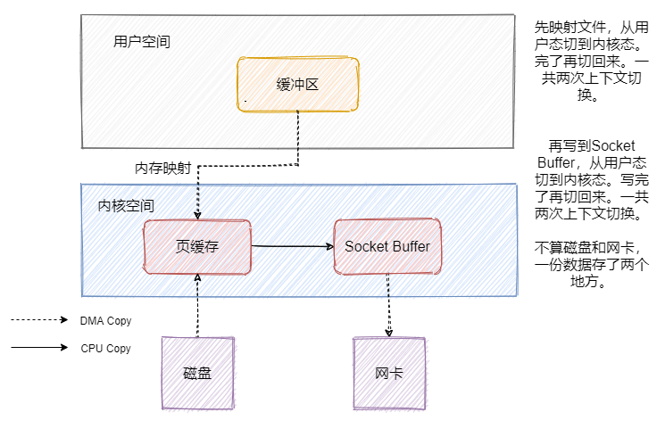
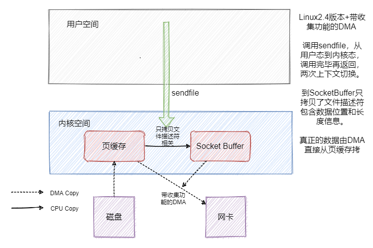
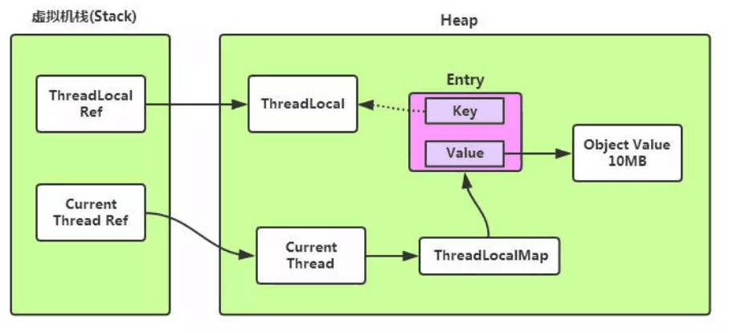
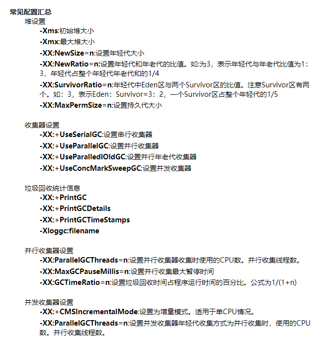
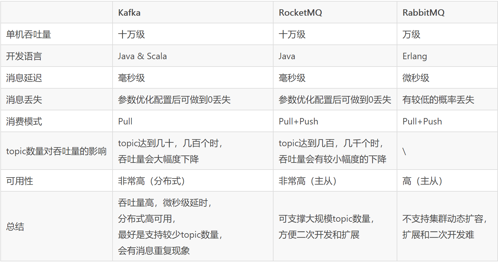

[TOC]


# 算法与数据结构

##### HashMap相关

* 内部数据结构，数组+链表<=>红黑树

  * 链表长度 > 8 & 数组大小  >= 64，链表转换成红黑树
  * 红黑树节点个数 < 6，红黑树转换成链表

* 数据插入原理

  * 数组是否为空，为空则初始化
  * 计算插入key的hash值和存放数组的索引位置
  * 数组无节点，构造节点存储数据
  * 数组有节点，哈希冲突，遍历链表/红黑树，判断key是否相等
    * 相等则替换value
    * 不相等，则创建节点插入链表/红黑树
  * 插入完成判断当前节点数是否大于阈值，大于则扩容

* HashMap初始容量，默认16，若指定大小k，则初始化为大于k的2的整数次方

* 哈希函数设计原则

  * 降低hash碰撞，均匀映射到哈希空间
  * 简单高效

* HashMap的哈希函数实现(扰动函数)

  * key的hashcode(32位)的高16位与低16位进行异或运算

    * 降低hash碰撞，涉及到计算数组索引时需要取模数组大小

      * 哈希值与数组值采用 hash & (n-1)，由于数组大小是2的次方，因此 n-1 相当于是一个低位掩码，仅保留hash值的低位
      * hash值低位可能冲突较大，通过高位与低位异或，即保留了高位的部分特征，也加大了低位的随机性

      

    * 简单高效，位运算

  ```java
  static final int hash(Object key) {
      int h;
      return (key == null) ? 0 : (h = key.hashCode()) ^ (h >>> 16);
  }
  ```

* HashMap JDK 1.8 优化和原因

  * 数组+链表 => 数组+链表+红黑树

    * 防止hash冲突导致链表长度过长，将时间复杂度由O(n)降为O(logn)

  * 头插法 => 尾插法

    * 头插法扩容时会发生链表反转，此时若另一个线程也在插入节点，会造成循环链表(环)

  * 扩容重新计算hash定位元素位置 => 位置不变 或 索引+旧容量大小

    * 扩容数组容量变两倍，相当于低位掩码多了一位1，直接获取节点的原hash，计算hash值在低位掩码新的1的那位的值，若为0则索引不变，若为1则索引增大旧数组容量

      

* HashMap线程安全问题和解决方案

  * 死循环(1.7)，数据丢失(1.7)，数据覆盖(1.7 + 1.8)，同时扩容
  * HashTable，Collections.synchronizedMap，ConcurrentHashMap
    * ConcurrentHashMap成员变量采用volatile修饰避免指令重排序和内存可见性，CAS+synchronized保证线程操作只会锁住当前操作的索引节点

##### 哈夫曼树

构建n个带权值的节点的树，使得这棵树的带权路径长度最小(权值*节点深度)，称为最优二叉树，即哈夫曼树，构建过程如下

1. 在 n 个权值中选出两个最小的权值，对应的两个结点组成一个新的二叉树，且新二叉树的根结点的权值为左右孩子权值的和
2. 在原有的 n 个权值中删除那两个最小的权值，同时将新的权值加入到 n–2 个权值的行列中，以此类推
3. 重复 1 和 2 ，直到所以的结点构建成了一棵二叉树为止，这棵树就是哈夫曼树

特点

* 哈夫曼编码
  * 频率高(权重大)的节点编码短，反之编码长
  * 编码(解码)保证唯一，即短编码与长编码的左起子串不冲突
* 同权不同构造，夫曼树的构造并不是唯一的


10亿个数中如何高效地找到最大的一个数以及最大的第 K 个数

两个 10G 大小包含 URL 数据的文件，最多使用 1G 内存，将这两个文件合并，并找到相同的 URL

使用递归及非递归两种方式实现快速排序

二叉树的层序遍历 (Leetcode)

常用的排序方式有哪些，时间复杂度是多少？

用 Rand7() 实现 Rand10() (Leetcode)

实现 LRU 算法，实现带有过期时间的 LRU 算法

如何随机生成不重复的 10个100 以内的数字？

236. 二叉树的最近公共祖先

从前序与中序遍历序列构造二叉树 (Leetcode)

如何实现大数运算

简述 Redis 集群配置以及基础原理

92. 反转链表 II

反转链表 (Leetcode)

1000 台机器，每台机器 1000个 文件，每个文件存储了 10亿个 整数，如何找到其中最小的 1000个 值？

最长公共子序列 (Leetcode)

链表倒数第K个数 (Leetcode)

用栈实现队列 (Leetcode)

二叉树的锯齿形层次遍历 (Leetcode)

验证回文串 (Leetcode)

合并区间 (Leetcode)

两个文件包含无序的数字，数字的大小范围是0-500w左右。如何求两个文件中的重复的数据？

按序打印 (Leetcode)

165. 比较版本号


# 计算机网络

##### TCP四次挥手为什么要2msl等待时间？

msl，即Maximum Segment Lifetime，报文在网络上存在的最长时间，超时报文将被丢弃

* 保证A发送的最后一个ACK报文能到达B，若丢失B超时重传上一个报文，A等待2msl也会重传最后一个ACK报文
* 保证连接所产生的所有报文段从网络消失，新连接不会出现旧连接请求的报文段

##### DNS的IP查找

域名结构分为，根域名，顶级域名，二级及多级域名

* 本地查询，浏览器缓存和系统Host文件缓存
* 网关查询，路由器缓存和ISP(运营商)缓存
* 本地DNS服务器缓存查询
* 根域名服务器 -> 顶级域名服务器 -> 二级域名服务器的迭代查询

##### HTTP 与 HTTPS 有哪些区别？

* 混合加密传输，密文通信，防窃听
* 证书认证，验证通信防身份，防伪装
* 内容摘要，完整性保护，防篡改

##### 简述 TCP 三次握手以及四次挥手的流程。为什么需要三次握手以及四次挥手？

* 三次握手
  * SYN(1)seq(x)
  * SYN(1)ACK(1)ack(x+1)seq(y)
  * ACK(1)ack(y+1)seq(x+1)
* 四次挥手
  * FIN(1)seq(x)
  * ACK(1)ack(x+1)seq(y)
  * FIN(1)ACK(1)ack(x+1)seq(z)
  * ACK(1)ack(z+1)seq(x+1)
* 四次挥手中二三次挥手不能合并，因为服务端可能还有数据没有发送完成

##### TCP 与 UDP 在网络协议中的哪一层，他们之间有什么区别？

* 传输层(第四层)
* TCP，面向连接，可靠交付，一对一，拥塞/流量控制
* UDP，无连接，尽最大可能交付，可多对多

##### 从输入 URL 到展现页面的全过程

根据建立TCP连接需要源IP端口和目标IP端口的思路

* DHCP配置主机信息，获取源IP(TCP)，DNS服务器IP，默认网关路由器IP
* ARP解析MAC地址，通过默认网关路由器IP获取其MAC地址

* DNS解析域名，通过默认网关路由器发送DNS查询报文，获取域名对应目标IP

* 发送TCP请求，建立连接，发送HTTP请求，获取页面


##### TCP 中常见的拥塞控制算法有哪些？

* 慢启动、拥塞避免、快重传、快恢复

##### DNS 查询服务器的基本流程是什么？DNS 劫持是什么？

* 可结合DHCP、ARP协议，具体DNS的迭代查询可参考DNS的IP查找问题
* DNS劫持，修改域名的DNS解析IP，如谷歌跳转到百度
* HTTP劫持，在和网站的交互过程劫持请求，增加返回错误的响应，如网站小广告

##### Cookie、Session、Token的关系和区别是什么？

* Cookie是客户端保存用户状态一种方式，如用户会话、数据、个性设置等，根据Domain/Path等特点会将Cookie携带至对应请求中，让HTTP请求具备状态
* Session是服务端保存用户会话的方式，可与Cookie结合应用，识别用户身份标识
* Token是服务端用于验证用户身份的方式，将用户相关信息通过密钥加密生成Token，可与Cookie结合应用，验证用户请求，与Session相比较难伪造和减少服务器内存开销

##### 什么是跨域，什么情况下会发生跨域请求？

* 跨域是基于浏览器的同源策略(协议+域名+端口)，非同源的脚本不能调用执行，可保证浏览器安全，避免XSS、Cookie泄漏、CSRF攻击等
* 解决方式，前端采用JSONP(仅支持GET)、代理访问(Nginx)、CORS浏览器与服务器确认是否允许跨域请求

##### 简述 HTTP 1.0，1.1，2.0 的主要区别

* HTTP 1.1，默认长连接，流水线连续请求、Cookie、请求缓存、范围请求、分块传输、多部份对象集合
* HTTP 2.0，多路复用并发请求，Header头部数据压缩，服务端推送

##### TCP 怎么保证可靠传输？

* 超时重传
* 校验和
* 确认应答和序列号，接受窗口按序接收
* 流量控制
* 拥塞控制

##### 什么是 TCP 粘包和拆包？

* TCP是面向字节流的协议，发送TCP数据时从底层套接字缓冲区获取数据发送
  * 粘包，应用程序写入数据小于缓冲区，将多次写入的数据一起发送
  * 拆包，应用程序写入数据大于缓冲区，将数据分开两次发送
* 解决方法
  * 首部添加数据包长度
  * 将每个数据包封装为固定长度，不够补0
  * 数据包之间设置边界，如特殊字符

##### TCP 中 SYN 攻击是什么？如何防止？

* 利用TCP协议三次握手，发送大量半连接请求，即发送第一次连接请求，收到服务端响应后，不发送第三次确认请求，浪费服务器CPU和内存资源
* 解决方法，减小超时时间，SYN网关/代理，SYN Cookie技术

##### 简述 WebSocket 是如何进行传输的

* 应用层协议，依赖HTTP进行握手，通过TCP连接双工传输数据

  * HTTP握手

    ```http
    // 请求
    Upgrade: websocket
    Connection: Upgrade
    Sec-WebSocket-Key: dGhlIHNhbXBsZSBub25jZQ==  // 防止恶意连接
    Sec-WebSocket-Version: 13
    // 响应
    HTTP/1.1 101 Switching Protocols
    Upgrade: websocket
    Connection: Upgrade
    Sec-WebSocket-Accept: s3pPLMBiTxaQ9kYGzzhZRbK+xOo=
    ```

  * TCP双工传输，基于frame形式分片传输，类似http的chunk可以边生成数据边传输

    * 多用户交互，服务端可主动推数据，如聊天室
    * 高实时数据传输，如直播、弹幕


# 操作系统

##### 进程间有哪些通信方式(IPC)？

* 管道，半双工(数据单向流动)，父子进程间运用
* 命名管道FIFO，半双工，可用于任意进程
* 信号(Signal)，通知进程某个事件发生，如子进程通知父进程
* 信号量，锁机制，控制多个进程对共享资源的访问
* 消息队列，存放在内核的消息链表
* 共享内存，映射一段能被多个进程访问的内存，效率高
* 套接字(Socket)，可支持跨网络进程间的通信机制

简述Linux mmap和零拷贝原理

* mmap，文件内存映射

  访问磁盘文件会先将数据加载到页缓存中，再将页缓存数据拷贝到用户空间的缓冲区，程序才可访问

  mmap可直接将程序虚拟页面映射到页缓存中，直接通过映射地址加偏移量进行文件读写

  

* sendfile，零拷贝

  


进程和线程之间有什么区别？

进程间有哪些通信方式？

简述几个常用的 Linux 命令以及他们的功能。

线程有多少种状态，状态之间如何转换

进程有多少种状态？

简述 socket 中 select 与 epoll 的使用场景以及区别，epoll 中水平触发以及边缘触发有什么不同？

Linux 下如何排查 CPU 以及 内存占用过多？

进程通信中的管道实现原理是什么？

Linux 下如何查看 CPU 荷载，正在运行的进程，某个端口对应的进程？

简述 Linux 零拷贝的原理

如何调试服务器内存占用过高的问题？

Linux 如何查看实时的滚动日志？


# 数据库

##### 实战题

如下数据库表

* 会员信息表(member)

  会员ID(uid)，年龄(age)，组织ID(org_id)

* 审批流程表(workflow)

  流程ID(id)，会员ID(uid)，流程创建时间(gmt_create)，流程结束时间(gmt_finish) 

请写出以下需求的SQL代码

1. 使用过审批流程的用户在各年龄段上的人数分布，年龄段包含未成年(0-17)、青年(18-40)、中年(41-65)、老年(大于65)

   ```mysql
   # UNION ALL 方式
   SELECT "未成年(0-17)" AS "年龄分布", COUNT(m.uid) AS "数量"
   FROM member AS m
   LEFT JOIN workflow AS w ON (m.uid = wf.uid)
   WHERE m.age >= 0 AND m.age <= 17
   AND w.id IS NOT NULL
   GROUP BY m.uid
   
   UNION ALL 
   
   SELECT "青年(18-40)" AS "年龄分布", COUNT(m.uid) AS "数量"
   FROM member AS m
   LEFT JOIN workflow AS w ON (m.uid = wf.uid)
   WHERE m.age >= 18 AND m.age <= 40
   AND w.id IS NOT NULL
   GROUP BY m.uid
   ...
   
   # CASE WHEN方式
   SELECT ageGap AS '年龄段', COUNT(*) AS '人数' 
   FROM 
       (SELECT 
           CASE 
           WHEN m.age >= 0 AND m.age <= 17 THEN '未成年(0-17)'
           WHEN m.age >= 18 AND m.age <= 40 THEN '青年(18-40)'
           WHEN m.age >= 41 AND m.age <= 65 THEN '中年(41-65)'
           ELSE '老年(大于65)'
           END AS ageGap
       FROM member AS m
       LEFT JOIN workflow AS w ON (m.uid = wf.uid)
       WHERE w.id IS NOT NULL
       GROUP BY m.uid,m.age) AS ageView
   GROUP BY ageGap
   ```

2. 如果某个uid的审批流程非常多，超过1000万条，如何提升问题1中SQL的执行速度？ 

3. 计算“组织人均审批完成时长”指标，每个人只取最近10条已完成的流程

##### 数据库连接池实现原理

* JDBC直接操作数据库流程

  加载数据库驱动，建立数据库连接，访问数据库执行sql语句闭并处理执行结果，断开数据库连接

  网络层面是，TCP建立连接，MYSQL三次握手认证，执行SQL，MYSQL连接关闭，TCP连接关闭

  缺点，网络IO多，数据库负载高，响应时间长，临时连接对象多(GC频繁)

* 数据库连接池

  * 池化思想，为了最大化收益并最小化风险，而将资源统一在一起管理
  * 数据库连接池，预先申请数据库连接，提升申请连接的速度，降低系统的开销
  * 流程
    * 建立数据库连接池对象，初始化连接【空闲连接数】
    * 对于数据库访问请求，从池中获取连接，若无空闲连接且连接数没有达到【最大连接数】，新建连接，达到最大连接数，将请求访问阻塞队列
    * 执行SQL，返回执行结果，关闭连接，将连接放回池中或释放连接
    * 服务停止，释放数据库连接池对象并释放所有连接
  * 相关实现，dbcp(jdbc)，c3p0，druid
  * Druid配置，DataSource(url/name/pwd)，initialSize/minIdle/maxActive，maxWait(获取连接的最大等待时间，配置后启用公平锁)

* MyBatis操作数据库流程

  * SqlSessionFactoryBuilder读取配置文件构造SqlSessionFactory
  * SqlSessionFactory打开数据库会话构造SqlSession
  * SqlSession的代理实现Executor调度三个组件查询数据库
    * StatementHandler，SQL语句执行器
    * ParameterHandler，SQL入参处理器，参数化查询preparedStatement
      * 预编译，提升查询效率
      * 参数化，动态查询
      * 防止SQL注入，会将用户输入的非法字符用\作转义
    * ResultSetHandler，结果映射器(ORM)，将查询结果映射到POJO中


##### MySQL 为什么使用 B+ 树来作索引，对比 B 树它的优点和缺点是什么？

* 非叶子节点不存放数据只存放索引指针，同一个节点(磁盘页大小)存放更多的索引，树高度更小
* 查询效率稳定，必须查询到叶子节点
* 数据存放在叶子节点并通过链表连接，范围查找、遍历效率、顺序IO效率高
  * 局部性原理和磁盘预读
* 缺点
  * 主键若不是有序递增，新增数据可能导致页分裂，产生数据迁移和空间碎片
  * 写请求的分布仍然是随机的

##### 数据库的事务隔离级别有哪些？各有哪些优缺点？

* 读未提交，读已提交，可重复读，串行化
* 脏读，不可重复读，幻读

##### 简述乐观锁以及悲观锁的区别以及使用场景

* 乐观锁，读频繁场景，CAS/版本号实现
  * 场景限制多，如CAS不能保证多变量的原子性/ABA问题/硬件支持、版本号不适用于多表
* 悲观锁，写频繁场景，锁机制实现
  * 竞争激烈程度限制，竞争不激烈时乐观锁消耗小不影响并发，竞争激烈时乐观锁不断失败浪费CPU资源

##### 简述一致性哈希算法的实现方式及原理

* 将整个哈希值空间组织成一个虚拟的圆环，对于每个数据，根据key计算hash值，确定数据在环上的位置，然后从此位置沿环顺时针行走，找到的第一台服务器就是其应该映射到的服务器
  * 节点数据不平衡问题，可用带虚拟节点的一致性哈希分区，hash->槽->实际节点

##### 简述脏读和幻读的发生场景，InnoDB 是如何解决幻读的？

* 脏读，读取到别的事务未提交的数据
* 幻读，读取到的数据数量不一致
* 采用Next-Lock，包含Record Lock和Gap Lock，锁定数据和数据间隙

什么情况下会发生死锁，如何解决死锁？

##### SQL优化的方案有哪些，如何定位问题并解决问题？

* 常用的SQL语句优化

  * SELECT，指定字段名称
  * WHERE，过滤条件尽量走索引，IN/EXISTS/联表的考虑
  * LIMIT限制条数，合理分页
  * 联表采用小表驱动大表

* 定位解决问题，EXPLAIN执行计划

  * type，表的连接方式，const/eq_ref/ref/range/index/ALL

  * key，索引名

  * rows，预估的扫描行数

  * extra，查询的详细信息

    * Using where，查询的WHERE语句仅用于匹配下一个表

    * Using index，覆盖索引

    * Using temporary

      使用临时表保存结果，一般查询中包含GROUP BY 或ORDER BY子句

    * Using filesort

      ORDERY BY子句无法利用索引完成排序，需要额外遍历重新按排序顺序检索行

    * Using join buffer

      联结表时未使用索引需要连接缓冲区存储中间结果，可添加索引优化

    * Impossible where

      查询的WHERE语句可能导致没有符合条件的行

    * Select tables optimized away

      通过使用索引可能仅从聚合函数结果中返回一行

##### 为什么 Redis 在单线程下能如此快？

* 基于内存实现
* 高效的数据结构，如SDS、双端链表、压缩列表、字典、跳表
* 合理的数据编码，数据类型在不同场景有不同的编码和转换机制
* 合适的线程模型
  * IO多路复用，单线程监听多个套接字，将命令推送到队列中，文件时间分派器复用线程处理

Redis 有几种数据结构？Zset 是如何实现的？

MySQL 的索引什么情况下会失效？

MySQL中 InnoDB 和 MylSAM 的区别是什么？(MySQL 有哪些常见的存储引擎和区别)

什么情况下会发生死锁，如何解决死锁？


简述数据库中什么情况下进行分库，什么情况下进行分表？

Redis 如何实现分布式锁？

简述什么是最左匹配原则

数据库索引的实现原理是什么？

简述 undo log 和 redo log 的作用

简述 Redis 中跳表的应用以及优缺点

数据库查询中左外连接和内连接的区别是什么？

数据库的读写分离的作用是什么？如何实现？

简述 Redis 中如何防止缓存雪崩和缓存击穿

Redis 中，sentinel 和 cluster 的区别和适用场景是什么？


# Java

##### Java SPI(Service Provider Interface)

JDK内置的一种服务提供发现机制，用于加载框架拓展和替换组件

如java.sql.Driver接口，MySQL和PostgreSQL都有不同实现提供给用户

服务提供者将SPI接口的实现配置到META-INF/services/${interface_name} ，JDK的ServiceLoader匹配目录的同类名实现类并加载实例化

* 流程Demo

  ```java
  // SPI接口
  package com.harvie.spi
  public interface HelloSPI {}
  
  // 实现类
  package com.harvie.spi.impl
  public class ImageHello implements HelloSPI{}
  public class TextHello implements HelloSPI{}
  
  // 配置 META-INF/services/com.harvie.spi.HelloSPI.properties
  com.harvie.spi.impl.ImageHello
  com.harvie.spi.impl.TextHello  
      
  // 加载实例化
  ServiceLoader<HelloSPI> serviceLoader = ServiceLoader.load(HelloSPI.class);       
  for (HelloSPI helloSPI : serviceLoader) {}   // 可调用不同实现的实例化方法
  ```

* ServiceLoader特性

  ```java
  // 核心成员变量
  private static final String PREFIX = "META-INF/services/";  // 配置文件目录
  private final Class<S> service;  // 存储要被加载的服务类或接口
  private final ClassLoader loader;  // 加载器
  private LinkedHashMap<String,S> providers = new LinkedHashMap<>();// 存储服务实现类的实例
  private LazyIterator lookupIterator;   // 查找服务的迭代器
  
  // 核心方法 
  LazyIterator.hasNext();  // 查找配置文件的实现类
  // 通过反射方法Class.forName()加载类对象
  // newInstance方法实例化对象保存到providers
  LazyIterator.next();  
  ```

* 不足

  * 资源浪费，不灵活

    默认加载实例化扩展点全部实现

  * 线程不安全，并发线程运用ServiceLoader实例存在并发问题

  * 不支持自动注入和装配

* 关于双亲委派模型

  * ServiceLoader.load(Class<?> clazz)，默认用AppClassLoader加载，不破坏双亲委派模型
  * ServiceLoader.load(Class<?> clazz,ClassLoader classLoader)，可用自定义ClassLoader并重写loadClass方法，可以打破双亲委派模型

##### ThreadLocal

* 主要用作线程数据隔离

* 场景

  Spring采用ThreadLocal实现线程的数据库连接对象的隔离，灵活管理多个事务

  线程跨方法调用的参数传递场景，如Cookie、Session等，解析时将用户信息放在ThreadLocal，要用的时候获取就很灵活方便

* 实现源码

  * ThreadLocal会被分配ThreadLocalKey，从而取模定位到存放ThreadLocalMap位置

  * ThreadLocalMap Hash冲突，填充到数组下个位置

  * ThreadLocal实例和值被线程持有，但还是存放在堆上，通过技巧将可见性修改成了线程可见

  * 可通过inheritableThreadLocals共享父子线程的ThreadLocal数据

  * 内存泄漏问题

    由图可知，ThreadLocalMap.Entry.Key对ThreadLocal是弱引用的(WeakReference)，则会造成当ThreadLocal没有强引用被GC时，CurrentThread还在运行，导致ThreadLocal对应的Key为null但value却还存在且无法被GC

    * 可通过remove()方法清空所有Entry.value值
    * 每次get()/set()/remove()ThreadLocalMap时，会自动清理key为null的value
  
    
  
  

##### JVM调优

相关工具

* jps，列出正在运行的虚拟机进程
* jstat，监视虚拟机运行状态信息，如堆栈空间、GC次数时间原因等信息
* jmap，生成堆存储快照(dump)，如堆中对象(类/实例)信息、GC回收器类型参数
* jstack，生成虚拟机当前时刻的线程快照，可定位线程问题，如Monitor锁状态、线程状态、死锁等

相关参数



##### 垃圾回收的流程(CMS/G1)


##### Java 中垃圾回收机制中如何判断对象需要回收？常见的 GC 回收算法有哪些？

* 引用计数法、可达性分析、方法区回收(卸载类)、finalize()重新引用自救
* 标记清除法、标记整理法、复制算法、分代收集法

##### 简述 ArrayList 与 LinkedList 的底层实现以及常见操作的时间复杂度

* 数组实现，get-O(1)，add末尾-O(1)，remove-O(N)，add指定位置-O(N)
* 双向链表，get-O(N)，add末尾-O(1)，remove-O(1)，add指定位置-O(N)

##### Java 类的加载流程是怎样的？什么是双亲委派机制？

* 加载，验证，准备，解析，初始化
* 一个类加载器首先将类加载请求转发到父类加载器，只有当父类加载器无法完成时才尝试自己加载

##### HashMap 实现原理，为什么使用红黑树？

* 基于哈希桶的拉链法
* 红黑树较平衡，插入、删除等操作效率高，检索速度块

##### 实现单例设计模式（懒汉，饿汉）

```java
// 饿汉 直接实例化 线程安全 
public class Singleton{
    
    private static Singleton instance =  new Singleton();
    
    private Singleton(){}
    
    public static Singleton get(){
        return instance;
    }
    
}

// 懒汉 double-check 延迟加载节约资源
public class Singleton{
    
    // volatile 禁止初始化时重排序 避免线程获取未初始化的实例
    private volatile static Singleton instance;
    
    private Singleton(){}
    
    // double-check
    public static Singleton get(){
        if(instance == null){
            synchronized(Singleton.class){
                if(instance == null) instance = new Singleton();
            }
        }
        return instance;
    }
    
}

// 单例类懒汉+静态内部类饿汉 延迟加载 + JVM提供线程安全支持
public class Singleton{
    
    private Singleton(){}
    
    // JVM保证类加载的<clinit>()方法在多线程环境下能被正确加锁和同步
    private static class SingletonHolder{
        private static Singleton INSTANCE = new Singleton();
    }
    
    public static Singleton get(){
        return SingletonHolder.INSTANCE;
    }
}
```

##### HashMap 与 ConcurrentHashMap 的实现原理是怎样的？ConcurrentHashMap 是如何保证线程安全的？

* HashMap，线程不安全，拉链法
* ConcurrentHashMap，线程安全，JDK1.8前用默认16个基于ReentrantLock的分段锁Segment保证并发，JDK1.8后用CAS支持更高并发，CAS失败用内置锁synchronized

##### 常用的排序方式有哪些，时间复杂度是多少？

* 选择，冒泡，插入(取决初始顺序)，O(n^2)
* 快速，归并，堆O(nlogn)
* 希尔

##### 简述 Spring bean 的生命周期

* BeanDefinition

  扫描XML/注解(@Scope/@Lazy/@DependsOn)/JavaConfig封装成BeanDefinition放到Map中与BeanName对应，是Bean的元数据

* BeanFactoryPostProcess，占位符信息注入等

* 实例化，反射选择合适构造器实例化对象

* 属性赋值，设置对象属性

* 初始化

  * Aware接口相关填充
  * BeanPostProcessor.before()，AOP
  * init相关拓展方法，@PostConstruct->InitializingBean接口->init-method()
  * BeanPostProcessor.after()，AOP

* 销毁，destroy()


##### 如何解决依赖注入的循环依赖？

* 无法解决的循环依赖

  * 构造方法注入导致循环依赖，因为Spring依赖构造方法实例化Bean解决循环依赖
  * @Scope(ConfigurableBeanFactory.SCOPE_PROTOTYPE)注入

* 可以解决的循环依赖，Singleton模式的属性注入

* Spring解决循环依赖的方法

  核心思想是提前曝光，注入引用，三级缓存模式

  

##### JVM 中内存模型是怎样的，简述新生代与老年代的区别？

* 线程内存，如程序计数器，Java虚拟机栈，本地方法栈
* 虚拟机内存，如堆，方法区
* 直接内存，NIO分配堆外内存

##### 基于分代收集算法进行划分

* 新生代复制算法，老年代标记清除/整理法
* MinorGC和FullGC
* 新生代晋升老年代

##### == 和 equals() 的区别？

* ==
  * 基本数据类型，比较的是值，字面量概念
  * 引用类型，比较的是引用的堆内存地址(是否是同一个对象)
* equals
  * 引用类型，默认比较的也是堆内存地址，一般会被重写成比较值

##### 简述 Synchronized，Volatile，可重入锁的不同使用场景及优缺点

* Synchronized，JVM提供的隐式锁，用于同步代码块、方法、类等，可重入，不可中断，非公平，无死锁问题，使用方式简单，JVM优化
* Volatile，关键字，用于保证共享变量的可见性和有序性
* ReentrantLock(可重复锁)，JDK提供的显示锁，用于同步代码块，可重入，可中断，可公平/非公平，需手动释放(死锁)，提供丰富功能(定时锁等待、可中断锁等待、公平锁、Conditon通知/等待机制)

##### Java 中 sleep() 与 wait() 的区别

* sleep()是Thread类的静态方法，wait()是Object类的实例方法

* sleep()不会释放对象锁，wait()会释放锁
* sleep()结束后有CPU资源可立刻执行，wait()结束后还需要notify()唤醒
* wait()要在同步代码块中使用

##### volatile 关键字解决了什么问题，它的实现原理是什么？

* volatile修饰的变量在多线程中可保证可见性和有序性

  * 保证可见性原理

    缓存一致性协议，更新和读取共享变量会冲刷处理器缓存

  * 保证有序性原理

    线程对volatile变量的操作会添加内存屏障，禁止指令重排序

##### 简述 SortedSet 实现原理

* 继承关系，提供了元素排序功能，元素需实现Comparable接口
* 采用TreeSet实现，非线程安全，不会重复添加元素，采用TreeMap实现，红黑树存储和排序数据

##### 简述使用协程的优点

* 协程类似一种用户态的轻量级线程，线程I/O访问、时钟阻塞需要依赖内核态的调度，协程则具备调度自身的能力，非抢占式调度而是协作式调度
* 优点
  * 跨平台、跨体系架构
  * 高并发、高拓展、低成本
  * 减少反复系统调用、线程上下文切换的开销
  * 抢占式调度执行顺序无法确定，存在同步问题，协程的调度则不存在

##### Java 编译后的 .class 文件包含了什么内容？

* Java字节码类文件(.class)是一种8位字节的二进制流文件，每个类/接口都单独占据一个class文件，大致有以下数据项(u1/u2/u4/u8为字节长度)
  * 魔数(MagicNumber)，版本(Version)
  * 常量池，类访问权限，类索引，父类索引
  * 接口(interfaces)，成员(fields)，方法(methods)，属性(arributes)

##### 什么是公平锁？什么是非公平锁？

* 公平锁，线程按照申请锁顺序获取锁
  * 避免线程在队列中长期获取不到锁(线程饥饿)
* 非公平锁，新线程直接尝试获取锁，获取不到再进入阻塞队列
  * 减少整体CPU唤醒线程数量和开销(有些新线程直接运行)，整体吞吐量效率高

##### 如何判断一个 Hash 函数好不好？

见算法与数据结构中的HashMap部分


# 系统设计

什么是 CAP ？什么是最终一致性？什么是幂等操作？

电商系统中，如何实现秒杀功能？如何解决商品的超卖问题？

简述 Zookeeper 基础原理以及使用场景

ZooKeeper 的 ZAB 算法与 Paxos 的区别是什么？

设计一个阻塞队列

如何实现百度搜索功能？

高并发情景下，核心线程池该如何设置参数？


# 中间件

##### 消息队列选型

常见消息队列特点和场景

* RabbitMQ，对消息队列功能和性能没有很高要求
* RocketMQ，处理在线业务，低延迟和高稳定性，如交易系统的订单
* Kafka，处理海量数据(大数据)，收集日志、监控信息、埋点数据等



##### Redis数据淘汰策略

* 相关设置
  * maxmemory ，最大内存
  * maxmemory-policy，内存淘汰策略
  * maxmemory-samples，近似LRU随机采样数量
* 相关策略
  * noeviction，默认，拒绝写请求，返回错误
  * allkeys-lru/volatile-lru，从所有/设置过期时间的数据中淘汰最近最少使用
  * allkeys-random/volatile-random，从所有/设置过期时间的数据中随机淘汰
  * volatile-ttl，从设置过期时间的数据中淘汰最早过期的
  * (Redis 4.0) allkeys-lfu/volatile-lfu，从所有/设置过期时间的数据中淘汰最近访问频率低的

* 相关Tips

  * Redis采用近似LRU算法，随机选出5个key，淘汰其中最近最少使用

    Redis 3.0优化，维护16大小的候选池

    * 每次选取的数据访问时间小于池中最小时间(最近最少使用)会被访问池内
    * 池满后，新数据访问池，则将池内访问时间最大的移除
    * 淘汰时，选择池中最小时间的数据淘汰

##### 简述 Redis 持久化中 rdb 以及 aof 方案的优缺点

* RDB优点，文件紧凑体积小，适合全量赋值，恢复速度快
* RDB缺点，快照持久化不实时，格式兼容差
* AOF优点，秒级持久化，兼容性好
* AOF缺点，文件大，恢复速度慢

##### RocketMQ消息可靠性保证

* Producer生产阶段
  * 同步/异步消息发送后，校验响应值SendStatus.SEND_OK
  * 消息发送失败/超时，设置合理的重试次数(setRetryTimesWhenSendFailed)
* Broker存储阶段
  * 设置同步刷盘，消息存储到磁盘再响应，flushDiskType = SYNC_FLUSH
  * 设置同步Slave模式，消息同步到Slave再响应，brokerRole=SYNC_MASTER
* Consumer消费阶段
  * 消息的业务逻辑处理完成后，再返回响应CONSUME_SUCCESS