## **高性能MySQL阅读笔记**

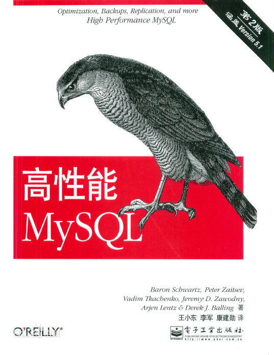


## **MySQL架构与特性**

MySQL的**存储引擎架构**将**任务处理**与**数据存储**相分离，使其可以根据性能、特性及需求来选择数据存储方式

#### **逻辑架构**

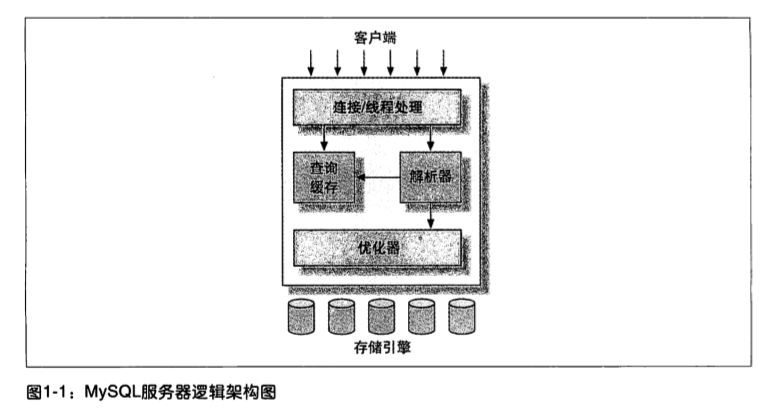

* **客户端的连接/线程处理**

  基于网络的C/S架构，包含连接处理、授权认证、安全等

* **查询缓存/解析器/优化器**

  核心服务功能层，包含**查询功能**，如查询解析、分析、优化、缓存、内置函数等功能，还有**跨存储引擎的功能**，如存储过程、触发器、视图等

* **存储引擎**

  负责数据的存储和提取，服务器通过API与存储引擎进行通信，这种通信屏蔽了不同存储引擎之间的差异

#### **并发控制**

MySQL在两个层面进行并发控制，**服务器层**与**存储引擎层**

**读写锁**

可以通过实现一个由两种类型的锁组成的所系统来解决并发读写问题，这两种锁通常称为

* **共享锁(sharedLock)/读锁(readLock)**

  一个资源的读锁不干扰多个线程的同时读取

* **排他锁(exclusiveLock)/写锁(writeLock)**

  一个资源的写锁会阻塞其他线程的写锁和读锁

**表行锁**

锁锁定的资源的范围称为锁粒度，锁粒度与锁的开销成反比，即锁粒度越细则锁的开销越大，MySQL支持两种重要的锁策略

* **表锁(tableLock)**

  大粒度小开销的锁策略，线程对数据表进行读写操作会锁定整张表

* **行锁(rowLock)**

  小粒度大开销的锁策略，可以最大程度支持并发处理，仅在存储引擎层面实现(如InnoDB引擎)

#### **事务**

一组原子性的SQL语句，如果数据库引擎成功执行事务的所有SQL语句则执行成功，若其中有任何一条SQL语句失败则所有语句均回滚不会执行，具备四种特性(ACID)

* **原子性(actomicity)**
* **一致性(consistency)**
* **隔离性(isolation)**
* **持久性(durability)**

#### **事务隔离级别**

隔离级别规定了事务中的修改是否其他事务可见，较低的隔离级别通常可以支持更高的并发

* **未提交读(readUncommitted)**

  事务中未提交的修改其他事务可见

  事务可以读取其他事务未提交的数据(脏读)

* **提交读(readCommitted)**

  事务中未提交的修改其他事务不可见，但可见其他事务已提交的修改

  事务执行两次同样的查询可能得到不一样的结果(不可重复读)

* **可重复读(repeatableRead)**

  MySQL默认事务隔离级别，保证了同一个事务多次读取同样的记录的结果是一致的

  事务读取范围记录时其他事务在范围内插入了新的记录(幻读)

* **可串行化(serializable)**

  强制事务串行执行，为所有读取的每行数据都加锁，保证数据的一致性，但可能导致锁超时、锁争用和死锁等问题

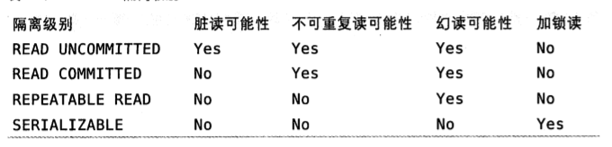

#### **死锁**

多个事务在同一资源上相互占用并请求锁定对方占用的资源从而引发恶性循环

#### **事务日志**

存储引擎在修改表数据时只需要修改其内存拷贝，再将修改行为持久化到硬盘上的事务日志中，而不用每次将修改数据本身持久化到磁盘，称为**预写式日志(Write-Ahead Logging)**，提高事务的效率

#### **MySQL的事务引擎**

MySQL提供的**事务型存储引擎**为**InnoDB**和**NDB Cluster**，其有以下特点

* **自动提交(autoCommit)**

  除非显式声明事务，否则**每个查询/命令(ALTER TABLE等)**都被当做一个事务执行提交操作

* **两阶段锁定协议(two-phase locking protocol)**

  * **隐式锁定**

    根据隔离级别在事务语句执行过程中自动加锁，且锁只有在执行COMMIT或ROLLBACK才会统一释放

  * **显式锁定**

    支持**服务器层的LOCK IN SHARE MODE/FOR UPDATE**语句加锁

#### **多版本并发控制**

MySQL的事务型存储引擎通过实现多版本并发控制(MVCC)，保存数据在某个时间点的快照，避免加锁操作，以此来提升并发性能

InnoDB的MVCC是通过在每行记录后面保存两个隐藏的列，**行创建的系统版本号和行过期的系统版本号**，根据每个事务的SQL语句操作来更新

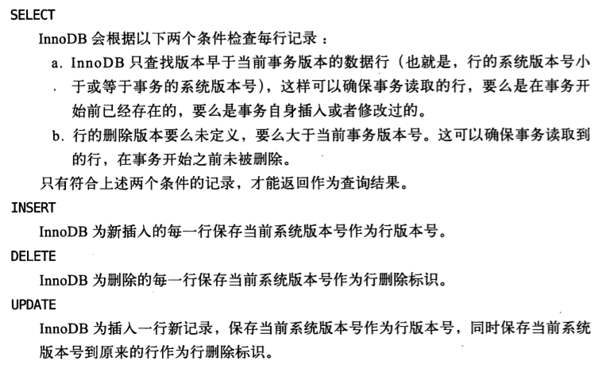


------

## **库表结构(Schema与数据类型)优化**

Schema是数据库对象的集合，包含数据表、视图、存储过程、索引等，因此Schema的设计对于数据库尤其重要

#### **数据类型优化**

* 数据类型-简单原则

  应该尽量使用满足需求的简单的数据类型替换复杂的数据类型，如整型替换字符、MySQL内建的date/time/datetime替换字符串、整形存储IP地址

* 具体类型-最小可用原则

  应该尽量使用可以正确存储数据的最小数据类型，但也要避免数据超出类型存储范围

* 尽量避免NULL

  除非需求需要，否则尽量避免使用NULL，而是用NOT NULL DEFAULT指定默认值，因为NULL使MySQL难以优化(索引、统计)，并且NULL的存储需要更多的空间

#### **数据类型**

* 整数

  TINYINT(8)、SMALLINT(16)、MEDIUMINT(24)、INT(32)、BIGINT(64)

* 实数(小数)

  FLOAT(4)、DOUBLE(8)、DECIMAL

* 字符串

  VARCHAR、CHAR、BLOB(二进制)、TEXT(字符)

* 日期和时间

  DATETIME(YYYYMMDDHHMMSS-8字节)、TIMESTAMP(1970-2038年-4字节)，可用MySQL内置函数FROM_UNIXTIME()/UNIX_TIMESTAMP()转换类型

* 位数据

  BIT(1-64)、SET

* 特殊类型

  比秒更小粒度的日期和时间值(BIGINT)，IPv4地址-32位无符号整数-可用MySQL内置的INET_ATON()/INET_NTOA()进行地址转化

#### **范式与反范式**

范式化设计中数据会且仅会出现一次，反范式化的数据库中信息是冗余的

范式的优点与缺点

* 更新操作性能高，因为范式化设计中很少重复数据，修改数据少
* 范式化的表更小，放到内存执行速度块
* 查询语句通常需要关联多张表
* 索引策略可能无效，因为范式化的列可能分布在不同表中

反范式的优点与缺点

* 避免关联，数据大部分都在一起
* 有效的索引策略

混用范式与反范式

* 在不同的表存储相同的特定列，用触发器更新缓存值
* 从父表冗余一些数据到子表可建立索引进行高效的排序

#### **缓存表和汇总表**

缓存表存储其他表获取速度较慢的数据，优化搜索和检索查询语句

* 创建一张只包含主表中部分列的缓存表用不同的索引组合来加速查询

汇总表存储使用GROUP BY语句聚合的数据，也称积累表

* 获取过去24小时内发送的消息数，以每小时汇总表为基础，把前23小时的统计表的技术加起来再加上最近一个不完整小时的计数即可，这比维护一个实时精确的计数器或者计算消息表所有的行有效的多

#### **计数器表**

维护单行数据的计数器表每次更新的时候可能遇到并发问题，可以采取以下优化

* 多槽(slot)计数器

  将计数器保存在多行中，每次选择随机一行进行更新，统计结果为所有行的和(SUM)

  ```mysql
  UPDATE counter SET cnt = cnt +1 WHERE slot = RAND() * 100;
  ```

* 多时计数器

  每隔一段时间开始一个新的计数器，使用INSERT INTO ON DUPLICATE KEY插入更新

  ```mysql
  INSERT INTO couter(day,slot,cnt)
  VALUES (CURRENT_DATE,RAND()*100,1)
  ON DUPLICATE KEY UPDATE cnt = cnt +1;
  ```

* 及时合并计数器

  周期任务合并计数器结果到0号槽并删除其他的槽

  ```mysql
  UPDATE counter as c
  INNER JOIN (
  	SELECT day,SUM(cnt) AS cnt,MIN(slot) AS mslot
      FROM counter
      GROUP BY day
  ) AS x USING day
  SET 
  c.cnt = IF(c.slot = x.mslot,x.cnt,0),
  c.slot = IF(c.slot = x.mslot,0,c.slot);
  DELETE FROM counter WHERE slot <> 0 AND cnt = 0;
  ```

#### **ALTER TABLE操作的优化**

ALTER TABLE大部分修改表结构的操作方法是用新的结构创建一个空表，从旧表中查出所有数据插入新表，然后删除旧表

如ALTER TABLE MODIFY COLUMN使用SHOW STATUS显示这个语句重建了表，性能很低

可采用ALTER COLUMN直接修改.frm文件而不涉及表数据，优化性能

或者创建一个新的.frm文件替换已经存在的表的.frm文件

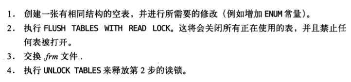


## **高性能索引**

#### **定义**

索引是帮助存储引擎快速查询记录的一种数据结构，索引的优劣对查询性能影响极大

#### **基础**

可以在一个或多个列上建立索引，由于MySQL的索引最左前缀原则，因为建立多个列索引的列顺序十分重要

#### **类型**

* B-Tree索引

  顺序存储，每个叶子页到根的距离(树深度)相同

  * 特点

    支持全值匹配、范围匹配、前缀匹配，支持排序

  * 缺陷

    无法查找非最左前缀匹配的列，范围查询的列的右列无法使用索引优化查找

  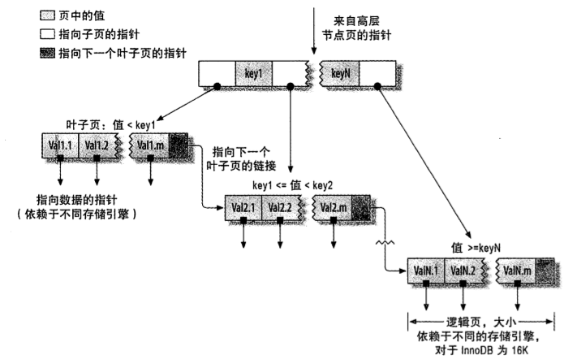

* Hash索引

  MySQL中仅Memory引擎显式支持非唯一哈希索引，存储引擎对所有的索引列计算出哈希码

  * 特点

    查找速度快

  * 缺陷

    仅存储哈希值和行指针不存储字段值，不支持部分匹配、范围匹配、排序，哈希冲突需全表遍历，维护代价高

    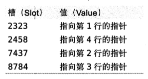

* 自适应哈希索引

  InnoDB引擎注意到某些索引值被访问频繁会在内存中基于B-Tree索引上建立哈希索引，优化查找速度

* 自定义哈希索引

  如为长值的列建立小的索引，插入列时对列值应用CRC32做哈希存储到表中，查询时使用这个哈希列的索引

  ```mysql
  # 创建表
  CREATE TABLE user (
      id int NOT NULL auto_increment,
      long_value varchar(255) NOT NULL,
      small_Index int NOT NULL DEFAULT 0,
  	PRIMARY KEY(id)
  )
  # 创建插入触发器
  DELIMITER
  CREATE TRIGGER user_crc_ins BEFORE INSERT ON user FOR EACH ROW BEGIN
  SET NEW.small_Index = crc32(NEW.long_value)
  END;
  # 创建更新触发器
  DELIMITER
  CREATE TRIGGER user_crc_upd BEFORE UPDATE ON user FOR EACH ROW BEGIN
  SET NEW.small_Index = crc32(NEW.long_value)
  END;
  # 查询采用自定义索引(防止哈希冲突需带入列值条件)
  SELECT id FROM user WHERE small_Index=CRC32('test') AND long_value='test';
  ```

* 其他索引

  * 空间数据索引(R-Tree)
  * 全文索引
  * 分形树索引

#### **优点**

索引不仅可用于帮助引擎定位到表的指定位置，如B-Tree索引还可用于ORDER BY和GROUP BY操作等，总结有如下三大优点

* 减少引擎需要扫描的数据量
* 帮助引擎避免排序和建立临时表
* 将随机I/O变为顺序I/O

#### **高性能索引策略**

高效正确选择、创建、使用索引是高性能查询的基础

* 独立的列

  查询时，索引列不能是表达式的一部分或者函数的参数，否则无法使用索引

* 前缀索引

  有些长值的列，如TEXT、BLOB、长VARCHAR等，会让索引变得大且慢，除了使用自定义哈希索引，还可以截取列的前缀建立索引，前缀需要足够长保证较高的选择性，又不能太长以便节约空间

  一个选择的诀窍是采用SQL语句试探前缀的选择性，通常来说前缀的选择性能够接近0.031即可

  ```mysql
  # 试探前缀的选择性
  SELECT COUNT(DISTINCT LEFT(long_value,33))/COUNT(*) FROM user;
  # 建立前缀索引
  ALTER TABLE user ADD KEY (long_value(33));
  ```

* 多列索引

  当查询涉及到对多个单列索引做相交(AND)、联合(OR)操作时，MySQL会优化查询语句应用索引合并策略，这种情况下通常意味着需要一个包含所有相关列的多列索引，而不是多个独立的单列索引

  ```mysql
  # 分析查询是否被索引合并
  EXPLAIN
  SELECT * FROM user WHERE name='test' AND age=18;
  # 可查看key、Extra属性查看查询是否被索引合并
  ```

* 是否建立索引与多列索引顺序

  建立低效的索引或者索引顺序的不当会使查询的性能几乎没有提升，对于如何选择索引的列有一个经验法则是建立选择性高的索引或者将选择性高的索引放在最前列，选择性与索引列的重复率成反比

  ```mysql
  # 列的选择性的计算公式
  SELECT COUNT(DISTINCT column_name)/COUNT(*) FROM table_name;
  ```

* 查询中的索引有效性

  有时候某些特定字段的值的查询性能低，这时候就需要考虑对于这个字段值索引是否有效，若该字段值几乎满足表中所有的行，即该值在此列的占比十分大，则该列的索引基本无效

  ```mysql
  # 列对于某些值的有效性计算公式
  SELECT COUNT(*),SUM(column_name = 'test') FROM user;
  ```

* 聚簇索引

  数据存储方式，表示数据行和相邻的键值存储在一起，InnoDB的聚簇索引将索引和数据保存在同一个B-Tree中，节点页包含索引列，叶子页包含数据行

  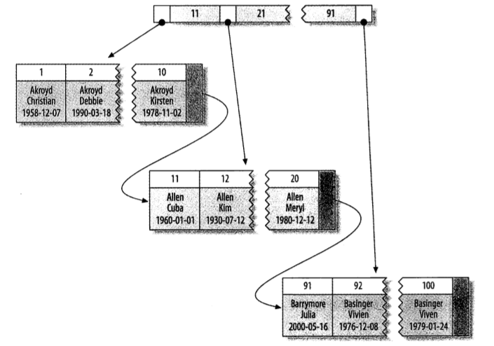

  聚簇索引优点是易聚集数据、获取数据快，但插入/更新数据代价大(顺序存储)(页分裂)、二级索引(非聚簇索引)需二次查询

  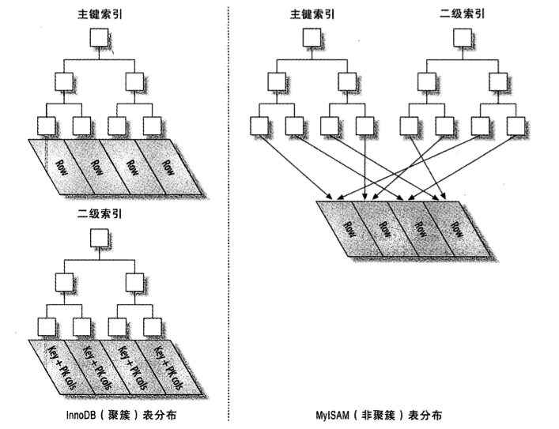

* 覆盖索引

  覆盖索引的叶子节点包含所有需要查询的字段的值，索引覆盖的不仅是查询语句的WHERE部分，还覆盖了查询语句的SELECT部分，这样查询只需要扫描索引而无需回表查询，极大提高了查询的性能

  可通过EXPLAIN语句的Extra字段是否存在Using index信息查看是否使用覆盖索引

  ```mysql
  # 检测覆盖索引，假设有多列索引(name,age)
  EXPLAIN
  SELECT name,age FROM user
  ```

* 索引排序

  通过索引扫描进行排序(EXPLAIN-type-index)比顺序全表扫描排序快，因此索引涉及最好既满足查找又满足排序，只有当索引的列顺序和ORDER BY子句顺序完全一致时才可以使用索引对结果进行排序

* 压缩(前缀)索引

  MyISAM引擎使用前缀压缩来减少索引大小，从而在内存中读取更多的索引，提高性能，压缩方式类似于相同前缀的索引则保存第一个，第二个索引保存第一个索引的指针+不同部分，类似第一个索引值是do保存为7，第二个索引值是done，则第二个索引值可保存为(7,ne)

* 冗余和重复索引

  冗余索引指增加的新索引已经包含在已有索引中了，如已有(A)索引增加(A,ID)索引，其中ID为主键索引，因为对于InnoDB主键列已经包含在二级索引中

  重复索引指在相同列上按照相同顺序创建的相同类型的索引，如已有(A,B)索引再创建(A)索引

#### **实际场景中的索引建立**

实际场景中，如查询用户信息表，搜索必须支持一些特征的各种组合来搜索用户，如城市、性别、年龄等，搜索还必须支持一些特征来对搜索的用户结果进行排序，如用户的优先级、评分等，如何涉及索引才能满足以上要求，需要考虑以下几点

* 范围查询的列放在索引列最后

  范围查询的列(BETWEEN AND)使用索引则后续的列无法使用索引进行查询/排序，即范围查询的列使用索引则后续的排序无法使用索引

* 索引前缀采用WHERE子句中频繁使用的列

  许多列如sex，选择性不高(取值仅有m/f)，但查询使用频率高，作为前缀可以优化大部分的查询，如果查询不限制性别，也可以在WHERE中使用SEX IN('m','f')这样的诀窍绕过前缀使用后面的索引

* 考虑常见的WHERE条件组合

* 考虑无索引执行较慢的WHERE条件组合

* 考虑列数据的值的选择性(不重复率)

* 排序分页考虑采用覆盖索引

  ORDER BY + LIMIT 分页很大值时，考虑采用覆盖索引查询所需的主键，再采用延迟关联查询表INNER JOIN查询出的主键，这样可以减少MySQL扫描需要丢弃的行

#### **总结**

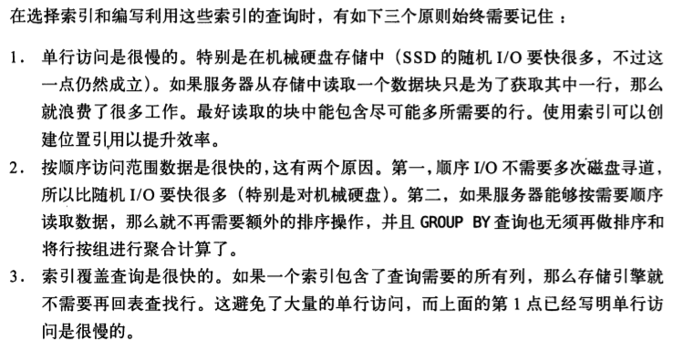


## **查询性能优化**

查询本质上一系列的子任务的组成，优化查询性能减少响应时间，要么优化子任务，要么减少子任务，要么减少子任务的执行次数

#### **优化数据访问**

影响查询性能的基本原因是访问数据过多，检索大量冗余的数据，有以下典型场景

* 查询不需要的记录
* (多表关联)返回所有的列
* 重复查询相同的数据

#### **优化数据扫描**

查询为了返回所需结果通常需要扫描额外的数据，进而分析(过滤/排序/截断)大量数据得到所需数据，这个开销可以使用以下三个指标衡量

* 响应时间

  服务时间(处理查询)和排队时间(I/O操作或锁等待)

* 扫描行数

  可以根据EXPLAIN语句的type列的访问类型进行定义，如全表扫描、索引扫描、范围扫描、唯一索引查询、常数引用等

* 返回行数

  扫描大量数据但返回少数的行，可用索引、库表结构(缓存表/汇总表)、重写查询语句优化

#### **重构查询**

* 切分查询

  将大查询分多次切分成小查询，如删除旧数据，切分多次删除可以减少阻塞、锁资源、事务日志的占用

* 分解关联查询

  将关联查询分解成多条查询，提高单表的缓存命中率，减少锁竞争，减少冗余记录的查询，代码中哈希关联多条查询可能比MySQL的嵌套循环关联查询效率高

#### **查询执行过程**

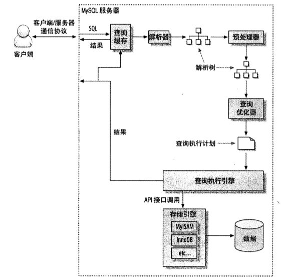

* 客户端/服务器通信协议

  半双工协议(单方向通信)，max_allowed_packet控制服务端接收数据的容量，连接MySQL的库函数会缓存从服务端获取的数据集，可用SHOW FULL PROCESSLIST命令查询MySQL线程的连接状态

  * Sleep：等待客户端新请求
  * Query：正在执行查询或正在将结果发送给客户端
  * Locked：等待表锁
  * Analyzing and statistics：正在收集引擎统计信息并生成查询的执行计划
  * Copying to tmp table：正在执行查询并将结果集复制到临时表中，如GROUP BY/文件排序/UNION操作
  * Sorting result：正在对结果集进行排序
  * Sendig data：正在切换状态时传送数据，或者正在生成结果集，或者正在向客户端返回数据

* 查询缓存(Query Cache)

  解析查询语句前MySQL会优先检查查询是否命中查询缓存中的数据，若命中且用户鉴权通过则直接从缓存中取结果集返回给客户端，查询缓存命中不会解析查询语句，不会生成执行计划

* 查询优化处理

  将SQL语句转换成一个执行计划，包含解析SQL、预处理、优化执行等

  * 语法解析器

    将SQL语句解析成一颗对应的解析树并根据MySQL语法规则验证和解析，如关键字是否错误、引号是否匹配

  * 预处理

    根据MySQL语法规则进一步解析语法树是否合法，如数据表/列是否存在、别名是否有歧义、验证权限

  * 查询优化器

    将合法的语法树转化成执行计划，并根据成本最小的执行方式执行查询，其优化策略可分为静态优化和动态优化如下

    * 重新定义表的关联顺序
    * 将外连接转换成内连接
    * 等价变换简化表达式
    * 优化函数，如B-Tree索引优化MIN()/MAX()，MyISAM引擎维护表的行数进而优化COUNT()
    * 子查询优化成常数表达式，如主键索引/唯一索引的常量查询仅会返回一行数据，可当作常数处理
    * 覆盖索引的扫描
    * 子查询优化
    * 提前终止查询，如LIMIT子句、条件过滤不存在值的查询
    * 等值传播，用于联结表的列的条件过滤语句可适用于所联结的多张表
    * IN()优化，将IN()中的条件等同于多个顺序的OR条件子句，通过二分查找处理

  * 统计信息

    由存储引擎保存数据和索引的统计信息，用于提供给优化器进行优化

  * 关联表

    MySQL对任何关联都执行嵌套循环关联，即深度优先遍历(嵌套循环和回溯)，但子查询和UNION操作是将其结果放在临时表中当作普通表使用，并且全外联结（MySQL不支持）也无法执行嵌套循环关联

  * 排序优化

    MySQL会优先使用索引生成排序结果，若索引排序失效则使用文件排序(filesort)，数据量小则使用内存排序，数据量大则使用磁盘分快排序再合并

* 查询执行引擎

  根据解析和优化生成查询对应的执行计划的指令逐步完成查询，包含调用大量存储引擎实现的接口完成

* 返回结果给客户端

  返回查询结果、查询信息(影响行数)、缓存查询等

#### **MySQL查询优化器的局限**

* WHERE语句的子查询

  


